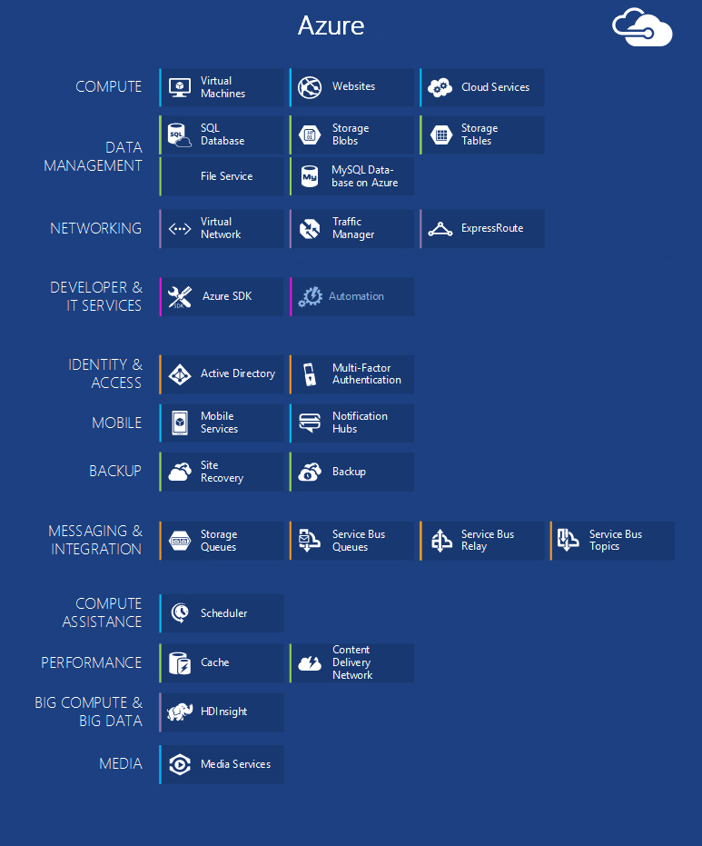
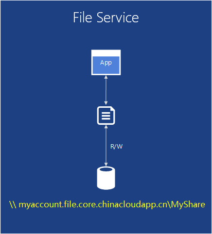
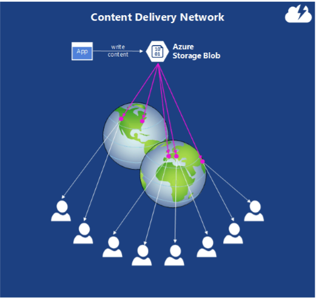

<properties 
	pageTitle="Azure 简介 | Azure" 
	description="是 Azure 的新手？ 获取有关所提供服务的基本概述，以及用法示例。" 
	services=" " 
	documentationCenter=".net" 
	authors="Rboucher" 
	manager="jwhit"
	editor=""/>

<tags 
	ms.service="multiple" 
	ms.date="06/30/2015"  
	wacn.date="10/03/2015"/>

# 介绍 Azure

本文的目的是为你提供了解 Azure 基本功能所需的基础知识，即使你对云计算一无所知也没有关系。

**如何阅读本文**

Azure 一直在不断扩大规模，因此很容易出现过载现象。基本服务在本文前面列出。请先阅读这些基本服务，然后阅读其他服务。这并不是说你不能单独使用这些其他的服务，而只是说基本服务构成了在 Azure 中运行的应用程序的核心。
   

## Azure 的组件

在管理门户中，Azure 将服务分组为不同类别和各种视觉帮助。管理门户是用来在 Azure 中管理大多数服务（但并非全部）的地方。

本文将使用**不同的组织**来讨论基于类似功能的服务，并调用属于大型服务一部分的重要子服务。

*图：Azure 提供可通过 Internet 访问且在 Azure 数据中心运行的应用程序服务。*

## 管理门户
Azure 的 Web 接口名为[管理门户](http://manage.windowsazure.cn)，允许管理员访问和管理大多数但不是所有 Azure 功能。

## 计算

云平台的最基本功能之一是执行应用程序。每个 Azure 计算模型都有着自己的角色。

你可以根据需要单独或组合使用这些技术来为你的应用程序打下正确的基础。你选择哪种方法取决于你要解决什么问题。

### Azure 虚拟机

*图：Azure 虚拟机为您提供对云中虚拟机实例的完全控制。*

可以按需创建一个虚拟机（无论是从标准映像还是从你提供的映像），此功能非常有用。这种方法通常称为“基础结构即服务”(IaaS)，即是 Azure 虚拟机模型提供的用途。图 2 显示了虚拟机 (VM) 是如何运行的，以及如何从 VHD 创建虚拟机。

若要创建一个 VM，需要指定使用哪一个 VHD 以及 VM 的大小。接下来，为 VM 运行的时间付费。VM 按分钟收费，并且仅在运行时收费，不过有一个最低存储收费，目的是维持 VHD 的可用性。Azure 提供储备 VHD（称为“映像”）库，其中包含用于启动的可引导操作系统。这些 VHD 包括 Microsoft 和合作伙伴选项，例如 Windows Server 和 Linux、SQL Server，等等。你可以自由地创建 Vhd 和图像，然后自己上载。你甚至可以上载 Vhd，只包含数据，然后从正在运行的 VM 对其进行访问。

无论 VHD 来自何处，你都可以在 VM 运行的同时永久存储所做的任何更改。下次从该 VHD 创建 VM 时，将从中断的地方开始。备份虚拟机的 VHD 将存储在 Azure 存储 Blob 中，我们稍后将对此进行介绍。这意味着你将获得冗余，从而确保你的 VM 不会由于硬件和磁盘故障而消失。也可以从 Azure 中复制更改的 VHD，然后在本地运行。
 
你的应用程序将在一个或多个虚拟机中运行，具体取决于你之前是如何创建它的，你也可以现在从头创建它。

可以用这种相当通用的云计算方法来处理许多不同问题。

**虚拟机方案**

1.	**开发/测试** - 可以使用它们创建廉价的开发和测试平台，用完后即可关闭它。也可以创建和运行使用您喜欢的任何语言和库的应用程序。这些应用程序可以使用 Azure 提供的任何数据管理选项，并且你还可以选择使用 SQL Server 或在一个或多个虚拟机中运行的另一个 DBMS。 
2.	**将应用程序移动到 Azure（提起并移动）** -“提起并移动”是指一种移动应用程序的方式，就像使用铲车移动大型物体一样。你将 VHD 从本地数据中心“提起”，然后将其“移动”到 Azure 并在那里运行。你通常需要执行一些操作来删除对其他系统的依赖项。如果依赖项过多，你可以改为选择选项 3。  
3.	**扩展您的数据中心** - 使用 Azure VM 作为您本地数据中心的扩展，运行 SharePoint 或其他应用程序。为支持此功能，可以通过在 Azure VM 中运行 Active Directory 在云中创建 Windows 域。您可以使用 Azure 虚拟网络（后面提到）将本地网络和网络在 Azure 中绑定在一起。
 

### Web 应用

*图：Azure Web 应用在云中运行网站应用程序，无需管理基础的 Web 服务器。*

人们在云中最常做的事情之一是运行网站和 Web 应用程序。虽然 Azure 虚拟机允许此操作，但仍由你负责管理一个或多个 VM 以及基础操作系统。云服务 Web 角色可以执行此操作，但部署和维护它们仍然离不开管理工作。如果你只需要一个由别人代你负责管理工作的网站，该怎么办？

Web 应用能做到这一点。此计算模型使用 Azure 管理门户以及 API 提供托管 Web 环境。您可以将现有网站应用程序原封不动地移动到 Web 应用，或者直接在云中创建一个新网站。网站开始运行后，您可以动态添加或删除实例，依靠 Azure Web 应用在实例间对请求进行负载平衡。Azure Apps 既提供一个共享选项，使您的网站与其他站点一起在一个虚拟机中运行，也提供让您的网站在自己的 VM 中运行的标准选项。通过该标准选项，你还可以在需要时增加实例的大小（计算能力）。

在开发方面，Web 应用支持使用 .NET、PHP、Node.js、Java 和 Python 以及 SQL 数据库和 MySQL执行关系存储。它还为几个流行的应用程序（包括 WordPress、Joomla 和 Drupal）提供内置支持。其目标是为在公有云中创建网站和 Web 应用程序提供一个低成本、可缩放且广泛适用的平台。

**Web 应用方案**

Web 应用旨在使公司、开发人员和 Web 设计机构都能利用它。对于公司而言，它是用于运行现有网站的易于管理、可伸缩、高度安全且高度可用的解决方案。当您需要设置一个网站时，最好是从 Azure Web 应用开始，当无法找到需要的功能时再转到云服务。请查看“计算”部分的末尾，以搜寻更多可以帮助你在这些选项中进行选择的链接。

### 云服务

*图：通过 Azure 云服务，可以在平台即服务 (PaaS) 环境中运行高度可缩放的自定义代码*

假设你要构建一个云应用程序，它可以支持大量并发用户，无需太多管理，且从不出故障。例如，您可能是一家较成熟的软件供应商，您决定通过在云中构建您应用程序之一的某个版本来包含“软件即服务”(SaaS)。或者，您可能是一家初创公司，您创建了一个预计会快速普及的使用者应用程序。如果在 Azure 上构建，应使用哪个执行模型？

Azure Web 应用允许创建这种 Web 应用程序，但有一些约束。例如，您没有管理访问权限，这意味着您不能随意安装软件。Azure 虚拟机模型为你提供了极大的灵活性，包括管理访问权限，你当然可以用它来构建高度可缩放的应用程序，但你必须自己处理可靠性和管理方面的诸多工作。你希望的选项应当是既能赋予你控制能力，又能处理可靠性和管理所需的大部分工作。

这正是 Azure 云服务所提供的内容。此技术明确用于支持可扩展、可靠且管理任务不多的应用程序，它也是通常称为“平台即服务”(PaaS) 的一个示例。要使用该服务，可以使用所选择的技术（如 C#、Java、PHP、Python、Node.js 或其他技术）创建一个应用程序。然后，你的代码在运行某个 Windows Server 版本的虚拟机（称为实例）中执行。

但这些 VM 有别于你使用 Azure 虚拟机模型创建的 VM。首先，Azure 本身管理它们，执行如安装操作系统修补程序并自动推出新修补的映像等操作。（这意味着你的应用程序不应保持 Web 或辅助角色实例中的状态；而应使用下一节中描述的 Azure 数据管理选项之一。）Azure 也监视这些 VM，重新启动任何出现故障的 VM。你可以将云服务设置为根据需要自动创建或多或少的实例。这样，你就可以处理使用量增大的情况，并在使用量下降时缩减规模，防止多付费。

在创建实例时你有两个角色可以选择，两者都基于 Windows Server。二者间的主要区别是，Web 角色的实例运行 IIS，而辅助角色的实例则不然。但是，管理两个角色的方式相同，而一个应用程序常常同时使用这两者。例如，一个 Web 角色实例可能会接受来自用户的请求，然后将它们传递给辅助角色实例进行处理。若要向上或向下扩展你的应用程序，可以请求 Azure 创建任一角色的更多实例，或关闭现有的实例。与 Azure 虚拟机相似，只针对运行每个 Web 角色实例或辅助角色实例的时间向你收费。

**云服务方案**

当您需要对平台进行更多的控制，而这种需要超过了 Azure Web 应用所能提供的控制，同时您又不想控制基础操作系统时，可以使用云服务进行大规模的向外扩展。

#### 选择计算模型
[Azure Web 应用、云服务和虚拟机比较](/documentation/articles/choose-web-site-cloud-service-vm/)提供了有关如何选择计算模型的更多详细信息。

## 数据管理

应用程序需要数据，不同类型的应用程序需要不同类型的数据。因此，Azure 提供了几种不同方法来存储和管理数据。Azure 提供了多个存储选项，但所有选项旨在用于非常持久的存储。在上述任何选项中，有 3 个数据的副本始终在 Azure 数据中心内保持同步 -- 如果您允许 Azure 使用地域冗余，以便将数据备份到至少 300 英里以外的另一个数据中心，则为 6 个副本。

### 在虚拟机中
我们已经讨论了如何才能在使用 Azure 虚拟机创建的 VM 中运行 SQL Server 或另一个 DBMS。请注意，此选项不限于关系系统；您也可以自由地运行 NoSQL 技术，如 MongoDB 和 Cassandra。运行自己的数据库系统最直截了当，就是将我们使用的东西复制到我们自己的数据中心，但仍需要处理该 DBMS 的管理任务。在其他选项中，Azure 为你处理更多（或所有）管理任务。

同样，虚拟机的状态以及你创建或上载的任何其他数据磁盘都通过 Blob 存储（将在后面讨论）进行备份。

### Azure SQL 数据库

*图：Azure SQL 数据库提供在云中托管的关系数据库服务。*

Azure 提供 SQL 数据库功能进行关系存储。不要被名称所欺骗。这不同于在 Windows Server 上运行的 SQL Server 提供的典型的 SQL 数据库。

Azure SQL 数据库以前称为 SQL Azure，它提供关系数据库管理系统的所有关键功能，包括原子事务、具有数据完整性约束的多用户并发数据访问、ANSI SQL 查询和大家所熟知的编程模型。和 SQL Server 相同，也可以使用 Entity Framework、ADO.NET、JDBC 和其他常见数据访问技术访问 SQL 数据库。SQL 数据库还支持大部分的 T-SQL 语言以及 SQL Server 工具（如 SQL Server Management Studio）。对于熟悉 SQL Server（或其他关系数据库）的用户而言，使用 SQL 数据库很简单。

但 SQL 数据库在云中不只是一个 DBMS，它还是一个 PaaS 服务。虽然您仍然控制着您的数据以及谁可以访问该数据，但 SQL 数据库负责管理方面的基础工作，例如管理硬件基础架构，并自动保持数据库和操作系统软件处于最新状态。SQL 数据库还提供了高可用性、自动备份和时间点还原功能，并可跨地理区域复制副本。

此外还有一种高级选项，你只需稍微多支付一些费用，即可拥有自己专用的服务器。使用“标准”选项时，数据库在共享硬件上运行，而如果你碰巧在一个特别繁忙的服务器上，这可能会限制你的数据库查询。

**SQL 数据库方案**

如果你要创建需要关系存储的 Azure 应用程序（使用这些计算模型中的任何一个），则 SQL 数据库可能是一个不错的选择。但是，在云外运行的应用程序也可以使用该服务，所以还有很多其他方案。例如，可以从不同客户端系统（包括台式机、笔记本电脑、平板电脑和手机）访问存储在 SQL 数据库中的数据。而且，因为它通过复制提供内置的高可用性，所以使用 SQL 数据库有助于减少停机时间。

### Azure MySQL 数据库

*图：Azure 提供MySQL数据库来存储数据。*

MySQL Database on Azure 是我们在 Azure 平台上推出的MySQL全托管数据库服务 。只需一到两分钟您即可在 Azure 上构建一个具备高可用性的 MySQL 数据库服务器 （提供99.9%SLA保障），而无需自己管理虚拟机或基础架构。MySQL Database on Azure 为客户提供了方便易用的管理和维护的功能和体验。您可以方便地监控数据库性能和资源的利用，并根据需要在不同的版本间切换。同时，MySQL Database on Azure 提供完善的备份恢复功能保障数据库高可靠性，支持长达30天的数据完整备份，以及7天内任意时间点恢复，以及灾难恢复功能。并且，MySQL Database on Azure服务采用MySQL社区版本，全面兼容 MySQL 的各种开发管理工具，你可以利用熟悉的语言和工具使用。

对于您在数据库性能方面的需求，MySQL Database on Azure 服务提供了多个不同性能的版本支持您纵向扩展数据库，您可以根据当前的性能需求选择一个相匹配的版本，后续再根据应用的实际运行情况进行弹性扩展或收缩，使您不再需要反复计算数据库服务器的配置需求，您也不再需要为如何调节各方面的配置以得到最好的数据库性能而烦恼。同时，如果您的应用读多写少，MySQL Database on Azure的只读实例功能支持您横向扩展数据库，轻松应对高并发需求。

并且，MySQL Database on Azure 支持本地到云端的数据库同步的功能，用户可以将 自建数据库或在虚机上搭建的MySQL 实例设为主库，把运行在 Azure 上的实例设为从库，通过标准的 MySQL 主从数据同步的方式同步数据到 Azure 以更好地满足企业各种混合云场景的需求。同时数据库同步的功能也可以帮助您实现更完善更灵活的云端迁移体验。

对于最新功能、价格、文档等更全面的介绍，您可以访问[MySQL on Azure](/home/features/mysql/)服务介绍了解更多。

### 表

  
*图：Azure 表提供了一种平面 NoSQL 方式来存储数据。*

此功能有时候会有不同的称呼，因为它是名为“Azure 存储空间”的更大型功能的一部分。你所看到的“表”、“Azure 表”或“存储表”都是同一种功能。

并且请不要因名称而感到困惑：此技术不提供关系存储。事实上，它是称为键/值存储的 NoSQL 方法的一个示例。Azure 表允许应用程序存储各种类型的属性，如字符串、整数和日期。然后，应用程序可以通过为一个属性组提供唯一键来检索该组。虽然不支持像联接这样的复杂操作，但表提供对类型化数据的快速访问。它们也能高度缩放，一个表即可以容纳多达 TB 量级的数据。使用表通常比使用 SQL 数据库关系存储更便宜，这与表的简单性是相配的。

**表方案**

假设你要创建一个 Azure 应用程序，该应用程序需要快速访问类型化数据（这样的数据可能很多），但并不需要对此数据执行复杂的 SQL 查询。例如，假设您要创建一个使用者应用程序，该应用程序需要存储每个用户的客户资料信息。您的应用程序将会大受欢迎，所以您需要考虑到大量数据，但除了存储数据，然后以简单方式检索它们外，您不想拿这些数据做更多事情。这种时候恰恰能体现出 Azure 表的意义。

### Blob

*图：Azure Blob 提供非结构化的二进制数据。*

Azure Blob（同样，“Blob 存储”和“存储 Blob”都是指同一种功能）设计用于存储非结构化二进制数据。像表一样，Blob 也提供廉价的存储，单个 Blob 最大可以为 1TB。Azure 应用程序还可以使用 Azure 驱动器，使得 Blob 可以为 Azure 实例中装入的 Windows 文件系统提供持久存储。该应用程序看到的是普通 Windows 文件，但内容其实存储在 Blob 中。

Blob 存储可用于许多其他的 Azure 功能（包括虚拟机），因此当然也可以处理你的工作负载。

**Blob 方案**

例如，一个存储视频、大量文件或其他二进制信息的应用程序可以使用 Blob 作为简单、廉价的存储。Blob 通常还与内容传送网络（稍后讨论）之类的其他服务一起使用。

### 文件服务

*图：Azure 文件服务为云中运行的应用程序提供 SMB \\\server\\share 路径。*

进行本地部署时，通常会允许通过服务器消息块 (SMB) 协议使用 \\\Server\\share 格式来访问大量的文件存储。Azure 现在提供的一种服务允许你在云中使用该协议。在 Azure 中运行的应用程序可以使用它通过熟悉的文件系统 API（例如 ReadFile 和 WriteFile）在 VM 之间共享文件。此外，还可以通过 REST 界面同时访问这些文件，该界面允许你在也设置了虚拟网络的情况下，从本地访问共享。Azure 文件基于 Blob 服务，因此会继承 Azure 存储空间中内置的可用性、持续性、可伸缩性和地域冗余。

**Azure 文件方案**

- **将现有应用程序迁移到云** - 将本地应用程序迁移到云，以便使用文件共享在应用程序的各部分之间共享数据，这种方式会更容易。每个 VM 都可以连接到文件共享，然后即可读取和写入相关文件，就像针对本地文件共享进行操作一样。

- **共享应用程序设置** - 分布式应用程序的常见模式是将配置文件置于某个中心位置，然后就可以从多个不同的虚拟机访问该中心位置的配置文件。这些配置文件可以存储在 Azure 文件共享中，供所有应用程序实例读取。这些设置也可以通过 REST 界面管理，这样全世界的用户都可以通过该界面访问配置文件。

- **诊断共享** - 您可以保存和共享诊断文件，例如日志、度量值和崩溃转储。允许通过 SMB 和 REST 界面使用这些文件，应用程序就可以使用各种分析工具来处理和分析诊断数据。

- **开发/测试/调试** - 开发人员或管理员在云中的虚拟机上工作时，通常需要一套工具或实用程序。在每个虚拟机上安装和分发这些实用程序很费时间。有了 Azure 文件，开发人员或管理员就可以将最喜爱的工具存储在文件共享中，然后即可从任何虚拟机连接到这些工具。

## 网络

目前，Azure 在全世界的许多数据中心运行。当您运行应用程序或存储数据时，可以选择使用其中一个或多个数据中心。你还可以使用下面的服务，通过各种方式连接到这些数据中心。

### 虚拟网络

*图：虚拟网络在云中提供了专用网络，因此不同的服务可以彼此互相通信，在设置了 VPN 连接（一种跨界连接）的情况下，还可以与本地资源通信。*

使用公共云的一种有效方法是把它当作你自己的数据中心的扩展。
 
因为您可以按需创建 VM，然后在不需要时删除它们（同时停止付费），所以只有在您需要计算能力时才具有这种能力。由于 Azure 虚拟机模型允许你创建运行 SharePoint、Active Directory 以及其他熟悉的本地软件的 VM，因此可以用这种方法处理你的已有应用程序。

不过，要使这种方法真正发挥作用，你的用户应该能够像这些应用程序就在你自己的数据中心运行那样对待它们。这正是 Azure 虚拟网络所允许的。使用 VPN 网关设备，管理员可以设置你的本地网络和你部署到 Azure 中的虚拟网络的 VM 之间的虚拟专用网络 (VPN)。因为您将自己的 IP v4 地址分配给云 VM，所以它们看上去就好像在您自己的网络上。你组织中的用户可以访问这些 VM 包含的应用程序，就像这些应用程序在本地运行一样。

有关规划和创建适合您的虚拟网络的详细信息，请参阅[虚拟网络](/documentation/articles/virtual-networks-overview/)。

### Express Route

*图：ExpressRoute 使用 Azure 虚拟网络，但通过更快速的专用线路而非公共 Internet 来路由连接。*

如果你需要更多的带宽，或者需要比 Azure 虚拟网络连接能够提供的安全性更高的安全性，则可以考虑 ExpressRoute。在某些情况下，ExpressRoute 还可以省钱。你将仍然需要 Azure 中的虚拟网络，但 Azure 与你的站点之间的链接使用专用连接，不需要通过公共 Internet。若要使用此服务，你将需要与网络服务提供商或 Exchange 提供商达成协议。

设置 ExpressRoute 连接需要更多的时间和规划，因此你可以先使用站点到站点 VPN，然后再迁移到 ExpressRoute 连接。

有关 ExpressRoute 的详细信息，请参阅 [ExpressRoute 技术概述](/documentation/articles/expressroute-introduction/)。

### 流量管理器

*图：使用 Azure 流量管理器可以将全局流量路由到基于智能规则的服务。*
 
如果你的 Azure 应用程序运行在多个数据中心中，则可以使用 Azure 流量管理器智能地跨应用程序的实例路由来自用户的请求。你还可以将流量路由到未在 Azure 中运行的服务，只要这些服务可以通过 Internet 访问。

如果某个 Azure 应用程序的用户只来自某个地区，则可能只在一个 Azure 数据中心运行该应用程序。但如果某个应用程序的用户散布在世界各地，则很可能在多个（甚至全部）数据中心运行该应用程序。在第二种情况下，您面临着一个问题：如何智能地将用户引导到应用程序实例？ 多数情况下，您可能希望每个用户访问离他们最近的数据中心，因为这可能会给他们带来最快的响应时间。但是，如果该应用程序实例已过载或不可用，该怎么办？ 在这种情况下，最好将用户的请求自动定向到另一个数据中心。这正是 Azure 流量管理器要做的。

应用程序所有者定义指定如何将用户请求定向到数据中心的规则，然后依靠流量管理器执行这些规则。例如，用户请求通常会被定向到最近的 Azure 数据中心，但当其默认数据中心的响应时间超过其他数据中心的响应时间时，便转往另一个数据中心。对于拥有众多用户的全球分布应用程序而言，具有内置服务来处理这类问题非常有用。

流量管理器使用目录名称服务 (DNS) 将用户路由到服务终结点，但在完成该连接后，后续的流量就不会经过流量管理器。这可以防止流量管理器形成瓶颈，降低服务通信的速度。

## 开发人员服务
Azure 提供了多种工具，可以帮助开发人员和 IT 专业人员创建和维护云中的应用程序。

### Azure SDK
早在 2008 年，Azure 的第一个预发行版本仅支持 .NET 开发。而现今，你几乎可以使用任何语言创建 Azure 应用程序。Microsoft 目前为 .NET、Java、PHP、Node.js、Ruby 和 Python 提供了特定于语言的 SDK。还有一个为任何语言（例如 C++）提供基本支持的常规 Azure SDK。

这些 SDK 可帮助你构建、部署和管理 Azure 应用程序。可从 [www.azure.cn](/downloads/) 或 GitHub 获得它们，并且它们可以与 Visual Studio 和 Eclipse 结合使用。Azure 还提供了开发人员可以将其与任何编辑器或开发环境结合使用的命令行工具，包括用于从 Linux 和 Macintosh 系统将应用程序部署到 Azure 的工具。

除了帮助你构建 Azure 应用程序以外，这些 SDK 还提供了客户端库，可帮助你创建使用 Azure 服务的软件。例如，你可以构建用于读取和写入 Azure Blob 的应用程序，或创建通过 Azure 管理界面部署 Azure 应用程序的工具。

### 自动化
没有人喜欢浪费时间来反复进行相同的手动过程。Azure 自动化是一种在 Azure 环境中创建、监视、管理和部署资源的方法。

自动化使用“Runbook”，后者实际上使用 Windows PowerShell 工作流（而不是单纯的常规 PowerShell）。Runbook 在执行时无需用户交互。PowerShell 工作流允许在各个检查点一路保存脚本状态。然后，如果发生故障，你不必从头开始检查一个脚本。你可以在最后一个检查点重新启动该脚本。你需要确保脚本能够处理所有可能的故障，而这可以节省你大量的工作。

**自动化方案**

在 Azure 中，如果需要自动处理那些需要手动操作的、长时间运行的、易出错且重复性很高的任务，则 Azure 自动化是一个很好的选择。
 

## 标识和访问
 
大部分应用程序都使用标识。知道用户是谁可以让应用程序决定它应该如何与该用户交互。Azure 提供相关服务来帮助跟踪标识，并将其与你可能已在使用的标识存储集成在一起。

### Active Directory

与大多数目录服务一样，Azure Active Directory 存储有关用户以及他们所属组织的信息。它允许用户登录，为他们提供令牌，以便他们可以向应用程序证明自己的身份。它还允许与在您的本地网络本地运行的 Windows Server Active Directory 同步用户信息。虽然 Azure Active Directory 使用的机制和数据格式与 Windows Server Active Directory 中使用的并不完全相同，但执行的功能基本相似。
 
务必要了解 Azure Active Directory 主要供云应用程序使用。例如，在 Azure 或其他云平台上运行的应用程序可以使用它。它也被 Microsoft 自己的云应用程序（如 Office 365 中的云应用程序）使用。不过，如果你需要使用 Azure 虚拟机和 Azure 网络将数据中心扩展到云中，则不应选择 Azure Active Directory，反而需要在虚拟机中运行 Windows Server Active Directory。

为了让应用程序访问它所包含的信息，Azure Active Directory 提供一个称为 Azure Active Directory Graph 的 RESTful API。该 API 允许运行于任何平台上的应用程序访问目录对象和它们之间的关系。例如，一个授权的应用程序可以使用该 API 了解某个用户、其所属的团体的信息以及其他信息。应用程序还可以看到用户与其社交圈之间的关系，从而帮助他们利用这些人际关系更好地开展工作。

该服务的另一个功能是 Azure Active Directory Access Control，它可以让应用程序更易于接受来自 Windows Live ID 和其他热门身份提供商的身份信息。Access Control 不需要应用程序理解多样的数据格式和每位提供商所使用的协议，它将所有这些都统统转换为一种通用格式。它还允许应用程序接受来自一个或多个 Active Directory 域的登录。例如，一个提供 SaaS 应用程序的供应商可以使用 Azure Active Directory Access Control 功能赋予其客户群中的用户通过单一登录访问该应用程序的权利。

目录服务是本地计算的一个核心基础。因此毋庸置疑，它们在云中也很重要。

### 多重身份验证

*图：Multi-Factor Authentication 为您的应用程序提供进行多种形式身份验证的功能*
 
安全性始终是重要的。多重身份验证 (MFA) 可帮助确保只有用户自己才能访问其帐户。MFA（也称为双因素身份验证或“2FA”）要求用户在登录以及进行事务处理时提供这三种身份验证方法中的两种。

- 你知道的某样东西（通常为密码）
- 你具有的某样东西（无法轻易复制的可信设备，如电话）
- 你自身的特征（生物辨识系统）

因此，当某位用户登录时，你可以要求该用户除了通过密码验证其身份外，也通过移动应用程序、电话呼叫或短信进行身份验证。默认情况下，Azure Active Directory 支持使用密码作为用户登录时唯一的身份验证方法。你可以通过 MFA SDK 将 MFA 与 Azure AD 或自定义应用程序和目录一起使用。你还可以通过多重身份验证服务器将它与本地应用程序一起使用。

**MFA 方案**

对敏感帐户（例如银行登录名和源代码访问权限）进行登录保护，以免未授权的访问造成高昂的财务或知识产权代价。

## 移动服务

如果你要为移动设备创建应用程序，可使用 Azure 在云中存储数据、对用户进行身份验证和发送推送通知，无需编写大量的自定义代码。

虽然您肯定可以使用虚拟机、云服务或 Web 应用构建移动应用程序的后端，但使用 Azure 服务可以花少得多的时间来编写基本的服务组件。

### 移动服务

  
*图：移动服务提供的功能通常是与移动设备进行交互的应用程序所需要的。*

Azure 移动服务提供了许多有用的功能，可帮助您节约构建移动应用程序后端的时间。它允许你对 SQL 数据库中存储的数据进行简单的设置和管理。你可以通过服务器端代码来轻松使用 Blob 存储或 MongoDB 等其他数据存储选项。移动服务支持通知，虽然在某些情况下您可以改为使用通知中心（如下所述）。该服务还有一个 REST API，可供移动应用程序调用以完成相关任务。移动服务还提供了通过 Microsoft 和 Active Directory 以及其他知名标识提供程序进行用户身份验证的功能。

你看使用其他 Azure 服务（如服务总线和辅助角色）来连接到本地系统。你甚至可以使用 Azure 应用商店中提供的第三方加载项（例如用于电子邮件的 SendGrid）来提供其他功能。

通过用于 Android、iOS、HTML/JavaScript、Windows Phone 和 Windows 应用商店的本机客户端库，更便于针对所有主要移动平台上的应用程序进行开发。通过 REST API，你能够将移动服务数据和身份验证功能用于不同平台上的应用程序。单个移动服务可以支持多个客户端应用程序，以便你可以提供跨设备的一致的用户体验。

由于 Azure 已经支持大规模缩放，你可以在应用程序变得更热门时处理相应的流量。支持监视和日志记录，以帮助解决问题并管理性能。

### 通知中心

*图：通知中心提供的功能通常是与移动设备进行交互的应用程序所需要的。*

虽然您可以通过编写代码在 Azure 移动服务中执行通知功能，不过通知中心已经过优化，可以在数分钟内广播数百万高度个性化的推送通知。你不必担心详细信息，如移动运营商或设备制造商。只需一个 API 调用，即可向单个用户或数百万用户发送通知。

通知中心适用于任何后端。您可以使用 Azure 移动服务、任何提供程序上运行的云中的自定义后端，或者本地后端。

**通知中心方案**如果您是在编写玩家轮流参加的移动游戏，您可能需要在玩家 1 完成其游戏后通知玩家 2。如果只需要这样的话，您可以直接使用 移动服务。但如果您的游戏有 100,000 位用户，而您需要向每位用户发送时效性很强的免费提供的优惠，则通知中心是更好的选择。

你可以向数百万用户发送突发性新闻、体育活动消息以及产品公告通知，延迟很轻微。企业可以向员工发送全新的时效性很强的通知，例如发送有关潜在销售顾客的通知，这样员工就不必频繁查看电子邮件或其他应用程序以接收通知。你也可以发送进行多重身份验证所需的一次性密码。
   

## 备份
每个企业都需要备份和还原数据。你可以使用 Azure 来备份和还原应用程序，不管是在云中还是在本地。Azure 提供了不同的帮助选项，具体取决于备份类型。

### 站点恢复
 
Azure 站点恢复（以前称为 Hyper-V Recovery Manager）可以帮助你跨站点协调 Hyper-V 映像的复制和恢复，从而保护重要的应用程序。你可以备份到你自己的辅助站点、托管商的网站或使用 Azure，从而避免构建和管理你自己的辅助位置所需的费用和复杂性。Azure 对数据和通信进行加密，你也可以选择为静态数据启用加密。

它会持续监视你的服务的运行状况，并帮助你在主数据中心出现站点中断的情况下，自动完成服务的有序恢复。虚拟机可以通过协调一致的方式启动，以便快速恢复服务，即使复杂的多层工作负载也是如此。

站点恢复适用于现有的技术，例如 Hyper-V Replica、System Center，以及 SQL Server AlwaysOn。

### Azure 备份

*图：Azure 备份可以将本地 Windows Server 中的数据备份到云中。*

Azure 备份可以将运行 Windows Server 的本地服务器中的数据备份到云中。你可以通过 Windows Server 2012、Windows Server 2012 Essentials 或 System Center 2012 中的备份工具 Data Protection Manager 直接管理你的备份。此外，你也可以使用专用的备份代理。

数据会更加安全，因为备份在传输前会进行加密，并且会以加密的形式存储在 Azure 中，受你上载的证书的保护。该服务使用在 Azure 存储空间中提供的相同冗余以及高度可用的数据保护措施。你可以按常规计划备份文件和文件夹，也可以立即进行备份，运行完整备份或增量备份。数据备份到云后，经过授权的用户可以轻松地恢复到任何服务器的备份。它还提供可配置的数据保留策略、数据压缩和数据传输限制，方便你管理存储和传输数据所需的成本。

**Azure 备份方案**

如果你已在使用 Windows Server 或 System Center，则 Azure 备份是一种很自然的解决方案，可用于备份服务器文件系统、虚拟机以及 SQL Server 数据库。它适用于加密文件、稀疏文件和压缩文件。存在一些限制，因此您应该先[检查 Azure 备份先决条件](http://technet.microsoft.com/zh-cn/library/dn296608.aspx)。

## 消息传送和集成

无论代码做什么，它都常常需要与其他代码交互。某些情况下，需要的只是基本的已排队消息。在其他情况下，需要更复杂的交互。Azure 提供几个不同方法来解决这些问题。图 5 解释了这些选项。

### 队列

*图：队列允许在应用程序各部分之间进行松散耦合，并且便于扩展。*

队列很简单：一个应用程序将一条消息放在一个队列中，而该消息最终被另一个应用程序读取。如果你的应用程序只需要这种简单的服务，Azure 队列可能是最好的选择。

考虑到 Azure 随时间增长而扩展的方式，Azure 存储队列和 服务总线队列提供了类似的队列服务。为什么选择其中一种而不选择另外一种？相关原因详见这篇技术文档[Azure 队列和服务总线队列 - 比较与对照](/documentation/articles/service-bus-azure-and-service-bus-queues-compared-contrasted/)。许多情况下，任何一种都可以使用。

**队列方案**

当前队列的一种常见用途是让 Web 角色实例与处于同一个云服务应用程序内的辅助角色实例通信。

例如，假设你创建了一个 Azure 应用程序用于视频共享。该应用程序包括在 Web 角色中运行的 PHP 代码（供用户上传和观看视频），以及使用 C# 实现的辅助角色（用于将上传的视频转换为各种格式）。

当 Web 角色实例从用户获取新视频时，它可以将视频存储在 blob 中，然后通过队列向辅助角色发送一条消息，告诉它在哪里可以找到此新视频。一个辅助角色实例（不管是哪一个）然后将从队列读取该消息并在后台执行所需的视频转换。

以这种方式构建应用程序将允许异步处理，还使得应用程序更易于缩放，因为 Web 角色实例和辅助角色实例的数目可以独立变化。你还可以将队列大小用作触发器，以便上下调整辅助角色的数目。数目过高，则添加更多角色。数目降低时，可减少正在运行的角色的数目以节省资金。

你可以将这种相同的模式用于应用程序的许多不同的部件，即使这些部件不使用 Web 角色和辅助角色。它允许你根据需要和处理时间上下调整队列两端的部件数目。

### 服务总线
无论是在云中、数据中心、移动设备还是在其他地方运行，应用程序都需要交互。Azure 服务总线的目标是让在几乎任何地方运行的应用程序交换数据。

除了前面所述的队列（一对一），服务总线还提供其他通信方法。

#### 服务总线中继

*图：服务总线中继允许在防火墙两侧的应用程序之间进行通信。*

服务总线允许通过其中继服务直接通信，从而为通过防火墙交互提供一条安全途径。服务总线中继通过使用在云中承载的终结点交换消息，而不是在本地进行交换，使应用程序能够进行通信。

**服务总线中继方案**

通过服务总线通信的应用程序可能是在某个其他云平台上运行的 Azure 应用程序或软件。但是，也可以是在云外部运行的应用程序。例如，假设有家航空公司在其自己的数据中心内的计算机上实现预订服务。该航空公司需要向一些客户端公开这些服务，包括机场自助售票值机亭、预订代理终端机甚至客户手机。它可以使用服务总线来完成此工作，在各种应用程序之间创建松散耦合的交互。

#### 服务总线主题和订阅

*图：服务总线主题允许多个应用程序发布消息，而其他订阅了消息的应用程序则可接收符合特定条件的消息。*

服务总线提供了名为“主题和订阅”的发布和订阅机制。使用发布和订阅机制，应用程序可以将消息发送给主题，而其他应用程序可以创建对此主题的订阅。这允许在一组应用程序间进行一对多通信，让多个收件人阅读同一消息。

**服务总线主题和订阅方案**

当你进行设置时，如果有很多重要的消息，而各种下游系统只需收听这些通信的不同部分，则不妨使用服务总线主题和订阅。

## 计算协助
Azure 为不需要一直运行的服务提供协助。

### 计划程序

*图：Azure 计划程序提供的方法可用于计划特定时间作业的特定时长。*

有时候，应用程序只需在特定时间运行。在 Azure 上，你可以为此类应用程序节省资金，不必让应用程序全天候运行来等待要处理的数据。Azure 计划程序允许您根据时间间隔或日历来计划应用程序的运行时间。它很可靠，即使网络、计算机和数据中心出现故障，也可以验证某个进程是否在运行。你使用计划程序 REST API 来管理这些操作。

计划的警报出现时，计划程序会将 HTTP 或 HTTPS 消息发送到特定终结点，也可以将一条消息放入存储队列。因此，你需要将应用程序设置为具有一个可访问的终结点，或者让其监视一个存储队列。这样，当它获得消息时，就可以执行编程中要求的相关操作。

**计划程序方案**

- 定期的应用程序操作。
- 日常维护：日志处理或修剪，执行备份和其他间歇安排的任务。
- 在夜间运行的任务。 
- Web 应用程序任务（例如每天删改日志、执行备份以及其他维护任务）。例如，管理员可以选择在随后的 9 个月中，每天凌晨 1 点备份其数据库。

计划程序 API 可用于通过编程方式创建、更新、删除、查看和管理作业集合以及计划的作业。

## 性能

性能对于应用程序始终很重要。应用程序往往会反复访问相同的数据。提高性能的一种方法是保留更接近应用程序的数据的副本，尽量减少检索它所需的时间。Azure 提供不同服务来实现这一点。

### Azure 缓存

*图：Azure 应用程序可以在内存中缓存数据，甚至可以将其散布在多个辅助角色中*

访问存储在任何 Azure 数据管理服务（SQL 数据库、表或 Blob）中的数据的速度相当快。而访问存储在内存中的数据的速度更快。因此，保留频繁访问的数据的内存中副本可以提高应用程序的性能。可以使用 Azure 内存中 Caching 来做到这一点。

云服务应用程序可以将数据存储在此缓存中，然后直接检索它，而无需访问持久性存储。缓存可在你的应用程序的 VM 内进行维护，或由专用于缓存的 VM 提供。在任一情况下，都可以分发缓存，并跨 Azure 数据中心中的多个 VM 分布其包含的数据。

Azure 有很多随着时间的推移而变化的缓存技术。按照引入顺序，一开始是共享式角色中托管型 Redis 缓存。共享缓存是老式技术，不应利用它来创建新的实施。托管缓存与角色中缓存具有相同的功能，但充当的是 Azure 管理门户外的托管服务。Redis 缓存以预览版形式提供。Redis 实施的功能最多，建议在编写新的缓存代码时使用。

**Azure 缓存方案**

例如，一个多次读取产品目录的应用程序可能从使用这种缓存中受益，因为它可以更快地获得其所需的数据。该技术还支持锁定，因此可用于读/写以及只读数据。只需改变一下配置，ASP.NET 应用程序就可以使用该服务存储会话数据。

### 内容传送网络

*图：可以在世界各地的站点上缓存 Blob 的副本。*

假设您在 Azure storage blob 存储了一个游戏下载包，但是客户从全国各地来访问，由于距离、网络等原因会导致部分客户下载速度慢。此时，可以使用CDN自动将数据缓存到遍布全中国的数据中心内，当第一个客户访问后，CDN会从源站读取并缓存资源，第二个客户访问的时候，可以就近获得CDN缓存的内容，无需回源站读取，解决 Internet 网络拥挤的状况，缓解源站压力，同时提高用户访问网站和应用程序的响应速度。

**CDN使用场景**

针对html网页文件，图片文件，JavaScript，CSS文件等的静态网页加速，软件安装包、游戏客户端、应用程序、影音等大文件的下载分发，以及在线视频网站、在线教育网站等以流媒体为主的视频点播和直播等多种业务类型加速。

## 大数据和大计算

### HDInsight (Hadoop)
 

*图：HDInsight 帮助完成庞大数据的大容量处理*

多年以来，大部分数据分析都是针对使用关系 DBMS 建立的数据仓库中存储的关系数据进行的。这种业务分析仍然很重要，会在将来持续很长一段时间。但如果您要分析的数据大到该关系数据库没办法处理， 同时假设该数据不是关系型的，该怎么办？ 例如，数据中心的服务器日志、传感器的历史事件数据等。在这种情况下，您遇到了所谓的大数据问题。你需要另一种方法。

如今用来分析大数据的主导技术是 Hadoop。该技术是一个 Apache 开放源代码项目，它使用 Hadoop 分布式文件系统 (HDFS) 存储数据，然后让开发人员创建 MapReduce 作业分析这些数据。HDFS 将数据分布在多个服务器上，然后在每个服务器上运行 MapReduce 作业块，从而对大数据进行并行处理。

HDInsight 是 Azure 的基于 Apache Hadoop 的服务的名称。通过 HDInsight，HDFS 可以在群集上存储数据以及跨多个虚拟机分发数据。它还跨这些虚拟机分布 MapReduce 作业的逻辑。如同本地 Hadoop 一样，在本地（逻辑和它所处理的数据位于同一 VM 中）并行处理数据以改善性能。HDInsight 还可以在 Azure 存储保管库 (ASV)（使用 Blob）中存储数据。使用 ASV 可节约资金，因为你可以在不使用时删除你的 HDInsight 群集，但仍将数据保留在云中。
 
HDinsight 还支持 Hadoop 生态系统的其他组件，包括 Hive 和 Pig。Microsoft 还创建了一些组件，借助于这些组件，你可以更轻松地使用传统 BI 工具（例如 HiveODBC 适配器和使用 Excel 的数据资源管理器）处理 HDInsight 生成的数据。

## 媒体

*图：媒体服务是向全球客户端提供视频和其他媒体的应用程序的平台。*

视频构成当今 Internet 流量的一大部分，并且该比例以后将更大。然而，在 Web 上提供视频并不简单。有许多可变因素，例如编码算法和用户屏幕的显示分辨率。视频需求往往还会突然爆发，例如在星期六晚上的高峰期，许多人都决定在这个时候观看在线影片。

考虑到这种需求的增加，可以有把握地打赌将创建许多使用视频的新应用程序。但是，所有应用程序都需要解决一些相同的问题，而每个人彼此独立解决这些问题并没有任何意义。较好的方法是创建提供供许多应用程序使用的通用解决方案的平台。在云中构建此平台具有一些明显的优势。它可以按现用现付模式广泛提供，并且还可以应对视频应用程序经常面临的需求变化。

Azure 媒体服务解决了此问题。它提供了一组云组件，从而使用户可以轻松地创建和运行使用视频和其他媒体的应用程序。

如图所示，媒体服务为使用视频和其他媒体的应用程序提供了一组组件。例如，它包括将视频上载到 媒体服务中的媒体插入组件（视频存储在 Azure Blob 中）、支持各种视频和音频格式的编码组件、提供数字版权管理的内容保护组件、用于将广告插入视频流的组件、用于流式处理的组件，等等。Microsoft 合作伙伴也可以为该平台提供组件，然后让 Microsoft 代表他们分发这些组件并计费。

使用此平台的应用程序可以运行在 Azure 上或其他位置。例如，视频制作公司的桌面应用程序可能允许其用户将视频上载到媒体服务，然后以各种方式对其进行处理。或者，运行在 Azure 上的基于云的内容管理服务可能依赖媒体服务来处理和分发视频。无论在哪里运行以及执行何操作，每个应用程序都会选择需要使用的组件，并通过 RESTful 接口访问这些组建。

若要分发所生成的内容，应用程序可以使用 Azure CDN、其他 CDN，或只是将比特直接发送给用户。无论实现方式如何，使用媒体服务创建的视频可供各种客户端系统使用，包括 Windows、Macintosh、HTML 5、iOS、Android、Windows Phone、Flash 和 Silverlight。其目标是更轻松地创建现代媒体应用程序。

## 入门

现在，你已了解大体情况，下一步是编写你的第一个 Azure 应用程序。选择您的语言，[获得适当的 SDK](/downloads/)，然后继续下一步。云计算是新的默认计算模式 -- 立即开始。

<!---HONumber=71-->