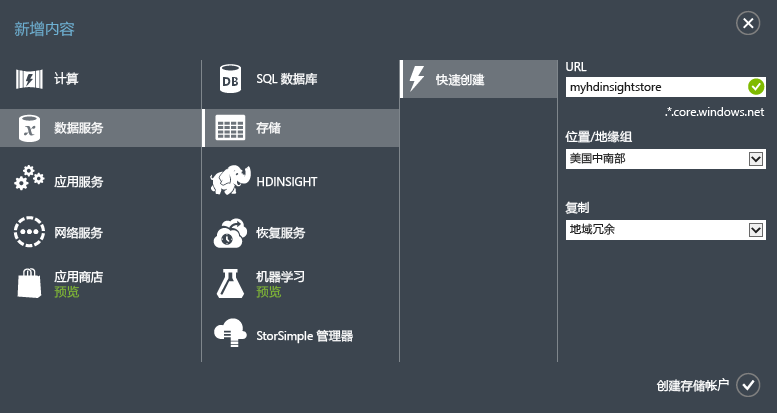
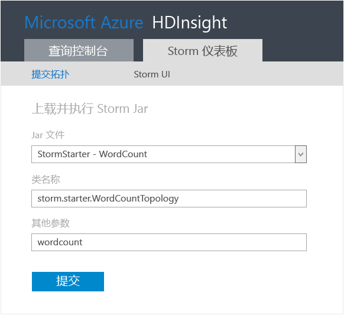
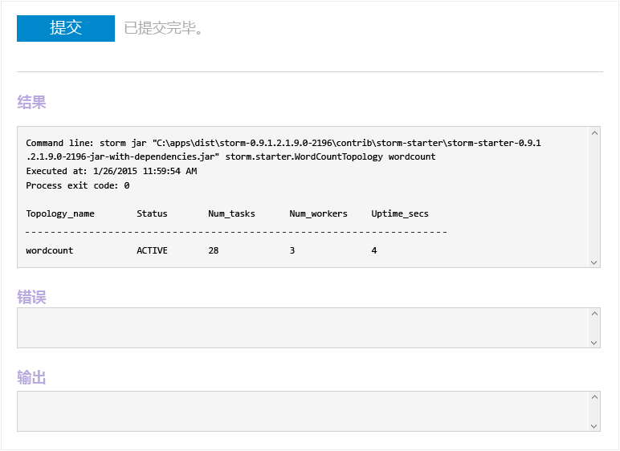
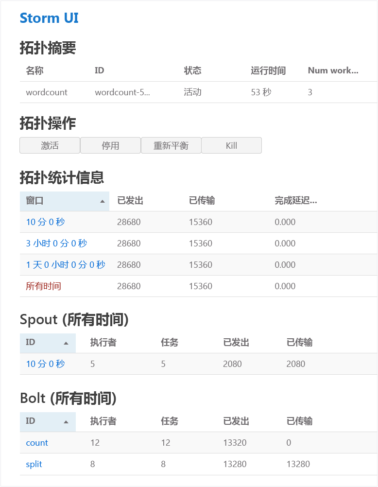
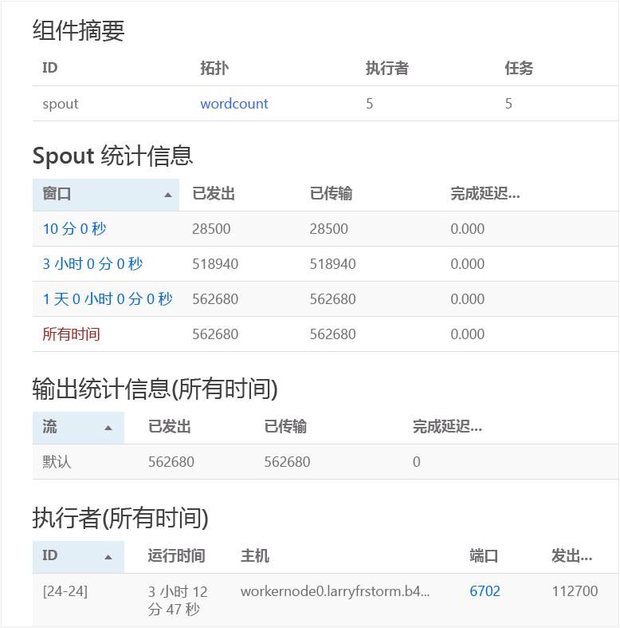

<properties
	pageTitle="Apache Storm 教程：Storm 入门 | Azure"
	description="开始在 HDInsight 上使用 Apache Storm 和 Storm 初学者示例进行大数据分析。了解如何使用 Storm 实时处理数据。"
	keywords="apache storm,apache storm 教程,大数据分析,storm 初学者"
	services="hdinsight"
	documentationCenter=""
	authors="Blackmist"
	manager="paulettm"
	editor="cgronlun"
	tags="azure-portal"/>

<tags
	ms.service="hdinsight"
	ms.date="03/07/2016"
	wacn.date="04/12/2016"/>

# Apache Storm 教程：用于在 HDInsight 上进行大数据分析的 Storm 初学者示例入门

Apache Storm 是一个可扩展的、具有容错能力的分布式实时计算系统，用于处理数据流。使用 Azure HDInsight 上的 Storm，你可以创建一个基于云的、用于实时执行大数据分析的 Storm 群集。

## 先决条件

[AZURE.INCLUDE [delete-cluster-warning](../includes/hdinsight-delete-cluster-warning.md)]

你必须具备以下条件才能成功完成本 Apache Storm 教程：

- **一个 Azure 订阅**。请参阅[获取 Azure 试用版](/pricing/1rmb-trial/)。

## 创建 Storm 群集

Storm on HDInsight 使用 Azure Blob 存储来存储提交到群集的日志文件和拓扑。使用以下步骤来创建用于群集的 Azure 存储帐户：

1.登录到 [Azure 经典管理门户](http://manage.windowsazure.cn/)。

2. 单击左下角的“新建”，依次指向“数据服务”和“存储”，然后单击“快速创建”。

	

3. 输入“URL”、“位置”和“复制”的信息，然后单击“创建存储帐户”。为 HDInsight 创建存储时，请不要选择地缘组。你将在存储列表中看到新的存储帐户。

	>[AZURE.NOTE]用于设置 HDInsight 群集的快速创建选项与我们在本教程中使用的一样，在设置群集时并不要求提供位置。相反，它默认将群集与存储帐户共同放在同一数据中心中。因此，确保在群集支持的位置中创建存储帐户，这些位置包括：“中国东部”、“中国北部”。

4. 等到新存储帐户的“状态”更改为“联机”。

有关创建存储帐户的详细信息，请参阅<a href="/documentation/articles/storage-create-storage-account/" target="_blank">如何创建存储帐户</a>。

##在 Azure 经典管理门户中预配 Storm 群集

当你设置 HDInsight 群集时，便设置了包含 Apache Storm 和相关应用程序的 Azure 计算资源。你还可以使用 Azure 经典管理门户、适用于 HDInsight 的 Azure PowerShell cmdlet 或 HDInsight .NET SDK 为其他版本创建 Hadoop 群集。有关说明，请参阅[使用自定义选项设置 HDInsight 群集][hdinsight-provision]。有关不同 HDInsight 版本及其服务级别协议 (SLA) 的信息，请参阅 [HDInsight 组件版本控制](/documentation/articles/hdinsight-component-versioning-v1/)页。

[AZURE.INCLUDE [provisioningnote](../includes/hdinsight-provisioning.md)]

1. 登录到 [Azure 经典管理门户](https://manage.windowsazure.cn)。

2. 在左窗格中单击“HDInsight”，然后单击页面左下角的“+新建”。

3. 单击第二列中的 HDInsight 图标，然后选择“Storm”。

	

4. 输入唯一的群集名称，然后输入管理员帐户的唯一密码。对于“存储帐户”，请选择前面创建的存储帐户。

	对于“群集大小”，请选择大小“1 个数据节点”以用于此群集。这是为了与群集相关联的开销降到最低。对于生产用途，你需要创建更大的群集。

	> [AZURE.NOTE]群集的管理员帐户名为 **admin**。输入的密码是此帐户的密码。你将需要此信息来对群集执行操作，例如提交或管理 Storm 拓扑。

5. 最后，选中“创建 HDINSIGHT 群集”旁边的复选标记以创建群集。

	> [AZURE.NOTE]创建群集需要一些时间，通常约 15 分钟左右。使用启动板上的磁贴或页面左侧的“通知”项检查预配过程。

## 在 HDInsight 上运行 Storm 初学者示例

本 Apache Storm 教程将介绍如何在 GitHub 上使用 Storm 初学者示例执行大型数据分析。

每个 Storm on HDInsight 群集都附带了一个 Storm 仪表板，可用于上载并在群集上运行 Storm 拓扑。每个群集还附带了可直接从 Storm 仪表板运行的示例拓扑。

### 连接到仪表板

仪表板位于 **https://&lt;clustername>.azurehdinsight.cn//**，其中 **clustername** 是群集的名称。群集的 Azure 经典管理门户页底部也提供了仪表板的链接。

 

> [AZURE.NOTE]在连接到仪表板时，系统将提示你输入用户名和密码。这是创建群集时所用的管理员名称 (**admin**) 和密码。

加载 Storm 仪表板后，你将看到“提交拓扑”窗体。

“提交拓扑”窗体可用于上载和运行包含 Storm 拓扑的 .jar 文件。它还包括群集随附的几个基本示例。

### 从 GitHub 中的 Storm 初学者项目运行单词计数示例

群集随附的示例包括单词计数拓扑的多种变体。这些示例包括随机生成句子的 **spout**，和将每个句子分解成不同的单词，然后统计每个单词出现次数的 **bolt**。这些示例来自 Apache Storm 中包含的 [Storm 初学者示例](https://github.com/apache/storm/tree/master/examples/storm-starter)。

执行以下步骤以运行 Storm 初学者示例：

1. 从“Jar 文件”下拉列表中选择“StormStarter - WordCount”。这会在“类名”和“其他参数”字段中填充此示例的参数。

	

	* **类名** - 提交拓扑的 .jar 文件中的类。
	* **其他参数** - 拓扑所需的任何参数。在此示例中，该字段用于提供已提交的拓扑的友好名称。

2. 单击“提交”。片刻之后，“结果”字段将显示用于提交该作业的命令以及命令的结果。“错误”字段将显示提交拓扑时出现的任何错误。

	

	> [AZURE.NOTE]结果不会指示已完成拓扑 - **Storm 拓扑在启动后将一直运行，直到你停止它**。 单词计数拓扑将会生成随机的句子，并会一直计算所遇到的每个单词的出现次数，直到你将其停止。

### 监视拓扑

Storm UI 可以用于监视拓扑。

1. 从 Storm 仪表板中选择“Storm UI”。这将显示群集和所有正在运行的拓扑的摘要信息。

	

	在上述页面中，你可以看到拓扑处于活动状态的时间，以及工作线程、执行器和正在使用的任务数。

	> [AZURE.NOTE]“名称”列包含前面通过“其他参数”字段提供的友好名称。

4. 在“拓扑摘要”下，选择“名称”列中的“Wordcount”条目。这将显示有关拓扑的详细信息。

	

	此页提供以下信息：

	* **拓扑统计信息** - 有关拓扑性能的基本信息，已组织到时间窗口中。

		> [AZURE.NOTE]选择特定的时间窗口会更改页面其他部分中显示的信息的时间窗口。

	* **Spout** - 有关 spout 的基本信息，包括每个 spout 返回的最后一个错误。

	* **Bolt** - 有关 bolt 的基本信息。

	* **拓扑配置** - 有关拓扑配置的详细信息。

	此页还提供可对拓扑执行的操作：

	* **激活** - 继续处理已停用的拓扑。

	* **停用** - 暂停正在运行的拓扑。

	* **重新平衡** - 调整拓扑的并行度。更改群集中的节点数目之后，你应该重新平衡正在运行的拓扑。这可让拓扑调整并行度，以弥补群集中增加/减少的节点数目。有关详细信息，请参阅[了解 Storm 拓扑的并行度](http://storm.apache.org/documentation/Understanding-the-parallelism-of-a-Storm-topology.html)。

	* **终止** - 在经过指定的超时之后终止 Storm 拓扑。

5. 在此页中，从“Spout”或“Bolt”部分中选择一个条目。这将显示有关选定组件的信息。

	

	此页显示以下信息：

	* **Spout/Bolt 统计信息** - 有关组件性能的基本信息，已组织到时间窗口中。

		> [AZURE.NOTE]选择特定的时间窗口会更改页面其他部分中显示的信息的时间窗口。

	* **输入统计信息**（仅限 Bolt）- 有关生成 Bolt 所用数据的组件的信息。

	* **输出统计信息** - 对此 Bolt 发出的数据的信息。

	* **执行器** - 有关此组件的实例的信息。

	* **错误** - 此组件生成的错误。

5. 在查看 spout 或 bolt 的详细信息时，从“执行器”部分中的“端口”列中选择一个条目可以查看组件特定实例的详细信息。

		2015-01-27 14:18:02 b.s.d.task [INFO] Emitting: split default ["with"]
		2015-01-27 14:18:02 b.s.d.task [INFO] Emitting: split default ["nature"]
		2015-01-27 14:18:02 b.s.d.executor [INFO] Processing received message source: split:21, stream: default, id: {}, [snow]
		2015-01-27 14:18:02 b.s.d.task [INFO] Emitting: count default [snow, 747293]
		2015-01-27 14:18:02 b.s.d.executor [INFO] Processing received message source: split:21, stream: default, id: {}, [white]
		2015-01-27 14:18:02 b.s.d.task [INFO] Emitting: count default [white, 747293]
		2015-01-27 14:18:02 b.s.d.executor [INFO] Processing received message source: split:21, stream: default, id: {}, [seven]
		2015-01-27 14:18:02 b.s.d.task [INFO] Emitting: count default [seven, 1493957]

	从这些数据中，你可以看到，单词 **seven** 出现了 1,493,957 次。就是自从启动此拓扑以来该单词出现的次数。

### 停止拓扑

返回到单词计数拓扑的“拓扑摘要”页，然后从“拓扑操作”部分中选择“终止”。出现提示时，输入停止拓扑之前要等待的秒数，即 10。超时期限过后，当你访问仪表板的“Storm UI”部分时，将不再显示该拓扑。

## 删除集群

[AZURE.INCLUDE [delete-cluster-warning](../includes/hdinsight-delete-cluster-warning.md)]

## 摘要

在本 Apache Storm 教程中，你已使用 Storm 初学者示例学习如何创建 Storm on HDInsight 群集，以及如何使用 Storm 仪表板来部署、监视和管理 Storm 拓扑。

## 后续步骤

* **HDInsight Tools for Visual Studio** - HDInsight Tools 允许你使用 Visual Studio 提交、监视和管理 Storm 拓扑，就像在前面提到的 Storm 仪表板中一样。HDInsight Tools 可让你创建 C# Storm 拓扑，并包含可在群集上部署和运行的示例拓扑。

	有关详细信息，请参阅 [HDInsight Tools for Visual Studio 入门](/documentation/articles/hdinsight-hadoop-visual-studio-tools-get-started/)。

* **示例文件** - HDInsight Storm 群集在 **%STORM\_HOME%\\contrib** 目录中提供了多个示例。每个示例都会包含以下内容：

	* 源代码 - 例如，storm-starter-0.9.1.2.1.5.0-2057-sources.jar

	* Java 文档 - 例如，storm-starter-0.9.1.2.1.5.0-2057-javadoc.jar

	* 示例 - 例如，storm-starter-0.9.1.2.1.5.0-2057-jar-with-dependencies.jar

	可以使用“jar”命令提取源代码或 Java 文档。例如，“jar -xvf storm-starter-0.9.1.2.1.5.0.2057-javadoc.jar”。

	> [AZURE.NOTE]Java 文档包含网页。一旦提取，可以使用浏览器来查看 **index.html** 文件。

	若要访问这些示例，必须为 Storm on HDInsight 群集启用远程桌面，然后复制 **%STORM\_HOME%\\contrib** 中的文件。

* 以下文档包含可与 Storm on HDInsight 配合使用的其他示例的列表：

	* [Storm on HDInsight 的示例拓扑](/documentation/articles/hdinsight-storm-example-topology/)

[apachestorm]: https://storm.incubator.apache.org
[stormdocs]: http://storm.incubator.apache.org/documentation/Documentation.html
[stormstarter]: https://github.com/apache/storm/tree/master/examples/storm-starter
[stormjavadocs]: https://storm.incubator.apache.org/apidocs/
[azureportal]: https://manage.windowsazure.cn/
[hdinsight-provision]: /documentation/articles/hdinsight-provision-clusters-v1/

<!---HONumber=79-->