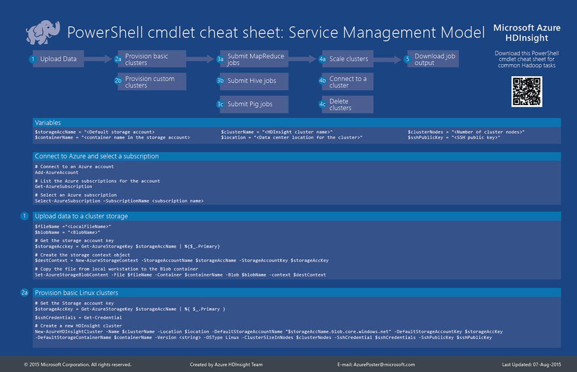

<properties 
	pageTitle="HDInsight Hadoop PowerShell Cmdlet 备忘单 | Azure" 
	description="一个可下载的 HDInsight Hadoop Powershell cmdlet 备忘单，可帮助你在 Azure HDInsight 中执行标准的 Hadoop 任务。"
	services="hdinsight" 
	documentationCenter="" 
	authors="nitinme" 
	manager="paulettm" 
	editor="cgronlun"/>

<tags
	ms.service="hdinsight"
	ms.date="02/25/2016"
	wacn.date="04/26/2016"/>

# 用于执行 Hadoop 常见任务的 Azure HDInsight PowerShell cmdlet 备忘单

Azure HDInsight 提供了 PowerShell cmdlet 用于在群集上执行 Hadoop 任务。**Azure HDInsight PowerShell Cmdlet 备忘单**旨在提供 PowerShell cmdlet 用于完成最常见的 Hadoop 任务，例如建立群集、运行作业、删除群集等。备忘单还提供了适用于 Azure HDInsight 的所有 PowerShell cmdlet 的列表。

## HDInsight 备忘单：服务管理模型

**在此处下载备忘单：[Azure HDInsight PowerShell Cmdlet 备忘单](http://download.microsoft.com/download/B/7/D/B7DBB509-164D-4343-9894-12D1FB053776/HDI_PowerShell_Cmdlet_CheatSheet.pdf)**

**查看 Azure HDInsight PowerShell 参考文档：[Azure HDInsight PowerShell 参考](https://msdn.microsoft.com/zh-cn/library/azure/dn858087.aspx)**

<!---HONumber=71-->