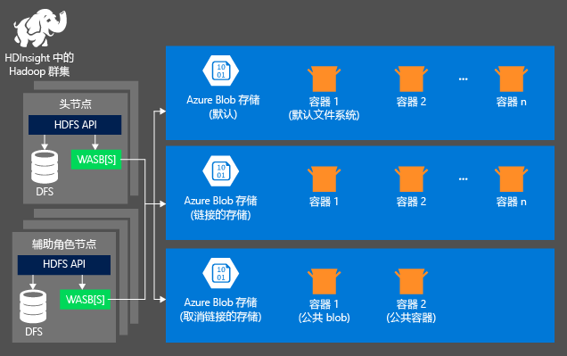

<properties
	pageTitle="从 HDFS 兼容的 Blob 存储查询数据 | Azure"
	description="HDInsight 使用 Azure Blob 存储作为 HDFS 的大数据存储。了解如何从 Blob 存储查询数据，并存储分析结果。"
	keywords="blob 存储,hdfs,结构化数据,非结构化数据"
	services="hdinsight,storage"
	documentationCenter=""
	tags="azure-portal"
	authors="mumian"
	manager="paulettm"
	editor="cgronlun"/>

<tags
	ms.service="hdinsight"
	ms.date="04/28/2016"
	wacn.date="06/29/2016"/>

# 将 HDFS 兼容的 Azure Blob 存储与 HDInsight 中的 Hadoop 配合使用

学习如何将低成本 Azure Blob 存储与 HDInsight 配合使用、创建 Azure 存储帐户和 Blob 存储容器，然后处理其中的数据。

Azure Blob 存储是一种稳健、通用的存储解决方案，它与 HDInsight 无缝集成。通过 Hadoop 分布式的文件系统 (HDFS) 界面，可以针对 Blob 存储中的结构化或非结构化数据直接运行 HDInsight 中的整套组件。

通过将数据存储在 Blob 存储中，你可以安全删除用于计算的 HDInsight 群集而不会丢失用户数据。

> [AZURE.NOTE]	HDInsight 版本 3.0 群集不支持 *asv://* 语法。这意味着提交到 HDInsight 版本 3.0 群集的任何显式使用 *asv://* 语法的作业都将会失败。应改用 *wasb://* 语法。而且，提交到任何 HDInsight 版本 3.0 群集的作业，如果是使用现有元存储创建的，而该元存储包含对使用 asv:// 语法的资源的显式引用，则这些作业也会失败。这些元存储将需要使用 wasb:// 语法重新创建以确定资源地址。
>
 HDInsight 目前只支持块 Blob。
>
 大多数 HDFS 命令（例如 <b>ls</b>、<b>copyFromLocal</b> 和 <b>mkdir</b>）仍按预期工作。只有特定于本机 HDFS 实现（称作 DFS）的命令在 Azure Blob 存储上会显示不同的行为，例如 <b>fschk</b> 和 <b>dfsadmin</b>。

有关创建 HDInsight 群集的信息，请参阅 [HDInsight 入门][hdinsight-get-started]或[创建 HDInsight 群集][hdinsight-creation]。

##HDInsight 存储体系结构
下图提供了 HDInsight 存储体系结构的抽象视图：

HDInsight 提供对在本地附加到计算节点的分布式文件系统的访问。可使用完全限定 URI 访问该文件系统，例如：

	hdfs://<namenodehost>/<path>

另外，HDInsight 提供了访问 Azure Blob 存储中所存储数据的功能。语法为：

	wasb[s]://<containername>@<accountname>.blob.core.chinacloudapi.cn/<path>

Hadoop 支持默认文件系统的概念。默认文件系统意指默认方案和授权。它还可用于解析相对路径。在 HDInsight 创建过程中，请将 Azure 存储帐户和该帐户上的特定 Azure Blob 存储容器指定为默认文件系统。

除了此存储帐户外，在创建过程中，你还可以从同一 Azure 订阅或不同 Azure 订阅添加其他存储帐户。有关添加其他存储帐户的说明，请参阅[创建 HDInsight 群集][hdinsight-creation]。

- **连接到群集的存储帐户中的容器：**由于在创建过程中帐户名称和密钥将与群集相关联，因此你对这些容器中的 Blob 具有完全访问权限。

- **没有连接到群集的存储帐户中的公共容器或公共 Blob：**你对这些容器中的 Blob 具有只读权限。

	> [AZURE.NOTE]
	> 利用公共容器，你可以获得该容器中可用的所有 Blob 的列表以及容器元数据。利用公共 Blob，你仅在知道正确 URL 时才可访问 Blob。有关详细信息，请参阅<a href="/documentation/articles/storage-manage-access-to-resources/\">限制对容器和 Blob 的访问</a>。

- **没有连接到群集的存储帐户中的私有容器：**你不能访问这些容器中的 Blob，除非在提交 WebHCat 作业时定义存储帐户。本文后面对此做了解释。

创建过程中定义的存储帐户及其密钥存储在群集节点上的 %HADOOP/\_HOME%/conf/core-site.xml 中。HDInsight 的默认行为是使用 core-site.xml 文件中定义的存储帐户。不推荐编辑 core-site.xml 文件，因为群集头节点 (master) 可能会随时重新映像或迁移，对那些文件所做的任何更改都将会丢失。

多个 WebHCat 作业，包括 Hive、MapReduce、Hadoop 流和 Pig，都可以带有存储帐户和元数据的说明。（它目前对带有存储帐户的 Pig 有效，但对元数据无效。） 在本文的[使用 Azure PowerShell 访问 Blob](#powershell) 部分中，提供了此功能的示例。有关详细信息，请参阅[将 HDInsight 群集与备用存储帐户和元存储配合使用](http://social.technet.microsoft.com/wiki/contents/articles/23256.using-an-hdinsight-cluster-with-alternate-storage-accounts-and-metastores.aspx)。

Blob 存储可用于结构化和非结构化数据。Blob 存储容器将数据存储为键值对，没有目录层次结构。不过，可在键名称中使用斜杠字符 (/)，使其看起来像存储在目录结构中的文件。例如，Blob 的键可以是 *input/log1.txt*。不存在实际的 *input* 目录，但由于键名称中包含斜杠字符，因此使其看起来像一个文件路径。

###Blob 存储的优点
通过在 Azure 数据中心的存储帐户资源附近创建计算群集，使计算节点能够通过高速网络非常高效地访问 Azure Blob 存储中的数据，从而减少了非并置计算群集和存储资源所产生的隐含性能成本。

在 Azure Blob 存储而非 HDFS 中存储数据有几个好处：

* **数据重用和共享：**HDFS 中的数据位于计算群集内。仅有权访问计算群集的应用程序才能通过 HDFS API 使用数据。Azure Blob 存储中的数据可通过 HDFS API 或 [Blob 存储 REST API][blob-storage-restAPI] 访问。因此，可使用大量应用程序（包括其他 HDInsight 群集）和工具来生成和使用此类数据。
* **数据存档：**通过在 Azure Blob 存储中存储数据，可以安全地删除用于计算的 HDInsight 群集而不会丢失用户数据。
* **数据存储成本：**与在 Azure Blob 存储中存储数据相比，在 DFS 中长期存储数据的成本更高，因为计算群集的成本高于 Azure Blob 存储容器的成本。此外，由于数据无需在每次生成计算群集时重新加载，也为你节省了数据加载成本。
* **弹性向外扩展：**尽管 HDFS 为你提供了向外扩展文件系统，但缩放将由你为群集创建的节点数量决定。与依靠你自动获得的 Azure Blob 存储的弹性缩放功能相比，更改缩放的过程可能会更复杂。
* **异地复制：**可对你的 Azure Blob 存储容器进行异地复制。尽管这可为你提供地理恢复和数据冗余功能，但针对异地复制位置的故障转移将大大影响你的性能，并且可能会产生额外成本。因此，我们建议你仅在数据的价值值得你支付额外成本时才选择适当的地理复制。

某些 MapReduce 作业和包可能会产生中间结果，你并不想在 Azure Blob 存储中存储这些结果。在此情况下，你仍可以选择将数据存储在本地 HDFS 中。实际上，HDInsight 在 Hive 作业和其他过程中会为其中某些中间结果使用 DFS。

##创建 Blob 容器

若要使用 Blob，必须先创建 [Azure 存储帐户][azure-storage-create]。在创建帐户期间，需要指定将存储你使用此帐户创建的对象的 Azure 数据中心。群集和存储帐户都必须位于同一数据中心。Hive 元存储 SQL Server 数据库和 Oozie 元存储 SQL Server 数据库也必须位于同一数据中心。

无论所创建的每个 Blob 位于何处，它都属于 Azure 存储帐户中的某个容器。此容器可以是在 HDInsight 外部创建的现有的 Blob，也可以是为 HDInsight 群集创建的容器。

默认的 Blob 容器存储群集特定的信息，如作业历史记录和日志。请不要多个 HDInsight 群集之间共享默认的 Blob 容器。这可能会损坏作业历史记录，群集将出现异常行为。建议对每个群集使用不同的容器，并将共享数据放入在所有相关群集的部署中指定的链接存储帐户，而不是放入默认存储帐户。有关配置链接存储帐户的详细信息，请参阅[创建 HDInsight 群集][hdinsight-creation]。但是，在删除原始的 HDInsight 群集后，你可以重用默认存储容器。对于 HBase 群集，实际上可以通过使用已删除的 HBase 群集使用的默认 Blob 存储容器创建新的 HBase 群集来保留 HBase 表架构和数据。

### 使用 Azure 经典管理门户

在 Azure 经典管理门户中预配 HDInsight 群集时，有两个选项：“快速创建”和“自定义创建”。“快速创建”选项要求提前创建好 Azure 存储帐户。有关说明，请参阅[如何创建存储帐户][azure-storage-create]。

使用“快速创建”选项时，你可以选择现有存储帐户。设置过程将创建一个与 HDInsight 群集同名的新容器。如果已存在同名的容器，将使用 <clusterName>-<x>，例如 *myHDIcluster-1*。此容器将用作默认文件系统。

![在 Azure 经典管理门户中对 HDInsight 中的新 Hadoop 群集使用“快速创建”。][img-hdi-quick-create]

使用“自定义创建”时，对于默认存储空间帐户，你可以选择以下选项之一：

- 使用现有存储
- 创建新存储
- 使用其他订阅中的存储

你还可以选择创建你自己的容器或使用现有的容器。

![使用现有存储帐户创建 HDInsight 群集的选项。][img-hdi-custom-create-storage-account]

若要创建容器，请使用以下命令：

	azure storage container create <containername> --account-name <storageaccountname> --account-key <storageaccountkey>

### 使用 Azure PowerShell

如果你[已安装并配置 Azure PowerShell][powershell-install]，则可以从 Azure PowerShell 提示符使用以下命令来创建存储帐户和容器：

	$subscriptionName = "<SubscriptionName>"	# Azure subscription name
	$storageAccountName = "<AzureStorageAccountName>" # The storage account that you will create
	$containerName="<BlobContainerToBeCreated>" # The Blob container name that you will create

	# Connect to your Azure account and selec the current subscription
	Add-AzureAccount # The connection will expire in 12 hours.
	Select-AzureSubscription $subscriptionName #only required if you have multiple subscriptions

	# Create a storage context object
	$storageAccountkey = get-azurestoragekey $storageAccountName | %{$_.Primary}
	$destContext = New-AzureStorageContext -StorageAccountName $storageAccountName -StorageAccountKey $storageAccountKey  

	# Create a Blob storage container
	New-AzureStorageContainer -Name $containerName -Context $destContext

##确定 Blob 存储空间中文件的地址

用于从 HDInsight 访问 Blob 存储中的文件的 URI 方案为：

	wasb[s]://<BlobStorageContainerName>@<StorageAccountName>.blob.core.chinacloudapi.cn/<path>

> [AZURE.NOTE] 用于在存储模拟器上确定文件地址的语法（在 HDInsight 模拟器上运行）是 <i>wasb://&lt;ContainerName&gt;@storageemulator</i>。

URI 方案提供了使用 *wasb:* 前缀的未加密访问和使用 *wasbs* 的 SSL 加密访问。建议尽量使用 *wasbs*，即使在访问位于同一 Azure 数据中心内的数据时也是如此。

&lt;BlobStorageContainerName&gt; 标识 Azure Blob 存储中的容器名称。&lt;StorageAccountName&gt; 标识 Azure 存储帐户名。完全限定域名 (FQDN) 是必需的。

如果既没有指定 &lt;BlobStorageContainerName&gt; 也没有指定 &lt;StorageAccountName&gt;，则会使用默认文件系统。对于默认文件系统中的文件，你可以使用相对路径或绝对路径。例如，可以使用以下任一方式引用随 HDInsight 群集提供的 *hadoop-mapreduce-examples.jar* 文件：

	wasb://mycontainer@myaccount.blob.core.chinacloudapi.cn/example/jars/hadoop-mapreduce-examples.jar
	wasb:///example/jars/hadoop-mapreduce-examples.jar
	/example/jars/hadoop-mapreduce-examples.jar

> [AZURE.NOTE] 在 HDInsight 版本 2.1 和 1.6 群集中，文件名是 <i>hadoop-examples.jar</i>。

&lt;path&gt; 是文件或目录 HDFS 路径名。由于 Azure Blob 存储容器只是键值存储，因此没有真正的分层文件系统。Blob 键中的斜杠字符 (/) 解释为目录分隔符。例如，*hadoop-mapreduce-examples.jar* 的 Blob 名称是：

	example/jars/hadoop-mapreduce-examples.jar

> [AZURE.NOTE] 在 HDInsight 外部使用 Blob 时，大多数实用程序无法识别 WASB 格式，你应该改用基本的路径格式，如 `example/jars/hadoop-mapreduce-examples.jar`。

##使用 Azure CLI 访问 Blob

使用以下命令列出与 Blob 有关的命令：

	azure storage blob

**使用 Azure CLI 上载文件的示例**

	azure storage blob upload <sourcefilename> <containername> <blobname> --account-name <storageaccountname> --account-key <storageaccountkey>

**使用 Azure CLI 下载文件的示例**

	azure storage blob download <containername> <blobname> <destinationfilename> --account-name <storageaccountname> --account-key <storageaccountkey>

**使用 Azure CLI 删除文件的示例**

	azure storage blob delete <containername> <blobname> --account-name <storageaccountname> --account-key <storageaccountkey>

**使用 Azure CLI 列出文件的示例**

	azure storage blob list <containername> <blobname|prefix> --account-name <storageaccountname> --account-key <storageaccountkey>

##使用 Azure PowerShell 访问 Blob

> [AZURE.NOTE] 本部分中的命令提供了使用 PowerShell 访问 Blob 中存储的数据的基本示例。有关针对使用 HDInsight 自定义的功能更加全面的示例，请参阅 [HDInsight 工具](https://github.com/Blackmist/hdinsight-tools)。

使用以下命令列出与 Blob 有关的 cmdlet：

	Get-Command *blob*

![Blob 相关 PowerShell cmdlet 的列表。][img-hdi-powershell-blobcommands]

###上载文件

请参阅[将数据上载到 HDInsight][hdinsight-upload-data]。

###下载文件

以下脚本将一个块 Blob 下载到当前文件夹。运行该脚本之前，请将该目录更改为你有写权限的文件夹。

	$storageAccountName = "<AzureStorageAccountName>"   # The storage account used for the default file system specified at provision.
	$containerName = "<BlobStorageContainerName>"  # The default file system container has the same name as the cluster.
	$blob = "example/data/sample.log" # The name of the blob to be downloaded.
	
	# Use Add-AzureAccount if you haven't connected to your Azure subscription
	#Add-AzureAccount # The connection is good for 12 hours

	# Use these two commands if you have multiple subscriptions
	#$subscriptionName = "<SubscriptionName>"
	#Select-AzureSubscription $subscriptionName

	Write-Host "Create a context object ... " -ForegroundColor Green
	$storageAccountKey = Get-AzureStorageKey $storageAccountName | %{ $_.Primary }
	$storageContext = New-AzureStorageContext -StorageAccountName $storageAccountName -StorageAccountKey $storageAccountKey  
	
	Write-Host "Download the blob ..." -ForegroundColor Green
	Get-AzureStorageBlobContent -Container $ContainerName -Blob $blob -Context $storageContext -Force
	
	Write-Host "List the downloaded file ..." -ForegroundColor Green
	cat "./$blob"

###删除文件

以下脚本显示如何删除文件。

	$storageAccountName = "<AzureStorageAccountName>"   # The storage account used for the default file system specified at provision.
	$containerName = "<BlobStorageContainerName>"  # The default file system container has the same name as the cluster.
	$blob = "example/data/sample.log" # The name of the blob to be downloaded.

	# Use Add-AzureAccount if you haven't connected to your Azure subscription
	#Add-AzureAccount -Environment AzureChinaCloud # The connection is good for 12 hours

	# Use these two commands if you have multiple subscriptions
	#$subscriptionName = "<SubscriptionName>"
	#Select-AzureSubscription $subscriptionName

	Write-Host "Create a context object ... " -ForegroundColor Green
	$storageAccountKey = Get-AzureStorageKey $storageAccountName | %{ $_.Primary }
	$storageContext = New-AzureStorageContext -Environment AzureChinaCloud -StorageAccountName $storageAccountName -StorageAccountKey $storageAccountKey  

	Write-Host "Delete the blob ..." -ForegroundColor Green
	Remove-AzureStorageBlob -Container $containerName -Context $storageContext -blob $blob

###列出文件

以下脚本显示如何列出文件夹中的文件。（下一个示例显示如何使用 **Invoke-Hive** cmdlet 来执行 **dfs ls** 命令以列出文件夹。）

	$storageAccountName = "<AzureStorageAccountName>"   # The storage account used for the default file system specified at provision.
	$containerName = "<BlobStorageContainerName>"  # The default file system container has the same name as the cluster.
	$blobPrefix = "example/data/"

	# Use Add-AzureAccount if you haven't connected to your Azure subscription
	#Add-AzureAccount -Environment AzureChinaCloud # The connection is good for 12 hours

	# Use these two commands if you have multiple subscriptions
	#$subscriptionName = "<SubscriptionName>"
	#Select-AzureSubscription $subscriptionName

	Write-Host "Create a context object ... " -ForegroundColor Green
	$storageAccountKey = Get-AzureStorageKey $storageAccountName | %{ $_.Primary }
	$storageContext = New-AzureStorageContext -Environment AzureChinaCloud -StorageAccountName $storageAccountName -StorageAccountKey $storageAccountKey  

	Write-Host "List the files in $blobPrefix ..."
	Get-AzureStorageBlob -Container $containerName -Context $storageContext -prefix $blobPrefix

###使用未定义的存储帐户运行 Hive 查询

此示例显示如何列出在创建过程中未定义的存储帐户的文件夹。

	$clusterName = "<HDInsightClusterName>"

	$undefinedStorageAccount = "<UnboundedStorageAccountUnderTheSameSubscription>"
	$undefinedContainer = "<UnboundedBlobContainerAssociatedWithTheStorageAccount>"

	$undefinedStorageKey = Get-AzureStorageKey $undefinedStorageAccount | %{ $_.Primary }

	Use-AzureHDInsightCluster $clusterName

	$defines = @{}
	$defines.Add("fs.azure.account.key.$undefinedStorageAccount.blob.core.chinacloudapi.cn", $undefinedStorageKey)

	Invoke-Hive -Defines $defines -Query "dfs -ls wasb://$undefinedContainer@$undefinedStorageAccount.blob.core.chinacloudapi.cn/;"

##后续步骤

在本文中，你已学习如何将 HDFS 兼容的 Azure Blob 存储与 HDInsight 配合使用，并已了解 Azure Blob 存储是 HDInsight 的一个基本组件。这样，你就可以使用 Azure Blob 存储来生成可伸缩的长期存档数据获取解决方案，并使用 HDInsight 来解锁所存储结构化和非结构化数据内的信息。

有关详细信息，请参阅：

* [Azure HDInsight 入门][hdinsight-get-started]
* [将数据上载到 HDInsight][hdinsight-upload-data]
* [将 Hive 与 HDInsight 配合使用][hdinsight-use-hive]
* [将 Pig 与 HDInsight 配合使用][hdinsight-use-pig]
* [使用 Azure 存储空间共享访问签名来限制使用 HDInsight 访问数据][hdinsight-use-sas]

[hdinsight-use-sas]: /documentation/articles/hdinsight-storage-sharedaccesssignature-permissions/
[powershell-install]: /documentation/articles/powershell-install-configure/
[hdinsight-creation]: /documentation/articles/hdinsight-provision-clusters-v1/
[hdinsight-get-started]: /documentation/articles/hdinsight-hadoop-tutorial-get-started-windows-v1/
[hdinsight-upload-data]: /documentation/articles/hdinsight-upload-data/
[hdinsight-use-hive]: /documentation/articles/hdinsight-use-hive/
[hdinsight-use-pig]: /documentation/articles/hdinsight-use-pig/

[blob-storage-restAPI]: http://msdn.microsoft.com/zh-cn/library/azure/dd135733.aspx
[azure-storage-create]: /documentation/articles/storage-create-storage-account/

[img-hdi-powershell-blobcommands]: ./media/hdinsight-hadoop-use-blob-storage/HDI.PowerShell.BlobCommands.png
[img-hdi-quick-create]: ./media/hdinsight-hadoop-use-blob-storage/HDI.QuickCreateCluster.png
[img-hdi-custom-create-storage-account]: ./media/hdinsight-hadoop-use-blob-storage/HDI.CustomCreateStorageAccount.png

<!---HONumber=Mooncake_0307_2016-->