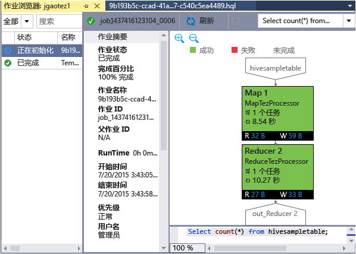

<properties
	pageTitle="了解如何使用 Visual Studio Hadoop Tools for HDInsight | Azure"
	description="了解如何安装和使用 Visual Studio Hadoop tools for HDInsight 连接到 Hadoop 群集及运行 Hive 查询。"
	keywords="hadoop tools,hive query,visual studio"
	services="HDInsight"
	documentationCenter=""
	tags="azure-portal"
	authors="mumian"
	manager="paulettm"
	editor="cgronlun"/>

<tags 
	ms.service="hdinsight"  
	ms.date="09/21/2015"
	wacn.date="11/02/2015"/>

# 开始使用 HDInsight 的 Visual Studio Hadoop 工具来运行 Hive 查询

了解如何使用适用于 Visual Studio 的 HDInsight 工具连接到 HDInsight 群集和提交 Hive 查询。有关如何使用 HDInsight 的详细信息，请参阅[开始使用 HDInsight][hdinsight.get.started]。有关连接到 Storm 群集的详细信息，请参阅[使用 Visual Studio 在 HDInsight 上针对 Apache Storm 开发 C# 拓扑][hdinsight.storm.visual.studio.tools]。

>[AZURE.NOTE]最新版本引入了一些新功能，例如 Hive 编辑器支持、Hive 脚本本地验证和 YARN 日志访问。

##先决条件

若要完成本教程并使用 Visual Studio 中的 Hadoop 工具，你需要做好以下准备：

- Azure HDInsight 群集：基于 Windows 的群集可用于本文档中的步骤。有关创建群集的详细信息，请参阅下列主题之一：

	- [开始使用基于 Windows 的 HDInsight](/documentation/articles/hdinsight-hadoop-tutorial-get-started-windows)

- 安装有以下软件的工作站：

	- Windows 8.1、Windows 8 或 Windows 7
	- Visual Studio（以下版本之一）：
		- 包含 [Update 4](https://www.microsoft.com/download/details.aspx?id=44921) 的 Visual Studio 2013 Community/Professional/Premium/Ultimate
		- Visual Studio 2015 (Community/Enterprise)

	>[AZURE.NOTE]目前，适用于 Visual Studio 的 HDInsight 工具仅有英文版本。

## 安装 HDInsight Tools for Visual Studio

适用于 Visual Studio 的 HDInsight 工具和 Microsoft Hive ODBC Driver 是随同 Windows Azure SDK for .NET 2.5.1 或更高版本一起打包的。你可以使用 [Web 平台安装程序](http://download.microsoft.com/download/F/4/2/F42AB12D-C935-4E65-9D98-4E56F9ACBC8E/wpilauncher.exe)安装它。你必须选择与你的 Visual Studio 版本匹配的版本。如果你尚未安装 Visual Studio，则可使用 [Web 平台安装程序](http://download.microsoft.com/download/F/4/2/F42AB12D-C935-4E65-9D98-4E56F9ACBC8E/wpilauncher.exe)或以下链接安装最新 Visual Studio Community 和 Azure SDK：

- [Visual Studio Community 2015 with Windows Azure SDK](https://www.microsoft.com/web/handlers/webpi.ashx/getinstaller/VS2015CommunityAzurePack.appids) 
- [Visual Studio Community 2013 with Windows Azure SDK](https://www.microsoft.com/web/handlers/webpi.ashx/getinstaller/VS2013CommunityAzurePack.appids) 
- [Windows Azure SDK for .NET (VS 2015)](https://www.microsoft.com/web/handlers/webpi.ashx/getinstaller/VWDOrVs2015AzurePack.appids) 
- [Windows Azure SDK for .NET (VS 2013)](https://www.microsoft.com/web/handlers/webpi.ashx/getinstaller/VWDOrVs2013AzurePack.appids) 

![Hadoop 工具：HDInsight Tools for Visual Studio Web 平台安装程序。][1]

## 连接到 Azure 订阅
适用于 Visual Studio 的 HDInsight 工具允许你连接到 HDInsight 群集，执行一些基本的管理操作，并运行 Hive 查询。

>[AZURE.NOTE]有关如何连接到 HDInsight 模拟器的信息，请参阅 [HDInsight 模拟器入门](/documentation/articles/hdinsight-get-started-emulator#vstools)。

>[AZURE.NOTE]有关连接到常规 Hadoop 群集（预览版）的信息，请参阅[使用 Visual Studio 编写和提交 Hive 查询](http://blogs.msdn.com/b/xiaoyong/archive/2015/05/04/how-to-write-and-submit-hive-queries-using-visual-studio.aspx)。

**连接到 Azure 订阅**

1.	打开 Visual Studio。
2.	在“视图”菜单中，单击“服务器资源管理器”，以打开“服务器资源管理器”窗口。
3.	依次展开“Azure”和“HDInsight”。 

	>[AZURE.NOTE]请注意，应打开“HDInsight 任务列表”窗口。如果你未看到它，则在“视图”菜单中，单击“其他窗口”，然后单击“HDInsight 任务列表”窗口。  
4.	输入你的 Azure 订阅凭据，然后单击“登录”。仅当你尚未从此工作站上的 Visual Studio 连接到 Azure 订阅时，才需要此凭据。
5.	在“服务器资源管理器”中，你将看到现有 HDInsight 群集的列表。如果你没有任何群集，则可以通过使用 Azure 门户、Azure PowerShell 或 HDInsight SDK 预配群集。有关详细信息，请参阅[设置 HDInsight 群集][hdinsight-provision]。

	![Hadoop 工具：HDInsight Tools for Visual Studio 服务器资源管理器群集列表][5]
6.	展开 HDInsight 群集。你将看到“Hive 数据库”、默认存储帐户、链接的存储帐户，以及“Hadoop 服务日志”。你可以进一步展开条目。

在连接到你的 Azure 订阅后，你将能够执行以下操作：

**从 Visual Studio 连接到 Azure 门户**

- 在“服务器资源管理器”中，展开“Azure”>“HDInsight”，右键单击 HDInsight 群集，然后单击“在 Azure 门户中管理群集”。

**通过 Visual Studio 提出问题并提供反馈**

- 在“工具”菜单中，单击“HDInsight”，然后单击“MSDN 论坛”，以提出问题，或单击“提供反馈”。

## 导航链接的资源 

在“服务器资源管理器”中，你可以看到默认存储帐户和任何链接的存储帐户。如果你展开默认存储帐户，则可以看到存储帐户中的容器。默认存储帐户和默认容器将处于标记状态。你也可以右键单击任何容器以查看内容。

![HDInsight Tools for Visual Studio 服务器资源管理器群集列表][2]

## 运行 Hive 查询
[Apache Hive][apache.hive] 是基于 Hadoop 构建的数据仓库基础结构，用于提供数据摘要、查询和分析。适用于 Visual Studio 的 HDInsight 工具支持从 Visual Studio 运行 Hive 查询。有关 Hive 的详细信息，请参阅[将 Hive 与 HDInsight 配合使用][hdinsight.hive]。

对 HDInsight 群集测试 Hive 脚本比较费时。它可能需要几分钟或更长时间。适用于 Visual Studio 的 HDInsight 工具可以在本地验证 Hive 脚本，而无需连接到活动群集。

适用于 Visual Studio 的 HDInsight 工具还让用户可通过以下方式查看 Hive 作业中的内容：连接和提供某些 Hive 作业的 YARN 日志。

### 查看 **hivesampletable**
所有 HDInsight 群集都提供了一个名为 *hivesampletable* 的示例 Hive 表。我们将使用此表向你说明如何列出 Hive 表、如何查看表架构，以及如何列出 Hive 表中的行。

**列出 Hive 表和查看 Hive 表架构**

1.	在“服务器资源管理器”中，展开“Azure”>“HDInsight”> 所选的群集 >“Hive 数据库”>“默认值”>“hivesampletable”，以查看表架构。
4.	右键单击“hivesampletable”，然后单击“查看前 100 行”以列出行。这相当于使用 Hive ODBC 驱动程序运行以下 Hive 查询：

		SELECT * FROM hivesampletable LIMIT 100

	你可以自定义行计数。

	![Hadoop 工具：HDinsight Hive Visual Studio 架构查询][6]

###创建 Hive 表

你可以使用 GUI 创建 Hive 表或使用 Hive 查询。有关使用 Hive 查询的信息，请参阅[运行 Hive 查询](#run.queries)。

**创建 Hive 表**

1. 在“服务器资源管理器”中，展开“Azure”>“HDInsight 群集” > HDInsight 群集 >“Hive 数据库”，然后右键单击“默认值”，再单击“创建表”。
2. 配置该表。
3. 单击“创建表”来提交创建新 Hive 表的作业。

	![Hadoop 工具：hdinsight visual studio 工具创建 hive 表][7]

###验证和运行 Hive 查询
你可以使用两种方法创建和运行 Hive 查询：

- 创建临时查询
- 创建 Hive 应用程序

**创建、验证和运行临时查询**

1. 在“服务器资源管理器”中，展开“Azure”，然后展开“HDInsight 群集”。
2. 右键单击要运行查询的群集，然后单击“编写 Hive 查询”。
3. 输入 Hive 查询。请注意，Hive 编辑器支持 IntelliSense。HDInsight Tools for Visual Studio 支持在你编辑 Hive 脚本时加载远程元数据。例如，当你键入“SELECT * FROM”时，IntelliSense 将列出所有建议的表名称。在指定表名称后，IntelliSense 将列出列名称。该工具几乎支持所有的 Hive DML 语句、子查询和内置 UDF。

	![Hadoop 工具：HDInsight Visual Studio Tools IntelliSense][13]

	![Hadoop 工具：HDInsight Visual Studio Tools IntelliSense][14]

	> [AZURE.NOTE]只建议 HDInsight 工具栏中已选择的群集元数据。
4. （可选）：单击“验证脚本”以检查脚本语法错误。

	![Hadoop 工具：hdinsight tools for Visual Studio 本地验证][10]

4. 单击“提交”或“提交(高级)”。使用高级提交选项，你可以针对脚本配置“作业名称”、“参数”、“其他配置”和“状态目录”：

	![hdinsight hadoop hive 查询][9]

	在提交作业后，你会看到“Hive 作业摘要”窗口。

	![HDInsight Hadoop Hive 查询摘要][8]
5. 使用“刷新”按钮来更新状态，直到作业状态更改为“已完成”。
6. 单击底部的链接可查看以下内容：**作业查询**、**作业输出**、**作业日志**或 **Yarn 日志**。

**创建和运行 Hive 解决方案**

1. 在“文件”菜单中，单击“新建”，然后单击“项目”。
2. 从左窗格中选择“HDInsight”，在中间窗格中选择“Hive 应用程序”，输入属性，然后单击“确定”。

	![Hadoop 工具：hdinsight visual studio 工具新建 hive 项目][11]
3. 在“解决方案资源管理器”中，双击 **Script.hql** 以将其打开。
4. 若要验证 Hive 脚本，你可以单击“验证脚本”按钮，或在 Hive 编辑器中右键单击该脚本，然后在上下文菜单中单击“验证脚本”。

 
###查看 Hive 作业
你可以查看作业查询、作业输出、作业日志和 Hive 作业的 Yarn 日志。有关详细信息，请参阅以前的屏幕截图。

最新版本的工具允许你通过收集和提供 YARN 日志来查看 Hive 作业的内容。YARN 日志可以帮助你调查性能问题。有关 HDInsight 如何收集 YARN 日志的详细信息，请参阅 [以编程方式访问 HDInsight 应用程序日志][hdinsight.access.application.logs]。

**查看 Hive 作业**

1. 在“服务器资源管理器”中，展开“Azure”，然后展开“HDInsight”。
2. 右键单击 HDInsight 群集，然后单击“查看作业”。你将会看到群集上运行的 Hive 作业的列表。
3. 单击作业列表中的作业以将其选定，然后使用“Hive 作业摘要”窗口以打开“作业查询”、“作业输出”、“作业日志”或“Yarn 日志”。

	![Hadoop 工具：HDInsight Visual Studio 工具查看 Hive 作业][12]

### Tez Hive 作业性能图

HDInsight Visual Studio 工具支持显示 Tez 执行引擎运行的 Hive 作业的性能图。有关启用 Tez 的信息，请参阅[使用 HDInsight 中的 Hive][hdinsight.hive]。提交 Visual Studio 中的 Hive 作业后，Visual Studio 将在作业完成时显示图形。你可能需要单击“刷新”按钮来获取最新的作业状态。

> [AZURE.NOTE]此功能仅适用于高于 3.2.4.593 版的 HDInsight 群集，并且只能用于已完成的作业。它适用于基于 Windows 的群集。

为了帮助你更好地了解 Hive 查询，该工具在此版中添加了“Hive 运算符”视图。只需双击作业图的相应顶点，即可查看顶点中的所有运算符。也可将鼠标悬停在特定运算符上方，以查看该运算符的更多详细信息。

## 运行 Pig 脚本

HDInsight Tools for Visual Studio 支持创建 Pig 脚本并将其提交到 HDInsight 群集。用户可基于模板创建 Pig 项目，然后将脚本提交到 HDInsight 群集。

## 后续步骤
在本文中，你已学习如何使用 Hadoop 工具包从 Visual Studio 连接到 HDInsight 群集，以及如何运行 Hive 查询。有关详细信息，请参阅：

- [在 HDInsight 中使用 Hadoop Hive][hdinsight.hive]
- [开始在 HDInsight 中使用 Hadoop][hdinsight.get.started]
- [在 HDInsight 中提交 Hadoop 作业][hdinsight.submit.jobs]

<!--Anchors-->
[Installation]: #installation
[Connect to your Azure subscription]: #connect-to-your-azure-subscription
[Navigate the linked resources]: #navigate-the-linked-resources
[Run Hive queries]: #run-hive-queries
[Next steps]: #next-steps

<!--Image references-->
[1]: ./media/hdinsight-hadoop-visual-studio-tools-get-started/hdinsight.visual.studio.tools.wpi.png
[2]: ./media/hdinsight-hadoop-visual-studio-tools-get-started/hdinsight.visual.studio.tools.linked.resources.png
[5]: ./media/hdinsight-hadoop-visual-studio-tools-get-started/hdinsight.visual.studio.tools.server.explorer.png
[6]: ./media/hdinsight-hadoop-visual-studio-tools-get-started/hdinsight.visual.studio.tools.hive.schema.png
[7]: ./media/hdinsight-hadoop-visual-studio-tools-get-started/hdinsight.visual.studio.tools.create.hive.table.png
[8]: ./media/hdinsight-hadoop-visual-studio-tools-get-started/hdinsight.visual.studio.tools.run.hive.job.summary.png
[9]: ./media/hdinsight-hadoop-visual-studio-tools-get-started/hdinsight.visual.studio.tools.submit.jobs.advanced.png
[10]: ./media/hdinsight-hadoop-visual-studio-tools-get-started/hdinsight.visual.studio.tools.validate.hive.script.png
[11]: ./media/hdinsight-hadoop-visual-studio-tools-get-started/hdinsight.visual.studio.tools.new.hive.project.png
[12]: ./media/hdinsight-hadoop-visual-studio-tools-get-started/hdinsight.visual.studio.tools.view.hive.jobs.png
[13]: ./media/hdinsight-hadoop-visual-studio-tools-get-started/hdinsight.visual.studio.tools.intellisense.table.names.png
[14]: ./media/hdinsight-hadoop-visual-studio-tools-get-started/hdinsight.visual.studio.tools.intellisense.column.names.png

<!--Link references-->
[hdinsight-provision]: /documentation/articles/hdinsight-provision-clusters/
[hdinsight.introduction]: /documentation/articles/hdinsight-introduction/
[hdinsight.get.started]: /documentation/articles/hdinsight-get-started/
[hdinsight.hive]: /documentation/articles/hdinsight-use-hive/
[hdinsight.submit.jobs]: /documentation/articles/hdinsight-submit-hadoop-jobs-programmatically

[hdinsight.storm.visual.studio.tools]: /documentation/articles/hdinsight-storm-develop-csharp-visual-studio-topology
[hdinsight.submit.jobs]: /documentation/articles/hdinsight-submit-hadoop-jobs-programmatically/

[apache.hive]: http://hive.apache.org

<!---HONumber=76-->