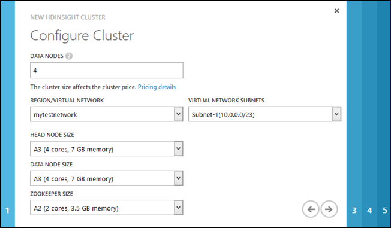
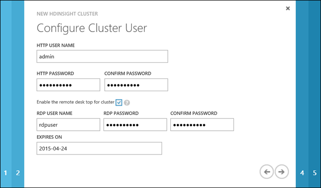
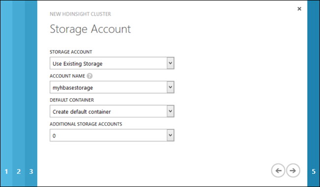

<properties
	pageTitle="在虚拟网络上预配 HBase 群集 | Azure"
	description="开始在 Azure HDInsight 中使用 HBase。了解如何在 Azure 虚拟网络上创建 HDInsight HBase 群集。"
	keywords=""
	services="hdinsight,virtual-network"
	documentationCenter=""
	authors="mumian"
	manager="paulettm"
	editor="cgronlun"/>

<tags
	ms.service="hdinsight"
	ms.date="03/04/2016"
	wacn.date="04/26/2016"/>

# 在 Azure 虚拟网络上设置 HBase 群集

了解如何在 [Azure 虚拟网络][1]上创建 Azure HDInsight HBase 群集。

通过虚拟网络集成，可以将 HBase 群集部署到应用程序所在的虚拟网络，以便应用程序直接与 HBase 进行通信。优点包括：

- 将 Web 应用直接连接到 HBase 群集节点，以通过 HBase Java 远程过程调用 (RPC) API 实现通信。
- 提高性能，因为流量不必通过多个网关和负载平衡器。
- 能够以更安全的方式处理敏感信息，而无需公开公共终结点。

##先决条件
在开始阅读本教程前，你必须具有：

- **一个 Azure 订阅**。请参阅[获取 Azure 免费试用版](/pricing/1rmb-trial/)。

- **配备 Azure PowerShell 的工作站**。

	在运行 Azure PowerShell 脚本之前，请确保你已通过使用以下 cmdlet 连接到 Azure 订阅：

		Add-AzureAccount -Environment AzureChinaCloud

	如果你有多个 Azure 订阅，请使用以下 cmdlet 来设置当前订阅：

		Select-AzureSubscription <AzureSubscriptionName>

##在虚拟网络中设置 HBase 群集

在设置 HBase 群集前，你需要拥有 Azure 虚拟网络。

**通过使用 Azure 经典管理门户创建虚拟网络**

1. 登录到 [Azure 经典管理门户][azure-portal]。
2. 单击左下角的“新建”，然后依次单击“网络服务”、“虚拟网络”和“快速创建”。
3. 键入或选择以下值：

	- **名称** - 虚拟网络的名称。
	- **地址空间** - 为虚拟网络提供大到足以为群集中的所有节点提供地址的地址空间。否则，设置将失败。为了完成本教程，你可以选取以下三个选项之一。
	- **最大 VM 计数** - 选择最大虚拟机 (VM) 计数之一。此值确定可以在地址空间下创建的可能主机 (VM) 数。为了完成本教程，**4096 [CIDR: /20]** 便已足够。
	- **位置** - 位置必须与你要创建的 HBase 群集相同。
	- **DNS 服务器** - 本教程使用 Azure 提供的内部域名系统 (DNS) 服务器，因此，你可以选择“无”。此外，也支持使用自定义 DNS 服务器的高级网络配置。有关详细指导，请参阅[名称解析 (DNS)](/documentation/articles/virtual-networks-name-resolution-for-vms-and-role-instances/)。
4. 单击右下角的“创建虚拟网络”。新虚拟网络名称将显示在列表中。等到“状态”列显示“已创建”。
5. 在主窗格中，单击刚创建的虚拟网络。
6. 单击该页顶部的“仪表板”。
7. 在“速览”下，记住虚拟网络 ID。在设置 HBase 群集时将要用到它。
8. 单击该页顶部的“配置”。
9. 在该页底部，默认子网名称为 **Subnet-1**。你可以选择重命名子网或者向 HBase 群集添加一个新子网。记下子网名称；在设置群集时将要用到它。
10. 验证要用于群集的子网的“CIDR(地址计数)”。地址数必须大于辅助节点数加上七（网关：2，头节点：2，ZooKeeper：3）。例如，如果需要一个 10 节点 HBase 群集，则子网的地址计数必须大于 17 (10+7)。否则，部署将失败。
11. 如果更新了子网值，请单击该页底部的“保存”。

**向虚拟网络添加 DNS 服务器虚拟机**

DNS 服务器是可选的，但在某些情况下又是必需的。[在两个 Azure 虚拟网络之间配置 DNS][hdinsight-hbase-replication-dns] 中记录了该过程。基本上，你将需要执行以下步骤：

1. 向虚拟网络添加 Azure 虚拟机
2. 为虚拟机设置静态 IP 地址
3. 向虚拟网络添加 DNS 服务器角色
4. 将 DNS 服务器分配到虚拟网络

**创建群集要使用的 Azure 存储帐户和 Blob 存储容器**

> [AZURE.NOTE]HDInsight 群集使用 Azure Blob 存储来存储数据。有关详细信息，请参阅[在 HDInsight 中将 Azure Blob 存储与 Hadoop 配合使用](/documentation/articles/hdinsight-hadoop-use-blob-storage/)。你需要存储帐户和 Blob 存储容器。存储帐户位置必须与虚拟网络位置和群集位置匹配。

像其他 HDInsight 群集，HBase 群集要求将 Azure 存储帐户和 Blob 存储容器作为默认文件系统。存储帐户位置必须与虚拟网络位置和群集位置匹配。有关详细信息，请参阅[在 HDInsight 中将 Azure Blob 存储与 Hadoop 配合使用][hdinsight-storage]。在设置 HBase 群集时，你可以选择创建新群集或使用现有群集。此过程演示如何使用 Azure 经典管理门户创建存储帐户和 Blob 存储容器。

1. 登录到 [Azure 经典管理门户][azure-portal]。
2. 单击左下角的“新建”，依次指向“数据服务”和“存储”，然后单击“快速创建”。

3. 键入或选择以下值：

	- **URL** - 存储帐户的名称。
	- **位置** - 存储帐户的位置。确保其与虚拟网络位置匹配。不支持地缘组。
	- **复制** - 出于测试目的，使用“本地冗余”来降低成本。

4. 单击“创建存储帐户”。你将在存储列表中看到新的存储帐户。
5. 等到新存储帐户的“状态”更改为“联机”。
6. 单击该列表中的新存储帐户以将其选定。
7. 在该页的底部，单击“管理访问密钥”。
8. 记下存储帐户名称和主访问密钥（或辅助访问密钥；两个密钥之一起作用）。本教程后面的步骤中将会用到它们。
9. 在该页的顶部，单击“容器”。
10. 在该页的底部，单击“添加”。
11. 输入容器名称。该容器将用作 HBase 群集的默认容器。默认情况下，默认容器名称与群集名称匹配。将“访问”字段保留为“私有”。  
12. 单击复选标记以创建容器。

**通过使用 Azure 经典管理门户设置 HBase 群集**

> [AZURE.NOTE]有关通过使用 Azure PowerShell 预配新 HBase 群集的信息，请参阅[使用 Azure PowerShell 预配 HBase 群集](#powershell)。

1. 登录到 [Azure 经典管理门户][azure-portal]。

2. 单击左下角的“新建”，依次指向“数据服务”和“HDINSIGHT”，然后单击“自定义创建”。

3. 输入群集名称，选择 HBase 作为群集类型，选择 Windows Server 2012 操作系统，选择 HDInsight 版本，然后单击右侧按钮。

	![提供 HBase 群集的详细信息][img-provision-cluster-page1]

	> [AZURE.NOTE]对于 HBase 群集，Windows Server 是唯一可用的 OS 选项。

4. 在“配置群集”页上，输入或选择以下内容：

	

	<table border='1'>
	<tr><th>属性</th><th>值</th></tr>
	<tr><td>数据节点</td><td>选择要部署的数据节点数。出于测试目的，创建一个单节点群集。 群集大小限制因 Azure 订阅而异。若要提高限制的大小，请联系 Azure 计费支持。</td></tr>
	<tr><td>区域/虚拟网络</td><td>
选择区域或 Azure 虚拟网络（如果已创建）。对于本教程，选择你以前创建的网络，然后选择相应的子网。默认名称为 <b>Subnet-1</b>。
</td></tr>
	<tr><td>头节点大小</td><td>
为头节点选择 VM 大小。
</td></tr>
	<tr><td>数据节点大小</td><td>
为数据节点选择 VM 大小。
</td></tr>
	<tr><td>Zookeeper 大小</td><td>
为 Zookeeper 节点选择 VM 大小。
</td></tr>
	</table>
	>[AZURE.NOTE]根据所选的 VM，你的成本可能会有所不同。HDInsight 对群集节点使用所有标准层 VM。有关 VM 大小如何影响价格的信息，请参阅 <a href="/home/features/hdinsight/pricing/" target="_blank">HDInsight 价格</a>。

	单击右侧按钮。

5. 输入要用于此群集的 Hadoop 用户名和密码，然后单击右侧按钮。

	

	<table border='1'>
	<tr><th>属性</th><th>值</th></tr>
	<tr><td>HTTP 用户名</td>
		<td>指定 HDInsight 群集用户名。</td></tr>
	<tr><td>HTTP 密码/确认密码</td>
		<td>指定 HDInsight 群集用户密码。</td></tr>
	<tr><td>为群集启用远程桌面</td>
		<td>在设置后，选中此复选框，以为可远程连接到群集节点的远程桌面用户指定用户名、密码和到期日期。稍后，你还可以在设置了群集后启用远程桌面。有关说明，请参阅<a href="hdinsight-administer-use-management-portal-v1/#rdp" target="_blank">使用 RDP 连接到 HDInsight 群集</a>。</td></tr>
	</table>

6. 在“存储帐户”页上提供以下值：

    

	<table border='1'>
	<tr><th>属性</th><th>值</th></tr>
	<tr><td>存储帐户</td>
		<td>为 HDInsight 群集指定将用作默认文件系统的 Azure 存储帐户。可以选择以下三个选项之一：
		<ul>
			<li><strong>使用现有存储</strong></li>
			<li><strong>创建新存储</strong></li>
			<li><strong>使用其他订阅中的存储</strong></li>
		</ul>
		</td></tr>
	<tr><td>帐户名</td>
		<td><ul>
			<li>如果选择了使用现有存储，请为“帐户名”选择现有的存储帐户。<strong></strong>下拉列表仅列出你选择设置群集的相同数据中心内的存储帐户。</li>
			<li>如果选择了“创建新存储”或“使用其他订阅中的存储”选项，则必须提供存储帐户名。<strong></strong><strong></strong></li>
		</ul></td></tr>
	<tr><td>帐户密钥</td>
		<td>如果选择了“使用其他订阅中的存储”选项，请指定该存储帐户的帐户密钥。<strong></strong></td></tr>
	<tr><td>默认容器</td>
		<td>
指定存储帐户上用作 HDInsight 群集默认文件系统的默认容器。如果为“存储帐户”字段选择了“使用现有存储”，并且该帐户中不存在现有容器，则默认情况下，将创建与群集同名的容器<strong></strong><strong></strong>。如果已存在与群集同名的容器，则将在容器名称后追加一个序列号。例如，mycontainer1、mycontainer2，等等。但是，如果现有存储帐户的容器名称与你指定的群集名称不同，则你也可以使用该容器。

        
如果选择创建新存储或使用其他 Azure 订阅中的存储，则必须指定默认容器名称

    </td></tr>
	<tr><td>其他存储帐户</td>
		<td>如果需要，请为群集指定其他存储帐户。HDInsight 支持多个存储帐户。一个群集可以使用的其他存储帐户数没有限制。但是，如果你通过使用 Azure 经典管理门户创建群集，则由于 UI 限制，你最多只能创建七个存储帐户。指定的每个其他存储帐户将在向导中添加一个额外的“存储帐户”页，以便你在此指定帐户信息。<strong></strong>例如，在以上屏幕截图中，未选择其他存储帐户，因此，不会将额外的页添加到向导中。</td></tr>
	</table>单击右箭头。

7. 在“脚本操作”页上，选中右下角的复选标记。请勿单击“添加脚本操作”按钮，因为本教程不需要自定义群集安装程序。

	![配置脚本操作以自定义 HDInsight HBase 群集][img-provision-cluster-page5]

	> [AZURE.NOTE]此页可用于在安装过程中自定义群集。有关详细信息，请参阅[使用脚本操作自定义 HDInsight 群集](/documentation/articles/hdinsight-hadoop-customize-cluster-v1/)。

要开始处理新 HBase 群集，可以按照[开始在 HDInsight 中将 HBase 与 Hadoop 配合使用](/documentation/articles/hdinsight-hbase-tutorial-get-started-v1/)中的步骤操作。

##通过使用 HBase Java RPC API 连接到虚拟网络中设置的 HBase 群集

1.	将基础结构即服务 (IaaS) 虚拟机设置到相同的 Azure 虚拟网络和子网中。因此，虚拟机和 HBase 群集使用相同的内部 DNS 服务器来解析主机名。为此，你必须选择“从库中”选项，然后选择虚拟网络而不是数据中心。有关说明，请参阅[创建运行 Windows Server 的虚拟机](/documentation/articles/virtual-machines-windows-classic-tutorial/)。具有小型虚拟机的标准 Windows Server 2012 映像已足够。

2.	使用 Java 应用程序远程连接到 HBase 时，必须使用完全限定域名 (FQDN)。若要确定这一点，你必须获取 HBase 群集的连接特定的 DNS 后缀。为此，请使用 Curl 查询 Ambari，或使用远程桌面来连接到群集。

	* **Curl** - 使用以下命令：

			curl -u <username>:<password> -k https://<clustername>.azurehdinsight.cn/ambari/api/v1/clusters/<clustername>.azurehdinsight.cn/services/hbase/components/hbrest

		在返回的 JavaScript 对象表示法 (JSON) 数据中，找到“host_name”条目。这将包含群集中的节点的 FQDN。例如：

			...
			"host_name": "wordkernode0.<clustername>.b1.chinacloudapp.cn
			...

		以群集名称开头的域名的部分是 DNS 后缀。例如，mycluster.b1.chinacloudapp.cn。

	* **Azure PowerShell** - 使用以下 Azure PowerShell 脚本注册 **Get-ClusterDetail** 函数，该函数可用于返回 DNS 后缀：

			function Get-ClusterDetail(
			    [String]
			    [Parameter( Position=0, Mandatory=$true )]
			    $ClusterDnsName,
				[String]
			    [Parameter( Position=1, Mandatory=$true )]
			    $Username,
				[String]
			    [Parameter( Position=2, Mandatory=$true )]
			    $Password,
			    [String]
			    [Parameter( Position=3, Mandatory=$true )]
			    $PropertyName
				)
			{
			<#
			    .SYNOPSIS
			     Displays information to facilitate an HDInsight cluster-to-cluster scenario within the same virtual network.
				.Description
				 This command shows the following 4 properties of an HDInsight cluster:
				 1. ZookeeperQuorum (supports only HBase type cluster)
					Shows the value of HBase property "hbase.zookeeper.quorum".
				 2. ZookeeperClientPort (supports only HBase type cluster)
					Shows the value of HBase property "hbase.zookeeper.property.clientPort".
				 3. HBaseRestServers (supports only HBase type cluster)
					Shows a list of host FQDNs that run the HBase REST server.
				 4. FQDNSuffix (supports all cluster types)
					Shows the FQDN suffix of hosts in the cluster.
			    .EXAMPLE
			     Get-ClusterDetail -ClusterDnsName {clusterDnsName} -Username {username} -Password {password} -PropertyName ZookeeperQuorum
			     This command shows the value of HBase property "hbase.zookeeper.quorum".
			    .EXAMPLE
			     Get-ClusterDetail -ClusterDnsName {clusterDnsName} -Username {username} -Password {password} -PropertyName ZookeeperClientPort
			     This command shows the value of HBase property "hbase.zookeeper.property.clientPort".
			    .EXAMPLE
			     Get-ClusterDetail -ClusterDnsName {clusterDnsName} -Username {username} -Password {password} -PropertyName HBaseRestServers
			     This command shows a list of host FQDNs that run the HBase REST server.
			    .EXAMPLE
			     Get-ClusterDetail -ClusterDnsName {clusterDnsName} -Username {username} -Password {password} -PropertyName FQDNSuffix
			     This command shows the FQDN suffix of hosts in the cluster.
			#>

				$DnsSuffix = ".azurehdinsight.cn"

				$ClusterFQDN = $ClusterDnsName + $DnsSuffix
				$webclient = new-object System.Net.WebClient
				$webclient.Credentials = new-object System.Net.NetworkCredential($Username, $Password)

				if($PropertyName -eq "ZookeeperQuorum")
				{
					$Url = "https://" + $ClusterFQDN + "/ambari/api/v1/clusters/" + $ClusterFQDN + "/configurations?type=hbase-site&tag=default&fields=items/properties/hbase.zookeeper.quorum"
					$Response = $webclient.DownloadString($Url)
					$JsonObject = $Response | ConvertFrom-Json
					Write-host $JsonObject.items[0].properties.'hbase.zookeeper.quorum'
				}
				if($PropertyName -eq "ZookeeperClientPort")
				{
					$Url = "https://" + $ClusterFQDN + "/ambari/api/v1/clusters/" + $ClusterFQDN + "/configurations?type=hbase-site&tag=default&fields=items/properties/hbase.zookeeper.property.clientPort"
					$Response = $webclient.DownloadString($Url)
					$JsonObject = $Response | ConvertFrom-Json
					Write-host $JsonObject.items[0].properties.'hbase.zookeeper.property.clientPort'
				}
				if($PropertyName -eq "HBaseRestServers")
				{
					$Url1 = "https://" + $ClusterFQDN + "/ambari/api/v1/clusters/" + $ClusterFQDN + "/configurations?type=hbase-site&tag=default&fields=items/properties/hbase.rest.port"
					$Response1 = $webclient.DownloadString($Url1)
					$JsonObject1 = $Response1 | ConvertFrom-Json
					$PortNumber = $JsonObject1.items[0].properties.'hbase.rest.port'

					$Url2 = "https://" + $ClusterFQDN + "/ambari/api/v1/clusters/" + $ClusterFQDN + "/services/hbase/components/hbrest"
					$Response2 = $webclient.DownloadString($Url2)
					$JsonObject2 = $Response2 | ConvertFrom-Json
					foreach ($host_component in $JsonObject2.host_components)
					{
						$ConnectionString = $host_component.HostRoles.host_name + ":" + $PortNumber
						Write-host $ConnectionString
					}
				}
				if($PropertyName -eq "FQDNSuffix")
				{
					$Url = "https://" + $ClusterFQDN + "/ambari/api/v1/clusters/" + $ClusterFQDN + "/services/yarn/components/resourcemanager"
					$Response = $webclient.DownloadString($Url)
					$JsonObject = $Response | ConvertFrom-Json
					$FQDN = $JsonObject.host_components[0].HostRoles.host_name
					$pos = $FQDN.IndexOf(".")
					$Suffix = $FQDN.Substring($pos + 1)
					Write-host $Suffix
				}
			}

		运行 Azure PowerShell 脚本后，使用以下命令通过 **Get-ClusterDetail** 函数来返回 DNS 后缀。使用此命令时，指定你的 HDInsight HBase 群集名称、管理员名称和管理员密码。

			Get-ClusterDetail -ClusterDnsName <yourclustername> -PropertyName FQDNSuffix -Username <clusteradmin> -Password <clusteradminpassword>

		这将返回 DNS 后缀。例如 **yourclustername.b4.internal.chinacloudapp.cn**。

	> [AZURE.NOTE]你还可以使用远程桌面来连接到 HBase 群集（你将连接到头节点），并从命令提示符运行 **ipconfig** 来获取 DNS 后缀。有关启用远程桌面协议 (RDP) 并使用 RDP 连接到群集的说明，请参阅[使用 Azure 经典管理门户在 HDInsight 中管理 Hadoop 群集][hdinsight-admin-portal]。
	> 
![hdinsight.hbase.dns.surffix][img-dns-surffix]

<!--
3.	Change the primary DNS suffix configuration of the virtual machine. This enables the virtual machine to automatically resolve the host name of the HBase cluster without explicit specification of the suffix. For example, the *workernode0* host name will be correctly resolved to workernode0 of the HBase cluster.

	To make the configuration change:

	1. RDP into the virtual machine.
	2. Open **Local Group Policy Editor**. The executable is gpedit.msc.
	3. Expand **Computer Configuration**, expand **Administrative Templates**, expand **Network**, and then click **DNS Client**.
	- Set **Primary DNS Suffix** to the value obtained in step 2:

		![hdinsight.hbase.primary.dns.suffix][img-primary-dns-suffix]
	4. Click **OK**.
	5. Reboot the virtual machine.
-->

若要验证虚拟机是否可与 HBase 群集进行通信，请从虚拟机使用 `ping headnode0.<dns suffix>` 命令。例如，ping headnode0.mycluster.b1.chinacloudapp.cn。

若要在 Java 应用程序中使用此信息，可以按照[使用 Maven 构建将 HBase 与 HDInsight (Hadoop) 配合使用的 Java 应用程序](/documentation/articles/hdinsight-hbase-build-java-maven/)中的步骤来创建应用程序。若要让应用程序连接到远程 HBase 服务器，请修改本示例中的 **hbase-site.xml** 文件，以对 Zookeeper 使用 FQDN。例如：

	<property>
    	<name>hbase.zookeeper.quorum</name>
    	<value>zookeeper0.<dns suffix>,zookeeper1.<dns suffix>,zookeeper2.<dns suffix></value>
	</property>

> [AZURE.NOTE]有关 Azure 虚拟网络中的名称解析的详细信息，包括如何使用自己的 DNS 服务器，请参阅[名称解析 (DNS)](/documentation/articles/virtual-networks-name-resolution-for-vms-and-role-instances/)。

##通过使用 Azure PowerShell 设置 HBase 群集

**通过使用 Azure PowerShell 设置 HBase 群集**

1. 打开 Azure PowerShell 集成脚本环境 (ISE)。
2. 将以下命令复制并粘贴到脚本窗格中：

		$hbaseClusterName = "<HBaseClusterName>"
		$hadoopUserName = "<HBaseClusterUsername>"
		$hadoopUserPassword = "<HBaseClusterUserPassword>"
		$location = "<HBaseClusterLocation>"  #i.e. "China North"
		$clusterSize = <HBaseClusterSize>  
		$vnetID = "<AzureVirtualNetworkID>"
		$subNetName = "<AzureVirtualNetworkSubNetName>"
		$storageAccountName = "<AzureStorageAccountName>" # Do not use the full name here
		$storageAccountKey = "<AzureStorageAccountKey>"
		$storageContainerName = "<AzureBlobStorageContainer>"

		$password = ConvertTo-SecureString $hadoopUserPassword -AsPlainText -Force
		$creds = New-Object System.Management.Automation.PSCredential ($hadoopUserName, $password)

		New-AzureHDInsightCluster -Name $hbaseClusterName `
		                          -ClusterType HBase `
		                          -Version 3.1 `
		                          -Location $location `
		                          -ClusterSizeInNodes $clusterSize `
		                          -Credential $creds `
		                          -VirtualNetworkId $vnetID `
		                          -SubnetName $subNetName `
		                          -DefaultStorageAccountName "$storageAccountName.blob.core.chinacloudapi.cn" `
		                          -DefaultStorageAccountKey $storageAccountKey `
		                          -DefaultStorageContainerName $storageContainerName

3. 单击“运行脚本”，或按 **F5**。
4. 若要验证群集，可以在 Azure 经典管理门户中检查该群集，也可以在底部窗格中运行以下 Azure PowerShell cmdlet：

	Get-AzureHDInsightCluster

##后续步骤

在本教程中，你已学习了如何设置 HBase 群集。若要了解更多信息，请参阅以下文章：

- [开始使用 HDInsight](/documentation/articles/hdinsight-hadoop-tutorial-get-started-windows-v1/)
- [在 HDInsight 中配置 HBase 复制](/documentation/articles/hdinsight-hbase-geo-replication/)
- [在 HDInsight 中设置 Hadoop 群集](/documentation/articles/hdinsight-provision-clusters-v1/)
- [开始在 HDInsight 中将 HBase 与 Hadoop 配合使用](/documentation/articles/hdinsight-hbase-tutorial-get-started-v1/)
- [虚拟网络概述][vnet-overview]

[1]:/home/features/networking/
[2]: http://technet.microsoft.com/zh-cn/library/ee176961.aspx
[3]: http://technet.microsoft.com/zh-cn/library/hh847889.aspx

[hbase-get-started]: /documentation/articles/hdinsight-hbase-tutorial-get-started-v1/
[vnet-overview]: /documentation/services/networking
[vm-create]: /documentation/articles/virtual-machines-windows-classic-tutorial/
[azure-portal]: https://manage.windowsazure.cn
[azure-create-storageaccount]: /documentation/articles/storage-create-storage-account/
[azure-purchase-options]: /pricing/overview/
[azure-member-offers]: /pricing/member-offers/
[azure-trial]: /pricing/1rmb-trial/

[hdinsight-admin-powershell]: /documentation/articles/hdinsight-administer-use-powershell/
[hdinsight-admin-portal]: /documentation/articles/hdinsight-administer-use-management-portal-v1/#rdp

[hdinsight-powershell-reference]: https://msdn.microsoft.com/zh-cn/library/dn858087.aspx

[twitter-streaming-api]: https://dev.twitter.com/docs/streaming-apis
[twitter-statuses-filter]: https://dev.twitter.com/docs/api/1.1/post/statuses/filter

[powershell-install]: /documentation/articles/powershell-install-configure/
[hdinsight-customize-cluster]: /documentation/articles/hdinsight-hadoop-customize-cluster-v1/
[hdinsight-provision]: /documentation/articles/hdinsight-provision-clusters-v1/
[hdinsight-get-started]: /documentation/articles/hdinsight-get-started/
[hdinsight-storage-powershell]: /documentation/articles/hdinsight-hadoop-use-blob-storage/#powershell
[hdinsight-analyze-flight-delay-data]: /documentation/articles/hdinsight-analyze-flight-delay-data/
[hdinsight-storage]: /documentation/articles/hdinsight-hadoop-use-blob-storage/
[hdinsight-use-sqoop]: /documentation/articles/hdinsight-use-sqoop/
[hdinsight-power-query]: /documentation/articles/hdinsight-connect-excel-power-query/
[hdinsight-hive-odbc]: /documentation/articles/hdinsight-connect-excel-hive-ODBC-driver/
[hdinsight-hbase-replication-dns]: /documentation/articles/hdinsight-hbase-geo-replication-configure-DNS/
[img-dns-surffix]: ./media/hdinsight-hbase-provision-vnet-v1/DNSSuffix.png
[img-primary-dns-suffix]: ./media/hdinsight-hbase-provision-vnet-v1/PrimaryDNSSuffix.png
[img-provision-cluster-page1]: ./media/hdinsight-hbase-provision-vnet-v1/hbasewizard1.png "预配新 HBase 群集的详细信息"
[img-provision-cluster-page5]: ./media/hdinsight-hbase-provision-vnet-v1/hbasewizard5.png "使用脚本操作来自定义 HBase 群集"

<!---HONumber=71-->