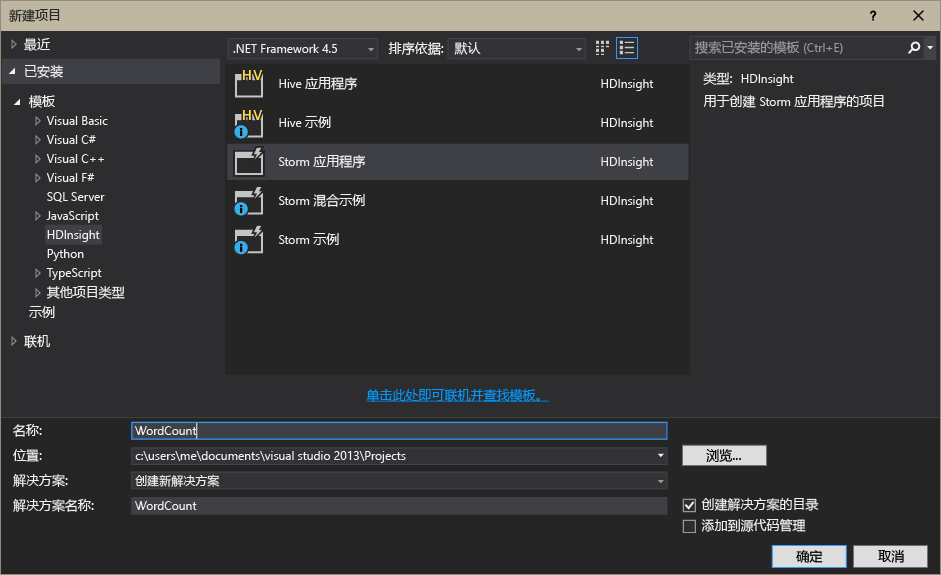

<properties
	pageTitle="Apache Storm on HDInsight 简介 | Azure"
	description="获取有关 Apache Storm 的简介，并了解如何使用 Storm on HDInsight 在云中构建实时数据分析解决方案。"
	services="hdinsight"
	documentationCenter=""
	authors="Blackmist"
	manager="paulettm"
	editor="cgronlun"
	tags="azure-portal"/>

<tags
	ms.service="hdinsight"
	ms.date="03/18/2016"
	wacn.date="04/18/2016"/>

#Apache Storm on HDInsight 简介：面向 Hadoop 的实时分析

Apache Storm on HDInsight 可让你使用 [Apache Hadoop](http://hadoop.apache.org) 在 Azure 环境中创建分布式实时分析解决方案。

##什么是 Apache Storm？

Apache Storm 是分布式可容错的开源计算系统，可用于配合 Hadoop 实时处理数据。Storm 解决方案还提供有保障的数据处理功能，能够重播第一次未成功处理的数据。

##为何要使用 Storm on HDInsight？

Apache Storm on HDInsight 是已集成到 Azure 环境中的托管群集。它提供以下主要优势：

* 以托管服务的形式执行，提供 99.9% 运行时间 SLA

* 使用你选择的语言：支持以 **Java**、**C#** 和 **Python** 编写的 Storm 组件

	* 支持混用编程语言：使用 Java 读取数据，然后使用 C# 处理数据

	* 使用 **Trident** Java 接口创建支持“一次性”消息处理、“事务性”数据存储持久性和一组常见流分析操作的 Storm 拓扑

* 包括内置的向上缩放和向下缩放功能：在不影响运行 Storm 拓扑的情况下缩放 HDInsight 群集

* 与其他 Azure 服务（包括事件中心、Azure 虚拟网络、SQL 数据库、Blob 存储和 DocumentDB）集成

	* 通过使用 Azure 虚拟网络中组合多个 HDInsight 群集的功能：创建使用 HDInsight、HBase 或 Hadoop 群集的分析管道

有关在实时分析解决方案中使用 Apache Storm 的公司列表，请参阅[使用 Apache Storm 的公司](https://storm.apache.org/documentation/Powered-By.html)。

若要开始使用 Storm，请参阅 [Storm on HDInsight 入门][gettingstarted]。

###易于设置

你可以在分钟数设置好新的 Storm on HDInsight 群集。指定群集名称、大小、管理员帐户和存储帐户。Azure 将创建该群集，包括示例拓扑和 Web 管理仪表板。

> [AZURE.NOTE] 你也可以使用 [Azure CLI](/documentation/articles/xplat-cli-install/) 或 [Azure PowerShell](/documentation/articles/powershell-install-configure/) 预配 Storm 群集。

在提交请求后的 15 分钟内，你就可以运行新的 Storm 群集，并准备好建立第一个实时分析管道。

###易于使用

__对于基于 Windows 的 Storm on HDInsight 群集__，HDInsight Tools for Visual Studio 允许你创建 C# 和混合 C#/Java 拓扑，然后将它们提交到 Storm on HDInsight 群集。

HDInsight Tools for Visual Studio 还提供了一个接口让你监视和管理群集上的 Storm 拓扑。

有关使用 HDInsight 工具创建 Storm 应用程序的示例，请参阅[使用 HDInsight Tools for Visual Studio 开发 C# Storm 拓扑](/documentation/articles/hdinsight-storm-develop-csharp-visual-studio-topology/)。

有关 HDInsight Tools for Visual Studio 的详细信息，请参阅 [HDInsight Tools for Visual Studio 入门](/documentation/articles/hdinsight-hadoop-visual-studio-tools-get-started/)。

每个 Storm on HDInsight 群集还提供一个基于 Web 的 Storm 仪表板让提交、监视和管理群集上运行的 Storm 拓扑。

有关使用 Storm 仪表板的详细信息，请参阅[在 HDInsight 上部署和管理 Apache Storm 拓扑](/documentation/articles/hdinsight-storm-deploy-monitor-topology/)。

Storm on HDInsight 还支持通过**事件中心 Spout** 与 Azure 事件中心轻松集成。此组件的最新版本可在 [https://github.com/hdinsight/hdinsight-storm-examples/tree/master/lib/eventhubs](https://github.com/hdinsight/hdinsight-storm-examples/tree/master/lib/eventhubs) 上获取。有关使用此组件的详细信息，请参阅以下文档。

* [开发使用 Azure 事件中心的 C# 拓扑](/documentation/articles/hdinsight-storm-develop-csharp-event-hub-topology/)

* [开发使用 Azure 事件中心的 Java 拓扑](/documentation/articles/hdinsight-storm-develop-java-event-hub-topology/)

###可靠性

Apache Storm 始终保证每个传入消息将完全处理，即使数据分析分散在数百个节点。

**Nimbus 节点**提供的功能与 Hadoop JobTracker 类似，它通过 **Zookeeper** 将任务分配给群集中的其他节点。Zookeeper 节点为群集提供协调功能，并促进 Nimbus 与辅助节点上的 **Supervisor** 进程进行通信。如果处理的一个节点出现故障，Nimbus 节点将得到通知，并分配到另一个节点的任务和关联的数据。

Apache Storm 的默认配置是只能有一个 Nimbus 节点。Storm on HDInsight 运行两个 Nimbus 节点。如果主节点出现故障，HDInsight 群集将切换到辅助节点，同时主节点将会恢复。

###缩放

虽然可以在创建过程中指定群集中的节点数，但你可能需要扩大或收缩群集以匹配工作负载。所有 HDInsight 群集允许你更改群集中的节点数，即使在处理数据时。

> [AZURE.NOTE] 若要利用通过缩放添加的新节点，你需要重新平衡在增加大小之前启动的拓扑。

###支持

Storm on HDInsight 附带全天候企业级支持。Storm on HDInsight 也提供 99.9% 的 SLA。这意味着，我们保证至少 99.9% 的时间群集都能建立外部连接。

##实时分析常见用例

以下是你可能使用 Apache storm on HDInsight 的一些常见方案。有关实际方案的信息，请阅读[公司如何使用 Storm](https://storm.incubator.apache.org/documentation/Powered-By.html)。

* 物联网 (IoT)
* 欺诈检测
* 社交分析
* 提取、转换、加载 (ETL)
* 网络监视
* 搜索
* 移动应用场景

##如何处理 HDInsight Storm 中的数据？

Apache Storm 运行的是**拓扑**，而不是你在 HDInsight 或 Hadoop 中可能熟悉的 MapReduce 作业。Storm on HDInsight 群集包含两种类型的节点：运行 **Nimbus** 的头节点和运行 **Supervisor** 的辅助节点。

* **Nimbus**：类似于 Hadoop 中的 JobTracker，负责在整个群集中分发代码、将任务分配给虚拟机以及监视故障情况。HDInsight 提供两个 Nimbus 节点，因此 Storm on HDInsight 不会出现单点故障

* **Supervisor**：每个辅助节点的 supervisor 负责启动和停止该节点上的**工作进程**。

* **工作进程**：运行**拓扑**的一个子集。正在运行的拓扑分布在整个群集的许多工作进程上。

* **拓扑**：定义处理数据**流**的计算图形。与 MapReduce 作业不同，拓扑运行到你停止它们为止。

* **流**：一个未绑定的**元组**集合。流由 **spout** 和 **bolt** 生成，并由 **bolt** 使用。

* **元组**：动态类型化值的一个命名列表。

* **Spout**：使用数据源中的数据并发出一个或多个**流**。

	> [AZURE.NOTE]在许多情况下，从 Kafka、Azure 服务总线队列或事件中心等队列中读取数据。队列确保发生中断时数据持续不断。

* **Bolt**：使用**流**，处理**元组**，并可以发出**流**。Bolt 还负责将数据编写到外部存储，比如队列、HDInsight HBase、blob 或其他数据存储。

* **Apache Thrift**：用于可缩放跨语言服务开发的软件框架。可用于构建在 C++、Java、Python、PHP、Ruby、Erlang、Perl、Haskell、C#、Cocoa、JavaScript、Node.js、Smalltalk 及其他语言间工作的服务。

	* **Nimbus** 是一种 Thrift 服务，**拓扑**是 Thrift 定义，因此可以使用各种编程语言来开发拓扑

有关 Storm 组件的详细信息，请参阅 apache.org 上的 [Storm 教程][apachetutorial]。

##我可以使用哪些编程语言？

Storm on HDInsight 群集支持 C#、Java 和 Python。

### C&#35;

HDInsight Tools for Visual Studio 允许 .NET 开发人员以 C# 语言设计和实施拓扑。你也可以创建使用 Java 和 C# 组件的混合拓扑。

有关详细信息，请参阅[使用 Visual Studio 开发 Apache Storm on HDInsight 的 C# 拓扑](/documentation/articles/hdinsight-storm-develop-csharp-visual-studio-topology/)。

###Java

你遇到的大多数 Java 示例都是无格式 Java 或 Trident。Trident 是一个高级别抽象，可更轻松地执行联接、汇总、分组和筛选等操作。但是，Trident 作用于批量元组，其中原始 Java 解决方案一次将处理一个元组流。

有关 Trident 的详细信息，请参阅 apache.org 上的 [Trident 教程](https://storm.incubator.apache.org/documentation/Trident-tutorial.html)。

有关 Java 和 Trident 拓扑的示例，请参阅 [Storm 拓扑示例列表](/documentation/articles/hdinsight-storm-example-topology/)或 HDInsight 群集上的 storm-starter 示例。

storm-starter 示例位于基于 Windows 的群集上的 **%storm\_home%\\contrib\\storm-starter** 目录中。

##常见的开发模式有哪些？

###有保证的消息处理

Storm 可以提供不同级别的有保证的消息处理。例如，基本的 Storm 应用程序至少可以保证一次处理，而 Trident 仅可以保证一次处理。

有关详细信息，请参阅 apache.org 上的[数据处理保证](https://storm.apache.org/about/guarantees-data-processing.html)。

###IBasicBolt

读取输入元组，发出零个或多个元组，然后在执行方法结束时立即询问输入元组，这种模式非常普通，以至 Storm 提供 IBasicBolt 接口来自动执行这种模式。

###联接

在应用程序之间联接两个数据流的方式将有所不同。例如，你可以从多个流将每个元组联接到一个新流，也可以仅联接特定窗口的批量元组。两种方式的联接都可以使用 [fieldsGrouping](http://javadox.com/org.apache.storm/storm-core/0.9.1-incubating/backtype/storm/topology/InputDeclarer.html#fieldsGrouping%28java.lang.String,%20backtype.storm.tuple.Fields%29) 来实现，它是定义元组如何路由到 bolt 的方式。

在以下 Java 实例中，fieldsGrouping 用于将来自组件“1”、“2”和“3”的元组路由至 **MyJoiner** bolt。

	builder.setBolt("join", new MyJoiner(), parallelism) .fieldsGrouping("1", new Fields("joinfield1", "joinfield2")) .fieldsGrouping("2", new Fields("joinfield1", "joinfield2")) .fieldsGrouping("3", new Fields("joinfield1", "joinfield2"));

###批处理

批处理可以通过若干方式来实现。利用基本 Storm Java 拓扑，你可以在发出元组前使用简单计数器对 X 个元组进行批处理，或使用称为计时周期元组的内部计时机制每 X 秒发出一批元组。

有关使用计时周期元组的示例，请参阅[使用 HDInsight 上的 Storm 和 HBase 分析传感器数据](/documentation/articles/hdinsight-storm-sensor-data-analysis/)。

如果你使用的是 Trident，则其基于批量处理元组。

###缓存

内存缓存通常用作加速处理的机制，因为它在内存中存储常用资产。由于拓扑分布于多个节点，并且每个节点中有多个进程，你应考虑使用 [fieldsGrouping](http://javadox.com/org.apache.storm/storm-core/0.9.1-incubating/backtype/storm/topology/InputDeclarer.html#fieldsGrouping%28java.lang.String,%20backtype.storm.tuple.Fields%29) 来确保包含用于缓存查询的字段的元组始终路由至同一进程。这可以避免在进程间重复缓存条目。

###流式处理 top N

当拓扑依赖于计算“top”N 值（比如 Twitter 上的前 5 大趋势）时，你应并行计算 top N 值，然后将这些计算的输出合并到全局值中。为此，可以使用 [fieldsGrouping](http://javadox.com/org.apache.storm/storm-core/0.9.1-incubating/backtype/storm/topology/InputDeclarer.html#fieldsGrouping%28java.lang.String,%20backtype.storm.tuple.Fields%29) 按字段路由至并行 bolt（该项按字段值对数据进行划分），然后路由至全局确定前 N 个值的 bolt。

有关此内容的示例，请参阅 [RollingTopWords](https://github.com/nathanmarz/storm-starter/blob/master/src/jvm/storm/starter/RollingTopWords.java) 示例。

##后续步骤

了解有关使用 HDInsight 中的 Apache Storm 构建实时分析解决方案的详细信息：

* [Storm on HDInsight 入门][gettingstarted]

* [Storm on HDInsight 的示例拓扑](/documentation/articles/hdinsight-storm-example-topology/)

[stormtrident]: https://storm.incubator.apache.org/documentation/Trident-API-Overview.html
[samoa]: http://yahooeng.tumblr.com/post/65453012905/introducing-samoa-an-open-source-platform-for-mining
[apachetutorial]: https://storm.incubator.apache.org/documentation/Tutorial.html
[gettingstarted]: /documentation/articles/hdinsight-apache-storm-tutorial-get-started/

<!---HONumber=Mooncake_0411_2016-->