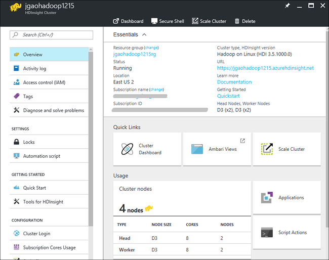

<properties
    pageTitle="使用 Azure 门户预览管理 HDInsight 中基于 Linux 的 Hadoop 群集 | Azure"
    description="了解如何使用 Azure 门户预览创建和管理基于 Linux 的 HDInsight 群集。"
    services="hdinsight"
    documentationcenter=""
    author="mumian"
    manager="jhubbard"
    editor="cgronlun"
    tags="azure-portal" />
<tags 
    ms.assetid="5a76f897-02e8-4437-8f2b-4fb12225854a"
    ms.service="hdinsight"
    ms.workload="big-data"
    ms.tgt_pltfrm="na"
    ms.devlang="na"
    ms.topic="article"
    ms.date="12/20/2016"
    wacn.date="01/25/2017"
    ms.author="jgao" />

# 使用 Azure 门户预览管理 HDInsight 中的 Hadoop 群集
[AZURE.INCLUDE [选择器](../../includes/hdinsight-portal-management-selector.md)]

使用 [Azure 门户预览][azure-portal]可以管理 Azure HDInsight 中基于 Linux 的群集。使用选项卡选择器还可以了解如何使用其他工具管理 HDInsight 中的 Hadoop 群集。

**先决条件**

在开始本文前，你必须具有以下项：

* **一个 Azure 订阅**。请参阅[获取 Azure 试用版](/pricing/1rmb-trial/)。

## 打开门户
1. 登录到 [https://portal.azure.cn](https://portal.azure.cn)。
2. 打开门户之后，你可以：
   
    * 单击左侧菜单中的“新建”以创建新群集：
     
        
    * 在左侧菜单中单击“HDInsight 群集”以列出现有群集
     
          

## 创建群集
[AZURE.INCLUDE [delete-cluster-warning](../../includes/hdinsight-delete-cluster-warning.md)]

HDInsight 使用各种 Hadoop 组件。有关已获得验证和支持的组件的列表，请参阅 [Azure HDInsight 包含哪个版本的 Hadoop？](/documentation/articles/hdinsight-component-versioning/)。有关创建群集的一般信息，请参阅 [Create Hadoop clusters in HDInsight](/documentation/articles/hdinsight-hadoop-provision-linux-clusters/)（在 HDInsight 中创建 Hadoop 群集）。

##  列出并显示群集
1. 登录到 [https://portal.azure.cn](https://portal.azure.cn)。
2. 在左侧菜单中单击“HDInsight 群集”，列出现有群集。
3. 单击群集名称。如果群集列表很长，可以使用页面顶部的筛选器。
4. 单击列表中的群集可查看概述页：
   
      

   
    **概述菜单**：

    * **仪表板**、**群集仪表板**和 URL：这是访问群集仪表板（即，适用于基于 Linux 群集的 Ambari Web）的所有途径。
    * **安全 Shell**：显示使用安全 Shell (SSH) 连接与群集建立连接的说明。
    * **缩放群集**：可让你更改此群集的辅助角色节点数。
    * **删除**：删除群集。

    **左侧菜单**
   
    * **活动日志**：显示和查询活动日志。
    * **访问控制 (IAM)**：使用角色分配。请参阅[使用角色分配来管理对 Azure 订阅资源的访问权限](/documentation/articles/role-based-access-control-configure/)。
    * **标记**：可让用户设置键/值对，以定义云服务的自定义分类。例如，你可以创建名为 **project** 的键，然后对与特定项目关联的所有服务使用一个公用值。
    * **诊断和解决问题**：显示故障排除信息。
    * **锁定**：添加锁，以防止修改或删除群集。
    * **自动化脚本**：显示和导出群集的 Azure Resource Manager 模板。目前，只能导出相关的 Azure 存储帐户。请参阅[使用 Azure Resource Manager 模板在 HDInsight 中创建基于 Linux 的 Hadoop 群集](/documentation/articles/hdinsight-hadoop-create-linux-clusters-arm-templates/)。
    * **快速启动**：显示可帮助用户开始使用 HDInsight 的信息。
    * **适用于 HDInsight 的工具**：HDInsight 相关工具的帮助信息。
    * **群集登录**：显示群集登录信息。
    * **订阅核心使用情况**：显示订阅的已用核心数和可用内核数。
    * **缩放群集**：增加和减少群集辅助角色节点的数量。请参阅[缩放群集](/documentation/articles/hdinsight-administer-use-management-portal/#scale-clusters)。
    * **安全 Shell**：显示使用安全 Shell (SSH) 连接与群集建立连接的说明。请参阅 [Use SSH with Linux-based Hadoop on HDInsight from Windows with PuTTY](/documentation/articles/hdinsight-hadoop-linux-use-ssh-windows/)（在装有 PuTTY 的 Windows 中的 HDInsight 上将 SSH 与基于 Linux 的 Hadoop 配合使用）和 [Use SSH with Linux-based Hadoop on HDInsight from Linux, Unix, or OS X](/documentation/articles/hdinsight-hadoop-linux-use-ssh-unix/)（在 Linux、Unix 或 OS X 中的 HDInsight 上将 SSH 与基于 Linux 的 Hadoop 配合使用）。
    * **HDInsight 合作伙伴**：添加/删除当前的 HDInsight 合作伙伴。
    * **外部元存储**：查看 Hive 和 Oozie 元存储。只能在群集创建过程中配置元存储。请参阅[使用 Hive/Oozie 元存储](/documentation/articles/hdinsight-hadoop-provision-linux-clusters/#use-hiveoozie-metastore)。
    * **脚本操作**：在群集上运行 Bash 脚本。请参阅 [Customize Linux-based HDInsight clusters using Script Action](/documentation/articles/hdinsight-hadoop-customize-cluster-linux/)（使用脚本操作自定义基于 Linux 的 HDInsight 群集）。
    * **应用程序**：添加/删除 HDInsight 应用程序。请参阅[安装自定义 HDInsight 应用程序](/documentation/articles/hdinsight-apps-install-custom-applications/)。
    * **属性**：查看群集属性。
    * **存储帐户**：查看存储帐户和密钥。存储帐户是在群集创建过程中进行配置。
    * **群集 AAD 标识**：
    * **新建支持请求**：允许用户使用 Azure.cn 支持创建支持票证。

6. 单击“属性”：
   
    属性包括：
   
    * **主机名**：群集名称。
    * **群集 URL**。Ambari Web 界面的 URL。
    * **状态**：包括“已终止”、“已接受”、ClusterStorageProvisioned、AzureVMConfiguration、HDInsightConfiguration、“正常运行”、“正在运行”、“错误”、“正在删除”、“已删除”、“超时”、DeleteQueued、DeleteTimedout、DeleteError、PatchQueued、CertRolloverQueued、ResizeQueued、ClusterCustomization
    * **区域**：Azure 位置。有关受支持的 Azure 位置的列表，请参阅 [HDInsight pricing](/pricing/details/hdinsight/)（HDInsight 定价）中的 **Region**（区域）下拉列表框。
    * **创建日期**。
    * **操作系统**：**Windows** 或 **Linux**。
    * **类型**：Hadoop、HBase、Storm、Spark。
    * **版本**。请参阅 [HDInsight versions](/documentation/articles/hdinsight-component-versioning/)（HDInsight 版本）
    * **订阅**：订阅名称。
    * **默认数据源**：默认的群集文件系统。
    * **工作节点大小**。
    * **头节点大小**。

##  删除群集
删除群集不会删除默认的存储帐户或任何链接的存储帐户。可以使用相同的存储帐户和相同的元存储来重新创建群集。建议在重新创建群集时使用新的默认 Blob 容器。

1. 登录到[门户][azure-portal]。
2. 单击左侧菜单中的“HDInsight 群集”。如果看不到“HDInsight 群集”，请先单击“更多服务”。
3. 单击要删除的群集。
4. 单击顶部菜单中的“删除”，然后按照说明操作。

另请参阅 [Pause/shut down clusters](#pauseshut-down-clusters)（暂停/关闭群集）。

##  缩放群集
使用群集缩放功能，可更改 Azure HDInsight 中运行的群集使用的辅助节点数，而无需重新创建群集。

> [AZURE.NOTE]
只支持使用 HDInsight 3.1.3 或更高版本的群集。如果不确定群集的版本，可以查看“属性”页面。请参阅[列出并显示群集](#list-and-show-clusters)。
> 
> 

更改 HDInsight 支持的每种类型的群集所用数据节点数的影响：

* Hadoop
  
    可顺利增加正在运行的 Hadoop 群集中的辅助节点数，而不会影响任何挂起或运行中的作业。也可在操作进行中提交新作业。系统会正常处理失败的缩放操作，让群集始终保持正常运行状态。
  
    减少数据节点数目以缩减 Hadoop 群集时，系统会重新启动群集中的某些服务。这会导致所有正在运行和挂起的作业在缩放操作完成时失败。但是，可在操作完成后重新提交这些作业。
* HBase
  
    可在 HBase 群集运行时顺利添加或删除节点。完成缩放操作后的几分钟内，区域服务器将自动平衡。但也可手动平衡区域服务器，方法是登录到群集的头节点，然后在命令提示符窗口中运行以下命令：
  
        >pushd %HBASE_HOME%\bin
        >hbase shell
        >balancer
  
    有关使用 HBase shell 的详细信息，请参阅
* Storm
  
    可在 Storm 群集运行时顺利添加或删除数据节点。但是，缩放操作成功完成后，需要重新平衡拓扑。
  
    可以使用两种方法来完成重新平衡操作：
  
    * Storm Web UI
    * 命令行界面 (CLI) 工具
    
    有关更多详细信息，请参阅 [Apache Storm 文档](http://storm.apache.org/documentation/Understanding-the-parallelism-of-a-Storm-topology.html)。
    
    HDInsight 群集上提供了 Storm Web UI：
    
    
    
    以下是有关如何使用 CLI 命令重新平衡 Storm 拓扑的示例：
    
        ## Reconfigure the topology "mytopology" to use 5 worker processes,
        ## the spout "blue-spout" to use 3 executors, and
        ## the bolt "yellow-bolt" to use 10 executors
        $ storm rebalance mytopology -n 5 -e blue-spout=3 -e yellow-bolt=10

**缩放群集**

1. 登录到[门户][azure-portal]。
2. 单击左侧菜单中的“HDInsight 群集”。
3. 单击要缩放的群集。
3. 单击“缩放群集”。
4. 输入**辅助节点数**。Azure 订阅中的群集节点数量限制有所不同。要增加限制，可联系计费支持人员。成本信息将反映对节点数所做的更改。
   
    

##  暂停/关闭群集

大多数 Hadoop 作业只是偶尔运行的批处理作业。大多数 Hadoop 群集都存在长时间不进行处理的情况。有了 HDInsight，可将数据存储在 Azure 存储空间，以便在不使用群集时可将其安全删除。此外，还需要支付 HDInsight 群集费用，即使未使用。由于群集费用高于存储空间费用数倍，因此在不使用群集时将其删除可以节省费用。

可以通过许多方式对此过程进行程序性处理：

* 使用 Azure PowerShell。请参阅 [Analyze flight delay data](/documentation/articles/hdinsight-analyze-flight-delay-data/)（分析航班延误数据）。
* 使用 Azure CLI。请参阅 [Manage HDInsight clusters using Azure CLI](/documentation/articles/hdinsight-administer-use-command-line/)（使用 Azure CLI 管理 HDInsight 群集）。
* 使用 HDInsight .NET SDK。请参阅 [Submit Hadoop jobs](/documentation/articles/hdinsight-submit-hadoop-jobs-programmatically/)（提交 Hadoop 作业）。

有关定价信息，请参阅 [HDInsight pricing](/pricing/details/hdinsight/)（HDInsight 定价）。若要从门户中删除群集，请参阅 [Delete clusters](#delete-clusters)（删除群集）

## 更改密码
HDInsight 群集可以有两个用户帐户。HDInsight 群集用户帐户（即HTTP 用户帐户）和 SSH 用户帐户是在创建过程中创建的。可以使用 Ambari Web UI 更改群集用户帐户用户名和密码，使用脚本操作更改 SSH 用户帐户

### 更改群集用户密码
可以使用 Ambari Web UI 更改群集用户密码。若要登录 Ambari，必须使用现有的群集用户名和密码。

> [AZURE.NOTE]
如果你更改群集用户 (admin) 的密码，可能会导致针对此群集运行的脚本操作失败。如果你的任何持久性脚本操作以辅助角色节点为目标，则当你通过调整大小操作在群集中添加节点时，这些操作可能会失败。有关脚本操作的详细信息，请参阅 [Customize HDInsight clusters using script actions](/documentation/articles/hdinsight-hadoop-customize-cluster-linux/)（使用脚本操作自定义 HDInsight 群集）。
> 
> 

1. 使用 HDInsight 群集用户凭据登录到 Ambari Web UI。默认的用户名为 **admin**。URL 为 **https://&lt;HDInsight Cluster Name>.azurehdinsight.cn**。
2. 在顶部菜单中单击“管理”，然后单击“管理 Ambari”。
3. 在左侧菜单中，单击“用户”。
4. 单击“管理”。
5. 单击“更改密码”。

然后，Ambari 将更改群集中所有节点上的密码。

### 更改 SSH 用户密码
1. 使用文本编辑器将以下文本保存到名为 **changepassword.sh** 的文件中。
   
    > [AZURE.IMPORTANT]
    所用的编辑器必须使用 LF 作为行尾。如果编辑器使用 CRLF，则脚本将无法正常工作。
    > 
    > 
   
        #! /bin/bash
        USER=$1
        PASS=$2
   
        usermod --password $(echo $PASS | openssl passwd -1 -stdin) $USER
2. 将该文件上载到可以使用 HTTP 或 HTTPS 地址从 HDInsight 访问的存储位置。例如，某个公共文件存储（如 OneDrive 或 Azure Blob 存储）。将 URI（HTTP 或 HTTPS 地址）保存到该文件中，因为下一步需要用到。
3. 从 Azure 门户预览中，单击“HDInsight 群集”。
4. 单击 HDInsight 群集。
4. 单击“脚本操作”。
4. 在“脚本操作”边栏选项卡中，选择“提交新项”。出现“提交脚本操作”边栏选项卡时，请输入以下信息。
   
    | 字段 | 值 |
    | --- | --- |
    | 名称 |更改 ssh 密码 |
    | Bash 脚本 URI |changepassword.sh 文件的 URI |
    | 节点（头节点、辅助角色节点、Nimbus、监督程序、Zookeeper，等等。） |✓ 适用于所有列出的节点类型 |
    | Parameters |输入 SSH 用户名和新密码。用户名与密码之间应有一个空格。 |
    | 保留此脚本操作... |将此字段保留未选中状态。 |
5. 选择“创建”以应用脚本。完成脚本后，你可以使用新密码通过 SSH 连接到群集。

## 授予/撤消访问权限
HDInsight 群集提供以下 HTTP Web 服务（所有这些服务都有 REST 样式的终结点）：

* ODBC
* JDBC
* Ambari
* Oozie
* Templeton

默认情况下，将授权这些服务进行访问。可以使用 [Azure CLI](/documentation/articles/hdinsight-administer-use-command-line/#enabledisable-http-access-for-a-cluster) 和 [Azure PowerShell](/documentation/articles/hdinsight-administer-use-powershell/#grantrevoke-access) 来吊销/授予访问权限。

## 查找订阅 ID

**查找你的 Azure 订阅 ID**

1. 登录到[门户][azure-portal]。
2. 单击“订阅”。每个订阅都有一个名称和 ID。

每个群集都绑定到一个 Azure 订阅。订阅 ID 显示在群集的“概要”磁贴上。请参阅 [List and show clusters](#list-and-show-clusters)（列出和显示群集）。

## 查找资源组
在 Azure Resource Manager 模式下，每个 HDInsight 群集都是使用 Azure Resource Manager 组创建的。群集所属的 Resource Manager 组显示在以下位置：

* 群集列表包含“资源组”列。
* 群集**概要**磁贴。

请参阅 [List and show clusters](#list-and-show-clusters)（列出和显示群集）。

## 查找默认存储帐户
每个 HDInsight 群集都有默认存储帐户。群集的默认存储帐户及其密钥显示在“存储帐户”下。请参阅[列出并显示群集](#list-and-show-clusters)。

## 运行 Hive 查询
无法直接从 Azure 门户预览运行 Hive 作业，但可以使用 Ambari Web UI 上的 Hive 视图。

**使用 Ambari Hive 视图运行 Hive 查询**

1. 使用 HDInsight 群集用户凭据登录到 Ambari Web UI。默认的用户名为 **admin**。URL 为 **https://&lt;HDInsight Cluster Name>azurehdinsight.cn**。
2. 打开 Hive 视图，如以下屏幕截图中所示：
   
    
3. 在顶部菜单中单击“查询”。
4. 在“查询编辑器”中输入 Hive 查询，然后单击“执行”。

## 监视作业
请参阅 [Manage HDInsight clusters by using the Ambari Web UI](/documentation/articles/hdinsight-hadoop-manage-ambari/#monitoring)（使用 Ambari Web UI 管理 HDInsight 群集）。

## 浏览文件
使用 Azure 门户预览可以浏览默认容器的内容。

1. 登录到 [https://portal.azure.cn](https://portal.azure.cn)。
2. 在左侧菜单中单击“HDInsight 群集”，列出现有群集。
3. 单击群集名称。如果群集列表很长，可以使用页面顶部的筛选器。
4. 单击群集左侧菜单中的“存储帐户”。
5. 单击某个存储帐户。
7. 单击“Blob”磁贴。
8. 单击默认容器名称。

## 监视群集使用情况
HDInsight 群集边栏选项卡的“使用情况”部分会显示相关信息，方便了解订阅中可以用于 HDInsight 的核心数、分配给此群集的核心数，以及这些核心是如何分配给此群集中的节点的。请参阅 [List and show clusters](#list-and-show-clusters)（列出和显示群集）。

> [AZURE.IMPORTANT]
若要监视 HDInsight 群集提供的服务，必须使用 Ambari Web 或 Ambari REST API。有关如何使用 Ambari 的详细信息，请参阅 [Manage HDInsight clusters using Ambari](/documentation/articles/hdinsight-hadoop-manage-ambari/)（使用 Ambari 管理 HDInsight 群集）
> 
> 

## 连接到群集
请参阅 [Use Hive with Hadoop in HDInsight with SSH](/documentation/articles/hdinsight-hadoop-use-hive-ssh/#ssh)（通过 SSH 将 Hive 与 HDInsight 中的 Hadoop 配合使用）。

## 后续步骤
在本文中，已学习如何使用门户创建 HDInsight 群集和如何打开 Hadoop 命令行工具。要了解更多信息，请参阅下列文章：

* [使用 Azure PowerShell 管理 HDInsight](/documentation/articles/hdinsight-administer-use-powershell/)
* [使用 Azure CLI 管理 HDInsight](/documentation/articles/hdinsight-administer-use-command-line/)
* [创建 HDInsight 群集](/documentation/articles/hdinsight-provision-clusters/)
* [在 HDInsight 中使用 Hive](/documentation/articles/hdinsight-use-hive/)
* [在 HDInsight 中使用 Pig](/documentation/articles/hdinsight-use-pig/)
* [Use Sqoop in HDInsight（在 HDInsight 中使用 Sqoop）](/documentation/articles/hdinsight-use-sqoop/)
* [Azure HDInsight 入门](/documentation/articles/hdinsight-hadoop-linux-tutorial-get-started/)
* [Azure HDInsight 包含哪个版本的 Hadoop？](/documentation/articles/hdinsight-component-versioning/)

[azure-portal]: https://portal.azure.cn
[image-hadoopcommandline]: ./media/hdinsight-administer-use-portal-linux/hdinsight-hadoop-command-line.png "Hadoop 命令行"

<!---HONumber=Mooncake_0120_2017-->