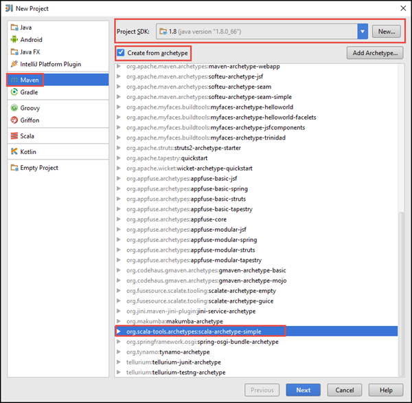
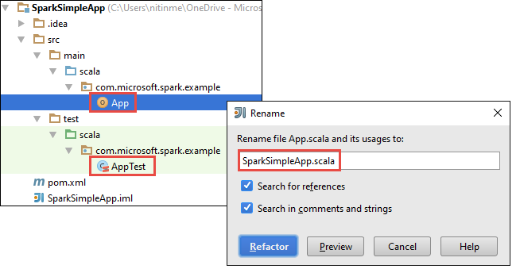

<properties
    pageTitle="创建要在 Azure Spark 群集上运行的 Scala Maven 应用程序 | Azure"
    description="了解如何使用 Maven 创建要在 HDInsight Spark 群集中运行的独立 Spark 应用程序。"
    services="hdinsight"
    documentationcenter=""
    author="nitinme"
    manager="jhubbard"
    editor="cgronlun"
    tags="azure-portal"
    translationtype="Human Translation" />
<tags
    ms.assetid="b2467a40-a340-4b80-bb00-f2c3339db57b"
    ms.service="hdinsight"
    ms.custom="hdinsightactive"
    ms.workload="big-data"
    ms.tgt_pltfrm="na"
    ms.devlang="na"
    ms.topic="article"
    ms.date="02/06/2017"
    wacn.date="05/08/2017"
    ms.author="nitinme"
    ms.sourcegitcommit="2c4ee90387d280f15b2f2ed656f7d4862ad80901"
    ms.openlocfilehash="8a9e40ed601d8daa68f597e96b9cd529093fccb7"
    ms.lasthandoff="04/28/2017" />

# 创建要在 HDInsight 上的 Apache Spark 群集中运行的 Scala Maven 应用程序

了解如何结合使用 Maven 和 IntelliJ IDEA 创建用 Scala 编写的 Spark 应用程序。 本文将 Apache Maven 用作生成系统，并从 IntelliJ IDEA 提供的 Scala 的现有 Maven 原型入手。  在 IntelliJ IDEA 中创建 Scala 应用程序需要以下步骤：

* 将 Maven 用作生成系统。
* 更新项目对象模型 (POM) 文件以解析 Spark 模块依赖项。
* 在 Scala 中编写应用程序。
* 生成可提交到 HDInsight Spark 群集的 jar 文件。
* 使用 Livy 在 Spark 群集上运行应用程序。

## 先决条件

* Azure 订阅。 请参阅[获取 Azure 试用版](/pricing/1rmb-trial/)。
* HDInsight 上的 Apache Spark 群集。 有关说明，请参阅[在 Azure HDInsight 中创建 Apache Spark 群集](/documentation/articles/hdinsight-apache-spark-jupyter-spark-sql/)。
* Oracle Java 开发工具包。 可以从 [此处](http://www.oracle.com/technetwork/java/javase/downloads/jdk8-downloads-2133151.html)安装它。
* Java IDE。 本文使用 IntelliJ IDEA 15.0.1。 可以从 [此处](https://www.jetbrains.com/idea/download/)安装它。

## 安装适用于 IntelliJ IDEA 的 Scala 插件
如果 IntelliJ IDEA 安装未提示启用 Scala 插件，请启动 IntelliJ IDEA 并完成以下步骤来安装该插件：

1. 启动 IntelliJ IDEA，在欢迎屏幕上单击“配置”，然后单击“插件”。

    
2. 在下一屏幕中，单击左下角的“安装 JetBrains 插件”。 在打开的“浏览 JetBrains 插件”对话框中搜索 Scala，然后单击“安装”。

    
3. 插件安装成功后，请单击“重启 IntelliJ IDEA”  按钮重启 IDE。

## 创建独立 Scala 项目
1. 启动 IntelliJ IDEA 并创建一个新项目。 在“新建项目”对话框中做出以下选择，然后单击“下一步”。

    

    * 选择“Maven”  作为项目类型。
    * 指定“项目 SDK” 。 单击“新建”并导航到 Java 安装目录，通常是 `C:\Program Files\Java\jdk1.8.0_66`。
    * 选择“从原型创建”  选项。
    * 从原型列表中，选择“org.scala-tools.archetypes:scala-archetype-simple” 。 这将创建适当的目录结构，并下载所需的默认依赖项来编写 Scala 程序。
2. 提供 **GroupId**、**ArtifactId** 和 **Version** 的相关值。 单机“下一步”
3. 在下一个对话框中（在其中指定 Maven 主目录和其他用户设置的位置），接受默认值，然后单击“下一步” 。
4. 在最后一个对话框中，指定项目名称和位置，然后单击“完成”。
5. 删除位于 **src\test\scala\com\microsoft\spark\example** 的 **MySpec.Scala** 文件。 应用程序不需要此文件。
6. 如有必要，对默认源和测试文件进行重命名。 从 IntelliJ IDEA 的左窗格中，导航到 **src\main\scala\com.microsoft.spark.example**。 右键单击“App.scala”，单击“重构”、“重命名”文件，然后在对话框中，提供应用程序的新名称，并单击“重构”。

      
7. 在后续步骤中，将更新 pom.xml 以定义 Spark Scala 应用程序的依赖项。 若要自动下载并解析这些依赖项，必须相应地配置 Maven。

    

    1. 在“文件”菜单中，单击“设置”。
    2. 在“设置”对话框中，导航到“生成、执行、部署” > “生成工具” > “Maven” > “导入”。
    3. 选择“自动导入 Maven 项目”选项。
    4. 单击“应用”，然后单击“确定”。
8. 更新 Scala 源文件以包含应用程序代码。 打开并将当前示例代码替换为以下代码，然后保存所做的更改。 此代码从 HVAC.csv（所有 HDInsight Spark 群集均有该文件）中读取数据，检索第六列中只有一个数字的行，并将输出写入群集的默认存储容器下的 **/HVACOut**。

        package com.microsoft.spark.example

        import org.apache.spark.SparkConf
        import org.apache.spark.SparkContext

        /**
          * Test IO to wasb
          */
        object WasbIOTest {
          def main (arg: Array[String]): Unit = {
            val conf = new SparkConf().setAppName("WASBIOTest")
            val sc = new SparkContext(conf)

            val rdd = sc.textFile("wasbs:///HdiSamples/HdiSamples/SensorSampleData/hvac/HVAC.csv")

            //find the rows which have only one digit in the 7th column in the CSV
            val rdd1 = rdd.filter(s => s.split(",")(6).length() == 1)

            rdd1.saveAsTextFile("wasbs:///HVACout")
          }
        }
9. 更新 pom.xml。

    1. 在 `<project>\<properties>` 中添加以下内容：

            <scala.version>2.10.4</scala.version>
            <scala.compat.version>2.10.4</scala.compat.version>
            <scala.binary.version>2.10</scala.binary.version>
    2. 在 `<project>\<dependencies>` 中添加以下内容：

            <dependency>
              <groupId>org.apache.spark</groupId>
              <artifactId>spark-core_${scala.binary.version}</artifactId>
              <version>1.4.1</version>
            </dependency>

        将更改保存到 pom.xml。
10. 创建 .jar 文件。 IntelliJ IDEA 允许创建 JAR，作为项目的一个项目 (artifact)。 执行以下步骤。

    1. 在“文件”菜单中，单击“项目结构”。
    2. 在“项目结构”对话框中，单击“项目”，然后单击加号。 在弹出的对话框中，单击“JAR”，然后单击“从包含依赖项的模块”。

        
    3. 在“从模块创建 JAR”对话框中，单击“主类”旁边的省略号 ()。
    4. 在“选择主类”对话框中，选择默认显示的类，然后单击“确定”。

        
    5. 在“从模块创建 JAR”对话框中，确保已选择“提取到目标 JAR”选项，然后单击“确定”。 这会创建包含所有依赖项的单个 JAR。

        
    6. “输出布局”选项卡列出了所有包含为 Maven 项目一部分的 jar。 你可以选择并删除 Scala 应用程序不直接依赖的 jar。 对于此处创建的应用程序，可以删除最后一个（**SparkSimpleApp 编译输出**）以外的所有 jar。 选择要删除的 jar，然后单击“删除”图标。

        

        请务必选中“在创建时生成”框，以确保每次生成或更新项目时都创建 jar。 单击“应用”，然后单击“确定”。
    7. 在菜单栏中单击“生成”，然后单击“创建项目”。 也可以单击“生成项目”以创建 jar。 输出 jar 将在 **\out\artifacts** 下创建。

        

## 在 Spark 群集上运行应用程序
若要在群集上运行应用程序，必须执行以下操作：

* **将应用程序 jar 复制到群集关联的 Azure 存储 blob**。 可以使用命令行实用工具 [**AzCopy**](/documentation/articles/storage-use-azcopy/) 来执行此操作。 也可以使用许多其他客户端来上传数据。 有关详细信息，请参阅[在 HDInsight 中上传 Hadoop 作业的数据](/documentation/articles/hdinsight-upload-data/)。
* **使用 Livy 将应用程序作业远程提交** 到 Spark 群集。 HDInsight 上的 Spark 群集包括 Livy，可公开 REST 终结点以远程提交 Spark 作业。 有关详细信息，请参阅[将 Livy 与 HDInsight 上的 Spark 群集配合使用以远程提交 Spark 作业](/documentation/articles/hdinsight-apache-spark-livy-rest-interface/)。

## 另请参阅
* [概述：Azure HDInsight 上的 Apache Spark](/documentation/articles/hdinsight-apache-spark-overview/)

### 方案
* [Spark 和 BI：使用 HDInsight 中的 Spark 和 BI 工具执行交互式数据分析](/documentation/articles/hdinsight-apache-spark-use-bi-tools/)
* [Spark 和机器学习：使用 HDInsight 中的 Spark 对使用 HVAC 数据生成温度进行分析](/documentation/articles/hdinsight-apache-spark-ipython-notebook-machine-learning/)
* [Spark 和机器学习：使用 HDInsight 中的 Spark 预测食品检查结果](/documentation/articles/hdinsight-apache-spark-machine-learning-mllib-ipython/)
* [Spark 流式处理：使用 HDInsight 中的 Spark 生成实时流式处理应用程序](/documentation/articles/hdinsight-apache-spark-eventhub-streaming/)
* [使用 HDInsight 中的 Spark 分析网站日志](/documentation/articles/hdinsight-apache-spark-custom-library-website-log-analysis/)

### 创建和运行应用程序
* [使用 Livy 在 Spark 群集中远程运行作业](/documentation/articles/hdinsight-apache-spark-livy-rest-interface/)

### 工具和扩展
* [在 HDInsight 上的 Spark 群集中使用 Zeppelin 笔记本](/documentation/articles/hdinsight-apache-spark-use-zeppelin-notebook/)
* [在 HDInsight 的 Spark 群集中可用于 Jupyter 笔记本的内核](/documentation/articles/hdinsight-apache-spark-jupyter-notebook-kernels/)
* [Use external packages with Jupyter notebooks（将外部包与 Jupyter 笔记本配合使用）](/documentation/articles/hdinsight-apache-spark-jupyter-notebook-use-external-packages/)
* [Install Jupyter on your computer and connect to an HDInsight Spark cluster（在计算机上安装 Jupyter 并连接到 HDInsight Spark 群集）](/documentation/articles/hdinsight-apache-spark-jupyter-notebook-install-locally/)

### 管理资源
* [管理 Azure HDInsight 中 Apache Spark 群集的资源](/documentation/articles/hdinsight-apache-spark-resource-manager/)
* [Track and debug jobs running on an Apache Spark cluster in HDInsight（跟踪和调试 HDInsight 中的 Apache Spark 群集上运行的作业）](/documentation/articles/hdinsight-apache-spark-job-debugging/)