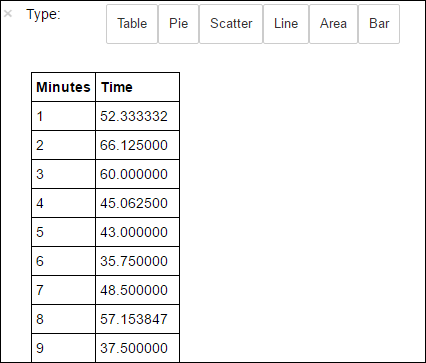

<properties
    pageTitle="结合使用自定义库和 HDInsight Spark 群集分析网站日志 | Azure"
    description="结合使用自定义库和 HDInsight Spark 群集分析网站日志"
    services="hdinsight"
    documentationcenter=""
    author="nitinme"
    manager="jhubbard"
    editor="cgronlun"
    tags="azure-portal" />
<tags 
    ms.assetid="8c61c70f-fe7f-4f0f-a4ab-0cccee5668c9"
    ms.service="hdinsight"
    ms.workload="big-data"
    ms.tgt_pltfrm="na"
    ms.devlang="na"
    ms.topic="article"
    ms.date="10/05/2016"
    wacn.date="02/20/2017"
    ms.author="nitinme" />

# 结合使用自定义库和 HDInsight Linux 上的 Apache Spark 群集来分析网站日志
此笔记本演示如何结合使用自定义库和 HDInsight 上的 Spark 来分析日志数据。我们使用的自定义库是一个名为 **iislogparser.py** 的 Python 库。

> [AZURE.TIP]
本教程也可用作在 HDInsight 中创建的 Spark (Linux) 群集上的 Jupyter 笔记本。笔记本体验将通过笔记本本身运行 Python 代码段。要在笔记本中执行本教程，请创建 Spark 群集，启动 Jupyter 笔记本 (`https://CLUSTERNAME.azurehdinsight.cn/jupyter`)，然后运行 **PySpark** 文件夹下的笔记本“结合使用 Spark 和自定义 library.ipynb 分析日志”。
>
>

**先决条件：**

你必须具有以下各项：

* Azure 订阅。请参阅[获取 Azure 试用版](/pricing/1rmb-trial/)。
* HDInsight Linux 上的 Apache Spark 群集。有关说明，请参阅 [Create Apache Spark clusters in Azure HDInsight](/documentation/articles/hdinsight-apache-spark-jupyter-spark-sql/)（在 Azure HDInsight 中创建 Apache Spark 群集）。

## 将原始数据另存为 RDD
在本节中，使用与 HDInsight 中的 Apache Spark 群集关联的 [Jupyter](https://jupyter.org) 笔记本，运行处理原始数据示例并将其保存为 Hive 表的作业。数据示例是所有群集默认提供的 .csv 文件 (hvac.csv)。

将数据保存为 Hive 表后，下一节将使用 Power BI 和 Tableau 等 BI 工具连接 Hive 表。

1. 在 [Azure 门户预览](https://portal.azure.cn/)上的启动板中，单击 Spark 群集的磁贴（如果已将它固定到启动板）。也可以在“全部浏览”>“HDInsight 群集”下导航到你的群集。
2. 在“Spark 群集”边栏选项卡中，单击“群集仪表板”，然后单击“Jupyter 笔记本”。出现提示时，请输入群集的管理员凭据。

    > [AZURE.NOTE]
    也可以在浏览器中打开以下 URL 来访问群集的 Jupyter 笔记本。将 **CLUSTERNAME** 替换为群集的名称：
    >

    > `https://CLUSTERNAME.azurehdinsight.cn/jupyter`
    >
    >
3. 创建新的笔记本。单击“新建”，然后单击“PySpark”。

    
4. 新笔记本随即已创建，并以 Untitled.pynb 名称打开。在顶部单击笔记本名称，然后输入一个友好名称。

    
5. 使用笔记本是使用 PySpark 内核创建的，因此不需要显式创建任何上下文。运行第一个代码单元格时，系统将自动创建 Spark 和 Hive 上下文。首先，可以导入此方案所需的类型。将以下代码段粘贴到空白单元格中，然后按 **SHIFT + ENTER**。

        from pyspark.sql import Row
        from pyspark.sql.types import *

1. 使用群集上已可用的示例日志数据创建 RDD。可在 **\\HdiSamples\\HdiSamples\\WebsiteLogSampleData\\SampleLog\\909f2b.log** 访问与群集关联的默认存储帐户中的数据。

        logs = sc.textFile('wasbs:///HdiSamples/HdiSamples/WebsiteLogSampleData/SampleLog/909f2b.log')

1. 检索示例日志集以验证上一步是否成功完成。

        logs.take(5)

    你应该会看到与下面类似的输出：

        # -----------------
        # THIS IS AN OUTPUT
        # -----------------

        [u'#Software: Microsoft Internet Information Services 8.0',
         u'#Fields: date time s-sitename cs-method cs-uri-stem cs-uri-query s-port cs-username c-ip cs(User-Agent) cs(Cookie) cs(Referer) cs-host sc-status sc-substatus sc-win32-status sc-bytes cs-bytes time-taken',
         u'2014-01-01 02:01:09 SAMPLEWEBSITE GET /blogposts/mvc4/step2.png X-ARR-LOG-ID=2ec4b8ad-3cf0-4442-93ab-837317ece6a1 80 - 1.54.23.196 Mozilla/5.0+(Windows+NT+6.3;+WOW64)+AppleWebKit/537.36+(KHTML,+like+Gecko)+Chrome/31.0.1650.63+Safari/537.36 - http://weblogs.asp.net/sample/archive/2007/12/09/asp-net-mvc-framework-part-4-handling-form-edit-and-post-scenarios.aspx www.sample.com 200 0 0 53175 871 46',
         u'2014-01-01 02:01:09 SAMPLEWEBSITE GET /blogposts/mvc4/step3.png X-ARR-LOG-ID=9eace870-2f49-4efd-b204-0d170da46b4a 80 - 1.54.23.196 Mozilla/5.0+(Windows+NT+6.3;+WOW64)+AppleWebKit/537.36+(KHTML,+like+Gecko)+Chrome/31.0.1650.63+Safari/537.36 - http://weblogs.asp.net/sample/archive/2007/12/09/asp-net-mvc-framework-part-4-handling-form-edit-and-post-scenarios.aspx www.sample.com 200 0 0 51237 871 32',
         u'2014-01-01 02:01:09 SAMPLEWEBSITE GET /blogposts/mvc4/step4.png X-ARR-LOG-ID=4bea5b3d-8ac9-46c9-9b8c-ec3e9500cbea 80 - 1.54.23.196 Mozilla/5.0+(Windows+NT+6.3;+WOW64)+AppleWebKit/537.36+(KHTML,+like+Gecko)+Chrome/31.0.1650.63+Safari/537.36 - http://weblogs.asp.net/sample/archive/2007/12/09/asp-net-mvc-framework-part-4-handling-form-edit-and-post-scenarios.aspx www.sample.com 200 0 0 72177 871 47']

## 使用自定义 Python 库分析日志数据
1. 在上面的输出中，前几行包括标头信息，其余的每一行均与此标头中描述的架构相匹配。分析此类日志可能很复杂。因此，可使用自定义 Python 库 (**iislogparser.py**) 极大简化针对这类日志的分析操作。默认情况下，此库包含在 **/HdiSamples/HdiSamples/WebsiteLogSampleData/iislogparser.py** 处 HDInsight 上的 Spark 群集中。

    但是，此库不在 `PYTHONPATH` 中，因此不能通过 `import iislogparser` 等导入语句来使用它。若要使用此库，必须将其分发给所有辅助角色节点。运行以下代码片段。

        sc.addPyFile('wasbs:///HdiSamples/HdiSamples/WebsiteLogSampleData/iislogparser.py')

1. 如果日志行是标题行，并且在遇到日志行时返回 `LogLine` 类的实例，则 `iislogparser` 提供返回 `None` 的函数 `parse_log_line`。使用 `LogLine` 类从 RDD 中仅提取日志行：

        def parse_line(l):
            import iislogparser
            return iislogparser.parse_log_line(l)
        logLines = logs.map(parse_line).filter(lambda p: p is not None).cache()
2. 检索一些提取的日志行，以验证该步骤成功完成。

        logLines.take(2)

    输出结果应与以下内容类似：

        # -----------------
        # THIS IS AN OUTPUT
        # -----------------

        [2014-01-01 02:01:09 SAMPLEWEBSITE GET /blogposts/mvc4/step2.png X-ARR-LOG-ID=2ec4b8ad-3cf0-4442-93ab-837317ece6a1 80 - 1.54.23.196 Mozilla/5.0+(Windows+NT+6.3;+WOW64)+AppleWebKit/537.36+(KHTML,+like+Gecko)+Chrome/31.0.1650.63+Safari/537.36 - http://weblogs.asp.net/sample/archive/2007/12/09/asp-net-mvc-framework-part-4-handling-form-edit-and-post-scenarios.aspx www.sample.com 200 0 0 53175 871 46,
        2014-01-01 02:01:09 SAMPLEWEBSITE GET /blogposts/mvc4/step3.png X-ARR-LOG-ID=9eace870-2f49-4efd-b204-0d170da46b4a 80 - 1.54.23.196 Mozilla/5.0+(Windows+NT+6.3;+WOW64)+AppleWebKit/537.36+(KHTML,+like+Gecko)+Chrome/31.0.1650.63+Safari/537.36 - http://weblogs.asp.net/sample/archive/2007/12/09/asp-net-mvc-framework-part-4-handling-form-edit-and-post-scenarios.aspx www.sample.com 200 0 0 51237 871 32]
3. 反过来，`LogLine` 类具有某些有用方法，如 `is_error()`，可返回日志条目是否具有错误代码。使用这个类计算所提取的日志行中的错误数，然后将所有错误记录到另一个文件中。

        errors = logLines.filter(lambda p: p.is_error())
        numLines = logLines.count()
        numErrors = errors.count()
        print 'There are', numErrors, 'errors and', numLines, 'log entries'
        errors.map(lambda p: str(p)).saveAsTextFile('wasbs:///HdiSamples/HdiSamples/WebsiteLogSampleData/SampleLog/909f2b-2.log')

    你应该看到如下输出：

        # -----------------
        # THIS IS AN OUTPUT
        # -----------------

        There are 30 errors and 646 log entries
4. 还可使用 **Matplotlib** 构造数据的可视化效果。例如，如果要找出导致请求长时间运行的原因，可能需要查找平均执行时间最长的文件。下面的代码片段检索执行请求时花费时间最长的前 25 个资源。

        def avgTimeTakenByKey(rdd):
           return rdd.combineByKey(lambda line: (line.time_taken, 1),
                                   lambda x, line: (x[0] + line.time_taken, x[1] + 1),
                                   lambda x, y: (x[0] + y[0], x[1] + y[1]))\
                     .map(lambda x: (x[0], float(x[1][0]) / float(x[1][1])))

        avgTimeTakenByKey(logLines.map(lambda p: (p.cs_uri_stem, p))).top(25, lambda x: x[1])

    你应该看到如下输出：

        # -----------------
        # THIS IS AN OUTPUT
        # -----------------

        [(u'/blogposts/mvc4/step13.png', 197.5),
        (u'/blogposts/mvc2/step10.jpg', 179.5),
        (u'/blogposts/extractusercontrol/step5.png', 170.0),
        (u'/blogposts/mvc4/step8.png', 159.0),
        (u'/blogposts/mvcrouting/step22.jpg', 155.0),
        (u'/blogposts/mvcrouting/step3.jpg', 152.0),
        (u'/blogposts/linqsproc1/step16.jpg', 138.75),
        (u'/blogposts/linqsproc1/step26.jpg', 137.33333333333334),
        (u'/blogposts/vs2008javascript/step10.jpg', 127.0),
        (u'/blogposts/nested/step2.jpg', 126.0),
        (u'/blogposts/adminpack/step1.png', 124.0),
        (u'/BlogPosts/datalistpaging/step2.png', 118.0),
        (u'/blogposts/mvc4/step35.png', 117.0),
        (u'/blogposts/mvcrouting/step2.jpg', 116.5),
        (u'/blogposts/aboutme/basketball.jpg', 109.0),
        (u'/blogposts/anonymoustypes/step11.jpg', 109.0),
        (u'/blogposts/mvc4/step12.png', 106.0),
        (u'/blogposts/linq8/step0.jpg', 105.5),
        (u'/blogposts/mvc2/step18.jpg', 104.0),
        (u'/blogposts/mvc2/step11.jpg', 104.0),
        (u'/blogposts/mvcrouting/step1.jpg', 104.0),
        (u'/blogposts/extractusercontrol/step1.png', 103.0),
        (u'/blogposts/sqlvideos/sqlvideos.jpg', 102.0),
        (u'/blogposts/mvcrouting/step21.jpg', 101.0),
        (u'/blogposts/mvc4/step1.png', 98.0)]
5. 还可以图绘形式显示此信息。创建绘图的第一步是创建一个临时表 **AverageTime**。该表按照时间对日志进行分组，以查看在任何特定时间是否存在任何异常延迟峰值。

        avgTimeTakenByMinute = avgTimeTakenByKey(logLines.map(lambda p: (p.datetime.minute, p))).sortByKey()
        schema = StructType([StructField('Minutes', IntegerType(), True),
                            StructField('Time', FloatType(), True)])

        avgTimeTakenByMinuteDF = sqlContext.createDataFrame(avgTimeTakenByMinute, schema)
        avgTimeTakenByMinuteDF.registerTempTable('AverageTime')
6. 接下来可以运行以下 SQL 查询以获取 **AverageTime** 表中的所有记录。

        %%sql -o averagetime
        SELECT * FROM AverageTime

    `%%sql` 幻数后跟 `-o averagetime` 确保了查询的输出本地保存在 Jupyter 服务器（通常为群集的头节点）上。输出作为 [Pandas](http://pandas.pydata.org/) 数据帧进行保存，指定名称为 **averagetime**。

    你应该看到如下输出：

      

    有关 `%%sql` 幻数以及可在 PySpark 内核中使用的其他幻数的详细信息，请参阅 [Kernels available on Jupyter notebooks with Spark HDInsight clusters](/documentation/articles/hdinsight-apache-spark-jupyter-notebook-kernels/#why-should-i-use-the-pyspark-or-spark-kernels)（包含 Spark HDInsight 群集的 Jupyter 笔记本上可用的内核）。
7. 现可使用 Matplotlib（用于构造数据效果可视化的库）创建绘图。因为必须从本地保存的 **averagetime** 数据帧中创建绘图，所以代码片段必须以 `%%local` 幻数开头。这可确保代码在 Jupyter 服务器上本地运行。

        %%local
        %matplotlib inline
        import matplotlib.pyplot as plt

        plt.plot(averagetime['Minutes'], averagetime['Time'], marker='o', linestyle='--')
        plt.xlabel('Time (min)')
        plt.ylabel('Average time taken for request (ms)')

    你应该看到如下输出：

      

8. 完成运行应用程序之后，应该要关闭笔记本以释放资源。为此，在笔记本的“文件”菜单中，单击“关闭并停止”。这将会关闭笔记本。

## 另请参阅
* [概述：Azure HDInsight 上的 Apache Spark](/documentation/articles/hdinsight-apache-spark-overview/)

### 方案
* [Spark 和 BI：使用 HDInsight 中的 Spark 和 BI 工具执行交互式数据分析](/documentation/articles/hdinsight-apache-spark-use-bi-tools/)
* [Spark 和机器学习：使用 HDInsight 中的 Spark 对使用 HVAC 数据生成温度进行分析](/documentation/articles/hdinsight-apache-spark-ipython-notebook-machine-learning/)
* [Spark 和机器学习：使用 HDInsight 中的 Spark 预测食品检查结果](/documentation/articles/hdinsight-apache-spark-machine-learning-mllib-ipython/)
* [Spark 流式处理：使用 HDInsight 中的 Spark 生成实时流式处理应用程序](/documentation/articles/hdinsight-apache-spark-eventhub-streaming/)

### 创建和运行应用程序
* [使用 Scala 创建独立的应用程序](/documentation/articles/hdinsight-apache-spark-create-standalone-application/)
* [使用 Livy 在 Spark 群集中远程运行作业](/documentation/articles/hdinsight-apache-spark-livy-rest-interface/)

### 工具和扩展
* [在 HDInsight 上的 Spark 群集中使用 Zeppelin 笔记本](/documentation/articles/hdinsight-apache-spark-use-zeppelin-notebook/)
* [在 HDInsight 的 Spark 群集中可用于 Jupyter 笔记本的内核](/documentation/articles/hdinsight-apache-spark-jupyter-notebook-kernels/)
* [Use external packages with Jupyter notebooks（将外部包与 Jupyter 笔记本配合使用）](/documentation/articles/hdinsight-apache-spark-jupyter-notebook-use-external-packages/)
* [Install Jupyter on your computer and connect to an HDInsight Spark cluster（在计算机上安装 Jupyter 并连接到 HDInsight Spark 群集）](/documentation/articles/hdinsight-apache-spark-jupyter-notebook-install-locally/)

### 管理资源
* [管理 Azure HDInsight 中 Apache Spark 群集的资源](/documentation/articles/hdinsight-apache-spark-resource-manager/)
* [Track and debug jobs running on an Apache Spark cluster in HDInsight（跟踪和调试 HDInsight 中的 Apache Spark 群集上运行的作业）](/documentation/articles/hdinsight-apache-spark-job-debugging/)

<!---HONumber=Mooncake_0213_2017-->