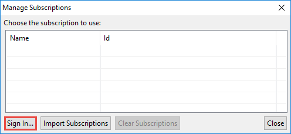
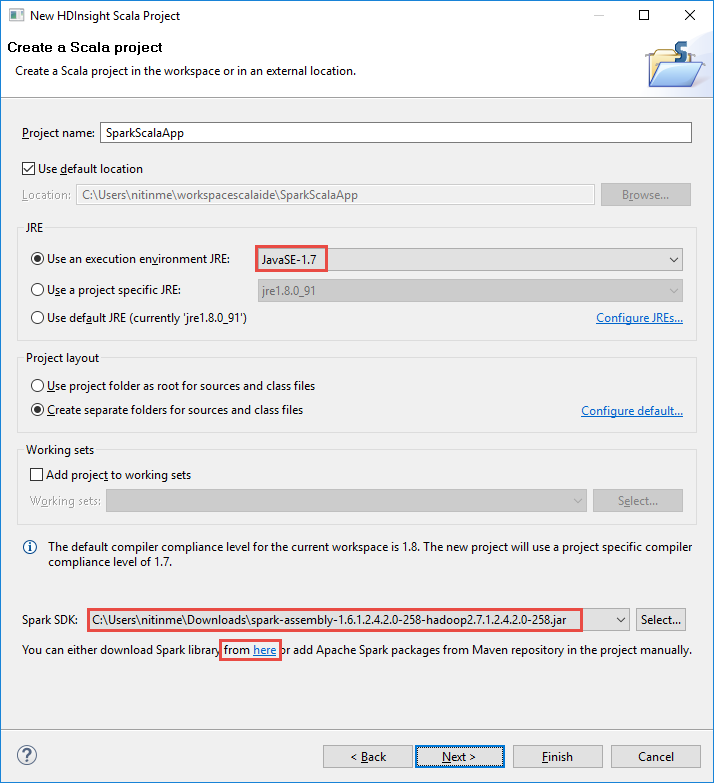
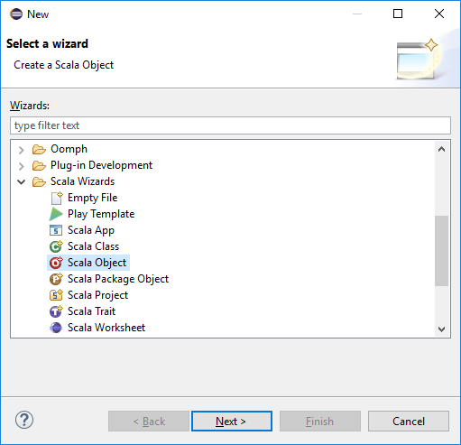
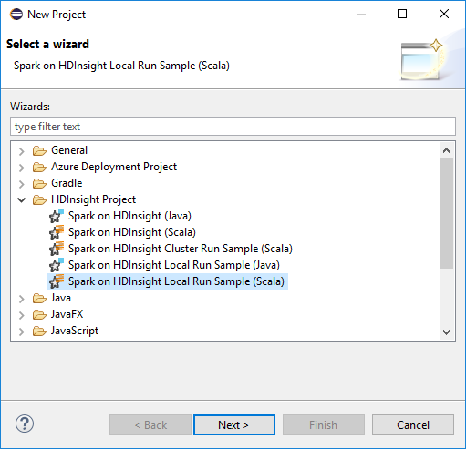
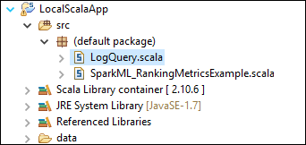

<!-- not suitable for Mooncake -->

 <properties
	pageTitle="使用 Azure Toolkit for Eclipse 中的 HDInsight 工具创建 Spark Scala 应用程序 | Azure"
	description="了解如何创建要在 HDInsight Spark 群集中运行的独立 Spark 应用程序。"
	services="hdinsight"
	documentationCenter=""
	authors="nitinme"
	manager="jhubbard"
	editor="cgronlun"
	tags="azure-portal"/>

<tags
	ms.service="hdinsight"
	ms.workload="big-data"
	ms.tgt_pltfrm="na"
	ms.devlang="na"
	ms.topic="article"
	ms.date="08/30/2016"
	wacn.date="02/06/2017"
	ms.author="nitinme"/>

# 使用 Azure Toolkit for Eclipse 中的 HDInsight 工具为 HDInsight Spark Linux 群集创建 Spark 应用程序

本文提供有关使用 Azure Toolkit for Eclipse 中的 HDInsight 工具开发用 Scala 编写的 Spark 应用程序并将其提交到 HDInsight Spark 群集的分步指导。可以按照多种不同的方式使用这些工具：

* 在 HDInsight Spark 群集中开发和提交 Scala Spark 应用程序
* 访问 Azure HDInsight Spark 群集资源
* 本地开发和运行 Scala Spark 应用程序

>[AZURE.IMPORTANT] 此工具仅可用于在 Linux 上的 HDInsight Spark 群集中创建和提交应用程序。

## 先决条件

* Azure 订阅。请参阅[获取 Azure 试用版](/pricing/1rmb-trial/)。

* HDInsight Linux 上的 Apache Spark 群集。有关说明，请参阅[在 Azure HDInsight 中创建 Apache Spark 群集](/documentation/articles/hdinsight-apache-spark-jupyter-spark-sql/)。

* Oracle Java 开发工具包第 7 版和第 8 版。
	* 由于 HDInsight 群集支持 Java 第 7 版，因此使用 **Java SDK 7** 来编译 Spark 项目。你可以从[此处](http://www.oracle.com/technetwork/java/javase/downloads/jdk7-downloads-1880260.html)下载 Java SDK 7。
	* **Java SDK 8** 用于 Eclipse IDE 运行时。可以从[此处](http://www.oracle.com/technetwork/java/javase/downloads/jdk8-downloads-2133151.html)下载它。

* Eclipse IDE。本文使用 Eclipse Neon。可以从[此处](https://www.eclipse.org/downloads/)安装它。

* Scala IDE for Eclipse。
	* **如果已安装 Eclipse IDE**，则可以转到“帮助”->“安装新软件”来添加 Scala IDE 插件，然后将 [http://download.scala-ide.org/sdk/lithium/e44/scala211/stable/site](http://download.scala-ide.org/sdk/lithium/e44/scala211/stable/site) 添加为下载适用于 Eclipse 的 Scala 插件的来源。
	* **如果没有安装 Eclipse IDE**，可以直接从[此处](http://scala-ide.org/download/sdk.html)安装 Scala IDE。可以从此链接下载 .zip 文件，将其解压缩后，导航到 **/eclipse** 文件夹，然后从该文件夹运行 **eclipse.exe** 文件。
	
	>[AZURE.NOTE] 本文档中的步骤以使用安装了 Scala 插件的 Eclipse IDE 为基础。

* Spark SDK。可以从[此处](http://go.microsoft.com/fwlink/?LinkID=723585&clcid=0x409)下载它。

* 从 [https://www.eclipse.org/efxclipse/install.html](https://www.eclipse.org/efxclipse/install.html) 安装 e(fx)clipse。

## 安装 Azure Toolkit for Eclipse 中的 HDInsight 工具

用于 Eclipse 的 HDInsight 工具作为 Azure Toolkit for Eclipse 的一部分提供。有关 Azure Toolkit 安装方法的说明，请参阅 [Installing the Azure Toolkit for Eclipse](/documentation/articles/azure-toolkit-for-eclipse-installation/)（安装 Azure Toolkit for Eclipse）。

## 登录到 Azure 订阅

1. 启动 Eclipse IDE 并打开 Azure 资源管理器。从 IDE 的“窗口”菜单中单击“显示视图”，然后单击“其他”。从打开的对话框中展开“Azure”，单击“Azure 资源管理器”，然后单击“确定”。

	

2. 在“Azure 资源管理器”中右键单击“Azure”节点，然后单击“管理订阅”。

3. 在“管理订阅”对话框中，单击“登录”并输入 Azure 凭据。

	

4. 登录之后，“管理订阅”对话框会列出与凭据关联的所有 Azure 订阅。单击对话框中的“关闭”。

5. 在“Azure 资源管理器”选项卡中展开“HDInsight”，查看订阅下的 HDInsight Spark 群集。

	

6. 你可以进一步展开群集名称节点，查看与群集关联的资源（例如存储帐户）。

	

## 为 HDInsight Spark 群集设置 Spark Scala 项目

1. 从 Eclipse IDE 工作区中，依次单击“文件”、“新建”和“项目”。

2. 在“新建项目”向导中，展开“HDInsight”，选择“Spark on HDInsight (Scala)”，然后单击“下一步”。

	

3. 在“新建 HDInsight Scala 项目”对话框中，输入/选择下图中所示的值，然后单击“下一步”。

	

	* 输入项目的名称。
	* 在“JRE”框中，确保“使用执行环境 JRE”已设为 **JavaSE-1.7**。
	* 确保 Spark SDK 已设置为你下载 SDK 的位置。下载位置的链接包含在本主题前面的[先决条件](#prerequisites)中。你也可以从包含在此对话框中的链接下载 SDK，如上图所示。

4. 在下一个对话框中，单击“库”选项卡，然后双击“JRE 系统库[JavaSE-1.7]”。

	

5. 在“编辑库”对话框中，确保“执行环境”已设置为 **JavaSE-1.7(jdk1.7.0\_79)**。如果没有此选项，请按照以下步骤操作。

	1. 选择“备用 JRE”选项，看是否有 **JavaSE-1.7(jdk1.7.0\_79)**。
	2. 如果没有，请单击“已安装的 JRE”按钮。

		  

	3. 在“已安装的 JRE”对话框中单击“添加”。

		  

	4. 在“JRE 类型”对话框中，选择“标准 VM”，然后单击“下一步”

		  

	5. 在“JRE 定义”对话框中，单击“目录”，然后导航到 JDK 7 安装位置，并选择 **jdk1.7.0\_79** 的根文件夹。

		  

	6. 单击“完成”。在“已安装的 JRE”对话框中，选择新添加的 JRE，然后单击“确定”。

		   

	7. 新添加的 JRE 应在“执行环境”下列出。单击**“完成”**。

	  	   

6. 返回“库”选项卡，双击“Scala 库容器[2.11.8]”。在“编辑库”对话框中，选择“固定的 Scala 库容器:2.10.6”。

	

	单击“完成”，直至退出项目设置对话框。

##  为 HDInsight Spark 群集创建 Scala 应用程序

1. 在已打开的 Eclipse IDE 中，从“包资源管理器”展开你之前创建的项目，右键单击“src”，指向“新建”，然后单击“其他”。

2. 在“选择向导”对话框中，展开“Scala 向导”，单击“Scala 对象”，然后单击“下一步”。

	

3. 在“创建新文件”对话框中，输入对象的名称，然后单击“完成”。

	

4. 在文本编辑器中粘贴以下代码。

		import org.apache.spark.SparkConf
		import org.apache.spark.SparkContext
	
		object MyClusterApp{
		  def main (arg: Array[String]): Unit = {
		    val conf = new SparkConf().setAppName("MyClusterApp")
		    val sc = new SparkContext(conf)
		
		    val rdd = sc.textFile("wasbs:///HdiSamples/HdiSamples/SensorSampleData/hvac/HVAC.csv")
		
		    //find the rows which have only one digit in the 7th column in the CSV
		    val rdd1 =  rdd.filter(s => s.split(",")(6).length() == 1)
		
		    rdd1.saveAsTextFile("wasbs:///HVACOut")
		  }		
		}

5. 在 HDInsight Spark 群集中运行该应用程序。

	1. 在“包资源管理器”中，右键单击项目名称，然后选择“将 Spark 应用程序提交到 HDInsight”。

	2. 在“Spark 提交”对话框中，提供以下值。

		* 对于“群集名称”，选择要在其上运行应用程序的 HDInsight Spark 群集。

		* 需要从 Eclipse 项目或硬盘中选择一个项目。

		* 对于“主要类名称”文本框，输入你在代码中指定的对象名称（请参阅下图）。

			

		* 由于本示例中的应用程序代码不需要任何命令行参数，也不需要引用 JAR 或文件，你可以将其余的文本框留空。

		* 单击“提交”。

	3. “Spark 提交”选项卡应开始显示进度。你可以通过单击“Spark 提交”窗口中的红色按钮停止应用程序。也可以单击全球图标（以图中的蓝色框表示），查看此特定应用程序运行的日志。

        

    下一部分介绍如何使用 Azure Toolkit for Eclipse 中的 HDInsight 工具访问作业输出。

## 使用 Azure Toolkit for Eclipse 中的 HDInsight 工具访问和管理 HDInsight Spark 群集

可以使用 HDInsight 工具执行各种操作。

### 访问群集的存储容器

1. 在 Azure 资源管理器中展开“HDInsight”根节点，查看可用 HDInsight Spark 群集的列表。

3. 展开群集名称以查看群集的存储帐户和默认存储容器。

	

4. 单击与群集关联的存储容器名称。在右窗格中，应看到名为 **HVACOut** 的文件夹。双击打开该文件夹，将看到 **part-*** 文件。打开其中一个文件可查看应用程序的输出。

### 访问 Spark 历史记录服务器

1. 从“Azure 资源管理器”中，右键单击 Spark 群集名称，然后选择“打开 Spark 历史记录 UI”。出现提示时，输入群集的管理员凭据。在预配群集时，你必须已指定这些凭据。

2. 在“Spark 历史记录服务器”仪表板中，你可以使用应用程序名称查找刚运行完的应用程序。上述代码使用 `val conf = new SparkConf().setAppName("MyClusterApp")` 设置了应用程序名称。因此，Spark 应用程序名称为 **MyClusterApp**。

### 启动 Ambari 门户

从“Azure 资源管理器”中，右键单击 Spark 群集名称，然后选择“打开群集管理门户(Ambari)”。出现提示时，输入群集的管理员凭据。在预配群集时，你必须已指定这些凭据。

### 管理 Azure 订阅

默认情况下，Azure Toolkit for Eclipse 中的 HDInsight 工具将列出所有 Azure 订阅中的 Spark 群集。如果需要，可以指定想要访问其群集的订阅。在“Azure 资源管理器”中，右键单击“Azure”根节点，然后单击“管理订阅”。在对话框中，清除不想访问的订阅所对应的复选框，然后单击“关闭”。如果想要从 Azure 订阅注销，可以单击“注销”。

## 本地运行 Spark Scala 应用程序

可以使用 Azure Toolkit for Eclipse 中的 HDInsight 工具在工作站上本地运行 Spark Scala 应用程序。通常情况下，此类应用程序不需要访问群集资源（如存储容器），并可以在本地运行和测试。

### 先决条件

在 Windows 计算机上运行本地 Spark Scala 应用程序时，可能会发生 [SPARK-2356](https://issues.apache.org/jira/browse/SPARK-2356) 中所述的异常，原因是 Windows OS 中缺少 **WinUtils.exe**。若要解决此错误，必须[从此处下载该可执行文件](http://public-repo-1.hortonworks.com/hdp-win-alpha/winutils.exe)到相应位置（例如 **C:\\WinUtils\\bin**）。然后必须添加环境变量 **HADOOP\_HOME**，并将其值设置为 **C\\WinUtils**。

### 运行本地的 Spark Scala 应用程序	 

1. 启动 Eclipse 并创建一个新项目。在“新建项目”对话框中做出以下选择，然后单击“下一步”。

	

	* 在左窗格中，选择“HDInsight”。
	* 在右窗格中，选择“Spark on HDInsight 本地运行示例(Scala)”。
	* 单击“下一步”。

2. 若要提供项目详细信息，请执行前面的 [为 HDInsight Spark 群集设置 Spark Scala 应用程序项目](#set-up-a-spark-scala-application-project-for-an-hdinsight-spark cluster) 部分中所述的步骤 3 到 6。

3. 模板将在 **src** 文件夹下面添加可在计算机上本地运行的示例代码 (**LogQuery**)。

	

4.  右键单击“LogQuery”应用程序，指向“运行方式”，然后单击“1 Scala 应用程序”。将在底部的“控制台”选项卡中看到如下输出。

	

## 反馈和已知问题

目前不支持直接查看 Spark 输出，我们正在解决此问题。

如果你有任何建议或反馈，或使用此工具时遇到任何问题，欢迎向 hdivstool@microsoft.com 发送电子邮件。

## 另请参阅

* [概述：Azure HDInsight 上的 Apache Spark](/documentation/articles/hdinsight-apache-spark-overview/)

### 方案

* [Spark 和 BI：使用 HDInsight 中的 Spark 和 BI 工具执行交互式数据分析](/documentation/articles/hdinsight-apache-spark-use-bi-tools/)

* [Spark 和机器学习：使用 HDInsight 中的 Spark 对使用 HVAC 数据生成温度进行分析](/documentation/articles/hdinsight-apache-spark-ipython-notebook-machine-learning/)

* [Spark 流式处理：使用 HDInsight 中的 Spark 生成实时流式处理应用程序](/documentation/articles/hdinsight-apache-spark-eventhub-streaming/)

### 创建和运行应用程序

* [使用 Livy 在 Spark 群集中远程运行作业](/documentation/articles/hdinsight-apache-spark-livy-rest-interface/)

### 工具和扩展

* [Use HDInsight Tools in Azure Toolkit for IntelliJ to create and submit Spark Scala applicatons](/documentation/articles/hdinsight-apache-spark-intellij-tool-plugin/)（使用 Azure Toolkit for IntelliJ 中的 HDInsight 工具创建和提交 Spark Scala 应用程序）

* [Use HDInsight Tools in Azure Toolkit for IntelliJ to debug Spark applications remotely](/documentation/articles/hdinsight-apache-spark-intellij-tool-plugin-debug-jobs-remotely/)（使用 Azure Toolkit for IntelliJ 中的 HDInsight 工具远程调试 Spark 应用程序）

* [在 HDInsight 上的 Spark 群集中使用 Zeppelin 笔记本](/documentation/articles/hdinsight-apache-spark-use-zeppelin-notebook/)

* [在 HDInsight 的 Spark 群集中可用于 Jupyter 笔记本的内核](/documentation/articles/hdinsight-apache-spark-jupyter-notebook-kernels/)

* [Use external packages with Jupyter notebooks（将外部包与 Jupyter 笔记本配合使用）](/documentation/articles/hdinsight-apache-spark-jupyter-notebook-use-external-packages/)

* [Install Jupyter on your computer and connect to an HDInsight Spark cluster（在计算机上安装 Jupyter 并连接到 HDInsight Spark 群集）](/documentation/articles/hdinsight-apache-spark-jupyter-notebook-install-locally/)

### 管理资源

* [管理 Azure HDInsight 中 Apache Spark 群集的资源](/documentation/articles/hdinsight-apache-spark-resource-manager/)

* [Track and debug jobs running on an Apache Spark cluster in HDInsight（跟踪和调试 HDInsight 中的 Apache Spark 群集上运行的作业）](/documentation/articles/hdinsight-apache-spark-job-debugging/)

<!---HONumber=Mooncake_0926_2016-->