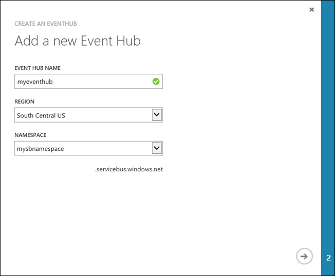
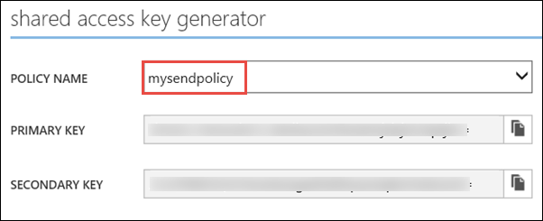

<properties 
	pageTitle="使用 Azure 事件中心和 HDInsight 中的 Apache Spark 处理流数据 | Azure" 
	description="逐步说明如何向 Azure 事件中心发送数据流，然后使用 scala 应用程序在 Spark 接收这些事件" 
	services="hdinsight" 
	documentationCenter="" 
	authors="nitinme" 
	manager="jhubbard" 
	editor="cgronlun"
	tags="azure-portal"/>

<tags 
	ms.service="hdinsight" 
	ms.workload="big-data" 
	ms.tgt_pltfrm="na" 
	ms.devlang="na" 
	ms.topic="article" 
	ms.date="09/30/2016" 
	wacn.date="02/06/2017" 
	ms.author="nitinme"/>  

# Spark Streaming：在 HDInsight Linux 上使用 Apache Spark 群集处理来自 Azure 事件中心的事件

Spark Streaming 可以扩展核心 Spark API，以生成可缩放、高吞吐量、容错的流处理应用程序。可以从许多来源引入数据。在本文中，我们将使用 Azure 事件中心来引入数据。事件中心是高度可缩放的引入系统，每秒可以引入数以百万计的事件。

在本教程中，你将学习如何创建 Azure 事件中心，使用以 Java 编写的控制台应用程序将消息引入事件中心，以及使用以 Scala 编写的 Spark 应用程序同时检索这些消息。此应用程序使用通过事件中心流式处理的数据，并将其路由到不同的输出（Azure 存储 Blob、Hive 表和 SQL 表）。

> [AZURE.NOTE] 若要遵循本文中的说明，必须使用两种版本的 Azure 门户。若要创建事件中心，需要使用 [Azure 经典管理门户](https://manage.windowsazure.cn)。若要操作 HDInsight Spark 群集，需要使用 [Azure 门户预览](https://portal.azure.cn/)。

**先决条件：**

必须满足以下条件：

- Azure 订阅。请参阅[获取 Azure 试用版](/pricing/1rmb-trial/)。
- Apache Spark 群集。有关说明，请参阅 [Create Apache Spark clusters in Azure HDInsight](/documentation/articles/hdinsight-apache-spark-jupyter-spark-sql/)（在 Azure HDInsight 中创建 Apache Spark 群集）。
- Oracle Java 开发工具包。可以从[此处](http://www.oracle.com/technetwork/java/javase/downloads/jdk8-downloads-2133151.html)安装它。
- Java IDE。本文使用 IntelliJ IDEA 15.0.1。可以从[此处](https://www.jetbrains.com/idea/download/)安装它。
- 适用于 SQL Server v4.1 或更高版本的 Microsoft JDBC 驱动程序。必须需要此插件将事件数据写入 SQL Server 数据库。可以从[此处](https://msdn.microsoft.com/sqlserver/aa937724.aspx)安装它。
- Azure SQL 数据库。有关说明，请参阅[快速创建 SQL 数据库](/documentation/articles/sql-database-get-started/)。

## 此解决方案有哪些功能？

下面是流解决方案的工作流：

1. 创建用于接收事件流的 Azure 事件中心。

2. 运行一个本地独立应用程序，以便生成事件并将其推送到 Azure 事件中心。[https://github.com/hdinsight/spark-streaming-data-persistence-examples](https://github.com/hdinsight/spark-streaming-data-persistence-examples) 网页中发布了一个用于执行此操作的示例应用程序。

2. 在 Spark 群集上，远程运行从 Azure 事件中心读取流事件并将其推送到不同位置（Azure Blob、Hive 表和 SQL 数据库表）的流应用程序。

## 创建 Azure 事件中心

1. 在 [Azure 门户](https://manage.windowsazure.cn)中，选择“新建”>“服务总线”>“事件中心”>“自定义创建”。

2. 在“添加新事件中心”屏幕中，输入“事件中心名称”，选择要在其中创建中心的“区域”，然后创建新的命名空间或选择现有的命名空间。单击**箭头**继续。

	

	> [AZURE.NOTE] 你应该选择与 HDInsight 中 Apache Spark 群集相同的“位置”，以便降低延迟和成本。

3. 在“配置事件中心”屏幕中，输入“分区计数”和“消息保留期”值，然后单击复选标记。对于本示例，请使用分区计数 10，消息保留期 1。记下分区计数，因为稍后需要用到。

	

4. 单击你创建的事件中心，单击“配置”，然后为事件中心创建两个访问策略。

	<table>
	<tr><th>名称</th><th>权限</th></tr>
	<tr><td>mysendpolicy</td><td>发送</td></tr>
	<tr><td>myreceivepolicy</td><td>侦听</td></tr>
	</table>

	创建权限后，在页面底部选择“保存”图标。这将会创建共享访问策略，用于对此事件中心进行发送 (**mysendpolicy**) 和侦听 (**myreceivepolicy**)。

	

	
5. 在同一页上，记下针对这两个策略生成的策略密钥。请保存这些密钥，因为稍后将要用到。

	

6. 在“仪表板”页上，单击底部的“连接信息”以使用两个策略来检索和保存事件中心的连接字符串。

	

## 使用 Scala 应用程序将消息发送到事件中心

在本部分中，你将使用独立的本地 Scala 应用程序将事件流发送到在前一步骤中创建的 Azure 事件中心。可从 GitHub 获取此应用程序，网址为：[https://github.com/hdinsight/eventhubs-sample-event-producer](https://github.com/hdinsight/eventhubs-sample-event-producer)。以下步骤假设你已复制此 GitHub 存储库。

1. 在 IntelliJ IDEA 中打开应用程序 **EventhubsSampleEventProducer**。
	
2. 生成项目。在“生成”菜单中，单击“创建项目”。将在 **\\out\\artifacts** 下创建输出 jar。

>[AZURE.TIP] 也可以使用 IntelliJ IDEA 中的选项直接从 GitHub 存储库创建项目。若要了解如何使用该方法，请参考下一部分中的说明。请注意，下一部分所述的许多步骤并不适用于在本步骤中创建的 Scala 应用程序。例如：

> * 你不必要更新 POM 以包含 Spark 版本。这是因为你并不需要依赖 Spark 来创建此应用程序
> * 不必要将某些依赖性 jar 添加到项目库。这是因为此项目并不需要这些 jar。

## 更新用于接收事件的 Scala 流应用程序

[https://github.com/hdinsight/spark-streaming-data-persistence-examples](https://github.com/hdinsight/spark-streaming-data-persistence-examples) 网页中提供了用于接收事件并将其路由到不同目标的示例 Scala 应用程序。请遵循以下步骤更新应用程序并创建输出 jar。

1. 启动 IntelliJ IDEA，在启动屏幕中选择“从版本控制签出”，然后单击“Git”。
		
	

2. 在“克隆存储库”对话框中，提供要从中克隆的 Git 存储库的 URL，指定要克隆到的目录，然后单击“克隆”。

	

	
3. 按照提示操作，直到项目克隆完成。按 **Alt + 1** 打开“项目视图”。其内容应如下所示。

	  

	
4. 请确保使用 Java8 编译应用程序代码。若要确保这一点，请依次单击“文件”、“项目结构”，在“项目”选项卡上，请确保项目语言级别设置为“8 - Lambdas、输入批注等”。

	  

5. 打开 **pom.xml** 并确保 Spark 版本正确。在 <properties> 节点下查找以下代码片段，并检查 Spark 版本。

		<scala.version>2.10.4</scala.version>
    	<scala.compat.version>2.10.4</scala.compat.version>
    	<scala.binary.version>2.10</scala.binary.version>
    	<spark.version>1.6.2</spark.version>
	
5. 应用程序需要两个依赖性 jar：

	* **EventHub 接收方 jar**。必须有此 jar，Spark 才能从事件中心接收消息。若要使用此 jar，请更新 **pom.xml**，在 `<dependencies>` 下面添加以下代码。

			<dependency>
			  <groupId>com.microsoft.azure</groupId>
			  <artifactId>spark-streaming-eventhubs_2.10</artifactId>
			  <version>1.6.0</version>
			</dependency> 

	* **JDBC 驱动程序 jar**。必须有此 jar，才能将事件中心发来的消息写入 Azure SQL 数据库。可从[此处](https://msdn.microsoft.com/sqlserver/aa937724.aspx)下载此 jar 文件的 v4.1 或更高版本。在项目库中添加对此 jar 的引用。执行以下步骤：

		1. 在已打开应用程序的 IntelliJ IDEA 窗口中，依次单击“文件”、“项目结构”和“库”。
		
		2. 单击添加图标 ()，单击“Java”，然后导航到 JDBC 驱动程序 jar 所下载到的位置。按照提示将 jar 文件添加到项目库。

			  

		3. 单击“应用”。

6. 创建输出 jar 文件。执行以下步骤。
	1. 在“项目结构”对话框中，单击“项目”，然后单击加号。在弹出的对话框中，单击“JAR”，然后单击“从包含依赖项的模块”。

		  

	1. 在“从模块创建 JAR”对话框中，单击“主类”旁边的省略号 ()。

	1. 在“选择主类”对话框中，选择任何可用的类，然后单击“确定”。

		  

	1. 在“从模块创建 JAR”对话框中，确保已选择“提取到目标 JAR”选项，然后单击“确定”。这会创建包含所有依赖项的单个 JAR。

		  

	1. “输出布局”选项卡列出了所有包含为 Maven 项目一部分的 jar。你可以选择并删除 Scala 应用程序不直接依赖的 jar。对于此处创建的应用程序，可以删除最后一个（**microsoft-spark-streaming-examples** 编译输出）以外的所有 jar。选择要删除的 jar，然后单击“删除”图标 ()。

		  

		请务必选中“在创建时生成”框，以确保每次生成或更新项目时都创建 jar。单击“应用”，然后单击“确定”。

	1. 在“输出布局”选项卡中的“可用元素”框右下角，显示了前面添加到项目库中的 SQL JDBC jar。必须将此 jar 添加到“输出布局”选项卡。右键单击该 jar 文件，然后单击“提取到输出根目录中”。

		  

		“输出布局”选项卡现在应如下所示。

		  

		在“项目结构”对话框中，单击“应用”，然后单击“确定”。

	1. 在菜单栏中单击“生成”，然后单击“创建项目”。也可以单击“生成项目”以创建 jar。在 **\\out\\artifacts** 下创建了输出 jar。

		  

## 使用 Livy 在 Spark 群集上远程运行应用程序

我们将使用 Livy 在 Spark 群集上远程运行流应用程序。有关如何在 HDInsight Spark 群集上使用 Livy 的详细介绍，请参阅[向 Azure HDInsight 上的 Apache Spark 群集远程提交作业](/documentation/articles/hdinsight-apache-spark-livy-rest-interface/)。在开始运行远程作业以使用 Spark 流式传输事件之前，必须完成一些准备工作：

1. 启动本地独立应用程序，以生成事件并将其发送到事件中心。使用以下命令来执行此操作：

		java -cp EventhubsSampleEventProducer.jar com.microsoft.eventhubs.client.example.EventhubsClientDriver --eventhubs-namespace "mysbnamespace" --eventhubs-name "myeventhub" --policy-name "mysendpolicy" --policy-key "<policy key>" --message-length 32 --thread-count 32 --message-count -1

2. 将流 jar (**microsoft-spark-streaming-examples.jar**) 复制到与群集关联的 Azure Blob 存储。这样，jar 便可供 Livy 访问。可以使用命令行实用工具 [**AzCopy**](/documentation/articles/storage-use-azcopy/) 来执行此操作。可以使用其他许多客户端来上载数据。有关详细信息，请参阅[在 HDInsight 中上载 Hadoop 作业的数据](/documentation/articles/hdinsight-upload-data/)。

3. 将 CURL 安装在要运行这些应用程序的计算机上。我们将使用 CURL 来调用 Livy 终结点，以远程运行作业。

### 运行应用程序以将事件以文本形式接收到 Azure 存储空间 Blob 中

打开命令提示符，导航到安装 CURL 的目录，然后运行以下命令（替换用户名/密码和群集名称）：

	curl -k --user "admin:mypassword1!" -v -H "Content-Type: application/json" -X POST --data @C:\Temp\inputBlob.txt "https://mysparkcluster.azurehdinsight.cn/livy/batches"

文件 **inputBlob.txt** 中的参数定义如下：

	{ "file":"wasbs:///example/jars/microsoft-spark-streaming-examples.jar", "className":"com.microsoft.spark.streaming.examples.workloads.EventhubsEventCount", "args":["--eventhubs-namespace", "mysbnamespace", "--eventhubs-name", "myeventhub", "--policy-name", "myreceivepolicy", "--policy-key", "<put-your-key-here>", "--consumer-group", "$default", "--partition-count", 10, "--batch-interval-in-seconds", 20, "--checkpoint-directory", "/EventCheckpoint", "--event-count-folder", "/EventCount/EventCount10"], "numExecutors":20, "executorMemory":"1G", "executorCores":1, "driverMemory":"2G" }

让我们了解输入文件中包含哪些参数：

* **file** 是与群集关联的 Azure 存储帐户上的应用程序 jar 文件的路径。
* **className** 是 jar 中的类名。
* **args** 是类所需的参数列表
* **numExecutors** 是 Spark 用于运行流应用程序的核心数。此数目始终至少应为事件中心分区数的两倍。
* **executorMemory**、**executorCores**、**driverMemory** 是用于将所需资源分配给流应用程序的参数。

>[AZURE.NOTE] 不需要创建用作参数的输出文件夹（EventCheckpoint、EventCount/EventCount10）。流应用程序将为你创建。
	
运行命令时，你应会看到类似于下面的输出：

	< HTTP/1.1 201 Created
	< Content-Type: application/json; charset=UTF-8
	< Location: /18
	< Server: Microsoft-IIS/8.5
	< X-Powered-By: ARR/2.5
	< X-Powered-By: ASP.NET
	< Date: Tue, 01 Dec 2015 05:39:10 GMT
	< Content-Length: 37
	<
	{"id":1,"state":"starting","log":[]}* Connection #0 to host mysparkcluster.azurehdinsight.cn left intact

请记下位于输出中最后一行的批 ID（在本示例中为“1”）。若要验证应用程序是否已成功运行，可以查看与群集关联的 Azure 存储帐户，可看到该处已创建 **/EventCount/EventCount10** 文件夹。此文件夹应包含相关的 Blob，其中捕获了在为参数 **batch-interval-in-seconds** 指定的时段内所处理的事件数。

应用程序将继续运行，直到你将它终止。若要终止，请使用以下命令：

	curl -k --user "admin:mypassword1!" -v -X DELETE "https://mysparkcluster.azurehdinsight.cn/livy/batches/1"

### 运行应用程序以将事件以 JSON 形式接收到 Azure 存储空间 Blob 中

打开命令提示符，导航到安装 CURL 的目录，然后运行以下命令（替换用户名/密码和群集名称）：

	curl -k --user "admin:mypassword1!" -v -H "Content-Type: application/json" -X POST --data @C:\Temp\inputJSON.txt "https://mysparkcluster.azurehdinsight.cn/livy/batches"

文件 **inputJSON.txt** 中的参数定义如下：

	{ "file":"wasbs:///example/jars/microsoft-spark-streaming-examples.jar", "className":"com.microsoft.spark.streaming.examples.workloads.EventhubsToAzureBlobAsJSON", "args":["--eventhubs-namespace", "mysbnamespace", "--eventhubs-name", "myeventhub", "--policy-name", "myreceivepolicy", "--policy-key", "<put-your-key-here>", "--consumer-group", "$default", "--partition-count", 10, "--batch-interval-in-seconds", 20, "--checkpoint-directory", "/EventCheckpoint", "--event-count-folder", "/EventCount/EventCount10", "--event-store-folder", "/EventStore10"], "numExecutors":20, "executorMemory":"1G", "executorCores":1, "driverMemory":"2G" }

这些参数类似于在前一步骤中为文本输出指定的参数。同样，你不需要创建用作参数的输出文件夹（EventCheckpoint、EventCount/EventCount10）。流应用程序将为你创建。

 在运行该命令之后，可以查看与群集关联的 Azure 存储帐户，可看到该处已创建 **/EventStore10** 文件夹。打开前缀为 **part-** 的任一文件，可看到以 JSON 格式处理的事件。

### 运行应用程序以将事件接收到 Hive 表中

若要运行将事件流式传输到 Hive 表中的应用程序，需要其他一些组件。其中包括：

* datanucleus-api-jdo-3.2.6.jar
* datanucleus-rdbms-3.2.9.jar
* datanucleus-core-3.2.10.jar
* hive-site.xml

这些 **.jar** 文件位于 `/usr/hdp/current/spark-client/lib` 中的 HDInsight Spark 群集上。**hive-site.xml** 位于 `/usr/hdp/current/spark-client/conf`。

可以使用 [WinScp](http://winscp.net/eng/download.php) 将这些文件从群集复制到本地计算机。然后，可以使用工具将这些文件复制到与群集关联的存储帐户。有关如何将文件上载到存储帐户的详细信息，请参阅[在 HDInsight 中上载 Hadoop 作业的数据](/documentation/articles/hdinsight-upload-data/)。

将文件复制到 Azure 存储帐户之后，请打开命令提示符，导航到安装 CURL 的目录，然后运行以下命令（替换用户名/密码和群集名称）：

	curl -k --user "admin:mypassword1!" -v -H "Content-Type: application/json" -X POST --data @C:\Temp\inputHive.txt "https://mysparkcluster.azurehdinsight.cn/livy/batches"

文件 **inputHive.txt** 中的参数定义如下：

	{ "file":"wasbs:///example/jars/microsoft-spark-streaming-examples.jar", "className":"com.microsoft.spark.streaming.examples.workloads.EventhubsToHiveTable", "args":["--eventhubs-namespace", "mysbnamespace", "--eventhubs-name", "myeventhub", "--policy-name", "myreceivepolicy", "--policy-key", "<put-your-key-here>", "--consumer-group", "$default", "--partition-count", 10, "--batch-interval-in-seconds", 20, "--checkpoint-directory", "/EventCheckpoint", "--event-count-folder", "/EventCount/EventCount10", "--event-hive-table", "EventHiveTable10" ], "jars":["wasbs:///example/jars/datanucleus-api-jdo-3.2.6.jar", "wasbs:///example/jars/datanucleus-rdbms-3.2.9.jar", "wasbs:///example/jars/datanucleus-core-3.2.10.jar"], "files":["wasbs:///example/jars/hive-site.xml"], "numExecutors":20, "executorMemory":"1G", "executorCores":1, "driverMemory":"2G" }

这些参数类似于在前面步骤中为文本输出指定的参数。同样，你不需要创建用作参数的输出文件夹（EventCheckpoint、EventCount/EventCount10）或输出 Hive 表 (EventHiveTable10)。流应用程序将为你创建。请注意，**jars** 和 **files** 选项包含已复制到存储帐户的 .jar 文件和 hive-site.xml 的路径。

若要验证是否已成功创建 Hive 表，可通过 SSH 连接到群集，然后运行 Hive 查询。有关说明，请参阅[通过 SSH 将 Hive 与 HDInsight 中的 Hadoop 配合使用](/documentation/articles/hdinsight-hadoop-use-hive-ssh/)。当使用 SSH 建立连接后，可以运行以下命令，以验证是否已创建 Hive 表 **EventHiveTable10**。

	show tables;

你应该会看到与下面类似的输出：

	OK
	eventhivetable10
	hivesampletable

你还可以运行 SELECT 查询来查看表的内容。

	SELECT * FROM eventhivetable10 LIMIT 10;

你应该看到如下输出：

	ZN90apUSQODDTx7n6Toh6jDbuPngqT4c
	sor2M7xsFwmaRW8W8NDwMneFNMrOVkW1
	o2HcsU735ejSi2bGEcbUSB4btCFmI1lW
	TLuibq4rbj0T9st9eEzIWJwNGtMWYoYS
	HKCpPlWFWAJILwR69MAq863nCWYzDEw6
	Mvx0GQOPYvPR7ezBEpIHYKTKiEhYammQ
	85dRppSBSbZgThLr1s0GMgKqynDUqudr
	5LAWkNqorLj3ZN9a2mfWr9rZqeXKN4pF
	ulf9wSFNjD7BZXCyunozecov9QpEIYmJ
	vWzM3nvOja8DhYcwn0n5eTfOItZ966pa
	Time taken: 4.434 seconds, Fetched: 10 row(s)

### 运行应用程序以将事件接收到 Azure SQL 数据库表中

在运行此步骤之前，请确保已创建 Azure SQL 数据库。需要指定数据库名称、数据库服务器名称和数据库管理员凭据的值作为参数。但是，不需要创建数据库表。流应用程序将为你创建该表。

打开命令提示符，导航到安装 CURL 的目录，然后运行以下命令：

	curl -k --user "admin:mypassword1!" -v -H "Content-Type: application/json" -X POST --data @C:\Temp\inputSQL.txt "https://mysparkcluster.azurehdinsight.cn/livy/batches"

文件 **inputSQL.txt** 中的参数定义如下：

	{ "file":"wasbs:///example/jars/microsoft-spark-streaming-examples.jar", "className":"com.microsoft.spark.streaming.examples.workloads.EventhubsToAzureSQLTable", "args":["--eventhubs-namespace", "mysbnamespace", "--eventhubs-name", "myeventhub", "--policy-name", "myreceivepolicy", "--policy-key", "<put-your-key-here>", "--consumer-group", "$default", "--partition-count", 10, "--batch-interval-in-seconds", 20, "--checkpoint-directory", "/EventCheckpoint", "--event-count-folder", "/EventCount/EventCount10", "--sql-server-fqdn", "<database-server-name>.database.chinacloudapi.cn", "--sql-database-name", "mysparkdatabase", "--database-username", "sparkdbadmin", "--database-password", "<put-password-here>", "--event-sql-table", "EventContent" ], "numExecutors":20, "executorMemory":"1G", "executorCores":1, "driverMemory":"2G" }

若要验证应用程序是否已成功运行，可以使用 SQL Server Management Studio 连接到 Azure SQL 数据库。有关如何执行该操作的说明，请参阅[使用 SQL Server Management Studio 连接到 SQL 数据库](/documentation/articles/sql-database-connect-query-ssms/)。连接到数据库之后，可以导航到流应用程序所创建的 **EventContent** 表。可以运行快速查询以获取该表中的数据。运行以下查询：

	SELECT * FROM EventCount

您应该会看到与下面类似的输出：

	00046b0f-2552-4980-9c3f-8bba5647c8ee
	000b7530-12f9-4081-8e19-90acd26f9c0c
	000bc521-9c1b-4a42-ab08-dc1893b83f3b
	00123a2a-e00d-496a-9104-108920955718
	0017c68f-7a4e-452d-97ad-5cb1fe5ba81b
	001KsmqL2gfu5ZcuQuTqTxQvVyGCqPp9
	001vIZgOStka4DXtud0e3tX7XbfMnZrN
	00220586-3e1a-4d2d-a89b-05c5892e541a
	0029e309-9e54-4e1b-84be-cd04e6fce5ec
	003333cf-874f-4045-9da3-9f98c2b4ea49
	0043c07e-8d73-420a-9af7-1fcb94575356
	004a11a9-0c2c-4bc0-a7d5-2e0ebd947ab9

	
## 另请参阅

* [概述：Azure HDInsight 上的 Apache Spark](/documentation/articles/hdinsight-apache-spark-overview/)

### 方案

* [Spark 和 BI：使用 HDInsight 中的 Spark 和 BI 工具执行交互式数据分析](/documentation/articles/hdinsight-apache-spark-use-bi-tools/)

* [Spark 和机器学习：使用 HDInsight 中的 Spark 对使用 HVAC 数据生成温度进行分析](/documentation/articles/hdinsight-apache-spark-ipython-notebook-machine-learning/)

* [Spark 和机器学习：使用 HDInsight 中的 Spark 预测食品检查结果](/documentation/articles/hdinsight-apache-spark-machine-learning-mllib-ipython/)

* [使用 HDInsight 中的 Spark 分析网站日志](/documentation/articles/hdinsight-apache-spark-custom-library-website-log-analysis/)

### 创建和运行应用程序

* [使用 Scala 创建独立的应用程序](/documentation/articles/hdinsight-apache-spark-create-standalone-application/)

* [使用 Livy 在 Spark 群集中远程运行作业](/documentation/articles/hdinsight-apache-spark-livy-rest-interface/)

### 工具和扩展

* [在 HDInsight 上的 Spark 群集中使用 Zeppelin 笔记本](/documentation/articles/hdinsight-apache-spark-use-zeppelin-notebook/)

* [在 HDInsight 的 Spark 群集中可用于 Jupyter 笔记本的内核](/documentation/articles/hdinsight-apache-spark-jupyter-notebook-kernels/)

* [Use external packages with Jupyter notebooks（将外部包与 Jupyter 笔记本配合使用）](/documentation/articles/hdinsight-apache-spark-jupyter-notebook-use-external-packages/)

* [Install Jupyter on your computer and connect to an HDInsight Spark cluster（在计算机上安装 Jupyter 并连接到 HDInsight Spark 群集）](/documentation/articles/hdinsight-apache-spark-jupyter-notebook-install-locally/)

### 管理资源

* [管理 Azure HDInsight 中 Apache Spark 群集的资源](/documentation/articles/hdinsight-apache-spark-resource-manager/)

* [Track and debug jobs running on an Apache Spark cluster in HDInsight（跟踪和调试 HDInsight 中的 Apache Spark 群集上运行的作业）](/documentation/articles/hdinsight-apache-spark-job-debugging/)

[hdinsight-versions]: /documentation/articles/hdinsight-component-versioning-v1/
[hdinsight-upload-data]: /documentation/articles/hdinsight-upload-data/
[hdinsight-storage]: /documentation/articles/hdinsight-hadoop-use-blob-storage/

[azure-purchase-options]: /pricing/overview/
[azure-member-offers]: /pricing/member-offers/
[azure-trial]: /pricing/1rmb-trial/
[azure-management-portal]: https://manage.windowsazure.cn/
[azure-create-storageaccount]: /documentation/articles/storage-create-storage-account/

<!---HONumber=Mooncake_1107_2016-->