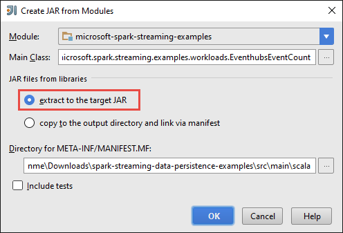

<properties
    pageTitle="借助 Azure HDInsight 中的 Apache Spark 流式处理来自事件中心的数据 | Azure"
    description="逐步说明如何向 Azure 事件中心发送数据流，然后使用 scala 应用程序在 HDInsight Spark 接收这些事件"
    services="hdinsight"
    documentationcenter=""
    author="nitinme"
    manager="jhubbard"
    editor="cgronlun"
    tags="azure-portal"
    translationtype="Human Translation" />
<tags
    ms.assetid="68894e75-3ffa-47bd-8982-96cdad38b7d0"
    ms.service="hdinsight"
    ms.custom="hdinsightactive"
    ms.workload="big-data"
    ms.tgt_pltfrm="na"
    ms.devlang="na"
    ms.topic="article"
    ms.date="03/27/2017"
    wacn.date="05/08/2017"
    ms.author="nitinme"
    ms.sourcegitcommit="2c4ee90387d280f15b2f2ed656f7d4862ad80901"
    ms.openlocfilehash="9fb436c319a5847e1a66d8b59e734f1333e53a9c"
    ms.lasthandoff="04/28/2017" />

# Spark Streaming：在 HDInsight 上使用 Apache Spark 群集处理来自 Azure 事件中心的事件

本文介绍一些与使用 Apache Spark 进行流式处理相关的概念，以及如何创建流式处理解决方案，具体步骤如下：

1. 使用独立的应用程序将消息引入 Azure 事件中心。

2. 使用 Azure HDInsight 上的 Spark 群集中运行的应用程序从事件中心实时检索消息。

3. 将数据路由到不同的输出，例如 Azure 存储 Blob、Hive 表或 SQL 表。 

## 先决条件

* Azure 订阅。 请参阅[获取 Azure 试用版](/pricing/1rmb-trial/)。

* HDInsight 上的 Apache Spark 群集。 有关说明，请参阅[在 Azure HDInsight 中创建 Apache Spark 群集](/documentation/articles/hdinsight-apache-spark-jupyter-spark-sql/)。

## Spark 流式处理的概念

有关流式处理的处理方式中的 Apache Spark 深入说明，请参阅 [Apache Spark 流式处理概述](http://spark.apache.org/docs/latest/streaming-programming-guide.html#overview)。 HDInsight 将相同的流式处理功能引入到 Azure 上的 Spark 群集。  

## 此解决方案有哪些功能？

在本文中，若要创建流式处理解决方案，请执行以下步骤：

1. 创建用于接收事件流的 Azure 事件中心。

2. 运行一个本地独立应用程序，以便生成事件并将其推送到 Azure 事件中心。 [https://github.com/hdinsight/spark-streaming-data-persistence-examples](https://github.com/hdinsight/spark-streaming-data-persistence-examples) 网页中发布了一个用于执行此操作的示例应用程序。

3. 在 Spark 群集上，远程运行从 Azure 事件中心读取流事件并将其推送到不同位置（Azure Blob、Hive 表和 SQL 数据库表）的流应用程序。 

## 创建 Azure 事件中心

1. 登录到 [Azure 门户预览](https://portal.azure.cn)，然后单击屏幕左上角的“新建”。

2. 单击“物联网”，然后单击“事件中心”。

    

3. 在“创建命名空间”  边栏选项卡中，输入命名空间名称。 选择定价层（基本或标准）。 另外，请选择一个 Azure 订阅、资源组以及要创建该资源的位置。 单击“创建”  创建命名空间。

    

    > [AZURE.NOTE]
    > 应选择与 HDInsight 中 Apache Spark 群集相同的“位置”，以降低延迟和成本。
    > 
    > 

4. 在“事件中心”命名空间列表中，单击新创建的命名空间。      

5. 在命名空间边栏选项卡中，单击“事件中心”，然后单击“+ 事件中心”创建新的事件中心。

    

6. 键入事件中心的名称，将分区计数设置为 10，将消息保留期设置为 1。 我们不会存档此解决方案中的消息，因此可以将其余设置保留为默认值，然后单击“创建”。

    

7. 新创建的事件中心的事件中心边栏选项卡中列出。

     

8. 返回命名空间边栏选项卡（不是特定的事件中心边栏选项卡），单击“共享访问策略”，然后单击“RootManageSharedAccessKey”。

     

9. 单击复制按钮，将 **RootManageSharedAccessKey** 主密钥和连接字符串复制到剪贴板。 保存这些设置，以便在本教程稍后使用。

     

## 使用 Scala 应用程序将消息发送到 Azure 事件中心

在本部分，你将使用独立的本地 Scala 应用程序生成事件流并将其发送到在前一步骤中创建的 Azure 事件中心。 可从 GitHub 获取此应用程序，网址为：[https://github.com/hdinsight/eventhubs-sample-event-producer](https://github.com/hdinsight/eventhubs-sample-event-producer)。 以下步骤假设你已复制此 GitHub 存储库。

1. 确保已在运行此应用程序的计算机上安装以下组件。

    * Oracle Java 开发工具包。 可以从 [此处](http://www.oracle.com/technetwork/java/javase/downloads/jdk8-downloads-2133151.html)安装它。
    * Java IDE。 本文使用 IntelliJ IDEA 15.0.1。 可以从[此处](https://www.jetbrains.com/idea/download/)安装。

2. 在 IntelliJ IDEA 中打开应用程序 **EventhubsSampleEventProducer**。

3. 生成项目。 在“生成”菜单中，单击“创建项目”。 根据 IntelliJ IDEA 配置，输出 jar 下创建 **\classes\artifacts**。

    > [AZURE.TIP]
    > 也可以使用 IntelliJ IDEA 中的选项直接从 GitHub 存储库创建项目。 若要了解如何使用该方法，请参考下一部分中的说明。 请注意，下一部分所述的许多步骤并不适用于在本步骤中创建的 Scala 应用程序。 例如：
    > 

    > 
* 不必要更新 POM 以包含 Spark 版本。 这是因为你并不需要依赖 Spark 来创建此应用程序
    > 
* 不必要将某些依赖性 jar 添加到项目库。 此项目并不需要这些 jar。
    > 
    > 

## 从使用 Spark 群集上运行的流式处理应用程序的事件中心接收消息

[https://github.com/hdinsight/spark-streaming-data-persistence-examples](https://github.com/hdinsight/spark-streaming-data-persistence-examples) 网页中提供了用于接收事件并将其路由到不同目标的示例 Scala 应用程序。 请遵循以下步骤更新应用程序并创建输出 jar。

1. 启动 IntelliJ IDEA，在启动屏幕中选择“从版本控制签出”，然后单击“Git”。

    
2. 在“克隆存储库”对话框中，提供要从中克隆的 Git 存储库的 URL，指定要克隆到的目录，然后单击“克隆”。

    
3. 按照提示操作，直到项目克隆完成。 按 **Alt+1** 打开“项目视图”。 其内容应如下所示。

    
4. 请确保使用 Java8 编译应用程序代码。 若要确保这点，请单击“文件”、“项目结构”，然后在“项目”选项卡上，确保将项目语言级别设置为“8 - Lambdas，类型批注等”。

    
5. 打开 **pom.xml** 并确保 Spark 版本正确。 在 `<properties>` 节点下查找以下代码片段，并检查 Spark 版本。

        <scala.version>2.11.8</scala.version>
        <scala.compat.version>2.11.8</scala.compat.version>
        <scala.binary.version>2.11</scala.binary.version>
        <spark.version>2.0.0</spark.version>

6. 应用程序需要调用一个依赖项 jar **JDBC 驱动程序 jar**。 必须有此 jar，才能将事件中心发来的消息写入 Azure SQL 数据库。 可从 [此处](https://msdn.microsoft.com/sqlserver/aa937724.aspx)下载此 jar 文件的 v4.1 或更高版本。 在项目库中添加对此 jar 的引用。 执行以下步骤：

    1. 在已打开应用程序的 IntelliJ IDEA 窗口中，依次单击“文件”、“项目结构”和“库”。 
    2. 单击添加图标（），单击“Java”，然后导航到 JDBC 驱动程序 jar 所下载到的位置。 按照提示将 jar 文件添加到项目库。

        
    3. 单击“应用” 。
7. 创建输出 jar 文件。 执行以下步骤。

    1. 在“项目结构”对话框中，单击“项目”，然后单击加号。 在弹出的对话框中，单击“JAR”，然后单击“从包含依赖项的模块”。

        
    2. 在“从模块创建 JAR”对话框中，单击“主类”旁边的省略号 ()。
    3. 在“选择主类”对话框中，选择任何可用的类，然后单击“确定”。

        
    4. 在“从模块创建 JAR”对话框中，确保已选择“提取到目标 JAR”选项，然后单击“确定”。 这会创建包含所有依赖项的单个 JAR。

        
    5. “输出布局”选项卡列出了所有包含为 Maven 项目一部分的 jar。 你可以选择并删除 Scala 应用程序不直接依赖的 jar。 对于此处创建的应用程序，可以删除最后一个（**microsoft-spark-streaming-examples** 编译输出）以外的所有 jar。 选择要删除的 jar，然后单击“删除”图标 ()。

        

        请务必选中“在创建时生成”框，以确保每次生成或更新项目时都创建 jar。 单击“应用” 。
    6. 在“输出布局”选项卡中的“可用元素”框右下角，显示了前面添加到项目库中的 SQL JDBC jar。 必须将此 jar 添加到“输出布局”选项卡。 右键单击该 jar 文件，然后单击“提取到输出根目录中”。

          

        “输出布局”选项卡现在应如下所示。

                

        在“项目结构”对话框中，单击“应用”，然后单击“确定”。    
    7. 在菜单栏中单击“生成”，然后单击“创建项目”。 也可以单击“生成项目”以创建 jar。 输出 jar 将在 **\classes\artifacts** 下创建。

        

## 使用 Livy 在 Spark 群集上远程运行应用程序

我们将使用 Livy 在 Spark 群集上远程运行流应用程序。 有关如何在 HDInsight Spark 群集上使用 Livy 的详细介绍，请参阅[向 Azure HDInsight 上的 Apache Spark 群集远程提交作业](/documentation/articles/hdinsight-apache-spark-livy-rest-interface/)。 在开始运行远程作业以使用 Spark 流式传输事件之前，必须完成一些准备工作：

1. 启动本地独立应用程序，以生成事件并将其发送到事件中心。 使用以下命令来执行此操作：

        java -cp com-microsoft-azure-eventhubs-client-example.jar com.microsoft.eventhubs.client.example.EventhubsClientDriver --eventhubs-namespace "mysbnamespace" --eventhubs-name "myeventhub" --policy-name "mysendpolicy" --policy-key "<policy key>" --message-length 32 --thread-count 32 --message-count -1

2. 将流式 jar (**spark-streaming-data-persistence-examples.jar**) 复制到与群集关联的 Azure Blob 存储。 这样，jar 便可供 Livy 访问。 可以使用命令行实用工具 [**AzCopy**](/documentation/articles/storage-use-azcopy/) 来执行此操作。 可以使用其他许多客户端来上载数据。 有关详细信息，请参阅[在 HDInsight 中上传 Hadoop 作业的数据](/documentation/articles/hdinsight-upload-data/)。
3. 将 CURL 安装在要运行这些应用程序的计算机上。 我们将使用 CURL 来调用 Livy 终结点，以远程运行作业。

### 运行应用程序以将事件以文本形式接收到 Azure 存储空间 Blob 中

打开命令提示符，导航到安装 CURL 的目录，然后运行以下命令（替换用户名/密码和群集名称）：

    curl -k --user "admin:mypassword1!" -v -H "Content-Type: application/json" -X POST --data @C:\Temp\inputBlob.txt "https://mysparkcluster.azurehdinsight.cn/livy/batches"

文件 **inputBlob.txt** 中的参数定义如下：

    { "file":"wasbs:///example/jars/spark-streaming-data-persistence-examples.jar", "className":"com.microsoft.spark.streaming.examples.workloads.EventhubsEventCount", "args":["--eventhubs-namespace", "mysbnamespace", "--eventhubs-name", "myeventhub", "--policy-name", "myreceivepolicy", "--policy-key", "<put-your-key-here>", "--consumer-group", "$default", "--partition-count", 10, "--batch-interval-in-seconds", 20, "--checkpoint-directory", "/EventCheckpoint", "--event-count-folder", "/EventCount/EventCount10"], "numExecutors":20, "executorMemory":"1G", "executorCores":1, "driverMemory":"2G" }

让我们了解输入文件中包含哪些参数：

* **file** 是与群集关联的 Azure 存储帐户上的应用程序 jar 文件的路径。
* **className** 是 jar 中的类名。
* **args** 是类所需的参数列表
* **numExecutors** 是 Spark 用于运行流应用程序的核心数。 此数目始终至少应为事件中心分区数的两倍。
* **executorMemory**、**executorCores**、**driverMemory** 是用于将所需资源分配给流式应用程序的参数。

> [AZURE.NOTE]
> 不需要创建用作参数的输出文件夹（EventCheckpoint、EventCount/EventCount10）。 流应用程序将为你创建。
> 
> 

运行命令时，你应会看到类似于下面的输出：

    < HTTP/1.1 201 Created
    < Content-Type: application/json; charset=UTF-8
    < Location: /18
    < Server: Microsoft-IIS/8.5
    < X-Powered-By: ARR/2.5
    < X-Powered-By: ASP.NET
    < Date: Tue, 01 Dec 2015 05:39:10 GMT
    < Content-Length: 37
    <
    {"id":1,"state":"starting","log":[]}* Connection #0 to host mysparkcluster.azurehdinsight.cn left intact

请记下位于输出中最后一行的批 ID（在本示例中为“1”）。 若要验证应用程序是否已成功运行，可以查看与群集关联的 Azure 存储帐户，应会看到该处已创建 **/EventCount/EventCount10** 文件夹。 此文件夹应包含相关的 Blob，其中捕获了在为参数 **batch-interval-in-seconds**指定的时段内所处理的事件数。

应用程序将继续运行，直到你将它终止。 若要终止，请使用以下命令：

    curl -k --user "admin:mypassword1!" -v -X DELETE "https://mysparkcluster.azurehdinsight.cn/livy/batches/1"

### 运行应用程序以将事件以 JSON 形式接收到 Azure 存储空间 Blob 中
打开命令提示符，导航到安装 CURL 的目录，然后运行以下命令（替换用户名/密码和群集名称）：

    curl -k --user "admin:mypassword1!" -v -H "Content-Type: application/json" -X POST --data @C:\Temp\inputJSON.txt "https://mysparkcluster.azurehdinsight.cn/livy/batches"

文件 **inputJSON.txt** 中的参数定义如下：

    { "file":"wasbs:///example/jars/spark-streaming-data-persistence-examples.jar", "className":"com.microsoft.spark.streaming.examples.workloads.EventhubsToAzureBlobAsJSON", "args":["--eventhubs-namespace", "mysbnamespace", "--eventhubs-name", "myeventhub", "--policy-name", "myreceivepolicy", "--policy-key", "<put-your-key-here>", "--consumer-group", "$default", "--partition-count", 10, "--batch-interval-in-seconds", 20, "--checkpoint-directory", "/EventCheckpoint", "--event-count-folder", "/EventCount/EventCount10", "--event-store-folder", "/EventStore10"], "numExecutors":20, "executorMemory":"1G", "executorCores":1, "driverMemory":"2G" }

这些参数类似于在前一步骤中为文本输出指定的参数。 同样，你不需要创建用作参数的输出文件夹（EventCheckpoint、EventCount/EventCount10）。 流应用程序将为你创建。

 在运行该命令之后，可以查看与群集关联的 Azure 存储帐户，可看到该处已创建 **/EventStore10** 文件夹。 打开前缀为 **part-** 的任一文件，可看到以 JSON 格式处理的事件。

### 运行应用程序以将事件接收到 Hive 表中
若要运行将事件流式传输到 Hive 表中的应用程序，需要其他一些组件。 其中包括：

* datanucleus-api-jdo-3.2.6.jar
* datanucleus-rdbms-3.2.9.jar
* datanucleus-core-3.2.10.jar
* hive-site.xml

这些 **.jar** 文件位于 HDInsight Spark 群集上：`/usr/hdp/current/spark-client/lib`。 **hive-site.xml** 位于 `/usr/hdp/current/spark-client/conf` 上。

可以使用 [WinScp](http://winscp.net/eng/download.php) 将这些文件从群集复制到本地计算机。 然后，可以使用工具将这些文件复制到与群集关联的存储帐户。 有关如何将文件上传到存储帐户的详细信息，请参阅[在 HDInsight 中上传 Hadoop 作业的数据](/documentation/articles/hdinsight-upload-data/)。

将文件复制到 Azure 存储帐户之后，请打开命令提示符，导航到安装 CURL 的目录，然后运行以下命令（替换用户名/密码和群集名称）：

    curl -k --user "admin:mypassword1!" -v -H "Content-Type: application/json" -X POST --data @C:\Temp\inputHive.txt "https://mysparkcluster.azurehdinsight.cn/livy/batches"

文件 **inputHive.txt** 中的参数定义如下：

    { "file":"wasbs:///example/jars/spark-streaming-data-persistence-examples.jar", "className":"com.microsoft.spark.streaming.examples.workloads.EventhubsToHiveTable", "args":["--eventhubs-namespace", "mysbnamespace", "--eventhubs-name", "myeventhub", "--policy-name", "myreceivepolicy", "--policy-key", "<put-your-key-here>", "--consumer-group", "$default", "--partition-count", 10, "--batch-interval-in-seconds", 20, "--checkpoint-directory", "/EventCheckpoint", "--event-count-folder", "/EventCount/EventCount10", "--event-hive-table", "EventHiveTable10" ], "jars":["wasbs:///example/jars/datanucleus-api-jdo-3.2.6.jar", "wasbs:///example/jars/datanucleus-rdbms-3.2.9.jar", "wasbs:///example/jars/datanucleus-core-3.2.10.jar"], "files":["wasbs:///example/jars/hive-site.xml"], "numExecutors":20, "executorMemory":"1G", "executorCores":1, "driverMemory":"2G" }

这些参数类似于在前面步骤中为文本输出指定的参数。 同样，你不需要创建用作参数的输出文件夹（EventCheckpoint、EventCount/EventCount10）或输出 Hive 表 (EventHiveTable10)。 流应用程序将为你创建。 请注意，**jars** 和 **files** 选项包含已复制到存储帐户的 .jar 文件和 hive-site.xml 的路径。

若要验证是否已成功创建 Hive 表，可通过 SSH 连接到群集，然后运行 Hive 查询。 有关说明，请参阅[通过 SSH 在 HDInsight 中将 Hive 与 Hadoop 配合使用](/documentation/articles/hdinsight-hadoop-use-hive-ssh/)。 当使用 SSH 建立连接后，可以运行以下命令，以验证是否已创建 Hive 表 **EventHiveTable10**。

    show tables;

你应该会看到与下面类似的输出：

    OK
    eventhivetable10
    hivesampletable

你还可以运行 SELECT 查询来查看表的内容。

    SELECT * FROM eventhivetable10 LIMIT 10;

你应该看到如下输出：

    ZN90apUSQODDTx7n6Toh6jDbuPngqT4c
    sor2M7xsFwmaRW8W8NDwMneFNMrOVkW1
    o2HcsU735ejSi2bGEcbUSB4btCFmI1lW
    TLuibq4rbj0T9st9eEzIWJwNGtMWYoYS
    HKCpPlWFWAJILwR69MAq863nCWYzDEw6
    Mvx0GQOPYvPR7ezBEpIHYKTKiEhYammQ
    85dRppSBSbZgThLr1s0GMgKqynDUqudr
    5LAWkNqorLj3ZN9a2mfWr9rZqeXKN4pF
    ulf9wSFNjD7BZXCyunozecov9QpEIYmJ
    vWzM3nvOja8DhYcwn0n5eTfOItZ966pa
    Time taken: 4.434 seconds, Fetched: 10 row(s)

### 运行应用程序以将事件接收到 Azure SQL 数据库表中
在运行此步骤之前，请确保已创建 Azure SQL 数据库。 有关说明，请参阅[快速创建 SQL 数据库](/documentation/articles/sql-database-get-started/)。 若要完成本部分，需要指定数据库名称、数据库服务器名称和数据库管理员凭据的值作为参数。 但是，不需要创建数据库表。 流应用程序将为你创建该表。

打开命令提示符，导航到安装 CURL 的目录，然后运行以下命令：

    curl -k --user "admin:mypassword1!" -v -H "Content-Type: application/json" -X POST --data @C:\Temp\inputSQL.txt "https://mysparkcluster.azurehdinsight.cn/livy/batches"

文件 **inputSQL.txt** 中的参数定义如下：

    { "file":"wasbs:///example/jars/spark-streaming-data-persistence-examples.jar", "className":"com.microsoft.spark.streaming.examples.workloads.EventhubsToAzureSQLTable", "args":["--eventhubs-namespace", "mysbnamespace", "--eventhubs-name", "myeventhub", "--policy-name", "myreceivepolicy", "--policy-key", "<put-your-key-here>", "--consumer-group", "$default", "--partition-count", 10, "--batch-interval-in-seconds", 20, "--checkpoint-directory", "/EventCheckpoint", "--event-count-folder", "/EventCount/EventCount10", "--sql-server-fqdn", "<database-server-name>.database.chinacloudapi.cn", "--sql-database-name", "mysparkdatabase", "--database-username", "sparkdbadmin", "--database-password", "<put-password-here>", "--event-sql-table", "EventContent" ], "numExecutors":20, "executorMemory":"1G", "executorCores":1, "driverMemory":"2G" }

若要验证应用程序是否已成功运行，可以使用 SQL Server Management Studio 连接到 Azure SQL 数据库。 有关如何执行该操作的说明，请参阅[使用 SQL Server Management Studio 连接到 SQL 数据库](/documentation/articles/sql-database-connect-query-ssms/)。 连接到数据库之后，可以导航到流应用程序所创建的 **EventContent** 表。 可以运行快速查询以获取该表中的数据。 运行以下查询：

    SELECT * FROM EventCount

您应该会看到与下面类似的输出：

    00046b0f-2552-4980-9c3f-8bba5647c8ee
    000b7530-12f9-4081-8e19-90acd26f9c0c
    000bc521-9c1b-4a42-ab08-dc1893b83f3b
    00123a2a-e00d-496a-9104-108920955718
    0017c68f-7a4e-452d-97ad-5cb1fe5ba81b
    001KsmqL2gfu5ZcuQuTqTxQvVyGCqPp9
    001vIZgOStka4DXtud0e3tX7XbfMnZrN
    00220586-3e1a-4d2d-a89b-05c5892e541a
    0029e309-9e54-4e1b-84be-cd04e6fce5ec
    003333cf-874f-4045-9da3-9f98c2b4ea49
    0043c07e-8d73-420a-9af7-1fcb94575356
    004a11a9-0c2c-4bc0-a7d5-2e0ebd947ab9

## 另请参阅
* [概述：Azure HDInsight 上的 Apache Spark](/documentation/articles/hdinsight-apache-spark-overview/)

### 方案
* [Spark 和 BI：使用 HDInsight 中的 Spark 和 BI 工具执行交互式数据分析](/documentation/articles/hdinsight-apache-spark-use-bi-tools/)
* [Spark 和机器学习：使用 HDInsight 中的 Spark 对使用 HVAC 数据生成温度进行分析](/documentation/articles/hdinsight-apache-spark-ipython-notebook-machine-learning/)
* [Spark 和机器学习：使用 HDInsight 中的 Spark 预测食品检查结果](/documentation/articles/hdinsight-apache-spark-machine-learning-mllib-ipython/)
* [使用 HDInsight 中的 Spark 分析网站日志](/documentation/articles/hdinsight-apache-spark-custom-library-website-log-analysis/)

### 创建和运行应用程序
* [使用 Scala 创建独立的应用程序](/documentation/articles/hdinsight-apache-spark-create-standalone-application/)
* [使用 Livy 在 Spark 群集中远程运行作业](/documentation/articles/hdinsight-apache-spark-livy-rest-interface/)

### 工具和扩展
* [在 HDInsight 上的 Spark 群集中使用 Zeppelin 笔记本](/documentation/articles/hdinsight-apache-spark-use-zeppelin-notebook/)
* [在 HDInsight 的 Spark 群集中可用于 Jupyter 笔记本的内核](/documentation/articles/hdinsight-apache-spark-jupyter-notebook-kernels/)
* [将外部包与 Jupyter 笔记本配合使用](/documentation/articles/hdinsight-apache-spark-jupyter-notebook-use-external-packages/)
* [在计算机上安装 Jupyter 并连接到 HDInsight Spark 群集](/documentation/articles/hdinsight-apache-spark-jupyter-notebook-install-locally/)

### 管理资源
* [管理 Azure HDInsight 中 Apache Spark 群集的资源](/documentation/articles/hdinsight-apache-spark-resource-manager/)
* [跟踪和调试 HDInsight 中的 Apache Spark 群集上运行的作业](/documentation/articles/hdinsight-apache-spark-job-debugging/)

[hdinsight-versions]: /documentation/articles/hdinsight-component-versioning/
[hdinsight-upload-data]: /documentation/articles/hdinsight-upload-data/
[hdinsight-storage]: /documentation/articles/hdinsight-hadoop-use-blob-storage/

[azure-purchase-options]: /pricing/overview/
[azure-member-offers]: /pricing/member-offers/
[azure-trial]: /pricing/1rmb-trial/
[azure-management-portal]: https://manage.windowsazure.cn/
[azure-create-storageaccount]: /documentation/articles/storage-create-storage-account/

<!--Update_Description: creating event hubs in Azure portal preview-->