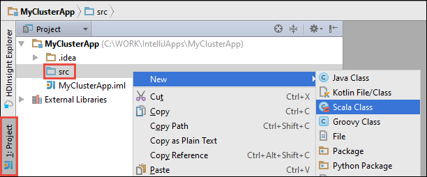
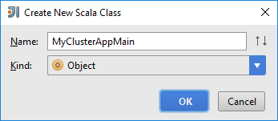
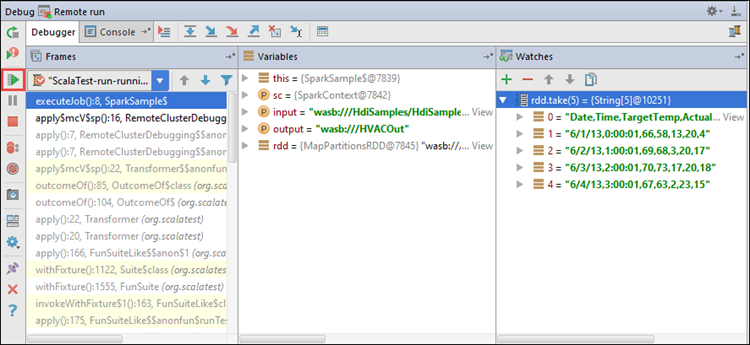

<!-- not suitable for Mooncake -->

 <properties
	pageTitle="使用 Azure Toolkit for IntelliJ 中的 HDInsight 工具远程调试 HDInsight Spark 群集上运行的应用程序 | Azure"
	description="了解如何使用 Azure Toolkit for IntelliJ 中的 HDInsight 工具远程调试 HDInsight Spark 群集上运行的应用程序。"
	services="hdinsight"
	documentationCenter=""
	authors="nitinme"
	manager="jhubbard"
	editor="cgronlun"
	tags="azure-portal"/>

<tags
	ms.service="hdinsight"
	ms.workload="big-data"
	ms.tgt_pltfrm="na"
	ms.devlang="na"
	ms.topic="article"
	ms.date="09/09/2016"
	wacn.date="02/06/2017"
	ms.author="nitinme"/>

# 使用 Azure Toolkit for IntelliJ 中的 HDInsight 工具在 HDInsight Spark Linux 群集上远程调试 Spark 应用程序

本文提供有关如何在 HDInsight Spark 群集上使用 Azure Toolkit for IntelliJ 中的 HDInsight 工具插件提交 Spark 作业，然后从台式机远程调试该作业的逐步指导。为此，必须执行以下概要步骤：

1. 创建站点到站点或点到站点 Azure 虚拟网络。本文档中的步骤假设你使用站点到站点网络。

2. 在 Azure HDInsight 中创建属于站点到站点 Azure 虚拟网络一部分的 Spark 群集。

3. 验证群集头节点与台式机之间的连接。

4. 在 IntelliJ IDEA 中创建 Scala 应用程序，并对它进行配置以进行远程调试。

5. 运行和调试应用程序。

##先决条件

* Azure 订阅。请参阅[获取 Azure 试用版](/pricing/1rmb-trial/)。

* HDInsight Linux 上的 Apache Spark 群集。有关说明，请参阅[在 Azure HDInsight 中创建 Apache Spark 群集](/documentation/articles/hdinsight-apache-spark-jupyter-spark-sql/)。
 
* Oracle Java 开发工具包。可以从[此处](http://www.oracle.com/technetwork/java/javase/downloads/jdk8-downloads-2133151.html)安装它。
 
* IntelliJ IDEA。本文使用版本 15.0.1。可以从[此处](https://www.jetbrains.com/idea/download/)安装它。
 
* Azure Toolkit for IntelliJ 中的 HDInsight 工具。Azure Toolkit for IntelliJ 随附了用于 IntelliJ 的 HDInsight 工具。有关 Azure Toolkit 安装方式的说明，请参阅[安装 Azure Toolkit for IntelliJ](/documentation/articles/azure-toolkit-for-intellij-installation/)。

* 从 IntelliJ IDEA 登录到 Azure 订阅。遵循[此处](/documentation/articles/hdinsight-apache-spark-intellij-tool-plugin/#log-into-your-azure-subscription)的说明。
 
* 在 Windows 计算机上运行 Spark Scala 应用程序进行远程调试时，可能会发生 [SPARK-2356](https://issues.apache.org/jira/browse/SPARK-2356) 中所述的异常，原因是在 Windows 中缺少 WinUtils.exe。若要解决此错误，必须[从此处下载该可执行文件](http://public-repo-1.hortonworks.com/hdp-win-alpha/winutils.exe)到相应位置（例如 **C:\\WinUtils\\bin**）。然后必须添加环境变量 **HADOOP\_HOME**，并将其值设置为 **C\\WinUtils**。

## 步骤 1：创建 Azure 虚拟网络

遵循以下链接中的说明创建 Azure 虚拟网络，然后确认台式机与 Azure 虚拟网络之间的连接。

* [使用 Azure 门户预览创建具有站点到站点 VPN 连接的 VNet](/documentation/articles/vpn-gateway-howto-site-to-site-resource-manager-portal/)
* [使用 PowerShell 创建具有站点到站点 VPN 连接的 VNet](/documentation/articles/vpn-gateway-create-site-to-site-rm-powershell/)
* [使用 PowerShell 配置与虚拟网络的点到站点连接](/documentation/articles/vpn-gateway-howto-point-to-site-rm-ps/)

## 步骤 2：创建 HDInsight Spark 群集

还应该在 Azure HDInsight 上创建属于所创建 Azure 虚拟网络一部分的 Apache Spark 群集。参考 [Create Linux-based clusters in HDInsight](/documentation/articles/hdinsight-hadoop-provision-linux-clusters/)（在 HDInsight 中创建基于 Linux 的群集）中提供的信息。请选择在上一步骤中创建的 Azure 虚拟网络作为可选配置的一部分。

## 步骤 3：验证群集头节点与台式机之间的连接

1. 获取头节点的 IP 地址。打开群集的 Ambari UI。在群集边栏选项卡中，单击“仪表板”。

	

2. 在 Ambari UI 的右上角单击“主机”。

	

3. 你应会看到头节点、辅助角色节点和 zookeeper 节点的列表。头节点带有 **hn*** 前缀。单击第一个头节点。

	

4. 在打开的页面底部，从“摘要”框复制头节点的 IP 地址和主机名。

	

5. 将头节点的 IP 地址和主机名包含在要从中运行和远程调试 Spark 作业的计算机上的 **hosts** 文件中。这样，你便可以使用 IP 地址和主机名来与头节点通信。

	1. 以提升的权限打开记事本。在“文件”菜单中单击“打开”，然后导航到 hosts 文件的位置。在 Windows 计算机上，该位置为 `C:\Windows\System32\Drivers\etc\hosts`。

	2. 将以下内容添加到 **hosts** 文件中。

			# For headnode0
			192.xxx.xx.xx hn0-nitinp
			192.xxx.xx.xx hn0-nitinp.lhwwghjkpqejawpqbwcdyp3.gx.internal.chinacloudapp.cn

			# For headnode1
			192.xxx.xx.xx hn1-nitinp
			192.xxx.xx.xx hn1-nitinp.lhwwghjkpqejawpqbwcdyp3.gx.internal.chinacloudapp.cn

5. 在连接到 HDInsight 群集所用 Azure 虚拟网络的计算机中，验证是否能够使用该 IP 地址和主机名 ping 到两个头节点。

6. 参考 [Connect to an HDInsight cluster using SSH](/documentation/articles/hdinsight-hadoop-linux-use-ssh-windows/#connect-to-a-linux-based-hdinsight-cluster)（使用 SSH 连接到 HDInsight 群集）中的说明，通过 SSH 连接到群集头节点。从群集头节点，对台式机的 IP 地址执行 ping 操作。应该测试是否能够连接到分配给计算机的两个 IP 地址，其中一个是网络连接的地址，另一个是计算机所连接到的 Azure 虚拟网络的地址。

7. 针对其他头节点重复上述步骤。

## 步骤 4：使用 Azure Toolkit for IntelliJ 中的 HDInsight 工具创建 Spark Scala 应用程序，并对其进行配置以进行远程调试

1. 启动 IntelliJ IDEA 并创建一个新项目。在“新建项目”对话框中做出以下选择，然后单击“下一步”。

	

	* 在左窗格中，选择“HDInsight”。
	* 在右窗格中，选择“Spark on HDInsight (Scala)”。
	* 单击“下一步”。

2. 在下一窗口中，提供项目详细信息。

	* 提供项目名称和项目位置。
	* 对于“项目 SDK”，请确保提供大于 7 的 Java 版本。
	* 对于“Scala SDK”，请依次单击“创建”、“下载”，然后选择要使用的 Scala 版本。**确保未使用版本 2.11.x**。本示例使用版本 **2.10.6**。

		

	* 对于“Spark SDK”，请从[此处](http://go.microsoft.com/fwlink/?LinkID=723585&clcid=0x409)下载并使用该 SDK。也可以忽略过此字段并改用[“Spark Maven 存储库”](http://mvnrepository.com/search?q=spark)，不过请确保已安装正确的 Maven 存储库，以便能够开发 Spark 应用程序。（例如，如果你使用 Spark Streaming，则需要确保已安装 Spark Streaming 部件；另请确保使用标记为 Scala 2.10 的存储库 - 不要使用标记为 Scala 2.11 的存储库。）

		

	* 单击“完成”。

3. Spark 项目将自动为你创建一个项目。若要查看该项目，请遵循以下步骤。

	1. 在“文件”菜单中，单击“项目结构”。
	2. 在“项目结构”对话框中，单击“项目”以查看创建的默认项目。

		

	也可以通过单击上图中突出显示的“+”图标创建自己的项目。

4. 在“项目结构”对话框中，单击“项目”。如果“项目 SDK”设置为 1.8，请确保“项目语言级别”设置为“7 - Diamonds、ARM、Multi-Catch 等”。

	

4. 将库添加到项目。若要添加库，请在项目树中右键单击项目名称，然后单击“打开模块设置”。在“项目结构”对话框的左窗格中单击“库”，单击加号 (+)，然后单击“从 Maven”。

	

	在“从 Maven 存储库下载库”对话框中，搜索并添加以下库。

	* `org.scalatest:scalatest_2.10:2.2.1`
	* `org.apache.hadoop:hadoop-azure:2.7.1`

5. 从群集头节点复制 `yarn-site.xml` 和 `core-site.xml` 并将其添加到项目。使用以下命令来复制文件。可以使用 [Cygwin](https://cygwin.com/install.html) 运行以下 `scp` 命令，以便从群集头节点复制文件。

		scp <ssh user name>@<headnode IP address or host name>://etc/hadoop/conf/core-site.xml .

	由于已将群集头节点 IP 地址和主机名添加到台式机上的 hosts 文件，因此可按以下方式使用 **scp** 命令。

		scp sshuser@hn0-nitinp:/etc/hadoop/conf/core-site.xml .
		scp sshuser@hn0-nitinp:/etc/hadoop/conf/yarn-site.xml .

	将这些文件复制到项目树中的 **/src** 文件夹下（例如 `<your project directory>\src`），从而将它们添加到项目。

6. 更新 `core-site.xml` 以进行以下更改。

	1. `core-site.xml` 包含与群集关联的存储帐户的已加密密钥。在已添加到项目的 `core-site.xml` 中，将已加密密钥替换为与默认存储帐户关联的实际存储密钥。请参阅 [Manage your storage access keys](/documentation/articles/storage-create-storage-account/#manage-your-storage-account)（管理存储访问密钥）。

			<property>
	      		<name>fs.azure.account.key.hdistoragecentral.blob.core.chinacloudapi.cn</name>
	      		<value>access-key-associated-with-the-account</value>
	    	</property>

	2. 从 `core-site.xml` 中删除以下条目。

			<property>
      			<name>fs.azure.account.keyprovider.hdistoragecentral.blob.core.chinacloudapi.cn</name>
      			<value>org.apache.hadoop.fs.azure.ShellDecryptionKeyProvider</value>
			</property>

			<property>
		      	<name>fs.azure.shellkeyprovider.script</name>
		      	<value>/usr/lib/python2.7/dist-packages/hdinsight_common/decrypt.sh</value>
		    </property>

			<property>
      			<name>net.topology.script.file.name</name>
      			<value>/etc/hadoop/conf/topology_script.py</value>
    		</property>

	3. 保存文件。

7. 添加应用程序的 Main 类。在“项目资源管理器”中，右键单击“src”，指向“新建”，然后单击“Scala 类”。

	

8. 在“新建 Scala 类”对话框中，提供名称，对于“种类”，选择“对象”，然后单击“确定”。

	

9. 在 `MyClusterAppMain.scala` 文件中粘贴以下代码。此代码将创建 Spark 上下文，并从 `SparkSample` 对象启动 `executeJob` 方法。

		import org.apache.spark.{SparkConf, SparkContext}

		object SparkSampleMain {
		  def main (arg: Array[String]): Unit = {
		    val conf = new SparkConf().setAppName("SparkSample")
		                              .set("spark.hadoop.validateOutputSpecs", "false")
		    val sc = new SparkContext(conf)
		
		    SparkSample.executeJob(sc,
		                           "wasbs:///HdiSamples/HdiSamples/SensorSampleData/hvac/HVAC.csv",
		                           "wasbs:///HVACOut")
		  }
		}

10. 重复上述步骤 8 和 9，添加名为 `SparkSample` 的新 Scala 对象。在此类中添加以下代码。此代码从 HVAC.csv（适用于所有 HDInsight Spark 群集）中读取数据，检索在 CSV 的第七列中只有一个数字的行，并将输出写入群集的默认存储容器下的 **/HVACOut**。

		import org.apache.spark.SparkContext
	
		object SparkSample {
		  def executeJob (sc: SparkContext, input: String, output: String): Unit = {
		    val rdd = sc.textFile(input)
		
		    //find the rows which have only one digit in the 7th column in the CSV
		    val rdd1 =  rdd.filter(s => s.split(",")(6).length() == 1)
		
		    val s = sc.parallelize(rdd.take(5)).cartesian(rdd).count()
		    println(s)
		
		    rdd1.saveAsTextFile(output)
		    //rdd1.collect().foreach(println)
		  }
		
		}

11. 重复上述步骤 8 和 9，添加名为 `RemoteClusterDebugging` 的新类。此类实现用于调试应用程序的 Spark 测试框架。将以下代码添加到 `RemoteClusterDebugging` 类。

		import org.apache.spark.{SparkConf, SparkContext}
		import org.scalatest.FunSuite
		
		class RemoteClusterDebugging extends FunSuite {
		
		  test("Remote run") {
		    val conf = new SparkConf().setAppName("SparkSample")
		                              .setMaster("yarn-client")
		                              .set("spark.yarn.am.extraJavaOptions", "-Dhdp.version=2.4")
		                              .set("spark.yarn.jar", "wasbs:///hdp/apps/2.4.2.0-258/spark-assembly-1.6.1.2.4.2.0-258-hadoop2.7.1.2.4.2.0-258.jar")
		                              .setJars(Seq("""C:\WORK\IntelliJApps\MyClusterApp\out\artifacts\MyClusterApp_DefaultArtifact\default_artifact.jar"""))
		                              .set("spark.hadoop.validateOutputSpecs", "false")
		    val sc = new SparkContext(conf)
		
		    SparkSample.executeJob(sc,
		      "wasbs:///HdiSamples/HdiSamples/SensorSampleData/hvac/HVAC.csv",
		      "wasbs:///HVACOut")
		  }
		}

	此处需要注意几个要点：
	
	* 对于.`.set("spark.yarn.jar", "wasbs:///hdp/apps/2.4.2.0-258/spark-assembly-1.6.1.2.4.2.0-258-hadoop2.7.1.2.4.2.0-258.jar")`，请确保 Spark 程序集 JAR 可在指定路径上的群集存储中使用。
	* 对于 `setJars`，指定将创建项目 jar 的位置。这通常是 `<Your IntelliJ project directory>\out<project name>_DefaultArtifact\default_artifact.jar`。

11. 在 `RemoteClusterDebugging` 类中，右键单击 `test` 关键字，然后选择“创建 RemoteClusterDebugging 配置”。

	

12. 在对话框中提供配置的名称，然后选择“测试种类”作为“测试名称”。将其他所有值保留默认值，单击“应用”，然后单击“确定”。

	

13. 现在，应会在菜单栏中看到“远程运行”配置下拉列表。

	

## 步骤 5：在调试模式下运行应用程序

1. 在 IntelliJ IDEA 项目中打开 `SparkSample.scala` 并在“val rdd1”旁边创建一个断点。在用于创建断点的弹出菜单中，选择“line in function executeJob”。

	

2. 单击“远程运行”配置下拉列表旁的“调试运行”按钮，开始运行应用程序。

	

3. 当程序执行步骤到达断点时，应会在底部窗格中看到“调试器”选项卡。

	

4. 单击 (**+**) 图标添加一个监视进程，如下图所示。

	

	此处由于应用程序在创建变量 `rdd1` 之前已中断，因此可以使用此监视进程查看变量 `rdd` 中的前 5 行。按 **ENTER**。

	

	从上图可以看到，在运行时，你可以查询 TB 量级的数据，并可以逐步调试应用程序。例如，在上图显示的输出中，可以看到输出的第一行是标头。基于此信息，你可以修改应用程序代码，以根据需要跳过标头行。

5. 现在可以单击“恢复程序”图标以继续运行应用程序。

	

6. 如果应用程序成功完成，你应会看到类似于下面的输出。

	

 

## 另请参阅

* [概述：Azure HDInsight 上的 Apache Spark](/documentation/articles/hdinsight-apache-spark-overview/)

### 方案

* [Spark 和 BI：使用 HDInsight 中的 Spark 和 BI 工具执行交互式数据分析](/documentation/articles/hdinsight-apache-spark-use-bi-tools/)

* [Spark 和机器学习：使用 HDInsight 中的 Spark 对使用 HVAC 数据生成温度进行分析](/documentation/articles/hdinsight-apache-spark-ipython-notebook-machine-learning/)

* [Spark 流式处理：使用 HDInsight 中的 Spark 生成实时流式处理应用程序](/documentation/articles/hdinsight-apache-spark-eventhub-streaming/)

### 创建和运行应用程序

* [使用 Livy 在 Spark 群集中远程运行作业](/documentation/articles/hdinsight-apache-spark-livy-rest-interface/)

### 工具和扩展

* [Use HDInsight Tools in Azure Toolkit for IntelliJ to create and submit Spark Scala applicatons](/documentation/articles/hdinsight-apache-spark-intellij-tool-plugin/)（使用 Azure Toolkit for IntelliJ 中的 HDInsight 工具创建和提交 Spark Scala 应用程序）

* [Use HDInsight Tools in Azure Toolkit for Eclipse to create Spark applications](/documentation/articles/hdinsight-apache-spark-eclipse-tool-plugin/)（使用 Azure Toolkit for IntelliJ 中的 HDInsight 工具创建 Spark 应用程序）

* [在 HDInsight 上的 Spark 群集中使用 Zeppelin 笔记本](/documentation/articles/hdinsight-apache-spark-use-zeppelin-notebook/)

* [在 HDInsight 的 Spark 群集中可用于 Jupyter 笔记本的内核](/documentation/articles/hdinsight-apache-spark-jupyter-notebook-kernels/)

* [Use external packages with Jupyter notebooks（将外部包与 Jupyter 笔记本配合使用）](/documentation/articles/hdinsight-apache-spark-jupyter-notebook-use-external-packages/)

* [Install Jupyter on your computer and connect to an HDInsight Spark cluster（在计算机上安装 Jupyter 并连接到 HDInsight Spark 群集）](/documentation/articles/hdinsight-apache-spark-jupyter-notebook-install-locally/)

### 管理资源

* [管理 Azure HDInsight 中 Apache Spark 群集的资源](/documentation/articles/hdinsight-apache-spark-resource-manager/)

* [Track and debug jobs running on an Apache Spark cluster in HDInsight（跟踪和调试 HDInsight 中的 Apache Spark 群集上运行的作业）](/documentation/articles/hdinsight-apache-spark-job-debugging/)

<!---HONumber=Mooncake_0926_2016-->