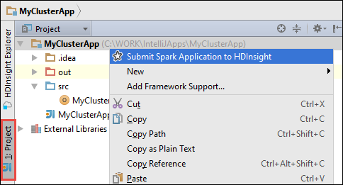
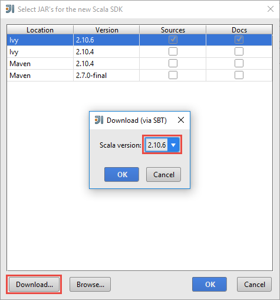

<!-- not suitable for Mooncake -->

<properties
    pageTitle="使用 Azure Toolkit for IntelliJ 中的 HDInsight 工具创建 Spark Scala 应用程序 | Azure"
    description="了解如何创建要在 HDInsight Spark 群集中运行的独立 Spark 应用程序。"
    services="hdinsight"
    documentationcenter=""
    author="nitinme"
    manager="jhubbard"
    editor="cgronlun"
    tags="azure-portal" />
<tags 
    ms.assetid="73304272-6c8b-482e-af7c-cd25d95dab4d"
    ms.service="hdinsight"
    ms.workload="big-data"
    ms.tgt_pltfrm="na"
    ms.devlang="na"
    ms.topic="article"
    ms.date="09/09/2016"
    wacn.date="02/06/2017"
    ms.author="nitinme" />

# 使用 Azure Toolkit for IntelliJ 中的 HDInsight 工具为 HDInsight Spark Linux 群集创建 Spark 应用程序
本文提供有关使用 Azure Toolkit for IntelliJ 中的 HDInsight 工具开发用 Scala 编写的 Spark 应用程序并将其提交到 HDInsight Spark 群集的分步指导。可以按照多种不同的方式使用这些工具：

* 在 HDInsight Spark 群集中开发和提交 Scala Spark 应用程序
* 访问 Azure HDInsight Spark 群集资源
* 本地开发和运行 Scala Spark 应用程序

也可以按照[此处](https://mix.office.com/watch/1nqkqjt5xonza)的视频来入门。

> [AZURE.IMPORTANT]
此工具仅可用于在 Linux 上的 HDInsight Spark 群集中创建和提交应用程序。
> 
> 

## 先决条件
* Azure 订阅。请参阅[获取 Azure 试用版](/pricing/1rmb-trial/)。
* HDInsight Linux 上的 Apache Spark 群集。有关说明，请参阅[在 Azure HDInsight 中创建 Apache Spark 群集](/documentation/articles/hdinsight-apache-spark-jupyter-spark-sql/)。
* Oracle Java 开发工具包。可以从[此处](http://www.oracle.com/technetwork/java/javase/downloads/jdk8-downloads-2133151.html)安装它。
* IntelliJ IDEA。本文使用版本 15.0.1。可以从[此处](https://www.jetbrains.com/idea/download/)安装它。

## 安装 Azure Toolkit for IntelliJ 中的 HDInsight 工具
用于 IntelliJ 的 HDInsight 工具作为 Azure Toolkit for IntelliJ 的一部分提供。有关 Azure Toolkit 安装方式的说明，请参阅[安装 Azure Toolkit for IntelliJ](/documentation/articles/azure-toolkit-for-intellij-installation/)。

##  登录到 Azure 订阅
1. 启动 IntelliJ IDE 并打开 Azure 资源管理器。在 IDE 的“视图”菜单中，单击“工具窗口”，然后单击“Azure 资源管理器”。
   
    
2. 在“Azure 资源管理器”中右键单击“Azure”节点，然后单击“管理订阅”。
3. 在“管理订阅”对话框中，单击“登录”并输入 Azure 凭据。
   
    
4. 登录之后，“管理订阅”对话框会列出与凭据关联的所有 Azure 订阅。单击对话框中的“关闭”。
5. 在“Azure 资源管理器”选项卡中展开“HDInsight”，查看订阅下的 HDInsight Spark 群集。
   
    
6. 你可以进一步展开群集名称节点，查看与群集关联的资源（例如存储帐户）。
   
    

## 在 HDInsight Spark 群集中运行 Spark Scala 应用程序
1. 启动 IntelliJ IDEA 并创建一个新项目。在“新建项目”对话框中做出以下选择，然后单击“下一步”。
   
    
   
    * 在左窗格中，选择“HDInsight”。
    * 在右窗格中，选择“Spark on HDInsight (Scala)”。
    * 单击“下一步”。
2. 在下一窗口中，提供项目详细信息。
   
    * 提供项目名称和项目位置。
    * 对于**项目 SDK**，Java 1.7 或更高版本用于 Spark 1.6 群集，Java 1.8 用于 Spark 2.0 群集。
    * 对于“Scala SDK”，请依次单击“创建”、“下载”，然后选择要使用的 Scala 版本。
    * * 如果要将作业提交到 Spark 2.0 群集，请选择“JDK 1.8 和 Scala 2.11.x”。
    * * 如果要将作业提交到 Spark 1.6 群集，请选择“JDK 1.7 或更高版本和 Scala 2.10.x”。

          

    * 对于 **Spark SDK**，可从[此处](http://go.microsoft.com/fwlink/?LinkID=723585&clcid=0x409)下载并使用 SDK（spark-assembly-2.0.0-hadoop2.7.0-SNAPSHOT.jar 用于 Spark 2.0 群集，spark-assembly-x.jar 用于 Spark 1.6 群集）。也可以忽略过此字段并改用“Spark Maven 存储库”，不过请确保已安装正确的 Maven 存储库，以便能够开发 Spark 应用程序。（例如，如果使用 Spark Streaming，则需要确保已安装 Spark Streaming 部件；另请确保对 Spark 1.6 群集使用标记为 Scala 2.10 的存储库，对 Spark 2.0 群集使用标记为 Scala 2.11 的存储库。）
     
         

    * 单击“完成”。
3. Spark 项目将自动为你创建一个项目。若要查看该项目，请遵循以下步骤。
   
    1. 在“文件”菜单中，单击“项目结构”。
    2. 在“项目结构”对话框中，单击“项目”以查看创建的默认项目。
      
       
      
      也可以通过单击上图中突出显示的“+”图标创建自己的项目。
4. 在“项目结构”对话框中，单击“项目”。如果“项目 SDK”设置为 1.8，请确保“项目语言级别”设置为“7 - Diamonds、ARM、Multi-Catch 等”（对于 Spark 2.0 群集，此项为可选项）。
   
      

5. 添加应用程序源代码。
   
    1. 在“项目资源管理器”中，右键单击“src”，指向“新建”，然后单击“Scala 类”。
      
       
    2. 在“新建 Scala 类”对话框中，提供名称，对于“种类”，选择“对象”，然后单击“确定”。
      
       
    3. 在 **MyClusterApp.scala** 文件中，粘贴以下代码。此代码从 HVAC.csv（适用于所有 HDInsight Spark 群集）中读取数据，检索在 CSV 的第七列中只有一个数字的行，并将输出写入群集的默认存储容器下的 **/HVACOut**。

            import org.apache.spark.SparkConf
            import org.apache.spark.SparkContext

            object MyClusterApp{
              def main (arg: Array[String]): Unit = {
                val conf = new SparkConf().setAppName("MyClusterApp")
                val sc = new SparkContext(conf)

                val rdd = sc.textFile("wasbs:///HdiSamples/HdiSamples/SensorSampleData/hvac/HVAC.csv")

                //find the rows which have only one digit in the 7th column in the CSV
                val rdd1 =  rdd.filter(s => s.split(",")(6).length() == 1)

                rdd1.saveAsTextFile("wasbs:///HVACOut")
              }

            }

1. 在 HDInsight Spark 群集中运行该应用程序。
   
    1. 在“项目资源管理器”中，右键单击项目名称，然后选择“将 Spark 应用程序提交到 HDInsight”。
      
       
    2. 系统将提示输入 Azure 订阅凭据。在“Spark 提交”对话框中，提供以下值。
      
      * 对于“Spark 群集(仅限 Linux)”，选择要在其上运行应用程序的 HDInsight Spark 群集。
      * 需要从 IntelliJ 项目或硬盘中选择一个项目。
      * 针对“主类名”文本框，单击省略号 ()，选择应用程序源代码中的主类，然后单击“确定”。
        
          
      * 由于本示例中的应用程序代码不需要任何命令行参数，也不需要引用 JAR 或文件，你可以将其余的文本框留空。
      * 提供所有输入后，对话框应如下所示。
        
          
      * 单击“提交”。
    3. 窗口底部的“Spark 提交”选项卡应开始显示进度。也可以通过单击“Spark 提交”窗口中的红色按钮停止应用程序。
      
       
      
      下一部分介绍如何使用 Azure Toolkit for IntelliJ 中的 HDInsight 工具访问作业输出。

## 使用 Azure Toolkit for IntelliJ 中的 HDInsight 工具访问和管理 HDInsight Spark 群集
可以使用 Azure Toolkit for IntelliJ 中的 HDInsight 工具执行各种操作。

### 直接从 HDInsight 工具访问作业视图
1. 在“Azure 资源管理器”中依次展开“HDInsight”和 Spark 群集名称，然后单击“作业”。
2. 在右窗格中，“Spark 作业视图”选项卡显示了群集上运行的所有应用程序。单击想要查看其详细信息的应用程序名称。
   
    
3. “错误消息”、“作业输出”、“Livy 作业日志”和“Spark 驱动程序日志”对应的框中已根据所选应用程序填充了信息。
4. 也可以单击屏幕顶部的相应按钮来打开“Spark 历史记录 UI”和“YARN UI”（应用程序级别）。

### 访问 Spark 历史记录服务器
1. 在“Azure 资源管理器”中，展开“HDInsight”，右键单击 Spark 群集名称，然后选择“打开 Spark 历史记录 UI”。出现提示时，输入群集的管理员凭据。在预配群集时，你必须已指定这些凭据。
2. 在“Spark 历史记录服务器”仪表板中，你可以使用应用程序名称查找刚运行完的应用程序。上述代码使用 `val conf = new SparkConf().setAppName("MyClusterApp")` 设置了应用程序名称。因此，Spark 应用程序名称为 **MyClusterApp**。

### 启动 Ambari 门户
在“Azure 资源管理器”中，展开“HDInsight”，右键单击 Spark 群集名称，然后选择“打开群集管理门户(Ambari)”。出现提示时，输入群集的管理员凭据。在预配群集时，你必须已指定这些凭据。

### 管理 Azure 订阅
默认情况下，HDInsight 工具将列出所有 Azure 订阅中的 Spark 群集。如果需要，可以指定想要访问其群集的订阅。在“Azure 资源管理器”中，右键单击“Azure”根节点，然后单击“管理订阅”。在对话框中，清除不想访问的订阅所对应的复选框，然后单击“关闭”。如果想要从 Azure 订阅注销，可以单击“注销”。

## 本地运行 Spark Scala 应用程序
可以使用 Azure Toolkit for IntelliJ 中的 HDInsight 工具在工作站上本地运行 Spark Scala 应用程序。通常情况下，此类应用程序不需要访问群集资源（如存储容器），并可以在本地运行和测试。

### 先决条件
在 Windows 计算机上运行本地 Spark Scala 应用程序时，可能会发生 [SPARK-2356](https://issues.apache.org/jira/browse/SPARK-2356) 中所述的异常，原因是 Windows 中缺少 WinUtils.exe。若要解决此错误，必须[从此处下载该可执行文件](http://public-repo-1.hortonworks.com/hdp-win-alpha/winutils.exe)到相应位置（例如 **C:\\WinUtils\\bin**）。然后必须添加环境变量 **HADOOP\_HOME**，并将其值设置为 **C\\WinUtils**。

### 运行本地的 Spark Scala 应用程序
1. 启动 IntelliJ IDEA 并创建一个新项目。在“新建项目”对话框中做出以下选择，然后单击“下一步”。
   
    
   
    * 在左窗格中，选择“HDInsight”。
    * 在右窗格中，选择“Spark on HDInsight 本地运行示例(Scala)”。
    * 单击“下一步”。
2. 在下一窗口中，提供项目详细信息。
   
    * 提供项目名称和项目位置。
    * 对于“项目 SDK”，请确保提供大于 7 的 Java 版本。
    * 对于“Scala SDK”，请依次单击“创建”、“下载”，然后选择要使用的 Scala 版本。**Scala 2.11.x 用于 Spark 2.0，Scala 2.10.x 用于 Spark 1.6**。
     
         

    * 对于“Spark SDK”，请从[此处](http://go.microsoft.com/fwlink/?LinkID=723585&clcid=0x409)下载并使用该 SDK。也可以忽略过此字段并改用“Spark Maven 存储库”，不过请确保已安装正确的 Maven 存储库，以便能够开发 Spark 应用程序。（例如，如果使用 Spark Streaming，则需要确保已安装 Spark Streaming 部件；另请确保对 Spark 1.6 群集使用标记为 Scala 2.10 的存储库，对 Spark 2.0 群集使用标记为 Scala 2.11 的存储库。）
     
         

    * 单击“完成”。
3. 模板将在 **src** 文件夹下面添加可在计算机上本地运行的示例代码 (**LogQuery**)。
   
    
4. 右键单击 **LogQuery** 应用程序，然后单击“运行 'LogQuery'”。将在底部的“运行”选项卡中看到如下输出。
   
    

## 转换现有 IntelliJ IDEA 应用程序以使用 Azure Toolkit for IntelliJ 中的 HDInsight 工具
也可以转换在 IntelliJ IDEA 中创建的现有 Spark Scala 应用程序，使其与Azure Toolkit for IntelliJ 中的 HDInsight 工具兼容。这将使你可以使用该工具将应用程序提交到 HDInsight Spark 群集。为此，可以执行以下步骤：

1. 对于使用 IntelliJ IDEA 创建的现有 Spark Scala 应用程序，打开关联的 .iml 文件。
2. 在根级别，将看到 **module** 元素，如下所示：
   
        <module org.jetbrains.idea.maven.project.MavenProjectsManager.isMavenModule="true" type="JAVA_MODULE" version="4">
3. 编辑该元素以添加 `UniqueKey="HDInsightTool"`，使 **module** 元素如下所示：
   
        <module org.jetbrains.idea.maven.project.MavenProjectsManager.isMavenModule="true" type="JAVA_MODULE" version="4" UniqueKey="HDInsightTool">
4. 保存更改。现在，应用程序应与 Azure Toolkit for IntelliJ 中的 HDInsight 工具兼容。可以通过右键单击项目资源管理器中的项目名称来测试此项。弹出菜单现在应包含选项“将 Spark 应用程序提交到 HDInsight”。

## 故障排除
### 本地运行期间出现“请使用更大的堆大小”错误
在 Spark 1.6 中，如果在本地运行期间使用 32 位 Java SDK，你可能会遇到以下错误：

    Exception in thread "main" java.lang.IllegalArgumentException: System memory 259522560 must be at least 4.718592E8. Please use a larger heap size.
        at org.apache.spark.memory.UnifiedMemoryManager$.getMaxMemory(UnifiedMemoryManager.scala:193)
        at org.apache.spark.memory.UnifiedMemoryManager$.apply(UnifiedMemoryManager.scala:175)
        at org.apache.spark.SparkEnv$.create(SparkEnv.scala:354)
        at org.apache.spark.SparkEnv$.createDriverEnv(SparkEnv.scala:193)
        at org.apache.spark.SparkContext.createSparkEnv(SparkContext.scala:288)
        at org.apache.spark.SparkContext.<init>(SparkContext.scala:457)
        at LogQuery$.main(LogQuery.scala:53)
        at LogQuery.main(LogQuery.scala)
        at sun.reflect.NativeMethodAccessorImpl.invoke0(Native Method)
        at sun.reflect.NativeMethodAccessorImpl.invoke(NativeMethodAccessorImpl.java:57)
        at sun.reflect.DelegatingMethodAccessorImpl.invoke(DelegatingMethodAccessorImpl.java:43)
        at java.lang.reflect.Method.invoke(Method.java:606)
        at com.intellij.rt.execution.application.AppMain.main(AppMain.java:144)

这是因为堆大小不足，导致 Spark 无法运行，因为 Spark 至少需要 471MB（如果需要，可以从 [SPARK-12081](https://issues.apache.org/jira/browse/SPARK-12081) 获取更多详细信息）。一个简单的解决方法就是使用 64 位 Java SDK。也可以通过添加以下选项来更改 IntelliJ 中的 JVM 设置：

    -Xms128m -Xmx512m -XX:MaxPermSize=300m -ea

## 反馈和已知问题
目前不支持直接查看 Spark 输出，我们正在解决此问题。

如果你有任何建议或反馈，或使用此工具时遇到任何问题，欢迎向 hdivstool@microsoft.com 发送电子邮件。

## 另请参阅
* [概述：Azure HDInsight 上的 Apache Spark](/documentation/articles/hdinsight-apache-spark-overview/)

### 方案
* [Spark 和 BI：使用 HDInsight 中的 Spark 和 BI 工具执行交互式数据分析](/documentation/articles/hdinsight-apache-spark-use-bi-tools/)
* [Spark 和机器学习：使用 HDInsight 中的 Spark 对使用 HVAC 数据生成温度进行分析](/documentation/articles/hdinsight-apache-spark-ipython-notebook-machine-learning/)
* [Spark 流式处理：使用 HDInsight 中的 Spark 生成实时流式处理应用程序](/documentation/articles/hdinsight-apache-spark-eventhub-streaming/)

### 创建和运行应用程序
* [使用 Livy 在 Spark 群集中远程运行作业](/documentation/articles/hdinsight-apache-spark-livy-rest-interface/)

### 工具和扩展
* [Use HDInsight Tools in Azure Toolkit for IntelliJ to debug Spark applications remotely（使用 Azure Toolkit for IntelliJ 中的 HDInsight 工具远程调试 Spark 应用程序）](/documentation/articles/hdinsight-apache-spark-intellij-tool-plugin-debug-jobs-remotely/)
* [Use HDInsight Tools in Azure Toolkit for Eclipse to create Spark applications（使用 Azure Toolkit for IntelliJ 中的 HDInsight 工具创建 Spark 应用程序）](/documentation/articles/hdinsight-apache-spark-eclipse-tool-plugin/)
* [在 HDInsight 上的 Spark 群集中使用 Zeppelin 笔记本](/documentation/articles/hdinsight-apache-spark-use-zeppelin-notebook/)
* [在 HDInsight 的 Spark 群集中可用于 Jupyter 笔记本的内核](/documentation/articles/hdinsight-apache-spark-jupyter-notebook-kernels/)
* [Use external packages with Jupyter notebooks（将外部包与 Jupyter 笔记本配合使用）](/documentation/articles/hdinsight-apache-spark-jupyter-notebook-use-external-packages/)
* [Install Jupyter on your computer and connect to an HDInsight Spark cluster（在计算机上安装 Jupyter 并连接到 HDInsight Spark 群集）](/documentation/articles/hdinsight-apache-spark-jupyter-notebook-install-locally/)

### 管理资源
* [管理 Azure HDInsight 中 Apache Spark 群集的资源](/documentation/articles/hdinsight-apache-spark-resource-manager/)
* [Track and debug jobs running on an Apache Spark cluster in HDInsight（跟踪和调试 HDInsight 中的 Apache Spark 群集上运行的作业）](/documentation/articles/hdinsight-apache-spark-job-debugging/)

<!---HONumber=Mooncake_0103_2017-->