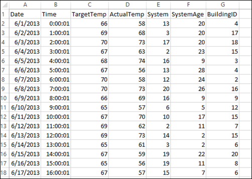

<!-- not suitable for Mooncake -->

<properties 
	pageTitle="在 HDInsight 上使用 Apache Spark 生成机器学习应用程序 | Azure" 
	description="逐步介绍如何使用 Apache Spark 随附的笔记本生成机器学习应用程序" 
	services="hdinsight" 
	documentationCenter="" 
	authors="nitinme" 
	manager="jhubbard" 
	editor="cgronlun"
	tags="azure-portal"/>

<tags 
	ms.service="hdinsight" 
	ms.workload="big-data" 
	ms.tgt_pltfrm="na" 
	ms.devlang="na" 
	ms.topic="article" 
	ms.date="09/14/2016" 
	wacn.date="02/06/2017" 
	ms.author="nitinme"/>

# 构建机器学习应用程序运行 HDInsight Linux 上的 Apache Spark 群集

了解如何使用 HDInsight 中的 Apache Spark 群集生成机器学习应用程序。本文介绍如何使用群集随附的 Jupyter 笔记本生成并测试应用程序。应用程序默认使用所有群集提供的 HVAC.csv 数据示例。

**先决条件：**

必须满足以下条件：

- Azure 订阅。请参阅[获取 Azure 试用版](/pricing/1rmb-trial/)。
- HDInsight Linux 上的 Apache Spark 群集。有关说明，请参阅 [Create Apache Spark clusters in Azure HDInsight](/documentation/articles/hdinsight-apache-spark-jupyter-spark-sql/)（在 Azure HDInsight 中创建 Apache Spark 群集）。

##讲解数据

开始生成应用程序前，应了解数据的结构和要对数据执行的分析类型。

在本文中，使用与 HDInsight 群集关联的 Azure 存储帐户中提供的 **HVAC.csv** 数据文件示例。在存储帐户中，该文件位于 **\\HdiSamples\\HdiSamples\\SensorSampleData\\hvac** 位置。下载并打开 CSV 文件，以获取数据的快照。

该数据显示安装 HVAC 系统的建筑物的目标温度和实际温度。假设“System”列表示系统 ID，“SystemAge”列表示建筑物安装 HVAC 系统的年数。

如果指定系统 ID 和系统年数，可以使用此数据预测建筑物的温度比目标温度高还是低。

##使用 Spark MLlib 编写机器学习应用程序

在此应用程序中，使用 Spark ML 管道执行文档分类。在管道中，将文档分割成单字，将单字转换成数字特征向量，并最后使用特征向量和标签创建预测模型。执行下列步骤创建应用程序。

1. 在 [Azure 门户](https://portal.azure.cn/)的启动板中，单击 Spark 群集磁贴（如果已将其固定到启动板）。也可以单击“全部浏览”>“HDInsight 群集”导航到群集。

2. 在 Spark 群集边栏选项卡中单击“快速链接”，然后在“群集仪表板”边栏选项卡中单击“Jupyter 笔记本”。出现提示时，请输入群集的管理员凭据。

	> [AZURE.NOTE] 也可以在浏览器中打开以下 URL 访问群集的 Jupyter 笔记本。将 __CLUSTERNAME__ 替换为群集的名称：
	>
	> `https://CLUSTERNAME.azurehdinsight.cn/jupyter`

2. 创建新笔记本。单击“新建”，然后单击“PySpark”。

	

3. 随即创建新笔记本，并以 Untitled.pynb 名称打开。单击顶部的笔记本名称，然后输入一个友好名称。

	

3. 由于笔记本是使用 PySpark 内核创建，因此不需要显式创建任何上下文。运行第一个代码单元格时，系统将自动创建 Spark 和 Hive 上下文。首先，可以导入此方案所需的类型。将以下代码段粘贴到空白单元格中，然后按 **SHIFT + ENTER**。

		from pyspark.ml import Pipeline
		from pyspark.ml.classification import LogisticRegression
		from pyspark.ml.feature import HashingTF, Tokenizer
		from pyspark.sql import Row
		
		import os
		import sys
		from pyspark.sql.types import *
		
		from pyspark.mllib.classification import LogisticRegressionWithSGD
		from pyspark.mllib.regression import LabeledPoint
		from numpy import array
		
		
	 
4. 现在，必须加载数据 (hvac.csv)，分析数据，然后用于训练模型。为此，需要定义检查建筑物实际温度是否高于目标温度的函数。如果实际温度较高，则表示建筑物处于高温状态，用值 **1.0** 表示。如果实际温度较低，则表示建筑物处于低温状态，用值 **0.0** 表示。

	将以下代码段粘贴到空白单元格中，然后按 **SHIFT + ENTER**。

		
		# List the structure of data for better understanding. Becuase the data will be
		# loaded as an array, this structure makes it easy to understand what each element
		# in the array corresponds to

		# 0 Date
		# 1 Time
		# 2 TargetTemp
		# 3 ActualTemp
		# 4 System
		# 5 SystemAge
		# 6 BuildingID

		LabeledDocument = Row("BuildingID", "SystemInfo", "label")

		# Define a function that parses the raw CSV file and returns an object of type LabeledDocument
		
		def parseDocument(line):
    		values = [str(x) for x in line.split(',')]
    		if (values[3] > values[2]):
        		hot = 1.0
    		else:
        		hot = 0.0        
    
    		textValue = str(values[4]) + " " + str(values[5])
    
    		return LabeledDocument((values[6]), textValue, hot)

		# Load the raw HVAC.csv file, parse it using the function
		data = sc.textFile("wasbs:///HdiSamples/HdiSamples/SensorSampleData/hvac/HVAC.csv")

		documents = data.filter(lambda s: "Date" not in s).map(parseDocument)
		training = documents.toDF()

5. 设置包括三个阶段的 Spark 机器学习管道：tokenizer、hashingTF 和 lr。有关管道简介及其工作原理的详细信息，请参阅 <a href="http://spark.apache.org/docs/latest/ml-guide.html#how-it-works" target="_blank">Spark 机器学习管道</a>。

	将以下代码段粘贴到空白单元格中，然后按 **SHIFT + ENTER**。

		tokenizer = Tokenizer(inputCol="SystemInfo", outputCol="words")
		hashingTF = HashingTF(inputCol=tokenizer.getOutputCol(), outputCol="features")
		lr = LogisticRegression(maxIter=10, regParam=0.01)
		pipeline = Pipeline(stages=[tokenizer, hashingTF, lr])

6. 将管道拟合到培训文档中。将以下代码段粘贴到空白单元格中，然后按 **SHIFT + ENTER**。

		model = pipeline.fit(training)

7. 验证训练文档以根据应用程序进度创建检查点。将以下代码段粘贴到空白单元格中，然后按 **SHIFT + ENTER**。

		training.show()

	输出应如下所示：

		+----------+----------+-----+
		|BuildingID|SystemInfo|label|
		+----------+----------+-----+
		|         4|     13 20|  0.0|
		|        17|      3 20|  0.0|
		|        18|     17 20|  1.0|
		|        15|      2 23|  0.0|
		|         3|      16 9|  1.0|
		|         4|     13 28|  0.0|
		|         2|     12 24|  0.0|
		|        16|     20 26|  1.0|
		|         9|      16 9|  1.0|
		|        12|       6 5|  0.0|
		|        15|     10 17|  1.0|
		|         7|      2 11|  0.0|
		|        15|      14 2|  1.0|
		|         6|       3 2|  0.0|
		|        20|     19 22|  0.0|
		|         8|     19 11|  0.0|
		|         6|      15 7|  0.0|
		|        13|      12 5|  0.0|
		|         4|      8 22|  0.0|
		|         7|      17 5|  0.0|
		+----------+----------+-----+

	返回并根据原始 CSV 文件验证输出。例如，CSV 文件中第一行包含此数据：

	

	请注意，实际温度比目标温度低表示建筑物处于低温状态。因此，在训练输出中，第一个行的 **label** 值为 **0.0**，表示建筑物并非处于高温状态。

8.  准备要对其运行训练模型的数据集。为此，将传递系统 ID 和系统年数（以训练输出中的 **SystemInfo** 表示），模型将预测该系统 ID 和系统年数表示建筑物的温度是较高（以 1.0 表示）还是较低（以 0.0 表示）。

	将以下代码段粘贴到空白单元格中，然后按 **SHIFT + ENTER**。
		
		# SystemInfo here is a combination of system ID followed by system age
		Document = Row("id", "SystemInfo")
		test = sc.parallelize([(1L, "20 25"),
                      (2L, "4 15"),
                      (3L, "16 9"),
                      (4L, "9 22"),
                      (5L, "17 10"),
                      (6L, "7 22")]) \
    		.map(lambda x: Document(*x)).toDF() 

9. 最后，对测试数据进行预测。将以下代码段粘贴到空白单元格中，然后按 **SHIFT + ENTER**。

		# Make predictions on test documents and print columns of interest
		prediction = model.transform(test)
		selected = prediction.select("SystemInfo", "prediction", "probability")
		for row in selected.collect():
		    print row

10. 输出应如下所示：

		Row(SystemInfo=u'20 25', prediction=1.0, probability=DenseVector([0.4999, 0.5001]))
		Row(SystemInfo=u'4 15', prediction=0.0, probability=DenseVector([0.5016, 0.4984]))
		Row(SystemInfo=u'16 9', prediction=1.0, probability=DenseVector([0.4785, 0.5215]))
		Row(SystemInfo=u'9 22', prediction=1.0, probability=DenseVector([0.4549, 0.5451]))
		Row(SystemInfo=u'17 10', prediction=1.0, probability=DenseVector([0.4925, 0.5075]))
		Row(SystemInfo=u'7 22', prediction=0.0, probability=DenseVector([0.5015, 0.4985]))

	从预测的第一行，对于 ID 为 20 且系统年数为 25 的 HVAC 系统，建筑物处于高温状态 (**prediction=1.0**)。DenseVector (0.49999) 的第一个值对应预测 0.0，第二个值 (0.5001) 对应预测 1.0。在输出中，即使第二个值仅稍微偏高，模型仍显示 **prediction=1.0**。

11. 完成运行应用程序后，应关闭笔记本以释放资源。为此，在笔记本的“文件”菜单中，单击“关闭并停止”。这将会关闭笔记本。
	  	   

##使用机器学习 Anaconda scikit-learn 库

HDInsight 上的 Apache Spark 群集包含 Anaconda 库，还包括适用于机器学习的 **scikit-learn** 库。该库还包含用于直接从 Jupyter 笔记本生成应用程序示例的各种数据集。有关使用 scikit-learn 库的示例，请参阅 [http://scikit-learn.org/stable/auto\_examples/index.html](http://scikit-learn.org/stable/auto_examples/index.html)。

##另请参阅

* [概述：Azure HDInsight 上的 Apache Spark](/documentation/articles/hdinsight-apache-spark-overview/)

### 方案

* [Spark 和 BI：使用 HDInsight 中的 Spark 和 BI 工具执行交互式数据分析](/documentation/articles/hdinsight-apache-spark-use-bi-tools/)

* [Spark 流式处理：使用 HDInsight 中的 Spark 生成实时流式处理应用程序](/documentation/articles/hdinsight-apache-spark-eventhub-streaming/)

### 创建和运行应用程序

* [使用 Livy 在 Spark 群集中远程运行作业](/documentation/articles/hdinsight-apache-spark-livy-rest-interface/)

### 工具和扩展

* [使用适用于 IntelliJ IDEA 的 HDInsight 工具插件创建和提交 Spark Scala 应用程序](/documentation/articles/hdinsight-apache-spark-intellij-tool-plugin/)

* [Use HDInsight Tools Plugin for IntelliJ IDEA to debug Spark applications remotely（使用 IntelliJ IDEA 的 HDInsight 工具插件远程调试 Spark 应用程序）](/documentation/articles/hdinsight-apache-spark-intellij-tool-plugin-debug-jobs-remotely/)

* [在 HDInsight 上的 Spark 群集中使用 Zeppelin 笔记本](/documentation/articles/hdinsight-apache-spark-use-zeppelin-notebook/)

* [可用于 HDInsight 的 Spark 群集中 Jupyter 笔记本的内核](/documentation/articles/hdinsight-apache-spark-jupyter-notebook-kernels/)

* [Use external packages with Jupyter notebooks（将外部包与 Jupyter 笔记本配合使用）](/documentation/articles/hdinsight-apache-spark-jupyter-notebook-use-external-packages/)

* [Install Jupyter on your computer and connect to an HDInsight Spark cluster（在计算机上安装 Jupyter 并连接到 HDInsight Spark 群集）](/documentation/articles/hdinsight-apache-spark-jupyter-notebook-install-locally/)

### 管理资源

* [管理 Azure HDInsight 中 Apache Spark 群集的资源](/documentation/articles/hdinsight-apache-spark-resource-manager/)

* [Track and debug jobs running on an Apache Spark cluster in HDInsight（跟踪和调试 HDInsight 中 Apache Spark 群集上运行的作业）](/documentation/articles/hdinsight-apache-spark-job-debugging/)

[hdinsight-versions]: /documentation/articles/hdinsight-component-versioning-v1/
[hdinsight-upload-data]: /documentation/articles/hdinsight-upload-data/
[hdinsight-storage]: /documentation/articles/hdinsight-hadoop-use-blob-storage/

[hdinsight-weblogs-sample]: /documentation/articles/hdinsight-hive-analyze-website-log/
[hdinsight-sensor-data-sample]: /documentation/articles/hdinsight-hive-analyze-sensor-data/

[azure-purchase-options]: /pricing/overview/
[azure-member-offers]: /pricing/member-offers/
[azure-trial]: /pricing/1rmb-trial/
[azure-management-portal]: https://manage.windowsazure.cn/
[azure-create-storageaccount]: /documentation/articles/storage-create-storage-account/

<!---HONumber=Mooncake_Quality_Review_1202_2016-->