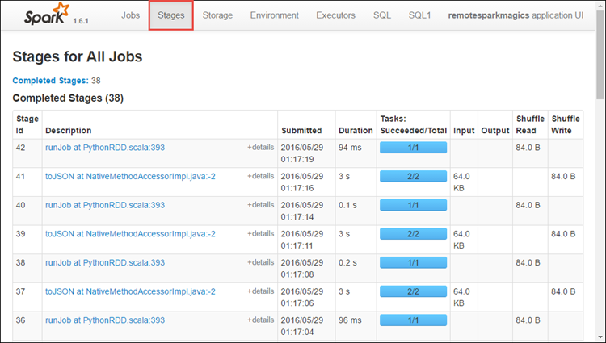
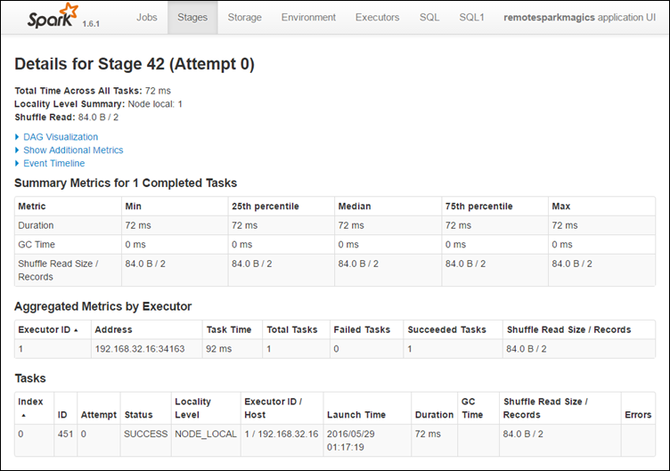
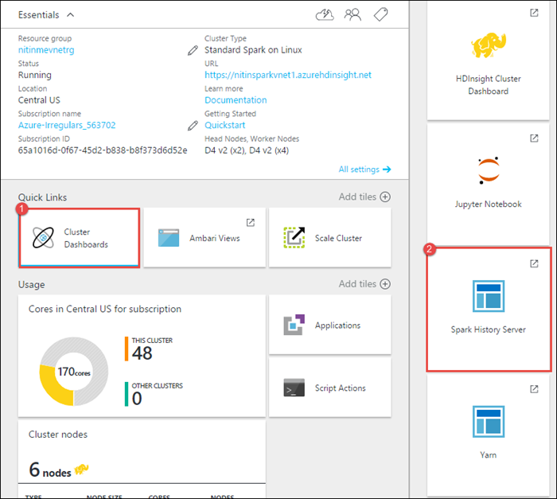

<!-- not suitable for Mooncake -->

<properties 
	pageTitle="跟踪和调试 HDInsight 中的 Apache Spark 群集上运行的作业 | Azure" 
	description="使用 YARN UI、Spark UI 和 Spark History Server 来跟踪和调试 Azure HDInsight 中的 Spark 群集上运行的作业" 
	services="hdinsight" 
	documentationCenter="" 
	authors="nitinme" 
	manager="paulettm" 
	editor="cgronlun"
	tags="azure-portal"/>

<tags
	ms.service="hdinsight"
	ms.date="08/25/2016"
	wacn.date="02/14/2017"/>

# 跟踪和调试 HDInsight Linux 中的 Apache Spark 群集上运行的作业

在本文中，你将了解如何使用 YARN UI、Spark UI 和 Spark History Server 来跟踪和调试 Spark 作业。在此过程中，我们将使用 Spark 群集中提供的笔记本启动 Spark 作业，相关信息请参阅 **Machine learning: Predictive analysis on food inspection data using MLLib**（机器学习：使用 MLLib 对食物检测数据进行预测分析）。你也可以执行以下步骤来跟踪使用任何其他方法（例如 **spark-submit**）提交的应用程序。

##先决条件

必须满足以下条件：

- Azure 订阅。请参阅[获取 Azure 试用版](/pricing/1rmb-trial/)。
- HDInsight Linux 上的 Apache Spark 群集。有关说明，请参阅 [Create Apache Spark clusters in Azure HDInsight](/documentation/articles/hdinsight-apache-spark-jupyter-spark-sql/)（在 Azure HDInsight 中创建 Apache Spark 群集）。
- 应已开始运行笔记本，相关信息请参阅 **[Machine learning: Predictive analysis on food inspection data using MLLib](/documentation/articles/hdinsight-apache-spark-machine-learning-mllib-ipython)**（机器学习：使用 MLLib 对食品检测数据进行预测分析））。有关如何运行此笔记本的说明，请单击以下链接。

## 在 YARN UI 中跟踪应用程序

1. 启动 YARN UI。在群集边栏选项卡中，单击“群集仪表板”，然后单击“YARN”。

	

	>[AZURE.TIP] 或者，也可以从 Ambari UI 启动 YARN UI。若要启动 Ambari UI，请在群集边栏选项卡中单击“群集仪表板”，然后单击“HDInsight 群集仪表板”。在 Ambari UI 中依次单击“YARN”、“快速链接”、活动的 Resource Manager、“ResourceManager UI”。

3. 由于 Spark 作业是使用 Jupyter 笔记本启动的，因此应用程序的名称为 **remotesparkmagics**（这是从笔记本启动的所有应用程序的名称）。单击应用程序名称旁边的应用程序 ID，以获取有关该作业的详细信息。此时将启动应用程序视图。

	

	对于从 Jupyter 笔记本启动的应用程序，在退出笔记本之前，其状态始终是“正在运行”。

4. 从应用程序视图中，可以进一步深入以找到与应用程序和日志 (stdout/stderr) 关联的容器。也可以通过单击“跟踪 URL”对应的链接来启动 Spark UI，如下所示。

	

## 在 Spark UI 中跟踪应用程序

在 Spark UI 中，可以深入到前面启动的应用程序所产生的 Spark 作业。

1. 若要启动 Spark UI，请在应用程序视图中，单击“跟踪 URL”旁边的链接，如上面的屏幕截图中所示。可以看到，应用程序启动的所有 Spark 作业正在 Jupyter 笔记本中运行。

	

2. 单击“执行器”选项卡以查看每个执行器的处理和存储信息。还可以通过单击“线程转储”链接来检索调用堆栈。

	
 
3. 单击“阶段”选项卡以查看与应用程序关联的阶段。

	

	每个阶段可能有多个任务，你可以查看这些任务的执行统计信息，如下所示。

	

4. 在阶段详细信息页上，可以启动 DAG 可视化。展开页面顶部的“DAG 可视化”链接，如下所示。

	

	DAG (Direct Aclyic Graph) 呈现了应用程序中的不同阶段。图形中的每个蓝框表示从应用程序调用的 Spark 操作。

5. 在阶段详细信息页上，还可以启动应用程序时间线视图。展开页面顶部的“事件时间线”链接，如下所示。

	

	此时将以时间线形式显示 Spark 事件。时间线视图提供三个级别：跨作业、作业内和阶段内。上图中捕获了指定阶段的时间线视图。

	>[AZURE.TIP] 如果选中“启用缩放”复选框，可以在时间线视图中左右滚动。

6. Spark UI 中的其他选项卡也提供了有关 Spark 实例的有用信息。

	* “存储”选项卡 - 如果应用程序创建了 RDD，你可以在“存储”选项卡中找到相关信息。
	* “环境”选项卡 - 此选项卡提供有关 Spark 实例的有用信息，例如
		* Scala 版本
		* 与群集关联的事件日志目录
		* 应用程序的执行器核心数
		* 等等

## 使用 Spark History Server 查找有关已完成的作业的信息

完成某个作业后，有关该作业的信息将保存在 Spark History Server 中。

1. 若要启动 Spark History Server，请在群集边栏选项卡中单击“群集仪表板”，然后单击“Spark History Server”。

	

	>[AZURE.TIP] 或者，也可以从 Ambari UI 启动 Spark History Server UI。若要启动 Ambari UI，请在群集边栏选项卡中单击“群集仪表板”，然后单击“HDInsight 群集仪表板”。在 Ambari UI 中，依次单击“Spark”、“快速链接”和“Spark History Server UI”。

2. 随后会看到已列出所有已完成的应用程序。单击应用程序 ID 可深入到该应用程序以获取更多信息。

	
	

## 另请参阅

* [概述：Azure HDInsight 上的 Apache Spark](/documentation/articles/hdinsight-apache-spark-overview/)

### 方案

* [Spark 和 BI：使用 HDInsight 中的 Spark 和 BI 工具执行交互式数据分析](/documentation/articles/hdinsight-apache-spark-use-bi-tools/)

* [Spark 和机器学习：使用 HDInsight 中的 Spark 对使用 HVAC 数据生成温度进行分析](/documentation/articles/hdinsight-apache-spark-ipython-notebook-machine-learning/)

* [Spark 和机器学习：使用 HDInsight 中的 Spark 预测食品检查结果](/documentation/articles/hdinsight-apache-spark-machine-learning-mllib-ipython/)

* [Spark 流式处理：使用 HDInsight 中的 Spark 生成实时流式处理应用程序](/documentation/articles/hdinsight-apache-spark-eventhub-streaming/)

* [使用 HDInsight 中的 Spark 分析网站日志](/documentation/articles/hdinsight-apache-spark-custom-library-website-log-analysis/)

### 创建和运行应用程序

* [使用 Scala 创建独立的应用程序](/documentation/articles/hdinsight-apache-spark-create-standalone-application/)

* [使用 Livy 在 Spark 群集中远程运行作业](/documentation/articles/hdinsight-apache-spark-livy-rest-interface/)

### 工具和扩展

* [在 HDInsight 上的 Spark 群集中使用 Zeppelin 笔记本](/documentation/articles/hdinsight-apache-spark-use-zeppelin-notebook/)

* [在 HDInsight 的 Spark 群集中可用于 Jupyter 笔记本的内核](/documentation/articles/hdinsight-apache-spark-jupyter-notebook-kernels/)

* [Use external packages with Jupyter notebooks](/documentation/articles/hdinsight-apache-spark-jupyter-notebook-use-external-packages/)（将外部包与 Jupyter 笔记本配合使用）

* [Install Jupyter on your computer and connect to an HDInsight Spark cluster](/documentation/articles/hdinsight-apache-spark-jupyter-notebook-install-locally/)（在计算机上安装 Jupyter 并连接到 HDInsight Spark 群集）

### 管理资源

* [管理 Azure HDInsight 中 Apache Spark 群集的资源](/documentation/articles/hdinsight-apache-spark-resource-manager/)

<!---HONumber=Mooncake_0711_2016-->