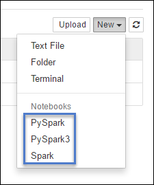

<properties
    pageTitle="在 Azure HDInsight Spark 群集上将不同内核与 Jupyter Notebook 配合使用 | Azure"
    description="了解 PySpark、PySpark3 和 Spark 内核，这三种内核可与 HDInsight Linux 上 Spark 群集随附的 Jupyter Notebook 配合使用。"
    services="hdinsight"
    documentationcenter=""
    author="nitinme"
    manager="jhubbard"
    editor="cgronlun"
    tags="azure-portal" />
<tags
    ms.assetid="0719e503-ee6d-41ac-b37e-3d77db8b121b"
    ms.service="hdinsight"
    ms.workload="big-data"
    ms.tgt_pltfrm="na"
    ms.devlang="na"
    ms.topic="article"
    ms.date="03/14/2017"
    wacn.date="03/31/2017"
    ms.author="nitinme" />  

# HDInsight 中的 Jupyter 笔记本内核与 Apache Spark 群集 

HDInsight Spark 群集提供了可在 Jupyter Notebook 中使用的内核，以便测试 Spark 应用程序。内核是可以运行和解释代码的程序。这两个内核是：

- **PySpark** - 适用于以 Python2 编写的应用程序
- **PySpark3** - 适用于以 Python3 编写的应用程序
- **Spark** - 适用于以 Scala 编写的应用程序

本文介绍如何使用这些内核以及使用它们的优势。

## 先决条件

* HDInsight 中的 Apache Spark 群集。有关说明，请参阅 [Create Apache Spark clusters in Azure HDInsight](/documentation/articles/hdinsight-apache-spark-jupyter-spark-sql/)（在 Azure HDInsight 中创建 Apache Spark 群集）。

## 创建 Jupyter 笔记本

1. 从 [Azure 门户预览](https://portal.azure.cn/)打开群集。请参阅[列出并显示群集](/documentation/articles/hdinsight-administer-use-portal-linux/#list-and-show-clusters)了解相关说明。群集将在新的门户边栏选项卡中打开。

2. 在“快速链接”部分中，单击“群集仪表板”，打开“群集仪表板”边栏选项卡。如果没有看到“快速链接”，请在边栏选项卡的左侧菜单中单击“概述”。

      

3. 单击“Jupyter 笔记本”。出现提示时，请输入群集的管理员凭据。
   
    > [AZURE.NOTE]
    也可以在浏览器中打开以下 URL 访问群集的 Jupyter 笔记本。将 **CLUSTERNAME** 替换为群集的名称：
    >

    > `https://CLUSTERNAME.azurehdinsight.cn/jupyter`  

    > 
    > 

3. 单击“新建”，然后单击“Pyspark”、“PySpark3”或“Spark”创建 Notebook。使用适用于 Scala 应用程序的 Spark 内核、适用于 Python2 应用程序的 PySpark 内核，以及适用于 Python3 应用程序的 PySpark3 内核。
   
      

4. 此时会打开使用所选内核的 Notebook。

##  使用这些内核的好处

下面是使用新内核的几项好处。

- **预设上下文**。使用 **PySpark**、**PySpark3** 或 **Spark** 内核，不需要先显式设置 Spark 或 Hive 上下文，即可开始使用应用程序。这些上下文默认可供使用。这些上下文包括：
   
    * **sc** - 表示 Spark 上下文
    * **sqlContext** - 表示 Hive 上下文

    因此，不需要运行如下语句来设置上下文：

        sc = SparkContext('yarn-client')
        sqlContext = HiveContext(sc)

    可以直接在应用程序中使用预设上下文。

- **单元 magic**。PySpark 内核提供一些预定义的“magic”，这是可以结合 `%%` 调用的特殊命令（例如 `%%MAGIC` <args>）。magic 命令必须是代码单元中的第一个字，并且允许多行内容。magic 一字应该是单元中的第一个字。在 magic 前面添加任何内容（即使是注释）都会导致错误。有关 magic 的详细信息，请参阅[此文](http://ipython.readthedocs.org/en/stable/interactive/magics.html)。
   
    下表列出了可通过内核提供的不同 magic。

    | Magic | 示例 | 说明 |
    | --- | --- | --- |
    | help |`%%help` |生成所有可用 magic 的表，其中包含示例和说明 |
    | info |`%%info` |输出当前 Livy 终结点的会话信息 |
    | 配置 |`%%configure -f` `{"executorMemory": "1000M"`, `"executorCores": 4`} |配置用于创建会话的参数。如果已创建会话，则 force 标志 (-f) 是必需的，可确保删除并重新创建该会话。有关有效参数的列表，请查看 [Livy's POST /sessions Request Body](https://github.com/cloudera/livy#request-body)（Livy 的 POST /sessions 请求正文）。参数必须以 JSON 字符串传入，并且必须位于 magic 后面的下一行，如示例列中所示。 |
    | sql |`%%sql -o <variable name>`  `SHOW TABLES` |针对 sqlContext 执行 Hive 查询。如果传递了 `-o` 参数，则查询的结果将以 [Pandas](http://pandas.pydata.org/) 数据帧的形式保存在 %%local Python 上下文中。 |
    | local |`%%local` `a=1` |后续行中的所有代码将在本地执行。代码必须是有效的 Python2 代码，即使不考虑所使用的内核。因此，即使在创建 Notebook 时选择了 **PySpark3** 或 **Spark** 内核，如果在单元中使用 `%%local` magic，则该单元只能包含有效的 Python2 代码。 |
    | 日志 |`%%logs` |输出当前 Livy 会话的日志。 |
    | 删除 |`%%delete -f -s <session number>` |删除当前 Livy 终结点的特定会话。请注意，无法删除针对内核本身启动的会话。 |
    | cleanup |`%%cleanup -f` |删除当前 Livy 终结点的所有会话，包括此笔记本的会话。force 标志 -f 是必需的。 |

    > [AZURE.NOTE]
    除了 PySpark 内核添加的 magic 以外，还可以使用[内置的 IPython magic](https://ipython.org/ipython-doc/3/interactive/magics.html#cell-magics)（包括 `%%sh`）。可以使用 `%%sh` magic 在群集头节点上运行脚本和代码块。
    >
    >
2. **自动可视化**。**Pyspark** 内核自动将 Hive 和 SQL 查询的输出可视化。可以选择多种不同类型的视觉效果，包括表、饼图、折线图、分区图和条形图。

##  %%sql magic 支持的参数
`%%sql` magic 支持不同的参数，可以使用这些参数控制运行查询时收到的输出类型。下表列出了输出。

| 参数 | 示例 | 说明 |
| --- | --- | --- |
| -o |`-o <VARIABLE NAME>` |使用此参数将查询结果以 [Pandas](http://pandas.pydata.org/) 数据帧的形式保存在 %%local Python 上下文中。数据帧变量的名称是指定的变量名称。 |
| -q |`-q` |使用此参数可关闭单元可视化。如果不想自动将单元内容可视化，而只想将它作为数据帧捕获，可以使用 `-q -o <VARIABLE>`。如果想要关闭可视化而不捕获结果（例如，运行诸如 `CREATE TABLE` 语句的 SQL 查询），请使用不带 `-o` 参数的 `-q`。 |
| -m |`-m <METHOD>` |其中，**METHOD** 是 **take** 或 **sample**（默认为 **take**）。如果方法为 **take**，内核将从 MAXROWS 指定的结果数据集顶部选择元素（如此表中稍后所述）。如果方法为 **sample**，内核将根据 `-r` 参数针对数据集的元素随机采样，如此表中稍后所述。 |
| -r |`-r <FRACTION>` |此处的 **FRACTION** 是介于 0.0 与 1.0 之间的浮点数。如果 SQL 查询的示例方法为 `sample`，则内核会随机地对结果集的指定部分元素取样。例如，如果使用参数 `-m sample -r 0.01` 运行 SQL 查询，则 1% 的结果行是随机取样的。 |
| -n |`-n <MAXROWS>` |**MAXROWS** 是整数值。内核将输出行的数目限制为 **MAXROWS**。如果 **MAXROWS** 是负数（例如 **-1**），结果集中的行数将不受限制。 |

**示例：**

    %%sql -q -m sample -r 0.1 -n 500 -o query2
    SELECT * FROM hivesampletable

上述语句执行以下操作：

* 从 **hivesampletable** 中选择所有记录。
* 由于使用了 -q，因此将关闭自动可视化。
* 由于使用了 `-m sample -r 0.1 -n 500`，因此将从 hivesampletable 的行中随机采样 10%，并将结果集的大小限制为 500 行。
* 最后，由于使用了 `-o query2`，因此将输出保存到名为 **query2** 的数据帧中。

## 使用新内核时的注意事项

无论使用哪种内核，使 Notebook 一直保持运行都会消耗群集资源。使用这些内核时，由于上下文是预设的，单单退出 Notebook 并不会终止上下文，因此会继续占用群集资源。使用完 Notebook 以后，最好是使用 Notebook 的“文件”菜单中的“关闭并停止”选项来终止上下文并退出 Notebook。

## 举例说明

打开 Jupyter Notebook 时，可以在根级别看到两个文件夹。

* **PySpark** 文件夹包含使用新 **Python** 内核的示例笔记本。
* **Scala** 文件夹包含使用新 **Spark** 内核的示例笔记本。

可以从 **PySpark** 或 **Spark** 文件夹打开 **00 - [READ ME FIRST] Spark Magic Kernel Features** 笔记本，了解各种可用的 magic。也可以使用这两个文件夹下面提供的其他笔记本示例，了解如何在 HDInsight Spark 群集上实现不同的 Jupyter 笔记本使用方案。

## 笔记本存储在何处？

Jupyter 笔记本保存在与 **/HdiNotebooks** 文件夹下面的群集关联的存储帐户中。可以从存储帐户访问在 Jupyter 内部创建的 Notebook、文本文件和文件夹。例如，如果使用 Jupyter 创建文件夹 **myfolder** 和 Notebook **myfolder/mynotebook.ipynb**，可以通过存储帐户中的 `/HdiNotebooks/myfolder/mynotebook.ipynb` 访问该 Notebook。反之亦然，如果直接将 Notebook 上载到 `/HdiNotebooks/mynotebook1.ipynb` 中的存储帐户，则可以从 Jupyter 查看该 Notebook。即使删除了群集，Notebook 也仍会保留在存储帐户中。

将笔记本保存到存储帐户的方式与 HDFS 兼容。因此，如果通过 SSH 访问群集，可以使用如以下代码片段所示的文件管理命令：

    hdfs dfs -ls /HdiNotebooks                               # List everything at the root directory - everything in this directory is visible to Jupyter from the home page
    hdfs dfs -copyToLocal /HdiNotebooks                    # Download the contents of the HdiNotebooks folder
    hdfs dfs -copyFromLocal example.ipynb /HdiNotebooks   # Upload a notebook example.ipynb to the root folder so it's visible from Jupyter

笔记本还会保存到头节点 `/var/lib/jupyter`，以防止访问群集的存储帐户时出现问题。

## 支持的浏览器

Google Chrome 仅支持针对 HDInsight Spark 群集运行的 Jupyter 笔记本。

## 反馈
新内核正处于发展阶段，一段时间后将变得成熟。这可能也意味着，API 可随着这些内核的成熟而改变。如果在使用这些新内核时有任何反馈，我们将不胜感激。这对于内核最终版本的定调会很有帮助。可以在本文末尾的“意见”部分下面填写意见/反馈。

## 另请参阅
* [概述：Azure HDInsight 上的 Apache Spark](/documentation/articles/hdinsight-apache-spark-overview/)

### 方案
* [Spark 和 BI：使用 HDInsight 中的 Spark 和 BI 工具执行交互式数据分析](/documentation/articles/hdinsight-apache-spark-use-bi-tools/)
* [Spark 和机器学习：使用 HDInsight 中的 Spark 对使用 HVAC 数据生成温度进行分析](/documentation/articles/hdinsight-apache-spark-ipython-notebook-machine-learning/)
* [Spark 和机器学习：使用 HDInsight 中的 Spark 预测食品检查结果](/documentation/articles/hdinsight-apache-spark-machine-learning-mllib-ipython/)
* [Spark 流式处理：使用 HDInsight 中的 Spark 生成实时流式处理应用程序](/documentation/articles/hdinsight-apache-spark-eventhub-streaming/)
* [使用 HDInsight 中的 Spark 分析网站日志](/documentation/articles/hdinsight-apache-spark-custom-library-website-log-analysis/)

### 创建和运行应用程序
* [使用 Scala 创建独立的应用程序](/documentation/articles/hdinsight-apache-spark-create-standalone-application/)
* [使用 Livy 在 Spark 群集中远程运行作业](/documentation/articles/hdinsight-apache-spark-livy-rest-interface/)

### 工具和扩展
* [在 HDInsight 上的 Spark 群集中使用 Zeppelin 笔记本](/documentation/articles/hdinsight-apache-spark-use-zeppelin-notebook/)
* [Use external packages with Jupyter notebooks（将外部包与 Jupyter 笔记本配合使用）](/documentation/articles/hdinsight-apache-spark-jupyter-notebook-use-external-packages/)
* [Install Jupyter on your computer and connect to an HDInsight Spark cluster（在计算机上安装 Jupyter 并连接到 HDInsight Spark 群集）](/documentation/articles/hdinsight-apache-spark-jupyter-notebook-install-locally/)

### 管理资源
* [管理 Azure HDInsight 中 Apache Spark 群集的资源](/documentation/articles/hdinsight-apache-spark-resource-manager/)
* [跟踪和调试 HDInsight 中的 Apache Spark 群集上运行的作业](/documentation/articles/hdinsight-apache-spark-job-debugging/)

<!---HONumber=Mooncake_0327_2017-->
<!--Update_Description: add PySpark3-->