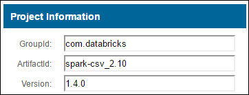

<properties
    pageTitle="在 HDInsight 上的 Apache Spark 群集中将外部包与 Jupyter 笔记本配合使用 | Azure"
    description="逐步说明如何配置可在 HDInsight Spark 群集中使用的 Jupyter 笔记本，以使用外部 Spark 包。"
    services="hdinsight"
    documentationcenter=""
    author="nitinme"
    manager="jhubbard"
    editor="cgronlun"
    tags="azure-portal" />
<tags 
    ms.assetid="2a8bc545-064e-436f-8b5f-e67c26cfbf98"
    ms.service="hdinsight"
    ms.workload="big-data"
    ms.tgt_pltfrm="na"
    ms.devlang="na"
    ms.topic="article"
    ms.date="10/31/2016"
    wacn.date="02/06/2017"
    ms.author="nitinme" />

# 在 HDInsight Linux 上的 Apache Spark 群集中将外部包与 Jupyter 笔记本配合使用

了解如何在 HDInsight (Linux) 上的 Apache Spark 群集中配置 Jupyter 笔记本，以使用未现成包含在群集中的、由社区贡献的外部 **maven** 包。

可以在 [Maven 存储库](http://search.maven.org/)中搜索可用包的完整列表。也可以从其他源获取可用包的列表。例如，[Spark 包](http://spark-packages.org/)中提供了社区贡献包的完整列表。

本文介绍如何将 [spark-csv](http://search.maven.org/#artifactdetails%7Ccom.databricks%7Cspark-csv_2.10%7C1.4.0%7Cjar) 包与 Jupyter 笔记本配合使用。

## 先决条件
必须满足以下条件：

* Azure 订阅。请参阅[获取 Azure 试用版](/pricing/1rmb-trial/)。
* HDInsight Linux 上的 Apache Spark 群集。有关说明，请参阅 [Create Apache Spark clusters in Azure HDInsight](/documentation/articles/hdinsight-apache-spark-jupyter-spark-sql/)（在 Azure HDInsight 中创建 Apache Spark 群集）。

## 将外部包与 Jupyter 笔记本配合使用
1. 在 [Azure 门户预览](https://portal.azure.cn/)上的启动板中，单击 Spark 群集的磁贴（如果已将它固定到启动板）。也可以在“全部浏览”>“HDInsight 群集”下导航到你的群集。
2. 在 Spark 群集边栏选项卡中单击“快速链接”，然后在“群集仪表板”边栏选项卡中单击“Jupyter 笔记本”。出现提示时，请输入群集的管理员凭据。

   
    > [AZURE.NOTE]
    也可以在浏览器中打开以下 URL 来访问群集的 Jupyter 笔记本。将 **CLUSTERNAME** 替换为群集的名称：
    > 

    > `https://CLUSTERNAME.azurehdinsight.cn/jupyter`
    > 

3. 创建新笔记本。单击“新建”，然后单击“Spark”。
   
    

4. 新笔记本随即已创建，并以 Untitled.pynb 名称打开。在顶部单击笔记本名称，然后输入一个友好名称。
   
    

5. 使用 `%%configure` magic 将笔记本配置为使用外部包。在使用外部包的笔记本中，确保在第一个代码单元中调用 `%%configure` magic。这可以确保将内核配置为在启动会话之前使用该包。

	>[AZURE.IMPORTANT] 
	如果忘记了在第一个单元中配置内核，可以结合 `-f` 参数使用 `%%configure`，但这会重新启动会话，导致所有进度都会丢失。

    [AZURE.INCLUDE [hdinsight-linux-acn-version.md](../../includes/hdinsight-linux-acn-version.md)]

	| HDInsight 版本 | 命令 |
	|-------------------|---------|
	|对于 HDInsight 3.3 和 HDInsight 3.4 | `%%configure`  `{ "packages":["com.databricks:spark-csv_2.10:1.4.0"] }`|
	| 对于 HDInsight 3.5 | `%%configure` `{ "conf": {"spark.jars.packages": "com.databricks:spark-csv_2.10:1.4.0" }}`|

6. 上述代码片段需要 Maven 中心存储库中用于外部包的 maven 坐标。在此代码片段中，`com.databricks:spark-csv_2.10:1.4.0` 是 **spark-csv** 包的 maven 坐标。下面说明了如何构造包的坐标。
   
    a.在 Maven 存储库中找出该包。在本教程中，我们使用 [spark-csv](http://search.maven.org/#artifactdetails%7Ccom.databricks%7Cspark-csv_2.10%7C1.4.0%7Cjar)。
   
    b.从存储库中收集 **GroupId**、**ArtifactId** 和 **Version** 的值。
   
      

   
    c.串连这三个值并以冒号分隔 (**:**)。
   
        com.databricks:spark-csv_2.10:1.4.0

7. 结合 `%%configure` magic 运行代码单元。这会将基础 Livy 会话配置为使用你提供的包。现在，可以在笔记本的后续单元中使用该包，如下所示。
   
        val df = sqlContext.read.format("com.databricks.spark.csv").
        option("header", "true").
        option("inferSchema", "true").
        load("wasbs:///HdiSamples/HdiSamples/SensorSampleData/hvac/HVAC.csv")

8. 然后，可以运行代码片段（如下所示）以查看上一步骤创建的数据帧中的数据。
   
        df.show()
   
        df.select("Time").count()

## 另请参阅
* [概述：Azure HDInsight 上的 Apache Spark](/documentation/articles/hdinsight-apache-spark-overview/)

### 方案
* [Spark 和 BI：使用 HDInsight 中的 Spark 和 BI 工具执行交互式数据分析](/documentation/articles/hdinsight-apache-spark-use-bi-tools/)
* [Spark 和机器学习：使用 HDInsight 中的 Spark 对使用 HVAC 数据生成温度进行分析](/documentation/articles/hdinsight-apache-spark-ipython-notebook-machine-learning/)
* [Spark 流式处理：使用 HDInsight 中的 Spark 生成实时流式处理应用程序](/documentation/articles/hdinsight-apache-spark-eventhub-streaming/)

### 创建和运行应用程序
* [使用 Livy 在 Spark 群集中远程运行作业](/documentation/articles/hdinsight-apache-spark-livy-rest-interface/)

### 工具和扩展

* [在 HDInsight Linux 上的 Apache Spark 群集中将外部 python 包与 Jupyter 笔记本配合使用](/documentation/articles/hdinsight-apache-spark-python-package-installation/)
* [在 HDInsight 上的 Spark 群集中使用 Zeppelin 笔记本](/documentation/articles/hdinsight-apache-spark-use-zeppelin-notebook/)
* [在 HDInsight 的 Spark 群集中可用于 Jupyter 笔记本的内核](/documentation/articles/hdinsight-apache-spark-jupyter-notebook-kernels/)
* [Install Jupyter on your computer and connect to an HDInsight Spark cluster（在计算机上安装 Jupyter 并连接到 HDInsight Spark 群集）](/documentation/articles/hdinsight-apache-spark-jupyter-notebook-install-locally/)

### 管理资源
* [管理 Azure HDInsight 中 Apache Spark 群集的资源](/documentation/articles/hdinsight-apache-spark-resource-manager/)
* [Track and debug jobs running on an Apache Spark cluster in HDInsight（跟踪和调试 HDInsight 中的 Apache Spark 群集上运行的作业）](/documentation/articles/hdinsight-apache-spark-job-debugging/)

<!---HONumber=Mooncake_0103_2017-->