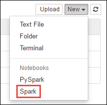

<properties
    pageTitle="在 Azure 上的 Spark 中将 Maven 包与 Jupyter 笔记本配合使用 | Azure"
    description="逐步说明如何配置可在 HDInsight Spark 群集中使用的 Jupyter 笔记本，以使用外部 Spark 包。"
    services="hdinsight"
    documentationcenter=""
    author="nitinme"
    manager="jhubbard"
    editor="cgronlun"
    tags="azure-portal"
    translationtype="Human Translation" />
<tags
    ms.assetid="2a8bc545-064e-436f-8b5f-e67c26cfbf98"
    ms.service="hdinsight"
    ms.custom="hdinsightactive"
    ms.workload="big-data"
    ms.tgt_pltfrm="na"
    ms.devlang="na"
    ms.topic="article"
    ms.date="02/06/2017"
    wacn.date="05/08/2017"
    ms.author="nitinme"
    ms.sourcegitcommit="2c4ee90387d280f15b2f2ed656f7d4862ad80901"
    ms.openlocfilehash="a9933968419472688bd0f6e0d8d1f80d8fbbd595"
    ms.lasthandoff="04/28/2017" />

# 在 HDInsight 上的 Apache Spark 群集中将外部包与 Jupyter 笔记本配合使用
> [AZURE.SELECTOR]
- [使用单元格 magic](/documentation/articles/hdinsight-apache-spark-jupyter-notebook-use-external-packages/)
- [使用脚本操作](/documentation/articles/hdinsight-apache-spark-python-package-installation/)

了解如何在 HDInsight 上的 Apache Spark 群集中配置 Jupyter 笔记本，以使用未现成包含在群集中的、由社区贡献的外部 **maven** 包。 

可以在 [Maven 存储库](http://search.maven.org/) 中搜索可用包的完整列表。 也可以从其他源获取可用包的列表。 例如， [Spark 包](http://spark-packages.org/)中提供了社区贡献包的完整列表。

本文介绍如何将 [spark-csv](http://search.maven.org/#artifactdetails%7Ccom.databricks%7Cspark-csv_2.10%7C1.4.0%7Cjar) 包与 Jupyter 笔记本配合使用。

## 先决条件
必须满足以下条件：

* Azure 订阅。 请参阅[获取 Azure 试用版](/pricing/1rmb-trial/)。
* HDInsight 上的 Apache Spark 群集。 有关说明，请参阅[在 Azure HDInsight 中创建 Apache Spark 群集](/documentation/articles/hdinsight-apache-spark-jupyter-spark-sql/)。

## 将外部包与 Jupyter 笔记本配合使用
1. 在 [Azure 门户](https://portal.azure.cn/)上的启动板中，单击 Spark 群集的磁贴（如果已将它固定到启动板）。 也可以单击“全部浏览” > “HDInsight 群集”导航到群集。   
2. 在 Spark 群集边栏选项卡中单击“快速链接”，然后在“群集仪表板”边栏选项卡中单击“Jupyter 笔记本”。 出现提示时，请输入群集的管理员凭据。

    > [AZURE.NOTE]
    > 也可以在浏览器中打开以下 URL 访问群集的 Jupyter 笔记本。 将 **CLUSTERNAME** 替换为群集的名称：
    > 
 
    > `https://CLUSTERNAME.azurehdinsight.cn/jupyter` 

3. 创建新的笔记本。 单击“新建”，然后单击“Spark”。

    

4. 随即创建新笔记本，并以 Untitled.pynb 名称打开。 单击顶部的笔记本名称，然后输入一个友好名称。

    

5. 使用 `%%configure` magic 将笔记本配置为使用外部包。 在使用外部包的笔记本中，确保在第一个代码单元中调用 `%%configure` magic。 这可以确保将内核配置为在启动会话之前使用该包。

    >[AZURE.IMPORTANT] 
    >如果忘记了在第一个单元中配置内核，可以结合 `-f` 参数使用 `%%configure`，但这会重新启动会话，导致所有进度都会丢失。

    [AZURE.INCLUDE [hdinsight-linux-acn-version.md](../../includes/hdinsight-linux-acn-version.md)]

    | HDInsight 版本 | 命令 |
    |-------------------|---------|
    |对于 HDInsight 3.3 和 HDInsight 3.4 | `%%configure`  `{ "packages":["com.databricks:spark-csv_2.10:1.4.0"] }`|
    | 对于 HDInsight 3.5 | `%%configure` `{ "conf": {"spark.jars.packages": "com.databricks:spark-csv_2.10:1.4.0" }}`|

6. 上述代码片段需要 Maven 中心存储库中用于外部包的 maven 坐标。 在此代码片段中， `com.databricks:spark-csv_2.10:1.4.0` 是 **spark-csv** 包的 maven 坐标。 下面说明了如何构造包的坐标。

    a. 在 Maven 存储库中找出该包。 在本教程中，我们使用 [spark-csv](http://search.maven.org/#artifactdetails%7Ccom.databricks%7Cspark-csv_2.10%7C1.4.0%7Cjar)。

    b. 从存储库中收集 **GroupId**、**ArtifactId** 和 **Version** 的值。 确保收集的值与群集相匹配。 本示例中，我们使用 Scala 2.10 和 Spark 1.4.0 包，但可能需要选择群集中相应的 Scala 或 Spark 版本的不同版本。 通过在 Spark Jupyter 内核或 Spark 提交上运行 `scala.util.Properties.versionString`，可以找出群集上的 Scala 版本。 通过在 Jupyter 笔记本上运行 `sc.version`，可以找出群集上的 Spark 版本。

    

    c. 串连这三个值并以冒号分隔 (**:**)。

        com.databricks:spark-csv_2.10:1.4.0

7. 结合 `%%configure` magic 运行代码单元。 这会将基础 Livy 会话配置为使用你提供的包。 现在，可以在笔记本的后续单元中使用该包，如下所示。

        val df = sqlContext.read.format("com.databricks.spark.csv").
        option("header", "true").
        option("inferSchema", "true").
        load("wasbs:///HdiSamples/HdiSamples/SensorSampleData/hvac/HVAC.csv")

8. 然后，可以运行代码片段（如下所示）以查看上一步骤创建的数据帧中的数据。

        df.show()

        df.select("Time").count()

## 另请参阅
* [概述：Azure HDInsight 上的 Apache Spark](/documentation/articles/hdinsight-apache-spark-overview/)

### 方案
* [Spark 和 BI：使用 HDInsight 中的 Spark 和 BI 工具执行交互式数据分析](/documentation/articles/hdinsight-apache-spark-use-bi-tools/)
* [Spark 和机器学习：使用 HDInsight 中的 Spark 对使用 HVAC 数据生成温度进行分析](/documentation/articles/hdinsight-apache-spark-ipython-notebook-machine-learning/)
* [Spark 和机器学习：使用 HDInsight 中的 Spark 预测食品检查结果](/documentation/articles/hdinsight-apache-spark-machine-learning-mllib-ipython/)
* [Spark 流式处理：使用 HDInsight 中的 Spark 生成实时流式处理应用程序](/documentation/articles/hdinsight-apache-spark-eventhub-streaming/)
* [使用 HDInsight 中的 Spark 分析网站日志](/documentation/articles/hdinsight-apache-spark-custom-library-website-log-analysis/)

### 创建和运行应用程序
* [使用 Scala 创建独立的应用程序](/documentation/articles/hdinsight-apache-spark-create-standalone-application/)
* [使用 Livy 在 Spark 群集中远程运行作业](/documentation/articles/hdinsight-apache-spark-livy-rest-interface/)

### 工具和扩展

* [在 HDInsight Linux 上的 Apache Spark 群集中将外部 python 包与 Jupyter 笔记本配合使用](/documentation/articles/hdinsight-apache-spark-python-package-installation/)
* [在 HDInsight 上的 Spark 群集中使用 Zeppelin 笔记本](/documentation/articles/hdinsight-apache-spark-use-zeppelin-notebook/)
* [在 HDInsight 的 Spark 群集中可用于 Jupyter 笔记本的内核](/documentation/articles/hdinsight-apache-spark-jupyter-notebook-kernels/)
* [在计算机上安装 Jupyter 并连接到 HDInsight Spark 群集](/documentation/articles/hdinsight-apache-spark-jupyter-notebook-install-locally/)

### 管理资源
* [管理 Azure HDInsight 中 Apache Spark 群集的资源](/documentation/articles/hdinsight-apache-spark-resource-manager/)
* [跟踪和调试 HDInsight 中的 Apache Spark 群集上运行的作业](/documentation/articles/hdinsight-apache-spark-job-debugging/)

<!--Update_Description: wording update-->