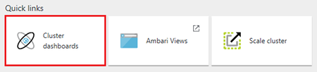
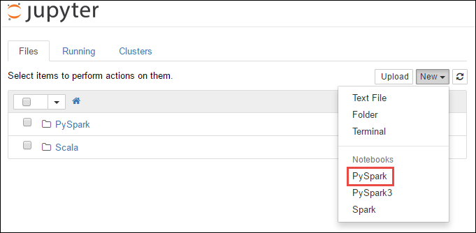
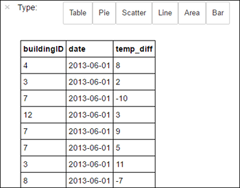

<properties
    pageTitle="入门 - Apache Spark 和交互式 Spark SQL 查询 - Azure HDInsight | Azure"
    description="此 HDInsight Spark 快速入门介绍了如何在 HDInsight 中创建 Apache Spark 群集并使用 Jupyter Notebook 运行交互式查询。"
    keywords="spark 快速入门,交互式 spark,交互式查询,hdinsight spark,azure spark"
    services="hdinsight"
    documentationcenter=""
    author="nitinme"
    manager="jhubbard"
    editor="cgronlun"
    tags="azure-portal" />
<tags
    ms.assetid="91f41e6a-d463-4eb4-83ef-7bbb1f4556cc"
    ms.service="hdinsight"
    ms.custom="hdinsightactive,hdiseo17may2017"
    ms.workload="big-data"
    ms.tgt_pltfrm="na"
    ms.devlang="na"
    ms.topic="get-started-article"
    ms.date="05/12/2017"
    wacn.date="06/05/2017"
    ms.author="v-dazen"
    ms.translationtype="Human Translation"
    ms.sourcegitcommit="08618ee31568db24eba7a7d9a5fc3b079cf34577"
    ms.openlocfilehash="e2d4b032a351d2de556edbe78f385c4ba3ca0a21"
    ms.contentlocale="zh-cn"
    ms.lasthandoff="05/26/2017" />

# 入门：在 HDInsight 中创建 Apache Spark 群集并运行交互式 Spark SQL 查询

了解如何在 HDInsight 中创建 [Apache Spark](/documentation/articles/hdinsight-apache-spark-overview/) 群集并使用 [Jupyter](https://jupyter.org) Notebook 运行交互式 Spark SQL 查询。

   

## 先决条件

* **一个 Azure 订阅**。 在开始学习本教程之前，你必须有一个 Azure 订阅。 请参阅[立即创建 Azure 试用帐户](/pricing/1rmb-trial)。

## 创建 HDInsight Spark 群集

在本部分，你将使用 [Azure Resource Manager 模板](https://github.com/Azure/azure-quickstart-templates/tree/master/101-hdinsight-spark-linux/)创建 HDInsight Spark 群集。 有关其他群集创建方法，请参阅[创建 HDInsight 群集](/documentation/articles/hdinsight-hadoop-provision-linux-clusters/)。

1. 单击下面的图像可在 Azure 门户预览中打开模板。         

    

    >[AZURE.NOTE]
    > 必须修改从 GitHub 存储库“azure-quickstart-templates”下载的模板，以适应 Azure 中国云环境。 例如，将一些终结点 -“blob.core.windows.net”替换为“blob.core.chinacloudapi.cn”，将“cloudapp.azure.com”替换为“chinacloudapp.cn”；将允许的位置更改为“China North”和“China East”；将 HDInsight Linux 版本更改为 Azure 中国区支持的版本 3.5。

2. 输入以下值：

    * **订阅**：为此群集选择 Azure 订阅。
    * **资源组**：创建资源组或选择现有的资源组。 使用资源组管理项目的 Azure 资源。
    * **位置**：选择资源组的位置。  此位置还用于默认群集存储和 HDInsight 群集。
    * **ClusterName**：为创建的 Hadoop 群集输入名称。
    * **Spark 版本**：选择要在群集上安装的 Spark 版本。
    * **群集登录名和密码**：默认登录名是 admin。
    * **SSH 用户名和密码**。

   请记下这些值。  本教程后面的步骤中将会用到它们。

3. 选择“固定到仪表板”；在“法律条款”中，单击“购买”；然后，单击“创建”。 你会看到一个标题为“为模板部署提交部署”的新磁贴。 创建群集大约需要 20 分钟时间。

> [AZURE.NOTE]
> 本文创建使用 [Azure 存储 Blob 作为群集存储](/documentation/articles/hdinsight-hadoop-use-blob-storage/)的 Spark 群集。
>
>

## 运行交互式 Spark SQL 查询

在本部分，你将使用 Jupyter Notebook 针对之前创建的 Spark 群集运行交互式 Spark SQL 查询。 HDInsight Spark 群集提供了可在 Jupyter 笔记本中使用的三个内核。 其中包括：

* **PySpark**（适用于以 Python 编写的应用程序）
* **PySpark3**（适用于以 Python3 编写的应用程序）
* **Spark**（适用于以 Scala 编写的应用程序）

在本文中，你将使用 Notebook 中的 **PySpark** 内核，你将从中运行交互式 Spark SQL 查询。 有关内核的详细信息，请参阅[将 Jupyter Notebook 内核与 HDInsight 中的 Apache Spark 群集配合使用](/documentation/articles/hdinsight-apache-spark-jupyter-notebook-kernels/)。 使用 PySpark 内核的主要好处包括：

* 自动设置 Spark 和 Hive 的上下文。
* 可以使用 cell magic（例如 `%%sql`）直接运行交互式 SQL 或 Hive 查询，而不需要任何前置的代码片段。
* 交互式查询的输出将自动可视化。

### 使用 PySpark 内核创建 Jupyter 笔记本

1. 打开 [Azure 门户预览](https://portal.azure.cn/)。

2. 如果选择将群集固定到仪表板，请单击仪表板中的“群集”磁贴，启动“群集”边栏选项卡。

    如果未将群集固定到仪表板，请在左窗格中单击“HDInsight 群集” ，然后单击所创建的群集。

3. 在“快速链接”中，单击“群集仪表板”，然后单击“Jupyter Notebook”。 出现提示时，请输入群集的管理员凭据。

    

    > [AZURE.NOTE]
    > 也可以在浏览器中打开以下 URL 来访问群集的 Jupyter Notebook。 将 **CLUSTERNAME** 替换为群集的名称：
    >

    > `https://CLUSTERNAME.azurehdinsight.cn/jupyter`
    >
3. 创建 Notebook。 单击“新建”，然后单击“PySpark”。

    

    新 Notebook 随即会创建，并以 Untitled(Untitled.pynb) 名称打开。

4. 在顶部单击笔记本名称，然后输入一个友好名称（如果需要）。

    

5. 将以下代码粘贴到一个空单元格中，然后按 **SHIFT + ENTER** 来运行这些代码。 该代码将导入此方案所需的类型：

        from pyspark.sql.types import *

    使用笔记本是使用 PySpark 内核创建的，因此不需要显式创建任何上下文。 运行第一个代码单元格时，系统将自动为你创建 Spark 和 Hive 上下文。

    

    每次在 Jupyter 中运行交互式查询时，Web 浏览器窗口标题中都会显示“(繁忙)”状态和 Notebook 标题。 右上角“PySpark”文本的旁边还会出现一个实心圆。 作业完成后，实心圆将变成空心圆。

6. 运行以下代码，将示例数据集注册为临时表 (**hvac**)。

        # Load the data
        hvacText = sc.textFile("wasbs:///HdiSamples/HdiSamples/SensorSampleData/hvac/HVAC.csv")

        # Create the schema
        hvacSchema = StructType([StructField("date", StringType(), False),StructField("time", StringType(), False),StructField("targettemp", IntegerType(), False),StructField("actualtemp", IntegerType(), False),StructField("buildingID", StringType(), False)])

        # Parse the data in hvacText
        hvac = hvacText.map(lambda s: s.split(",")).filter(lambda s: s[0] != "Date").map(lambda s:(str(s[0]), str(s[1]), int(s[2]), int(s[3]), str(s[6]) ))

        # Create a data frame
        hvacdf = sqlContext.createDataFrame(hvac,hvacSchema)

        # Register the data frame as a table to run queries against
        hvacdf.registerTempTable("hvac")

    HDInsight 中的 Spark 群集在 **\HdiSamples\HdiSamples\SensorSampleData\hvac** 下面随附了一个示例数据文件 **hvac.csv**。

7. 若要对数据运行交互式查询，请使用以下代码。

        %%sql
        SELECT buildingID, (targettemp - actualtemp) AS temp_diff, date FROM hvac WHERE date = \"6/1/13\"

    由于使用的是 PySpark 内核，因此现在可直接对使用 `%%sql` magic 创建的临时表 **hvac** 运行交互式 SQL 查询。 有关 `%%sql` magic 以及可在 PySpark 内核中使用的其他 magic 的详细信息，请参阅[包含 Spark HDInsight 群集的 Jupyter Notebook 上可用的内核](/documentation/articles/hdinsight-apache-spark-jupyter-notebook-kernels/#parameters-supported-with-the-sql-magic)。

    默认情况下，将显示以下表格输出。

    

    你也可以在其他视觉效果中查看结果。 例如，同一输出的分区图看起来如下所示。

    

9. 运行完应用程序后，可以关闭 Notebook 以释放资源。 为此，请在 Notebook 的“文件”菜单中，单击“关闭并停止”。

## 删除群集
[AZURE.INCLUDE [delete-cluster-warning](../../includes/hdinsight-delete-cluster-warning.md)]

## 访问控制故障排除

如果在创建 HDInsight 群集时遇到问题，请参阅[访问控制要求](/documentation/articles/hdinsight-administer-use-portal-linux/#create-clusters)。

## 另请参阅
* [概述：Azure HDInsight 上的 Apache Spark](/documentation/articles/hdinsight-apache-spark-overview/)

### 方案
* [Spark 和 BI：使用 HDInsight 中的 Spark 和 BI 工具执行交互式数据分析](/documentation/articles/hdinsight-apache-spark-use-bi-tools/)
* [Spark 和机器学习：使用 HDInsight 中的 Spark 对使用 HVAC 数据生成温度进行分析](/documentation/articles/hdinsight-apache-spark-ipython-notebook-machine-learning/)
* [Spark 和机器学习：使用 HDInsight 中的 Spark 预测食品检查结果](/documentation/articles/hdinsight-apache-spark-machine-learning-mllib-ipython/)
* [Spark 流式处理：使用 HDInsight 中的 Spark 生成实时流式处理应用程序](/documentation/articles/hdinsight-apache-spark-eventhub-streaming/)

### 创建和运行应用程序
* [使用 Scala 创建独立的应用程序](/documentation/articles/hdinsight-apache-spark-create-standalone-application/)
* [使用 Livy 在 Spark 群集中远程运行作业](/documentation/articles/hdinsight-apache-spark-livy-rest-interface/)

### 工具和扩展
* [在 HDInsight 上的 Spark 群集中使用 Zeppelin 笔记本](/documentation/articles/hdinsight-apache-spark-use-zeppelin-notebook/)
* [在 HDInsight 的 Spark 群集中可用于 Jupyter 笔记本的内核](/documentation/articles/hdinsight-apache-spark-jupyter-notebook-kernels/)
* [Use external packages with Jupyter notebooks（将外部包与 Jupyter 笔记本配合使用）](/documentation/articles/hdinsight-apache-spark-jupyter-notebook-use-external-packages/)
* [Install Jupyter on your computer and connect to an HDInsight Spark cluster（在计算机上安装 Jupyter 并连接到 HDInsight Spark 群集）](/documentation/articles/hdinsight-apache-spark-jupyter-notebook-install-locally/)

### 管理资源
* [管理 Azure HDInsight 中 Apache Spark 群集的资源](/documentation/articles/hdinsight-apache-spark-resource-manager/)
* [跟踪和调试 HDInsight 中的 Apache Spark 群集上运行的作业](/documentation/articles/hdinsight-apache-spark-job-debugging/)

[hdinsight-versions]: /documentation/articles/hdinsight-component-versioning/
[hdinsight-upload-data]: /documentation/articles/hdinsight-upload-data/
[hdinsight-storage]: /documentation/articles/hdinsight-hadoop-use-blob-storage/

[azure-purchase-options]: /pricing/overview/
[azure-member-offers]: /pricing/member-offers/
[azure-trial]: /pricing/1rmb-trial/
[azure-management-portal]: https://manage.windowsazure.cn/
[azure-create-storageaccount]: /documentation/articles/storage-create-storage-account/

<!--Update_Description: wording update-->