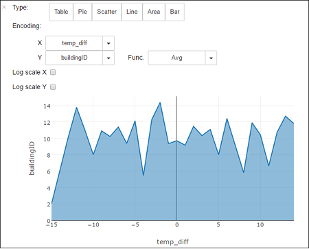

<!-- not suitable for Mooncake -->

<properties
    pageTitle="在 Azure HDInsight 中创建 Spark 群集并从 Jupyter 使用 Spark SQL 执行交互式分析 | Azure"
    description="逐步说明如何在 HDInsight 群集中快速创建 Apache Spark 群集，然后从 Jupyter 笔记本使用 Spark SQL 来运行交互式查询。"
    services="hdinsight"
    documentationcenter=""
    author="nitinme"
    manager="jhubbard"
    editor="cgronlun"
    tags="azure-portal" />
<tags 
    ms.assetid="91f41e6a-d463-4eb4-83ef-7bbb1f4556cc"
    ms.service="hdinsight"
    ms.workload="big-data"
    ms.tgt_pltfrm="na"
    ms.devlang="na"
    ms.topic="get-started-article"
    ms.date="01/06/2017"
    wacn.date="01/25/2017"
    ms.author="nitinme" />

# 入门：在 Azure HDInsight 中创建 Apache Spark 群集并使用 Spark SQL 运行交互式查询
了解如何在 HDInsight 中创建 [Apache Spark](/documentation/articles/hdinsight-apache-spark-overview/) 群集，然后使用 [Jupyter](https://jupyter.org) 笔记本在 Spark 群集上运行 Spark SQL 交互式查询。

  

[AZURE.INCLUDE [delete-cluster-warning](../../includes/hdinsight-delete-cluster-warning.md)]

## 先决条件
* **一个 Azure 订阅**。在开始学习本教程之前，你必须有一个 Azure 订阅。请参阅[立即创建 Azure 试用帐户](https://www.azure.cn/pricing/1rmb-trial/)。
* **安全外壳 (SSH) 客户端**：Linux、Unix 和 OS X 系统可通过 `ssh` 命令提供 SSH 客户端。对于 Windows 系统，请参阅[在装有 PuTTY 的 Windows 中的 HDInsight 上将 SSH 与基于 Linux 的 Hadoop 配合使用](/documentation/articles/hdinsight-hadoop-linux-use-ssh-windows/)；对于 Linux、Unix 或 OS X，请参阅[在 Linux、Unix 或 OS X 中的 HDInsight 上将 SSH 与基于 Linux 的 Hadoop 配合使用](/documentation/articles/hdinsight-hadoop-linux-use-ssh-unix/)

> [AZURE.NOTE]
本文通过 Azure Resource Manager 模板创建使用 [Azure 存储 Blob 作为群集存储](/documentation/articles/hdinsight-hadoop-use-blob-storage/)的 Spark 群集。
>
>

### 访问控制要求
[AZURE.INCLUDE [access-control](../../includes/hdinsight-access-control-requirements.md)]

## 创建 Spark 群集
在此部分中，会使用 [Azure Resource Manager 模板](https://github.com/Azure/azure-quickstart-templates/tree/master/101-hdinsight-spark-linux/)在 HDInsight 中创建 Spark 群集。有关 HDInsight 版本及其 SLA 的信息，请参阅 [HDInsight 组件版本](/documentation/articles/hdinsight-component-versioning/)。有关其他群集创建方法，请参阅 [Create HDInsight clusters](/documentation/articles/hdinsight-hadoop-provision-linux-clusters/)（创建 HDInsight 群集）。

1. 单击下面的图像可在 Azure 门户预览中打开模板。

    

    >[AZURE.NOTE] 必须修改从 GitHub 存储库“azure-quickstart-templates”下载的模板，以适应 Azure 中国云环境。例如，替换某些终结点（将“blob.core.windows.net”替换为“blob.core.chinacloudapi.cn”，将“cloudapp.azure.com”替换为“chinacloudapp.cn”）；把允许的地域改成“China North”和“China East”；把 HDInsight Linux 版本改为 Azure 中国所支持的 3.5。

2. 输入以下值：

    * **订阅**：为此群集选择 Azure 订阅。
    * **资源组**：创建新资源组或选择现有的资源组。使用资源组管理项目的 Azure 资源。
    * **位置**：选择资源组的位置。此位置还用于默认群集存储和 HDInsight 群集。
    * **ClusterName**：为将创建的 Hadoop 群输入名称。
    * **群集登录名和密码**：默认登录名是 admin。
    * **SSH 用户名和密码**。

    请记下这些值。本教程后面的步骤中将会用到它们。

3. 选择“固定到仪表板”；在“法律条款”中，单击“购买”；然后，单击“创建”。你会看到一个标题为“为模板部署提交部署”的新磁贴。创建群集大约需要 20 分钟时间。

## 使用 Jupyter 笔记本运行 Spark SQL 查询
在本部分中，你将使用 Jupyter 笔记本针对 Spark 群集运行 Spark SQL 查询。HDInsight Spark 群集提供了可在 Jupyter 笔记本中使用的两个内核。它们是：

* **PySpark**（适用于以 Python 编写的应用程序）
* **Spark**（适用于以 Scala 编写的应用程序）

本文将使用 PySpark 内核。在 [Kernels available on Jupyter notebooks with Spark HDInsight clusters](/documentation/articles/hdinsight-apache-spark-jupyter-notebook-kernels/#why-should-i-use-the-pyspark-or-spark-kernels)（包含 Spark HDInsight 群集的 Jupyter 笔记本上可用的内核）一文中，可以详细了解使用 PySpark 内核带来的好处。但是，使用 PySpark 内核的主要好处包括：

* 不需要设置 Spark 和 Hive 的上下文。系统会自动为你设置。
* 可以使用 cell magic（例如 `%%sql`）直接运行 SQL 或 Hive 查询，而不需要任何前置的代码片段。
* SQL 或 Hive 查询的输出将自动可视化。

### 使用 PySpark 内核创建 Jupyter 笔记本

1. 打开 [Azure 门户预览](https://portal.azure.cn/)。
2. 在左侧菜单中，单击“资源组”。
3. 单击在上一部分中创建的资源组。如果有太多资源组，可以使用搜索功能。可以看到组中的两个资源、HDInsight 群集和默认存储帐户。
4. 单击群集以将其打开。
 
2. 从“快速链接”，单击“群集仪表板”，然后单击“Jupyter 笔记本”。出现提示时，请输入群集的管理员凭据。

      

    > [AZURE.NOTE]
    也可以在浏览器中打开以下 URL 来访问群集的 Jupyter 笔记本。将 **CLUSTERNAME** 替换为群集的名称：
    >

    > `https://CLUSTERNAME.azurehdinsight.cn/jupyter`
    >
    >
3. 创建新的笔记本。单击“新建”，然后单击“PySpark”。

      

    随即创建新笔记本，并以 Untitled(Untitled.pynb) 名称打开。

4. 在顶部单击笔记本名称，然后输入一个友好名称（如果需要）。

      

5. 将以下代码粘贴到空白单元格中，然后按 **SHIFT + ENTER** 执行该代码。该代码将导入此方案所需的类型：

        from pyspark.sql.types import *

    使用笔记本是使用 PySpark 内核创建的，因此不需要显式创建任何上下文。当你运行第一个代码单元格时，系统将自动为你创建 Spark 和 Hive 上下文。

      

    每当你在 Jupyter 中运行作业时，Web 浏览器窗口标题中都会显示“(繁忙)”状态以及笔记本标题。右上角 **PySpark** 文本的旁边还会出现一个实心圆。作业完成后，实心圆将变成空心圆。

6. 运行以下代码将一些示例数据注册到名为 **hvac** 的临时表中。

        # Load the data
        hvacText = sc.textFile("wasbs:///HdiSamples/HdiSamples/SensorSampleData/hvac/HVAC.csv")

        # Create the schema
        hvacSchema = StructType([StructField("date", StringType(), False),StructField("time", StringType(), False),StructField("targettemp", IntegerType(), False),StructField("actualtemp", IntegerType(), False),StructField("buildingID", StringType(), False)])

        # Parse the data in hvacText
        hvac = hvacText.map(lambda s: s.split(",")).filter(lambda s: s[0] != "Date").map(lambda s:(str(s[0]), str(s[1]), int(s[2]), int(s[3]), str(s[6]) ))

        # Create a data frame
        hvacdf = sqlContext.createDataFrame(hvac,hvacSchema)

        # Register the data fram as a table to run queries against
        hvacdf.registerTempTable("hvac")

    HDInsight 中的 Spark 群集附带了一个示例数据文件 (**hvac.csv**)，位于 **\\HdiSamples\\HdiSamples\\SensorSampleData\\hvac** 下。
    
7. 运行以下代码以查询数据：

        %%sql
        SELECT buildingID, (targettemp - actualtemp) AS temp_diff, date FROM hvac WHERE date = "6/1/13"

    由于你使用的是 PySpark 内核，因此现在可直接在刚才使用 `%%sql` magic 创建的临时表 **hvac** 上运行 SQL 查询。有关 `%%sql` magic 以及可在 PySpark 内核中使用的其他 magic 的详细信息，请参阅 [Kernels available on Jupyter notebooks with Spark HDInsight clusters](/documentation/articles/hdinsight-apache-spark-jupyter-notebook-kernels/#why-should-i-use-the-pyspark-or-spark-kernels)（包含 Spark HDInsight 群集的 Jupyter 笔记本上可用的内核）。

    默认情况下，将显示以下表格输出。

      

    你也可以在其他视觉效果中查看结果。例如，同一输出的分区图看起来如下所示。

      

9. 运行完应用程序之后，可以关闭笔记本以释放资源。为此，在笔记本的“文件”菜单中，单击“关闭并停止”。这将会关闭笔记本。

## 删除群集
[AZURE.INCLUDE [delete-cluster-warning](../../includes/hdinsight-delete-cluster-warning.md)]

## 另请参阅
* [概述：Azure HDInsight 上的 Apache Spark](/documentation/articles/hdinsight-apache-spark-overview/)

### 方案
* [Spark 和 BI：使用 HDInsight 中的 Spark 和 BI 工具执行交互式数据分析](/documentation/articles/hdinsight-apache-spark-use-bi-tools/)
* [Spark 和机器学习：使用 HDInsight 中的 Spark 对使用 HVAC 数据生成温度进行分析](/documentation/articles/hdinsight-apache-spark-ipython-notebook-machine-learning/)
* [Spark 流式处理：使用 HDInsight 中的 Spark 生成实时流式处理应用程序](/documentation/articles/hdinsight-apache-spark-eventhub-streaming/)

### 创建和运行应用程序
* [使用 Livy 在 Spark 群集中远程运行作业](/documentation/articles/hdinsight-apache-spark-livy-rest-interface/)

### 工具和扩展
* [在 HDInsight 上的 Spark 群集中使用 Zeppelin 笔记本](/documentation/articles/hdinsight-apache-spark-use-zeppelin-notebook/)
* [在 HDInsight 的 Spark 群集中可用于 Jupyter 笔记本的内核](/documentation/articles/hdinsight-apache-spark-jupyter-notebook-kernels/)
* [Use external packages with Jupyter notebooks（将外部包与 Jupyter 笔记本配合使用）](/documentation/articles/hdinsight-apache-spark-jupyter-notebook-use-external-packages/)
* [Install Jupyter on your computer and connect to an HDInsight Spark cluster（在计算机上安装 Jupyter 并连接到 HDInsight Spark 群集）](/documentation/articles/hdinsight-apache-spark-jupyter-notebook-install-locally/)

### 管理资源
* [管理 Azure HDInsight 中 Apache Spark 群集的资源](/documentation/articles/hdinsight-apache-spark-resource-manager/)
* [Track and debug jobs running on an Apache Spark cluster in HDInsight（跟踪和调试 HDInsight 中的 Apache Spark 群集上运行的作业）](/documentation/articles/hdinsight-apache-spark-job-debugging/)

[hdinsight-versions]: /documentation/articles/hdinsight-component-versioning/
[hdinsight-upload-data]: /documentation/articles/hdinsight-upload-data/
[hdinsight-storage]: /documentation/articles/hdinsight-hadoop-use-blob-storage/

[azure-purchase-options]: /pricing/overview/
[azure-member-offers]: /pricing/member-offers/
[azure-trial]: /pricing/1rmb-trial/
[azure-management-portal]: https://manage.windowsazure.cn/
[azure-create-storageaccount]: /documentation/articles/storage-create-storage-account/

<!---HONumber=Mooncake_0120_2017-->