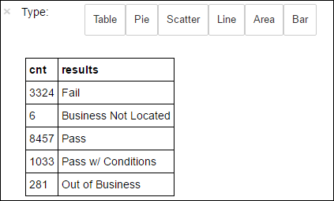

<!-- not suitable for Mooncake -->

<properties
    pageTitle="在 HDInsight 上使用 Apache Spark 生成机器学习应用程序 | Azure"
    description="逐步介绍如何使用 Apache Spark 随附的笔记本生成机器学习应用程序"
    services="hdinsight"
    documentationcenter=""
    author="nitinme"
    manager="jhubbard"
    editor="cgronlun"
    tags="azure-portal" />
<tags 
    ms.assetid="c0fd4baa-946d-4e03-ad2c-a03491bd90c8"
    ms.service="hdinsight"
    ms.workload="big-data"
    ms.tgt_pltfrm="na"
    ms.devlang="na"
    ms.topic="article"
    ms.date="10/05/2016"
    wacn.date="02/20/2017"
    ms.author="nitinme" />

# 机器学习：结合使用 MLlib 与 HDInsight Linux 上的 Apache Spark 群集对食品检测数据进行预测分析
> [AZURE.TIP]
本教程也可用作在 HDInsight 中创建的 Spark (Linux) 群集上的 Jupyter 笔记本。笔记本体验将通过笔记本本身运行 Python 代码段。若要在笔记本中执行本教程，请创建 Spark 群集，启动 Jupyter 笔记本 (`https://CLUSTERNAME.azurehdinsight.cn/jupyter`)，然后运行 **Python** 文件夹下的笔记本“Spark 机器学习 - 使用 MLLib.ipynb 对食品检测数据进行预测分析”。
>
>

本文演示如何使用 Spark 的内置机器学习库 ** MLLib ** 对开放数据集执行简单的预测分析。MLLib 是一个核心 Spark 库，它提供了许多可用于机器学习任务的实用工具，包括适用于以下任务的实用程序：

* 分类
* 回归
* 群集功能
* 主题建模
* 奇异值分解 (SVD) 和主成分分析 (PCA)
* 假设测试和计算示例统计信息

本文介绍通过逻辑回归进行“分类”的简单方法。

## 分类和逻辑回归是什么？
“分类”是一种很常见的机器学习任务，是将输入数据归入各类别的过程。分类算法的作用是找出如何为提供的输入数据分配“标签”。例如，可以想到一种机器学习算法，它接受股票信息作为输入，然后将股票分为两类：应该销售的股票和应该保留的股票。

逻辑回归是用于分类的算法。Spark 的逻辑回归 API 可用于“二元分类”，或将输入数据分类为两个组之一。有关逻辑回归的详细信息，请参阅[维基百科](https://en.wikipedia.org/wiki/Logistic_regression)。

总之，逻辑回归过程会产生“逻辑函数”，该函数可用于预测输入向量属于其中一个组的概率。

## 在本文中，我们要完成什么？
将使用 Spark 对经由[芝加哥数据门户](https://data.cityofchicago.org/)获取的食品检测数据 (**Food\_Inspections1.csv**) 执行一些预测分析。该数据集包含在上海执行的食品检验的相关信息，包括被检查的每个食品机构的信息、发现的违规行为（如果有）以及检验结果。已可通过存储帐户获取 CSV 数据文件，该帐户与位于 **/HdiSamples/HdiSamples/FoodInspectionData/Food\_Inspections1.csv** 处的群集关联。

在下面的步骤中，将开发一个模型来了解决定食品检验通过或不通过的因素。

## 开始使用 Spark MLlib 构建机器学习应用程序
1. 在 [Azure 门户预览](https://portal.azure.cn/)上的启动板中，单击 Spark 群集的磁贴（如果已将它固定到启动板）。也可以在“全部浏览”>“HDInsight 群集”下导航到你的群集。
1. 在“Spark 群集”边栏选项卡中，单击“群集仪表板”，然后单击“Jupyter 笔记本”。出现提示时，请输入群集的管理员凭据。

    > [AZURE.NOTE]
    也可以在浏览器中打开以下 URL 来访问群集的 Jupyter 笔记本。将 **CLUSTERNAME** 替换为群集的名称：
    >

    > `https://CLUSTERNAME.azurehdinsight.cn/jupyter`
    >
    >
1. 创建新的笔记本。单击“新建”，然后单击“PySpark”。

    
1. 新笔记本随即已创建，并以 Untitled.pynb 名称打开。在顶部单击笔记本名称，然后输入一个友好名称。

    
1. 使用笔记本是使用 PySpark 内核创建的，因此不需要显式创建任何上下文。当你运行第一个代码单元格时，系统将自动为你创建 Spark 和 Hive 上下文。可以通过导入此方案所需的类型来开始构建机器学习应用程序。为此，请将光标放在单元格中，然后按 **SHIFT + ENTER**。

        from pyspark.ml import Pipeline
        from pyspark.ml.classification import LogisticRegression
        from pyspark.ml.feature import HashingTF, Tokenizer
        from pyspark.sql import Row
        from pyspark.sql.functions import UserDefinedFunction
        from pyspark.sql.types import *

## 构造输入数据帧
可以使用 `sqlContext` 对结构化数据执行转换。第一个任务是将示例数据 ((**Food\_Inspections1.csv**)) 加载到 Spark SQL 数据帧 中。

1. 因为原始数据是 CSV 格式，所以需要使用 Spark 上下文将文件的每一行拉入内存中作为非结构化文本；然后，便可以使用 Python 的 CSV 库来单独分析每一行。

        def csvParse(s):
            import csv
            from StringIO import StringIO
            sio = StringIO(s)
            value = csv.reader(sio).next()
            sio.close()
            return value

        inspections = sc.textFile('wasbs:///HdiSamples/HdiSamples/FoodInspectionData/Food_Inspections1.csv')\
                        .map(csvParse)
1. 我们现在有 CSV 文件，可用作 RDD。现在从 RDD 中检索一行以了解数据的架构。

        inspections.take(1)

    你应该看到如下输出：

        # -----------------
        # THIS IS AN OUTPUT
        # -----------------

        [['413707',
          'LUNA PARK INC',
          'LUNA PARK  DAY CARE',
          '2049789',
          "Children's Services Facility",
          'Risk 1 (High)',
          '3250 W FOSTER AVE ',
          'CHICAGO',
          'IL',
          '60625',
          '09/21/2010',
          'License-Task Force',
          'Fail',
          '24. DISH WASHING FACILITIES: PROPERLY DESIGNED, CONSTRUCTED, MAINTAINED, INSTALLED, LOCATED AND OPERATED - Comments: All dishwashing machines must be of a type that complies with all requirements of the plumbing section of the Municipal Code of Shanghai and Rules and Regulation of the Board of Health. OBSEVERD THE 3 COMPARTMENT SINK BACKING UP INTO THE 1ST AND 2ND COMPARTMENT WITH CLEAR WATER AND SLOWLY DRAINING OUT. INST NEED HAVE IT REPAIR. CITATION ISSUED, SERIOUS VIOLATION 7-38-030 H000062369-10 COURT DATE 10-28-10 TIME 1 P.M. ROOM 107 400 W. SURPERIOR. | 36. LIGHTING: REQUIRED MINIMUM FOOT-CANDLES OF LIGHT PROVIDED, FIXTURES SHIELDED - Comments: Shielding to protect against broken glass falling into food shall be provided for all artificial lighting sources in preparation, service, and display facilities. LIGHT SHIELD ARE MISSING UNDER HOOD OF  COOKING EQUIPMENT AND NEED TO REPLACE LIGHT UNDER UNIT. 4 LIGHTS ARE OUT IN THE REAR CHILDREN AREA,IN THE KINDERGARDEN CLASS ROOM. 2 LIGHT ARE OUT EAST REAR, LIGHT FRONT WEST ROOM. NEED TO REPLACE ALL LIGHT THAT ARE NOT WORKING. | 35. WALLS, CEILINGS, ATTACHED EQUIPMENT CONSTRUCTED PER CODE: GOOD REPAIR, SURFACES CLEAN AND DUST-LESS CLEANING METHODS - Comments: The walls and ceilings shall be in good repair and easily cleaned. MISSING CEILING TILES WITH STAINS IN WEST,EAST, IN FRONT AREA WEST, AND BY THE 15MOS AREA. NEED TO BE REPLACED. | 32. FOOD AND NON-FOOD CONTACT SURFACES PROPERLY DESIGNED, CONSTRUCTED AND MAINTAINED - Comments: All food and non-food contact equipment and utensils shall be smooth, easily cleanable, and durable, and shall be in good repair. SPLASH GUARDED ARE NEEDED BY THE EXPOSED HAND SINK IN THE KITCHEN AREA | 34. FLOORS: CONSTRUCTED PER CODE, CLEANED, GOOD REPAIR, COVING INSTALLED, DUST-LESS CLEANING METHODS USED - Comments: The floors shall be constructed per code, be smooth and easily cleaned, and be kept clean and in good repair. INST NEED TO ELEVATE ALL FOOD ITEMS 6INCH OFF THE FLOOR 6 INCH AWAY FORM WALL.  ',
          '41.97583445690982',
          '-87.7107455232781',
          '(41.97583445690982, -87.7107455232781)']]
1. 上面的输出让我们对输入文件架构有了一定理解；该文件包含每个机构的名称、机构的类型、地址、检测数据和位置等等。选择几个对我们的预测分析有用的列，并将结果归为一个数据帧，接下来会用它来创建一个临时表。

        schema = StructType([
        StructField("id", IntegerType(), False),
        StructField("name", StringType(), False),
        StructField("results", StringType(), False),
        StructField("violations", StringType(), True)])

        df = sqlContext.createDataFrame(inspections.map(lambda l: (int(l[0]), l[1], l[12], l[13])) , schema)
        df.registerTempTable('CountResults')
1. 现在有了一个数据帧 `df`，可以在其上执行分析。还有一个名为 **CountResults** 的临时表。数据帧中包含了 4 个相关的列：“ID”、“名称”、“结果”和“违规”。

    现在获取一个小型数据样本：

        df.show(5)

    你应该看到如下输出：

        # -----------------
        # THIS IS AN OUTPUT
        # -----------------

        +------+--------------------+-------+--------------------+
        |    id|                name|results|          violations|
        +------+--------------------+-------+--------------------+
        |413707|       LUNA PARK INC|   Fail|24. DISH WASHING ...|
        |391234|       CAFE SELMARIE|   Fail|2. FACILITIES TO ...|
        |413751|          MANCHU WOK|   Pass|33. FOOD AND NON-...|
        |413708|BENCHMARK HOSPITA...|   Pass|                    |
        |413722|           JJ BURGER|   Pass|                    |
        +------+--------------------+-------+--------------------+

## 了解数据
1. 让我们开始了解数据集所包含的内容。例如，“结果”列中有哪些不同的值？

        df.select('results').distinct().show()

    你应该看到如下输出：

        # -----------------
        # THIS IS AN OUTPUT
        # -----------------

        +--------------------+
        |             results|
        +--------------------+
        |                Fail|
        |Business Not Located|
        |                Pass|
        |  Pass w/ Conditions|
        |     Out of Business|
        +--------------------+
1. 快速可视化可以帮助我们推断这些结果的分布。我们已将数据导入临时表 **CountResults** 中。可以对表运行以下 SQL 查询，以更好地了解结果的分布情况。

        %%sql -o countResultsdf
        SELECT results, COUNT(results) AS cnt FROM CountResults GROUP BY results

    `%%sql` 幻数后跟 `-o countResultsdf` 确保了查询的输出本地保存在 Jupyter 服务器（通常为群集的头节点）上。输出将保存为具有指定名称 ** countResultsdf ** 的 [Pandas ](http://pandas.pydata.org/) 数据帧。

    你应该看到如下输出：

      

    有关 `%%sql` 幻数以及可在 PySpark 内核中使用的其他幻数的详细信息，请参阅 [Kernels available on Jupyter notebooks with Spark HDInsight clusters](/documentation/articles/hdinsight-apache-spark-jupyter-notebook-kernels/#why-should-i-use-the-pyspark-or-spark-kernels)（包含 Spark HDInsight 群集的 Jupyter 笔记本上可用的内核）。
1. 还可以使用 Matplotlib（用于构建数据可视化效果的库）创建绘图。因为该绘图必须从本地保存的 **countResultsdf** 数据帧创建，所以代码片段必须以 `%%local` 幻数开头。这可确保代码在 Jupyter 服务器上本地运行。

        %%local
        %matplotlib inline
        import matplotlib.pyplot as plt

        labels = countResultsdf['results']
        sizes = countResultsdf['cnt']
        colors = ['turquoise', 'seagreen', 'mediumslateblue', 'palegreen', 'coral']
        plt.pie(sizes, labels=labels, autopct='%1.1f%%', colors=colors)
        plt.axis('equal')

    你应该看到如下输出：

      

1. 可以看到，检测可有 5 种不同的结果：

    * 未找到企业
    * 失败
    * 通过
    * 通过 w/ 条件和
    * 停业

     让我们开发一个模型，它可以猜测食品检测的结果，假设是违规的情况。由于逻辑回归是二元分类方法，因此将数据归为两个类别是有意义的：“未通过”和“通过”。“通过 w/ 条件”仍然属于通过，所以在定型模型时，会将这两个结果视为等效。具有其他结果（“企业不存在”，“停业”）的数据没有用处，所以会从定型集中将其删除。由于这两个类别占结果很小的比例，所以这样操作应该没有问题。
1. 让我们继续，将现有数据帧 (`df`) 转换为新的数据帧，其中每个检测表示为一个标签违规对。在我们的例子中，`0.0` 标签表示失败，`1.0` 标签表示成功，`-1.0` 标签表示不同于这两种结果的其他一些结果。在计算新的数据帧时，我们将筛选出这些其他结果。

        def labelForResults(s):
            if s == 'Fail':
                return 0.0
            elif s == 'Pass w/ Conditions' or s == 'Pass':
                return 1.0
            else:
                return -1.0
        label = UserDefinedFunction(labelForResults, DoubleType())
        labeledData = df.select(label(df.results).alias('label'), df.violations).where('label >= 0')

    让我们从标记的数据中检索一行，看看它是什么样子。

        labeledData.take(1)

    你应该看到如下输出：

        # -----------------
        # THIS IS AN OUTPUT
        # -----------------

        [Row(label=0.0, violations=u"41. PREMISES MAINTAINED FREE OF LITTER, UNNECESSARY ARTICLES, CLEANING  EQUIPMENT PROPERLY STORED - Comments: All parts of the food establishment and all parts of the property used in connection with the operation of the establishment shall be kept neat and clean and should not produce any offensive odors.  REMOVE MATTRESS FROM SMALL DUMPSTER. | 35. WALLS, CEILINGS, ATTACHED EQUIPMENT CONSTRUCTED PER CODE: GOOD REPAIR, SURFACES CLEAN AND DUST-LESS CLEANING METHODS - Comments: The walls and ceilings shall be in good repair and easily cleaned.  REPAIR MISALIGNED DOORS AND DOOR NEAR ELEVATOR.  DETAIL CLEAN BLACK MOLD LIKE SUBSTANCE FROM WALLS BY BOTH DISH MACHINES.  REPAIR OR REMOVE BASEBOARD UNDER DISH MACHINE (LEFT REAR KITCHEN). SEAL ALL GAPS.  REPLACE MILK CRATES USED IN WALK IN COOLERS AND STORAGE AREAS WITH PROPER SHELVING AT LEAST 6' OFF THE FLOOR.  | 38. VENTILATION: ROOMS AND EQUIPMENT VENTED AS REQUIRED: PLUMBING: INSTALLED AND MAINTAINED - Comments: The flow of air discharged from kitchen fans shall always be through a duct to a point above the roofline.  REPAIR BROKEN VENTILATION IN MEN'S AND WOMEN'S WASHROOMS NEXT TO DINING AREA. | 32. FOOD AND NON-FOOD CONTACT SURFACES PROPERLY DESIGNED, CONSTRUCTED AND MAINTAINED - Comments: All food and non-food contact equipment and utensils shall be smooth, easily cleanable, and durable, and shall be in good repair.  REPAIR DAMAGED PLUG ON LEFT SIDE OF 2 COMPARTMENT SINK.  REPAIR SELF CLOSER ON BOTTOM LEFT DOOR OF 4 DOOR PREP UNIT NEXT TO OFFICE.")]

## 从输入数据帧创建逻辑回归模型
我们的最终任务是将标记的数据转换为可以通过逻辑回归分析的格式。逻辑回归算法的输入应为一组“标签特征向量对”，其中“特征向量”是以某种方式表示输入点的数字向量。因此，我们需要一种方法将“违规”列（它是半结构化的，并且包含大量自定义文本形式的注释）转换为机器容易理解的实数数组。

用于处理自然语言的一种标准机器学习方法是为每个不同的单词分配一个“索引”，然后将一个向量传递给机器学习算法，以使每个索引的值包含该词在文本字符串中的相对频率。

MLLib 提供了执行此操作的一种简单方法。首先，我们将“标记”每个违规字符串以获取每个字符串中的各个单词，然后使用 `HashingTF` 将每组标记转换为特征向量，随后可将其传递给逻辑回归算法以构建模型。我们将使用“管道”按顺序执行所有这些步骤。

    tokenizer = Tokenizer(inputCol="violations", outputCol="words")
    hashingTF = HashingTF(inputCol=tokenizer.getOutputCol(), outputCol="features")
    lr = LogisticRegression(maxIter=10, regParam=0.01)
    pipeline = Pipeline(stages=[tokenizer, hashingTF, lr])

    model = pipeline.fit(labeledData)

## 在单独的测试数据集上评估模型
我们可以使用先前创建的模型，基于观察到的违规，预测新的检测的结果。我们在数据集 **Food\_Inspections1.csv** 上定型此模型。让我们使用第二个数据集 **Food\_Inspections2.csv** 评估此模型对新数据的有效度。此第二个数据集 (**Food\_Inspections2.csv**) 应已位于与群集关联的默认存储容器中。

1. 以下代码段创建新的数据帧 **predictionsDf**，其中包含模型生成的预测。该代码段还基于数据帧创建临时表 **Predictions**。

        testData = sc.textFile('wasbs:///HdiSamples/HdiSamples/FoodInspectionData/Food_Inspections2.csv')\
                 .map(csvParse) \
                 .map(lambda l: (int(l[0]), l[1], l[12], l[13]))
        testDf = sqlContext.createDataFrame(testData, schema).where("results = 'Fail' OR results = 'Pass' OR results = 'Pass w/ Conditions'")
        predictionsDf = model.transform(testDf)
        predictionsDf.registerTempTable('Predictions')
        predictionsDf.columns

    你应该看到如下输出：

        # -----------------
        # THIS IS AN OUTPUT
        # -----------------

        ['id',
         'name',
         'results',
         'violations',
         'words',
         'features',
         'rawPrediction',
         'probability',
         'prediction']
1. 查看其中的一个预测。运行此代码段：

        predictionsDf.take(1)

    将看到对测试数据集中第一个条目的预测。
1. `model.transform()` 方法将对具有相同架构的任何新数据应用相同的转换，并得出如何对数据进行分类的预测。可以做一些简单的统计，来了解预测的准确性：

        numSuccesses = predictionsDf.where("""(prediction = 0 AND results = 'Fail') OR
                                              (prediction = 1 AND (results = 'Pass' OR
                                                                   results = 'Pass w/ Conditions'))""").count()
        numInspections = predictionsDf.count()

        print "There were", numInspections, "inspections and there were", numSuccesses, "successful predictions"
        print "This is a", str((float(numSuccesses) / float(numInspections)) * 100) + "%", "success rate"

    输出如下所示：

        # -----------------
        # THIS IS AN OUTPUT
        # -----------------

        There were 9315 inspections and there were 8087 successful predictions
        This is a 86.8169618894% success rate

    配合使用 Spark 和逻辑回归提供了违规描述（英语）与某个给定企业是否会通过食品检验之间关系的准确模型。

## 创建预测的可视化表示形式
现在可以构造最终的可视化效果，以帮助推断此测试的结果。

1. 首先，我们从之前创建的 **Predictions** 临时表中提取不同的预测和结果。以下查询将输出区分为 *true\_positive*、*false\_positive*、*true\_negative* 和 *false\_negative*。在以下查询中，我们通过使用 `-q` 关闭可视化效果，并将输出保存（通过使用 `-o`）为随后可与 `%%local` 幻数一起使用的数据帧。

        %%sql -q -o true_positive
        SELECT count(*) AS cnt FROM Predictions WHERE prediction = 0 AND results = 'Fail'

        %%sql -q -o false_positive
        SELECT count(*) AS cnt FROM Predictions WHERE prediction = 0 AND (results = 'Pass' OR results = 'Pass w/ Conditions')

        %%sql -q -o true_negative
        SELECT count(*) AS cnt FROM Predictions WHERE prediction = 1 AND results = 'Fail'

        %%sql -q -o false_negative
        SELECT count(*) AS cnt FROM Predictions WHERE prediction = 1 AND (results = 'Pass' OR results = 'Pass w/ Conditions')
1. 最后，使用以下代码段通过 **Matplotlib** 生成绘图。

        %%local
        %matplotlib inline
        import matplotlib.pyplot as plt

        labels = ['True positive', 'False positive', 'True negative', 'False negative']
        sizes = [true_positive['cnt'], false_positive['cnt'], false_negative['cnt'], true_negative['cnt']]
        colors = ['turquoise', 'seagreen', 'mediumslateblue', 'palegreen', 'coral']
        plt.pie(sizes, labels=labels, autopct='%1.1f%%', colors=colors)
        plt.axis('equal')

    你应会看到以下输出：

      

    在该图中，“正”的结果指未通过食品检验，而“负”的结果指通过检验。

## 关闭笔记本
完成运行应用程序之后，应该要关闭笔记本以释放资源。为此，在笔记本的“文件”菜单中，单击“关闭并停止”。这将会关闭笔记本。

## 另请参阅
* [概述：Azure HDInsight 上的 Apache Spark](/documentation/articles/hdinsight-apache-spark-overview/)

### 方案
* [Spark 和 BI：使用 HDInsight 中的 Spark 和 BI 工具执行交互式数据分析](/documentation/articles/hdinsight-apache-spark-use-bi-tools/)
* [Spark 和机器学习：使用 HDInsight 中的 Spark 对使用 HVAC 数据生成温度进行分析](/documentation/articles/hdinsight-apache-spark-ipython-notebook-machine-learning/)
* [Spark 流式处理：使用 HDInsight 中的 Spark 生成实时流式处理应用程序](/documentation/articles/hdinsight-apache-spark-eventhub-streaming/)
* [使用 HDInsight 中的 Spark 分析网站日志](/documentation/articles/hdinsight-apache-spark-custom-library-website-log-analysis/)

### 创建和运行应用程序
* [使用 Scala 创建独立的应用程序](/documentation/articles/hdinsight-apache-spark-create-standalone-application/)
* [使用 Livy 在 Spark 群集中远程运行作业](/documentation/articles/hdinsight-apache-spark-livy-rest-interface/)

### 工具和扩展
* [在 HDInsight 上的 Spark 群集中使用 Zeppelin 笔记本](/documentation/articles/hdinsight-apache-spark-use-zeppelin-notebook/)
* [在 HDInsight 的 Spark 群集中可用于 Jupyter 笔记本的内核](/documentation/articles/hdinsight-apache-spark-jupyter-notebook-kernels/)
* [Use external packages with Jupyter notebooks（将外部包与 Jupyter 笔记本配合使用）](/documentation/articles/hdinsight-apache-spark-jupyter-notebook-use-external-packages/)
* [Install Jupyter on your computer and connect to an HDInsight Spark cluster（在计算机上安装 Jupyter 并连接到 HDInsight Spark 群集）](/documentation/articles/hdinsight-apache-spark-jupyter-notebook-install-locally/)

### 管理资源
* [管理 Azure HDInsight 中 Apache Spark 群集的资源](/documentation/articles/hdinsight-apache-spark-resource-manager/)
* [Track and debug jobs running on an Apache Spark cluster in HDInsight（跟踪和调试 HDInsight 中 Apache Spark 群集上运行的作业）](/documentation/articles/hdinsight-apache-spark-job-debugging/)

<!---HONumber=Mooncake_0213_2017-->