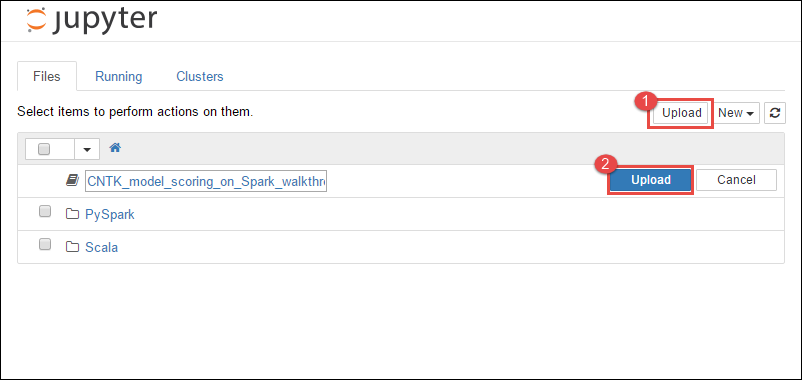

<properties
    pageTitle="用于进行深度学习的包含 Azure HDInsight Spark 的 Microsoft 认知工具包 | Azure"
    description="了解如何在 Azure HDInsight Spark 群集中使用 Spark Python API 将定型的 Microsoft 认知工具包深入学习模型应用于数据集。"
    services="hdinsight"
    documentationcenter=""
    author="nitinme"
    manager="jhubbard"
    editor="cgronlun"
    tags="azure-portal"
    translationtype="Human Translation" />
<tags
    ms.service="hdinsight"
    ms.custom="hdinsightactive"
    ms.workload="big-data"
    ms.tgt_pltfrm="na"
    ms.devlang="na"
    ms.topic="article"
    ms.date="03/28/2017"
    wacn.date="05/08/2017"
    ms.author="nitinme"
    ms.sourcegitcommit="2c4ee90387d280f15b2f2ed656f7d4862ad80901"
    ms.openlocfilehash="a5415b06a5d30acb7d3caf8c429e81a8824751cf"
    ms.lasthandoff="04/28/2017" />

# 将 Microsoft 认知工具包深入学习模型与 Azure HDInsight Spark 群集配合使用

在本文中，将执行以下步骤。

1. 运行自定义脚本，在 Azure HDInsight Spark 群集上安装 Microsoft 认知工具包。

2. 将 Jupyter 笔记本上传到 Spark 群集，以了解如何使用 [Spark Python API (PySpark)](https://spark.apache.org/docs/0.9.0/python-programming-guide.html) 将定型的 Microsoft 认知工具包深入学习模型应用于 Azure Blob 存储帐户中的文件

## 先决条件

* **一个 Azure 订阅**。 在开始学习本教程之前，你必须有一个 Azure 订阅。 请参阅[立即创建 Azure 试用帐户](/pricing/1rmb-trial/)。

* **Azure HDInsight Spark 群集**。 在本文中，将创建 Spark 2.0 群集。 有关说明，请参阅[在 Azure HDInsight 中创建 Apache Spark 群集](/documentation/articles/hdinsight-apache-spark-jupyter-spark-sql/)。

## 此解决方案的流程如何？

此解决方案分为两部分，即本文和作为本教程的一部分上传的 Jupyter 笔记本。 在本文中，完成以下步骤：

* 在 HDInsight Spark 群集上运行脚本操作，安装 Microsoft 认知工具包和 Python 包。
* 将运行解决方案的 Jupyter 笔记本上传到 HDInsight Spark 群集中。

以下其余步骤涵盖在 Jupyter 笔记本中。

- 将示例图像加载到 Spark 弹性分布式数据集或 RDD 中
    - 加载模块并定义预设
    - 将数据集下载到本地 Spark 群集上
    - 将数据集格转换为 RDD
- 使用定型的认知工具包模型对图像评分
    - 将定型的认知工具包模型下载到 Spark 群集
    - 定义由辅助角色节点使用的函数
    - 对辅助角色节点上的图像评分
    - 评估模型准确性

## 安装 Microsoft 认知工具包

可以使用脚本操作在 Spark 群集上安装 Microsoft 认知工具包。 脚本操作使用自定义脚本在群集上安装默认情况下未提供的组件。 可以从 Azure 门户预览、通过使用 HDInsight .NET SDK 或 Azure PowerShell，来使用自定义脚本。 还可以在创建群集过程中或者在群集已启动并运行之后使用脚本安装工具包。 

在本文中，我们在群集创建完成后使用门户安装该工具包。 有关运行自定义脚本的其他方式，请参阅[使用脚本操作自定义 HDInsight 群集](/documentation/articles/hdinsight-hadoop-customize-cluster-linux/)。

### 使用 Azure 门户预览

有关如何使用 Azure 门户预览运行脚本操作的说明，请参阅[使用脚本操作自定义 HDInsight 群集](/documentation/articles/hdinsight-hadoop-customize-cluster-linux/#use-a-script-action-during-cluster-creation)。 确保提供以下输入，以便安装 Microsoft 认知工具包。

* 提供脚本操作名称的值。

* 对于 **Bash 脚本 URI**，输入 `https://raw.githubusercontent.com/Azure-Samples/hdinsight-pyspark-cntk-integration/master/cntk-install.sh`。

* 确保仅在头节点上运行脚本。 清除辅助角色节点和 Zookeeper 节点的复选框。

* 单击“创建” 。

## 将 Jupyter 笔记本上传到 Azure HDInsight Spark 群集

若要将 Microsoft 认知工具包与 Azure HDInsight Spark 群集配合使用，必须将 Jupyter 笔记本 **CNTK_model_scoring_on_Spark_walkthrough.ipynb** 加载到 Azure HDInsight Spark 群集中。 此笔记本可在 GitHub 上通过以下地址获取：[https://github.com/Azure-Samples/hdinsight-pyspark-cntk-integration](https://github.com/Azure-Samples/hdinsight-pyspark-cntk-integration)。

1. 克隆 GitHub 存储库 [https://github.com/Azure-Samples/hdinsight-pyspark-cntk-integration](https://github.com/Azure-Samples/hdinsight-pyspark-cntk-integration)。 有关克隆的说明，请参阅 [Cloning a repository](https://help.github.com/articles/cloning-a-repository/)（克隆存储库）。

2. 从 Azure 门户预览中，打开已预配的“Spark 群集”边栏选项卡，依次单击“群集仪表板”和“Jupyter 笔记本”。

    也可以通过转到 URL `https://<clustername>.azurehdinsight.cn/jupyter/` 来启动 Jupyter 笔记本。 将 \<clustername> 替换为 HDInsight 群集名。

3. 从 Jupyter 笔记本中，单击右上角的“上传”，然后导航至克隆 GitHub 存储库的位置。

    

4. 再次单击“上传”。

5. 笔记本上传后，单击笔记本的名称，然后按照笔记本中有关如何加载数据集和执行教程的说明进行操作。

## 另请参阅
* [概述：Azure HDInsight 上的 Apache Spark](/documentation/articles/hdinsight-apache-spark-overview/)

### 方案
* [Spark 和 BI：使用 HDInsight 中的 Spark 和 BI 工具执行交互式数据分析](/documentation/articles/hdinsight-apache-spark-use-bi-tools/)
* [Spark 和机器学习：使用 HDInsight 中的 Spark 对使用 HVAC 数据生成温度进行分析](/documentation/articles/hdinsight-apache-spark-ipython-notebook-machine-learning/)
* [Spark 和机器学习：使用 HDInsight 中的 Spark 预测食品检查结果](/documentation/articles/hdinsight-apache-spark-machine-learning-mllib-ipython/)
* [Spark 流式处理：使用 HDInsight 中的 Spark 生成实时流式处理应用程序](/documentation/articles/hdinsight-apache-spark-eventhub-streaming/)
* [使用 HDInsight 中的 Spark 分析网站日志](/documentation/articles/hdinsight-apache-spark-custom-library-website-log-analysis/)

### 创建和运行应用程序
* [使用 Scala 创建独立的应用程序](/documentation/articles/hdinsight-apache-spark-create-standalone-application/)
* [使用 Livy 在 Spark 群集中远程运行作业](/documentation/articles/hdinsight-apache-spark-livy-rest-interface/)

### 工具和扩展
* [在 HDInsight 上的 Spark 群集中使用 Zeppelin 笔记本](/documentation/articles/hdinsight-apache-spark-use-zeppelin-notebook/)
* [在 HDInsight 的 Spark 群集中可用于 Jupyter 笔记本的内核](/documentation/articles/hdinsight-apache-spark-jupyter-notebook-kernels/)
* [将外部包与 Jupyter 笔记本配合使用](/documentation/articles/hdinsight-apache-spark-jupyter-notebook-use-external-packages/)
* [在计算机上安装 Jupyter 并连接到 HDInsight Spark 群集](/documentation/articles/hdinsight-apache-spark-jupyter-notebook-install-locally/)

### 管理资源
* [管理 Azure HDInsight 中 Apache Spark 群集的资源](/documentation/articles/hdinsight-apache-spark-resource-manager/)
* [跟踪和调试 HDInsight 中的 Apache Spark 群集上运行的作业](/documentation/articles/hdinsight-apache-spark-job-debugging/)

[hdinsight-versions]: /documentation/articles/hdinsight-component-versioning/
[hdinsight-upload-data]: /documentation/articles/hdinsight-upload-data/
[hdinsight-storage]: /documentation/articles/hdinsight-hadoop-use-blob-storage/

[azure-purchase-options]: /pricing/overview/
[azure-member-offers]: /pricing/member-offers/
[azure-trial]: /pricing/1rmb-trial/
[azure-management-portal]: https://manage.windowsazure.cn/
[azure-create-storageaccount]: /documentation/articles/storage-create-storage-account/