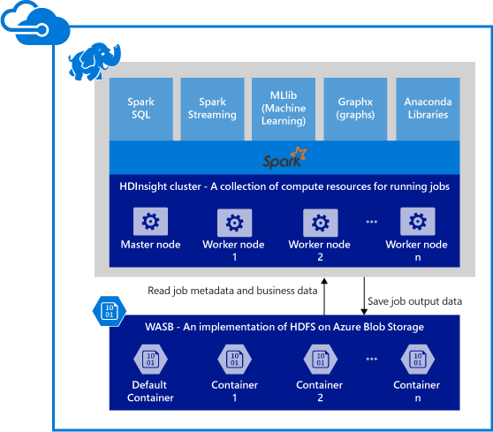

<properties
    pageTitle="Azure HDInsight 上的 Apache Spark 概述 | Azure"
    description="介绍 HDInsight 中的 Apache Spark，以及可在应用程序中使用 HDInsight 上的 Spark 的情况。"
    services="hdinsight"
    documentationcenter=""
    author="nitinme"
    manager="jhubbard"
    editor="cgronlun"
    tags="azure-portal"
    translationtype="Human Translation" />
<tags
    ms.assetid="82334b9e-4629-4005-8147-19f875c8774e"
    ms.service="hdinsight"
    ms.custom="hdinsightactive"
    ms.workload="big-data"
    ms.tgt_pltfrm="na"
    ms.devlang="na"
    ms.topic="get-started-article"
    ms.date="04/03/2017"
    wacn.date="05/08/2017"
    ms.author="nitinme"
    ms.sourcegitcommit="2c4ee90387d280f15b2f2ed656f7d4862ad80901"
    ms.openlocfilehash="43f119e41e9aa4e8e82f6f78d32ca75ec06c5f96"
    ms.lasthandoff="04/28/2017" />

# 概述：HDInsight 上的 Apache Spark

<a href="http://spark.apache.org/" target="_blank">Apache Spark</a> 是一种开放源代码并行处理框架，支持内存中处理，以提升大数据分析应用程序的性能。 Spark 处理引擎是专为速度、易用性和复杂分析打造的产品。 Spark 的内存中计算功能使其成为机器学习和图形计算中的迭代算法的最佳选择。 Spark 也能与 Azure 存储 (WASB) 兼容，因此你可以轻松地通过 Spark 处理存储在 Azure 中的现有数据。

在 HDInsight 中创建 Spark 群集时，即会创建已安装并配置了 Spark 的 Azure 计算资源。 在 HDInsight 中创建 Spark 群集只需要约十分钟。 系统将要处理的数据存储在 Azure 存储中。 请参阅[将 Azure 存储与 HDInsight 配合使用][hdinsight-storage]。

**想要开始在 Azure HDInsight 上使用 Apache Spark 吗？** 请参阅[快速入门：使用 Jupyter 在 HDInsight 上创建 Spark 群集并运行示例应用程序](/documentation/articles/hdinsight-apache-spark-jupyter-spark-sql/)。

> [AZURE.NOTE]
> 有关当前版本的已知问题和限制列表，请参阅 [Azure HDInsight 中 Apache Spark 的已知问题](/documentation/articles/hdinsight-apache-spark-known-issues/)。
> 
> 

## 为何要在 Azure HDInsight 上使用 Spark？
Azure HDInsight 提供完全托管的 Spark 服务。 在 HDInsight 上使用 Spark 的好处如下：

| 功能 | 说明 |
| --- | --- |
| 方便创建群集 |你可以使用 Azure 管理门户、Azure PowerShell 或 HDInsight .NET SDK，在几分钟之内于 HDInsight 上创建新的 Spark 群集。 请参阅 [HDInsight 中的 Spark 群集入门](/documentation/articles/hdinsight-apache-spark-jupyter-spark-sql/) |
| 易于使用 |HDInsight 群集中的 Spark 包含预先配置的 Jupyter 笔记本。 你可以使用这些笔记本执行交互式数据处理和可视化。 Jupyter 笔记本的 URL 为 https://CLUSTERNAME.azurehdinsight.cn/jupyter。 将 **CLUSTERNAME** 替换为 Spark HDInsight 群集的名称。 |
| REST API |HDInsight 中的 Spark 包含 [Livy](https://github.com/cloudera/hue/tree/master/apps/spark/java#welcome-to-livy-the-rest-spark-server)，它是基于 REST-API 的 Spark 作业服务器，用于远程提交和监视正在运行的作业。 |
| 与 Azure 服务集成 |HDInsight 上的 Spark 随附了 Azure 事件中心的连接器。客户还可以使用事件中心来生成流式处理应用程序。 |
| 并发查询 |HDInsight 中的 Spark 支持并发查询。 它允许一个用户运行多个查询，或者不同的用户运行多个查询，以及让应用程序共享相同的群集资源。 |
| SSD 缓存 |你可以选择将数据缓存在内存中，或缓存在已附加到群集节点的 SSD 中。 内存缓存提供最佳的查询性能，但可能费用不菲；SSD 缓存是改善查询性能的绝佳选项，而且你不需要根据内存中的整个数据集创建满足其需求的群集规模。 |
| 与 BI 工具集成 |HDInsight 的 Spark 提供 BI 工具（如 [Power BI](http://www.powerbi.com/) 和 [Tableau](http://www.tableau.com/products/desktop)）的连接器用于数据分析。 |
| 预先加载的 Anaconda 库 |HDInsight 上的 Spark 群集随附预先安装的 Anaconda 库。 [Anaconda](http://docs.continuum.io/anaconda/) 提供将近 200 个用于机器学习、数据分析、可视化等的库。 |
| 可伸缩性 |虽然可以在创建过程中指定群集中的节点数，但你可能需要扩大或收缩群集以匹配工作负载。 所有 HDInsight 群集允许你更改群集中的节点数。 此外，由于所有数据都存储在 Azure 存储中，因此你可以在不丢失数据的情况下删除 Spark 群集。 |
| 全天候支持 |HDInsight 上的 Spark 附有企业级的全天候支持和保证正常运行时间达 99.9% 的 SLA。 |

## HDInsight 上的 Spark 有哪些用例？
HDInsight 中的 Apache Spark 适用于以下主要方案。

### 交互式数据分析和 BI
[观看教程](/documentation/articles/hdinsight-apache-spark-use-bi-tools/)

HDInsight 中的 Apache Spark 将数据存储在 Azure Blob 内。 商务专家和重要决策者可以利用这些数据来进行分析和创建报告，并使用 Microsoft Power BI 来根据分析数据生成交互式报告。 分析师可以从 Azure 存储空间内的非结构化/半结构化数据着手、使用笔记本来定义数据的架构，然后使用 Microsoft Power BI 生成数据模型。 HDInsight 中的 Spark 还支持 Tableau、Qlikview 和 SAP Lumira 等多种第三方 BI 工具，因此能成为数据分析师、商务专家和重要决策者的理想平台。

### 迭代机器学习
[查看教程：使用 HVAC 数据预测建筑物温度](/documentation/articles/hdinsight-apache-spark-ipython-notebook-machine-learning/)

[查看教程：预测食品检测结果](/documentation/articles/hdinsight-apache-spark-machine-learning-mllib-ipython/)

Apache Spark 随附 [MLlib](http://spark.apache.org/mllib/)- 构建在 Spark 基础之上的机器学习库。 此外，HDInsight 上的 Spark 还包含 Anaconda - 为机器学习提供各种包的 Python 分发版。 结合内置的 Jupyter 笔记本支持，你将拥有最先进的机器学习应用程序创建环境。  

### 流式处理和实时数据分析
[观看教程](/documentation/articles/hdinsight-apache-spark-eventhub-streaming/)

不论是通过在数据抵达时进行处理来缩短获取数据见解的时间，或是生成真正的流式处理解决方案，这些方案都在实时数据分析的适用范围内。 HDInsight 中的 Spark 提供丰富的支持供你生成实时分析解决方案。 尽管 Spark 已随附从 Flume、Twitter、ZeroMQ 或 TCP 套接字等众多来源引入数据的连接器，但 HDInsight 中的 Spark 增加了一流的支持，供你从 Azure 事件中心引入数据。 事件中心是 Azure 上最广泛使用的队列服务。 拥有立即可用的事件中心支持，让 HDInsight 中的 Spark 成为生成实时分析管道的理想平台。

## Spark 群集包含哪些组件？
默认情况下，HDInsight 中的 Spark 可通过群集提供以下组件。

* [Spark Core](https://spark.apache.org/docs/1.5.1/)。 包括 Spark Core、Spark SQL、Spark 流式处理 API、GraphX 和 MLlib。
* [Anaconda](http://docs.continuum.io/anaconda/)
* [Livy](https://github.com/cloudera/hue/tree/master/apps/spark/java#welcome-to-livy-the-rest-spark-server)
* [Jupyter 笔记本](https://jupyter.org)
* [Zeppelin 笔记本](http://zeppelin-project.org/)

HDInsight 中的 Spark 还提供 [ODBC 驱动程序](http://go.microsoft.com/fwlink/?LinkId=616229) ，可让你从 Microsoft Power BI 和 Tableau 等 BI 工具连接到 HDInsight 中的 Spark 群集。

## 从哪里开始？
首先，请在 HDInsight Linux 上创建一个 Spark 群集。 请参阅 [快速入门：使用 Jupyter 在 HDInsight Linux 上创建 Spark 群集并运行示例应用程序](/documentation/articles/hdinsight-apache-spark-jupyter-spark-sql/)。 

## 后续步骤
### 方案
* [Spark 和 BI：使用 HDInsight 中的 Spark 和 BI 工具执行交互式数据分析](/documentation/articles/hdinsight-apache-spark-use-bi-tools/)
* [Spark 和机器学习：使用 HDInsight 中的 Spark 对使用 HVAC 数据生成温度进行分析](/documentation/articles/hdinsight-apache-spark-ipython-notebook-machine-learning/)
* [Spark 和机器学习：使用 HDInsight 中的 Spark 预测食品检查结果](/documentation/articles/hdinsight-apache-spark-machine-learning-mllib-ipython/)
* [Spark 流式处理：使用 HDInsight 中的 Spark 生成实时流式处理应用程序](/documentation/articles/hdinsight-apache-spark-eventhub-streaming/)
* [使用 HDInsight 中的 Spark 分析网站日志](/documentation/articles/hdinsight-apache-spark-custom-library-website-log-analysis/)

### 创建和运行应用程序
* [使用 Scala 创建独立的应用程序](/documentation/articles/hdinsight-apache-spark-create-standalone-application/)
* [使用 Livy 在 Spark 群集中远程运行作业](/documentation/articles/hdinsight-apache-spark-livy-rest-interface/)

### 工具和扩展
* [在 HDInsight 上的 Spark 群集中使用 Zeppelin 笔记本](/documentation/articles/hdinsight-apache-spark-use-zeppelin-notebook/)
* [在 HDInsight 的 Spark 群集中可用于 Jupyter 笔记本的内核](/documentation/articles/hdinsight-apache-spark-jupyter-notebook-kernels/)
* [Use external packages with Jupyter notebooks（将外部包与 Jupyter 笔记本配合使用）](/documentation/articles/hdinsight-apache-spark-jupyter-notebook-use-external-packages/)
* [Install Jupyter on your computer and connect to an HDInsight Spark cluster（在计算机上安装 Jupyter 并连接到 HDInsight Spark 群集）](/documentation/articles/hdinsight-apache-spark-jupyter-notebook-install-locally/)

### 管理资源
* [管理 Azure HDInsight 中 Apache Spark 群集的资源](/documentation/articles/hdinsight-apache-spark-resource-manager/)
* [跟踪和调试 HDInsight 中的 Apache Spark 群集上运行的作业](/documentation/articles/hdinsight-apache-spark-job-debugging/)

[hdinsight-storage]: /documentation/articles/hdinsight-hadoop-use-blob-storage/