<!-- not suitable for Mooncake -->

<properties
    pageTitle="将 BI 工具与 HDInsight 上的 Apache Spark 配合使用 | Azure"
    description="逐步介绍如何在 Apache Spark 上使用笔记本，基于原始数据创建架构并将其保存为 Hive 表，然后使用 BI 工具分析 Hive 表中的数据"
    services="hdinsight"
    documentationcenter=""
    author="nitinme"
    manager="jhubbard"
    editor="cgronlun"
    tags="azure-portal" />
<tags 
    ms.assetid="1448b536-9bc8-46bc-bbc6-d7001623642a"
    ms.service="hdinsight"
    ms.workload="big-data"
    ms.tgt_pltfrm="na"
    ms.devlang="na"
    ms.topic="article"
    ms.date="01/06/2017"
    wacn.date="01/25/2017"
    ms.author="nitinme" />

# 将 BI 工具与 HDInsight Linux 上的 Apache Spark 群集配合使用
了解如何使用 Azure HDInsight 中的 Apache Spark 执行以下操作：

* 获取原始示例数据并将其保存为 Hive 表
* 使用 Power BI 与 Tableau 等 BI 工具分析和可视化数据。

本教程也可用作在 HDInsight 中创建的 Spark (Linux) 群集上的 Jupyter 笔记本。笔记本体验将通过笔记本本身运行 Python 代码段。要在笔记本中执行本教程，请创建 Spark 群集，启动 Jupyter 笔记本 (`https://CLUSTERNAME.azurehdinsight.cn/jupyter`)，然后运行 **Python** 文件夹中的笔记本“将 BI 工具与 HDInsight.ipynb 上的 Apache Spark 配合使用”。

**先决条件：**

你必须具有以下各项：

* Azure 订阅。请参阅[获取 Azure 试用版](/pricing/1rmb-trial/)。
* HDInsight Linux 上的 Apache Spark 群集。有关说明，请参阅 [Create Apache Spark clusters in Azure HDInsight](/documentation/articles/hdinsight-apache-spark-jupyter-spark-sql/)（在 Azure HDInsight 中创建 Apache Spark 群集）。
* 安装 Microsoft Spark ODBC 驱动程序的计算机（HDInsight 上的 Spark 需要驱动程序才能使用 Tableau）。可从[此处](http://go.microsoft.com/fwlink/?LinkId=616229)安装该驱动程序。
* [Power BI](http://www.powerbi.com/) 或 [Tableau Desktop](http://www.tableau.com/products/desktop) 等 BI 工具。可以从 [http://www.powerbi.com/](http://www.powerbi.com/) 获取免费的 Power BI 预览版订阅。

## 将原始数据保存为 Hive 表
在本节中，使用与 HDInsight 中的 Apache Spark 群集关联的 [Jupyter](https://jupyter.org) 笔记本，运行处理原始数据示例并将其保存为 Hive 表的作业。数据示例是所有群集默认提供的 .csv 文件 (hvac.csv)。

将数据保存为 Hive 表后，下一节将使用 Power BI 和 Tableau 等 BI 工具连接 Hive 表。

1. 在 [Azure 门户预览](https://portal.azure.cn/)上的启动板中，单击 Spark 群集的磁贴（如果已将它固定到启动板）。也可以在“全部浏览”>“HDInsight 群集”下导航到你的群集。
2. 在“Spark 群集”边栏选项卡中，单击“群集仪表板”，然后单击“Jupyter 笔记本”。出现提示时，请输入群集的管理员凭据。

    > [AZURE.NOTE]
    也可以在浏览器中打开以下 URL 来访问群集的 Jupyter 笔记本。将 **CLUSTERNAME** 替换为群集的名称：
    >

    > `https://CLUSTERNAME.azurehdinsight.cn/jupyter`
    >
    >
3. 创建新的笔记本。单击“新建”，然后单击“PySpark”。

    
4. 新笔记本随即已创建，并以 Untitled.pynb 名称打开。在顶部单击笔记本名称，然后输入一个友好名称。

    
5. 使用笔记本是使用 PySpark 内核创建的，因此不需要显式创建任何上下文。当你运行第一个代码单元格时，系统将自动为你创建 Spark 和 Hive 上下文。首先，可以导入此方案所需的类型。为此，请将光标放在单元格中，然后按 **SHIFT + ENTER**。

        from pyspark.sql import *
6. 将示例数据载入临时表。在 HDInsight 中创建 Spark 群集时，系统会将数据示例文件 **hvac.csv** 复制到 **\\HdiSamples\\HdiSamples\\SensorSampleData\\hvac** 下的关联存储帐户。

    将以下代码段粘贴到空白单元格中，然后按 **SHIFT + ENTER**。此代码段会将数据注册到名为 **hvac** 的 Hive 表。

        # Create an RDD from sample data
        hvacText = sc.textFile("wasbs:///HdiSamples/HdiSamples/SensorSampleData/hvac/HVAC.csv")

        # Create a schema for our data
        Entry = Row('Date', 'Time', 'TargetTemp', 'ActualTemp', 'BuildingID')

        # Parse the data and create a schema
        hvacParts = hvacText.map(lambda s: s.split(',')).filter(lambda s: s[0] != 'Date')
        hvac = hvacParts.map(lambda p: Entry(str(p[0]), str(p[1]), int(p[2]), int(p[3]), int(p[6])))

        # Infer the schema and create a table       
        hvacTable = sqlContext.createDataFrame(hvac)
        hvacTable.registerTempTable('hvactemptable')
        dfw = DataFrameWriter(hvacTable)
        dfw.saveAsTable('hvac')

1. 验证创建表是否成功。可以使用 `%%sql` 幻数直接运行 Hive 查询。有关 `%%sql` 幻数以及可在 PySpark 内核中使用的其他幻数的详细信息，请参阅 [Kernels available on Jupyter notebooks with Spark HDInsight clusters](/documentation/articles/hdinsight-apache-spark-jupyter-notebook-kernels/#why-should-i-use-the-pyspark-or-spark-kernels)（包含 Spark HDInsight 群集的 Jupyter 笔记本上可用的内核）。

        %%sql
        SHOW TABLES

    输出应如下所示：

        +-----------+---------------+
        |isTemporary|tableName        |
        +-----------+---------------+
        |       true|hvactemptable  |
        |      false|hivesampletable|
        |      false|hvac            |
        +-----------+---------------+

    只有 **isTemporary** 列中包含 false 的表才是要存储在元存储，并且可通过 BI 工具访问的 Hive 表。在本教程中，连接到刚创建的 **hvac** 表。

1. 验证表是否包含所需的数据。将以下代码段粘贴到笔记本的空白单元格中，然后按 **SHIFT + ENTER**。

        %%sql
        SELECT * FROM hvac LIMIT 10
2. 现在，可以关闭笔记本以释放资源。为此，在笔记本的“文件”菜单中，单击“关闭并停止”。这将会关闭笔记本。

## 使用 Power BI 分析 Hive 表中的数据
将数据保存为 Hive 表后，可以使用 Power BI 连接数据并以可视化方式呈现，以便创建报告和仪表板等。

1. 登录 [Power BI](http://www.powerbi.com/)。
2. 在“欢迎”屏幕中，单击“数据库和其他信息”。

    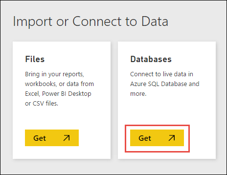
3. 在下一个屏幕上，单击“Azure HDInsight 上的 Spark”，然后单击“连接”。出现提示时，请输入群集 URL (`mysparkcluster.azurehdinsight.cn`) 和用于连接到群集的凭据。

    建立连接后，Power BI 开始从 HDInsight 上的 Spark 群集导入数据。
4. Power BI 导入数据，并在“数据集”标题下方添加新 Spark 数据集。单击数据集打开新工作表，以可视化数据。还可以将工作表另存为报表。如要保存工作表，请单击“文件”菜单中的“保存”。

    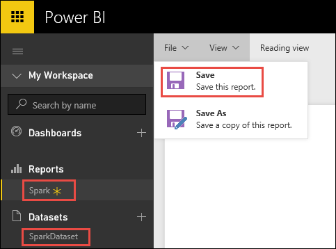
5. 请注意，右侧“字段”列表列出前面创建的 **hvac** 表。展开该表，以查看前面在笔记本的表中定义的字段。

    
6. 生成视觉效果，以显示每栋建筑物目标温度与实际温度之间的差异。选择“分区图”（在红框中显示）以可视化数据。要定义轴，请将“BuildingID”字段拖放到“轴”下方，并将“ActualTemp”/“TargetTemp”字段拖放到“值”下方。

    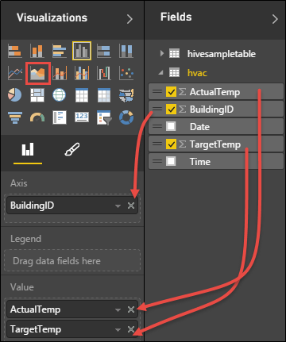  

7. 默认情况下，视觉效果会显示 **ActualTemp** 和 **TargetTemp** 的总和。对于这两个字段，从下拉列表中选择“平均”以求出两栋建筑物的实际和目标温度的平均值。

    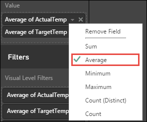
8. 数据视觉效果应类似如下。在视觉效果上移动光标可获取相关数据的工具提示。

    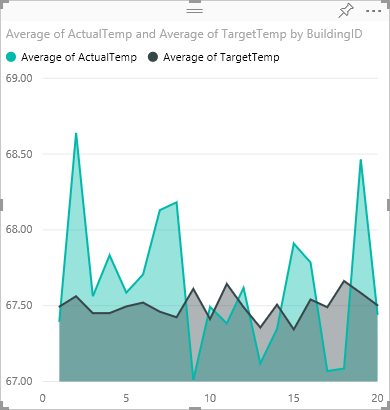
9. 在顶部菜单中，单击“保存”并提供报表名称。还可以固定视觉效果。固定视觉效果时，系统会将其存储在仪表板上，以便直观跟踪最新值。

    可以针对同一个数据集添加任意数量的视觉效果，并将其固定在仪表板上，以获取数据快照。此外，HDInsight 上的 Spark 群集直接连接到 Power BI。这意味着，Power BI 随时能够获取群集的最新信息，因此不需要计划数据集的刷新。

## 使用 Tableau Desktop 分析 Hive 表中的数据

> [AZURE.NOTE]
本部分仅适用于在 Azure HDInsight 中创建的 Spark 1.5.2 群集。
>
>

1. 启动 Tableau Desktop。在左窗格中，从要连接到的服务器列表中单击“Spark SQL”。如果左窗格中默认未列出 Spark SQL，可以单击“更多服务器”查找。
2. 在 Spark SQL 连接对话框中，按照下图所示输入值，然后单击“确定”。

    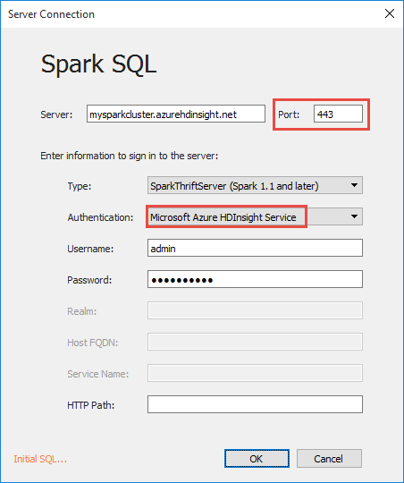

    只有计算机已安装 [Microsoft Spark ODBC 驱动程序](http://go.microsoft.com/fwlink/?LinkId=616229)，身份验证下拉列表才将“Azure HDInsight 服务”列作为选项。
3. 在下一个屏幕上，从“架构”下拉列表中单击“查找”图标，然后单击“默认”。

    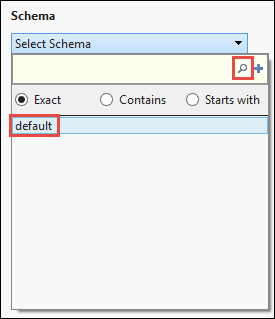
4. 对于“表”字段，请再次单击“查找”图标以列出群集中可用的所有 Hive 表。将显示之前使用笔记本创建的 **hvac** 表。

    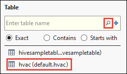
5. 将表拖放到右侧的顶部框中。Tableau 导入数据，并以红色框突出显示架构。

    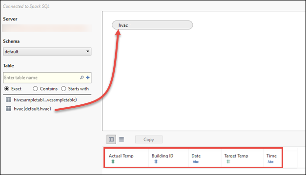
6. 单击左下角的“工作表 1”选项卡。针对每个日期生成一种视觉效果，用于显示所有建筑物的目标温度和实际温度平均值。将“日期”和“建筑物 ID”拖到“列”，并将“实际温度”/“目标温度”拖到“行”。在“标记”下选择“区域”，以使用区域映射视觉效果。

    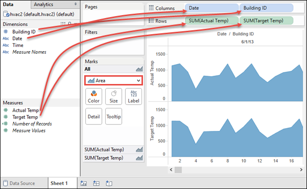  

7. 默认情况下，温度字段显示为聚合值。如果要显示平均温度，可从下拉列表中执行该操作，如下所示。

    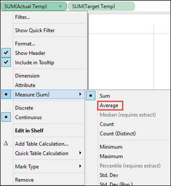
8. 也可以将一个温度映射叠加在另一个温度映射上，以便更好感受目标温度和实际温度之间的差异。将鼠标移到下方区域映射的角落，直到出现以红色圆圈突出显示的控点形状为止。将映射拖到顶部的其他映射，当出现以红色矩形突出显示的形状时释放鼠标。

    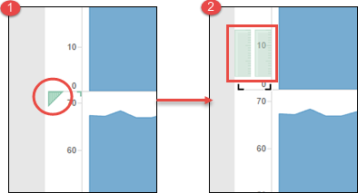

    数据视觉效果更改应如下所示：

    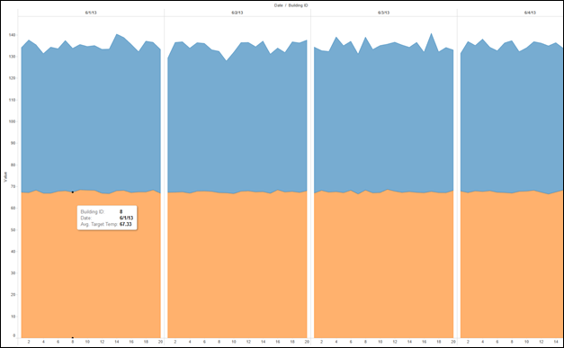
9. 单击“保存”以保存工作表。可以创建仪表板，并在其中添加一个或多个工作表。

## 另请参阅
* [概述：Azure HDInsight 上的 Apache Spark](/documentation/articles/hdinsight-apache-spark-overview/)

### 方案
* [Spark 和机器学习：使用 HDInsight 中的 Spark 对使用 HVAC 数据生成温度进行分析](/documentation/articles/hdinsight-apache-spark-ipython-notebook-machine-learning/)
* [Spark 流式处理：使用 HDInsight 中的 Spark 生成实时流式处理应用程序](/documentation/articles/hdinsight-apache-spark-eventhub-streaming/)

### 创建和运行应用程序
* [使用 Livy 在 Spark 群集中远程运行作业](/documentation/articles/hdinsight-apache-spark-livy-rest-interface/)

### 工具和扩展
* [在 HDInsight 上的 Spark 群集中使用 Zeppelin 笔记本](/documentation/articles/hdinsight-apache-spark-use-zeppelin-notebook/)
* [在 HDInsight 的 Spark 群集中可用于 Jupyter 笔记本的内核](/documentation/articles/hdinsight-apache-spark-jupyter-notebook-kernels/)
* [Use external packages with Jupyter notebooks（将外部包与 Jupyter 笔记本配合使用）](/documentation/articles/hdinsight-apache-spark-jupyter-notebook-use-external-packages/)
* [Install Jupyter on your computer and connect to an HDInsight Spark cluster（在计算机上安装 Jupyter 并连接到 HDInsight Spark 群集）](/documentation/articles/hdinsight-apache-spark-jupyter-notebook-install-locally/)

### 管理资源
* [管理 Azure HDInsight 中 Apache Spark 群集的资源](/documentation/articles/hdinsight-apache-spark-resource-manager/)
* [Track and debug jobs running on an Apache Spark cluster in HDInsight（跟踪和调试 HDInsight 中的 Apache Spark 群集上运行的作业）](/documentation/articles/hdinsight-apache-spark-job-debugging/)

[hdinsight-versions]: /documentation/articles/hdinsight-component-versioning/
[hdinsight-upload-data]: /documentation/articles/hdinsight-upload-data/
[hdinsight-storage]: /documentation/articles/hdinsight-hadoop-use-blob-storage/

[azure-purchase-options]: /pricing/overview/
[azure-member-offers]: /pricing/member-offers/
[azure-trial]: /pricing/1rmb-trial/
[azure-management-portal]: https://manage.windowsazure.cn/
[azure-create-storageaccount]: /documentation/articles/storage-create-storage-account/

<!---HONumber=Mooncake_0120_2017-->