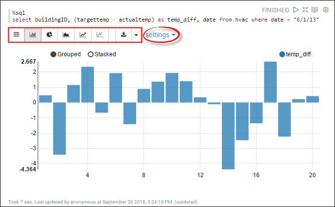
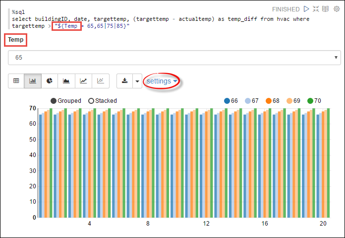
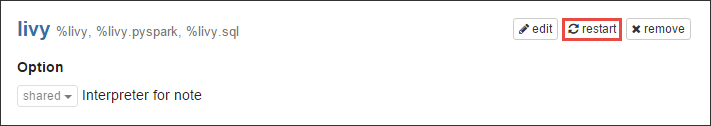

<properties
    pageTitle="在 HDInsight Linux 上的 Spark 群集中使用 Zeppelin 笔记本 | Azure"
    description="逐步说明如何在 HDInsight Linux 上的 Spark 群集中使用 Zeppelin 笔记本。"
    services="hdinsight"
    documentationcenter=""
    author="nitinme"
    manager="jhubbard"
    editor="cgronlun" />
<tags 
    ms.assetid="df489d70-7788-4efa-a089-e5e5006421e2"
    ms.service="hdinsight"
    ms.workload="big-data"
    ms.tgt_pltfrm="na"
    ms.devlang="na"
    ms.topic="article"
    ms.date="01/04/2017"
    wacn.date="01/25/2017"
    ms.author="nitinme" />

# 在 HDInsight Linux 上的 Apache Spark 群集中使用 Zeppelin 笔记本
HDInsight Spark 群集包括可用于运行 Spark 作业 Zeppelin 笔记本。本文中你将了解如何在 HDInsight 群集中使用 Zeppelin 笔记本。

> [AZURE.NOTE]
默认情况下，Zeppelin 笔记本仅适用于 HDInsight 群集版本 3.5 上的 Spark 1.6.2。如果要在其他版本的 HDInsight Spark 群集上使用 Zeppelin，可以使用脚本操作安装 Zeppelin。有关说明，请参阅[为 HDInsight Linux 上的 Apache Spark 群集安装 Zeppelin 笔记本](/documentation/articles/hdinsight-apache-spark-use-zeppelin-notebook/)。
> 
>

**先决条件：**

* Azure 订阅。请参阅[获取 Azure 试用版](/pricing/1rmb-trial/)。
* Apache Spark 群集。有关说明，请参阅 [Create Apache Spark clusters in Azure HDInsight](/documentation/articles/hdinsight-apache-spark-jupyter-spark-sql/)（在 Azure HDInsight 中创建 Apache Spark 群集）。

## 启动 Zeppelin 笔记本。
1. 在“Spark 群集”边栏选项卡中，单击“群集仪表板”，然后单击“Zeppelin 笔记本”。出现提示时，请输入群集的管理员凭据。
   
    > [AZURE.NOTE]
    也可以在浏览器中打开以下 URL 来访问群集的 Zeppelin 笔记本。将 **CLUSTERNAME** 替换为群集的名称：
    > 

    > `https://CLUSTERNAME.azurehdinsight.cn/zeppelin`
    > 
    > 
2. 创建新的笔记本。在标题窗格中单击“笔记本”，然后单击“创建新笔记”。
   
      

   
    输入笔记本的名称，然后单击“创建笔记”。
3. 此外，请确保笔记本标题显示“已连接”状态。该状态由右上角的一个绿点表示。
   
      

4. 将示例数据载入临时表。在 HDInsight 中创建 Spark 群集时，系统会将示例数据文件 **hvac.csv** 复制到 **\\HdiSamples\\SensorSampleData\\hvac** 下的关联存储帐户。
   
    将以下代码段粘贴到新笔记本中默认创建的空白段落处。
   
        %livy.spark
        //The above magic instructs Zeppelin to use the Livy Scala interpreter
   
        // Create an RDD using the default Spark context, sc
        val hvacText = sc.textFile("wasbs:///HdiSamples/HdiSamples/SensorSampleData/hvac/HVAC.csv")
   
        // Define a schema
        case class Hvac(date: String, time: String, targettemp: Integer, actualtemp: Integer, buildingID: String)
   
        // Map the values in the .csv file to the schema
        val hvac = hvacText.map(s => s.split(",")).filter(s => s(0) != "Date").map(
            s => Hvac(s(0), 
                    s(1),
                    s(2).toInt,
                    s(3).toInt,
                    s(6)
            )
        ).toDF()
   
        // Register as a temporary table called "hvac"
        hvac.registerTempTable("hvac")
   
    按 **SHIFT + ENTER** 或单击“播放”按钮，使段落运行代码段。段落右上角的状态应从“就绪”逐渐变成“挂起”、“正在运行”和“已完成”。输出将显示在同一段落的底部。屏幕截图如下所示：
   
    
   
    你也可以为每个段落提供标题。单击右下角的“设置”图标，然后单击“显示标题”。
5. 现在可以针对 **hvac** 表运行 Spark SQL 语句。将以下查询粘贴到新段落中。该查询将检索建筑物 ID，以及每栋建筑物在指定日期的目标温度与实际温度之间的差异。按 **SHIFT + ENTER**。
   
        %sql
        select buildingID, (targettemp - actualtemp) as temp_diff, date from hvac where date = "6/1/13" 
   
    开头的 **%Sql** 语句告诉笔记本要使用 Livy Scala 解释器。
   
    以下屏幕快照显示了输出。
   
    
   
    单击显示选项（以矩形突出显示）以针对相同输出切换不同的表示形式。单击“设置”以选择构成输出中的密钥和值的项。以上屏幕截图使用 **buildingID** 作为密钥，使用 **temp\_diff** 平均值作为值。
6. 你还可以在查询中使用变量来运行 Spark SQL 语句。下一个代码段演示如何在查询中使用你可以用来查询的值定义 **Temp** 变量。当你首次运行查询时，下拉列表中会自动填充你指定的变量值。
   
        %sql
        select buildingID, date, targettemp, (targettemp - actualtemp) as temp_diff from hvac where targettemp > "${Temp = 65,65|75|85}" 
   
    将此代码段粘贴到新段落，然后按 **SHIFT + ENTER**。以下屏幕快照显示了输出。
   
    
   
    对于后续查询，可以从下拉列表中选择新值，然后再次运行查询。单击“设置”以选择构成输出中的密钥和值的项。以上屏幕截图使用 **buildingID** 作为密钥，使用 **temp\_diff** 平均值作为值，使用 **targettemp** 作为组。
7. 重启 Livy 解释器以退出应用程序。若要执行此操作，请单击右上角的登录用户名，打开解释器设置，然后单击“解释器”。
   
      

8. 滚动到 Livy 解释器设置，然后单击“重启”。
   
      

## 如何在笔记本中使用外部包？
在 HDInsight (Linux) 上的 Apache Spark 群集中配置 Zeppelin 笔记本，以使用当前未包含在群集中的、由社区贡献的外部包。可以在 [Maven 存储库](http://search.maven.org/)中搜索可用包的完整列表。也可以从其他源获取可用包的列表。例如，[Spark 包](http://spark-packages.org/)中提供了社区贡献包的完整列表。

本文中你将了解如何在 Jupyter 笔记本中使用 [spark-csv](http://search.maven.org/#artifactdetails%7Ccom.databricks%7Cspark-csv_2.10%7C1.4.0%7Cjar) 包。

1. 打开解释器设置。单击右上角的登录用户名，然后单击“解释器”。
   
      

2. 滚动到 Livy 解释器设置，然后单击“编辑”。
   
      

3. 添加名为 **livy.spark.jars.packages** 的新键，并将其值的格式设为 `group:id:version`。因此，如果想要使用 [spark csv](http://search.maven.org/#artifactdetails%7Ccom.databricks%7Cspark-csv_2.10%7C1.4.0%7Cjar) 包，必须将该键的值设为 `com.databricks:spark-csv_2.10:1.4.0`。
   
      

   
    单击“保存”，然后重启 Livy 解释器。
4. **提示**：如果想要了解如何获得上面输入的键值，以下为相应步骤。
   
    a.在 Maven 存储库中找出该包。在本教程中，我们使用 [spark-csv](http://search.maven.org/#artifactdetails%7Ccom.databricks%7Cspark-csv_2.10%7C1.4.0%7Cjar)。
   
    b.从存储库中收集 **GroupId**、**ArtifactId** 和 **Version** 的值。
   
      

   
    c.串连这三个值并以冒号分隔 (**:**)。
   
        com.databricks:spark-csv_2.10:1.4.0

## Zeppelin 笔记本保存在何处？
Zeppelin 笔记本保存在群集头节点。因此，如果删除群集，笔记本也将被删除。如果想要保留笔记本以供将来在其他群集中使用，那么必须在运行完作业之后，将笔记本导出。若要导出笔记本，请单击下图显示的“导出”图标。

  

此操作可在下载位置将笔记本保存为 JSON 文件。

## Livy 会话管理
在 Zeppelin 笔记本中运行第一个代码段时，在 HDInsight Spark 群集中创建了新的 Livy 会话。此会话在随后创建的所有 Zeppelin 笔记本中共享。如果由于某种原因 Livy 会话停止了（群集重启等），则不能在 Zeppelin 笔记本中运行作业。

在这种情况下，必须首先执行以下步骤，然后才能开始在 Zeppelin 笔记本中运行作业。

1. 在 Zeppelin 笔记本中重启 Livy 解释器。若要执行此操作，请单击右上角的登录用户名，打开解释器设置，然后单击“解释器”。
   
      

2. 滚动到 Livy 解释器设置，然后单击“重启”。
   
      

3. 在现有的 Zeppelin 笔记本中运行代码单元。此操作可在 HDInsight 群集中创建新的 Livy 会话。

## 另请参阅
* [概述：Azure HDInsight 上的 Apache Spark](/documentation/articles/hdinsight-apache-spark-overview/)

### 方案
* [Spark 和 BI：使用 HDInsight 中的 Spark 和 BI 工具执行交互式数据分析](/documentation/articles/hdinsight-apache-spark-use-bi-tools/)
* [Spark 和机器学习：使用 HDInsight 中的 Spark 对使用 HVAC 数据生成温度进行分析](/documentation/articles/hdinsight-apache-spark-ipython-notebook-machine-learning/)
* [Spark 和机器学习：使用 HDInsight 中的 Spark 预测食品检查结果](/documentation/articles/hdinsight-apache-spark-machine-learning-mllib-ipython/)
* [Spark 流式处理：使用 HDInsight 中的 Spark 生成实时流式处理应用程序](/documentation/articles/hdinsight-apache-spark-eventhub-streaming/)
* [使用 HDInsight 中的 Spark 分析网站日志](/documentation/articles/hdinsight-apache-spark-custom-library-website-log-analysis/)

### 创建和运行应用程序
* [使用 Scala 创建独立的应用程序](/documentation/articles/hdinsight-apache-spark-create-standalone-application/)
* [使用 Livy 在 Spark 群集中远程运行作业](/documentation/articles/hdinsight-apache-spark-livy-rest-interface/)

### 工具和扩展
* [在 HDInsight 的 Spark 群集中可用于 Jupyter 笔记本的内核](/documentation/articles/hdinsight-apache-spark-jupyter-notebook-kernels/)
* [Use external packages with Jupyter notebooks（将外部包与 Jupyter 笔记本配合使用）](/documentation/articles/hdinsight-apache-spark-jupyter-notebook-use-external-packages/)
* [Install Jupyter on your computer and connect to an HDInsight Spark cluster（在计算机上安装 Jupyter 并连接到 HDInsight Spark 群集）](/documentation/articles/hdinsight-apache-spark-jupyter-notebook-install-locally/)

### 管理资源
* [管理 Azure HDInsight 中 Apache Spark 群集的资源](/documentation/articles/hdinsight-apache-spark-resource-manager/)
* [Track and debug jobs running on an Apache Spark cluster in HDInsight（跟踪和调试 HDInsight 中的 Apache Spark 群集上运行的作业）](/documentation/articles/hdinsight-apache-spark-job-debugging/)

[hdinsight-versions]: /documentation/articles/hdinsight-component-versioning/
[hdinsight-upload-data]: /documentation/articles/hdinsight-upload-data/
[hdinsight-storage]: /documentation/articles/hdinsight-hadoop-use-blob-storage/

[azure-purchase-options]: /pricing/overview/
[azure-member-offers]: /pricing/member-offers/
[azure-trial]: /pricing/1rmb-trial/
[azure-management-portal]: https://manage.windowsazure.cn/
[azure-create-storageaccount]: /documentation/articles/storage-create-storage-account/

<!---HONumber=Mooncake_0120_2017-->