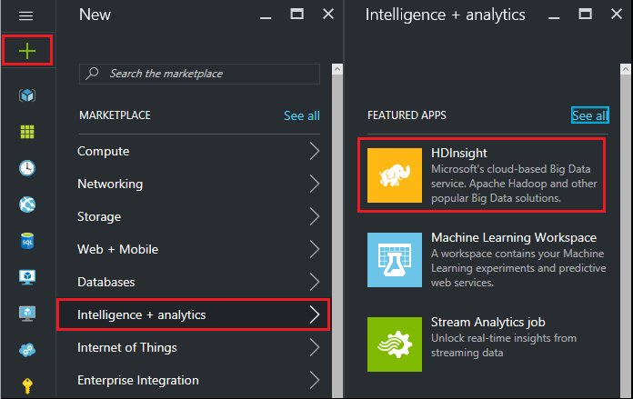
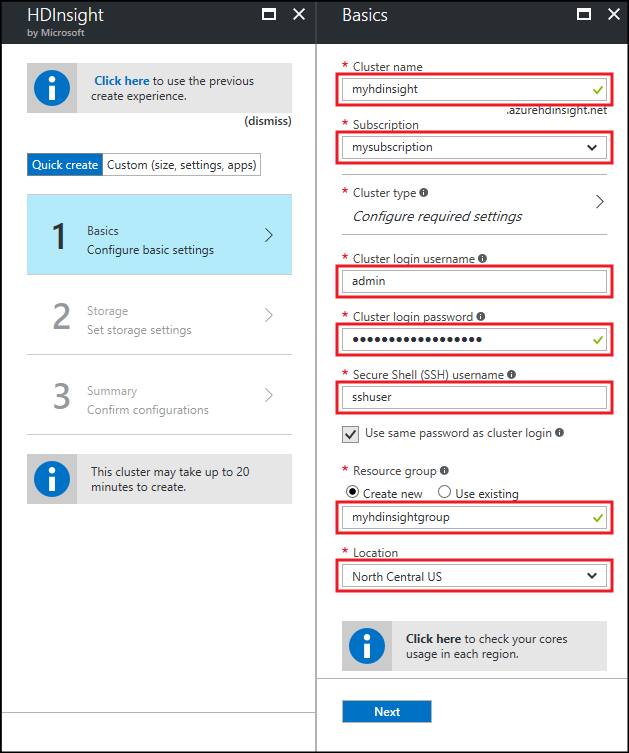
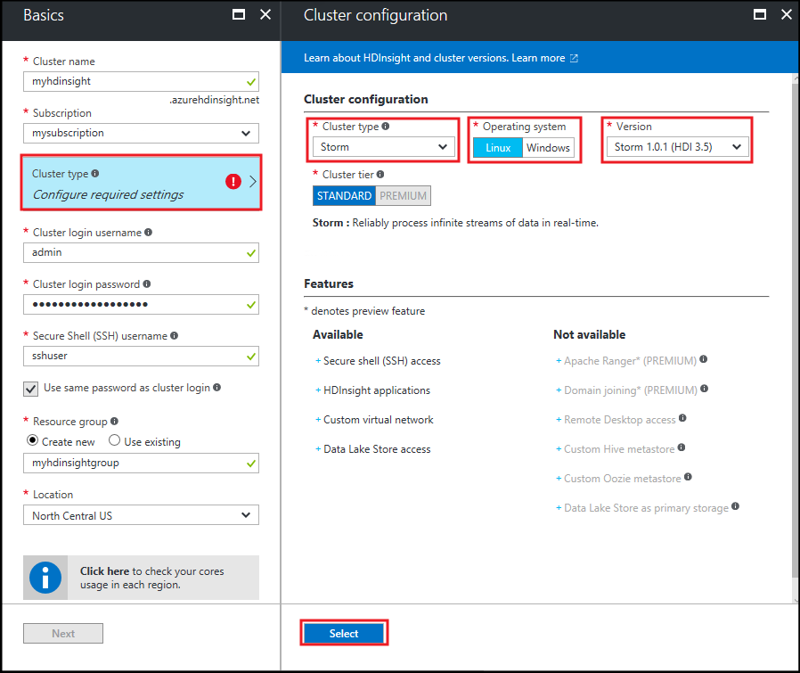
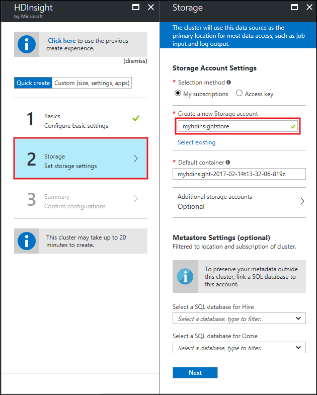
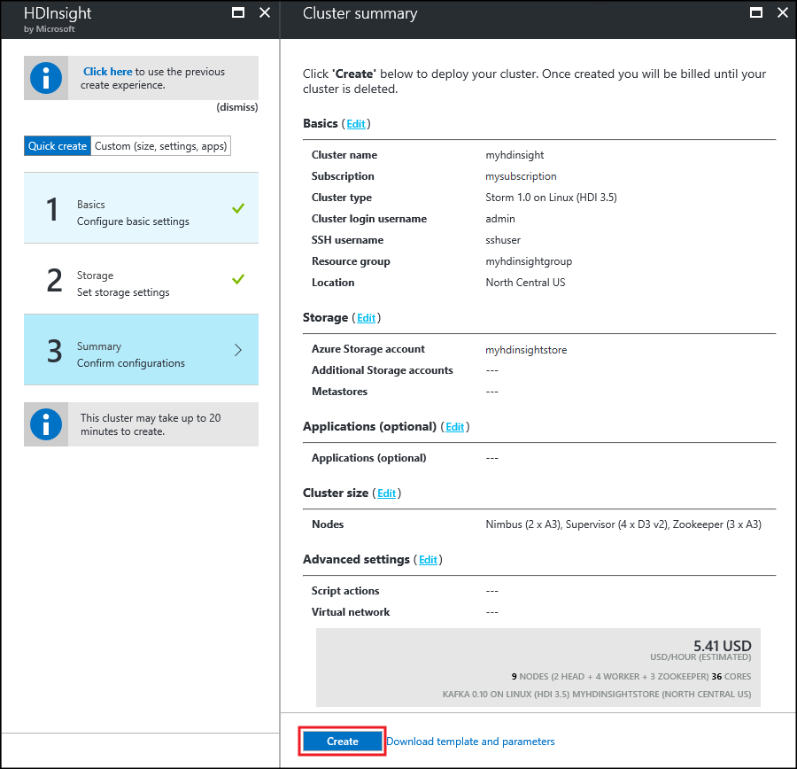

<properties
    pageTitle="Azure HDInsight 上的 Apache Storm 入门 | Azure"
    description="开始在基于 Linux 的 HDInsight 上使用 Apache Storm 和 Storm 初学者示例进行大数据分析。了解如何使用 Storm 实时处理数据。"
    keywords="apache storm,apache storm 教程,大数据分析,storm 初学者"
    services="hdinsight"
    documentationcenter=""
    author="Blackmist"
    manager="jhubbard"
    editor="cgronlun" />
<tags
    ms.assetid="d710dcac-35d1-4c27-a8d6-acaf8146b485"
    ms.service="hdinsight"
    ms.devlang="java"
    ms.topic="get-started-article"
    ms.tgt_pltfrm="na"
    ms.workload="big-data"
    ms.date="03/17/2017"
    wacn.date="03/31/2017"
    ms.author="larryfr"
    ms.custom="H1Hack27Feb2017" />  

#用于在基于 Linux 的 HDInsight 上进行大数据分析的 Storm 初学者示例入门

Apache Storm 是一个可扩展的、具有容错能力的分布式实时计算系统，用于处理数据流。使用 Azure HDInsight 上的 Storm，你可以创建一个基于云的、用于实时执行大数据分析的 Storm 群集。

> [AZURE.IMPORTANT]
Linux 是在 HDInsight 3.4 版或更高版本上使用的唯一操作系统。有关详细信息，请参阅 [HDInsight 在 Windows 上弃用](/documentation/articles/hdinsight-component-versioning/#hdi-version-32-and-33-nearing-deprecation-date)。

## 先决条件

[AZURE.INCLUDE [delete-cluster-warning](../../includes/hdinsight-delete-cluster-warning.md)]

* **一个 Azure 订阅**。请参阅[获取 Azure 试用版](/pricing/1rmb-trial/)。

* **熟悉 SSH 和 SCP**。有关如何在 HDInsight 中使用 SSH 和 SCP 的详细信息，请参阅以下文档：
  
    * [在 Windows 10 上的 Bash、Linux、Unix 或 OS X 上将 SSH 与 HDInsight 上基于 Linux 的 Hadoop 配合使用](/documentation/articles/hdinsight-hadoop-linux-use-ssh-unix/)
    
    * [在 Windows 中的 HDInsight 上将 SSH (PuTTY) 与基于 Linux 的 Hadoop 配合使用](/documentation/articles/hdinsight-hadoop-linux-use-ssh-windows/)

### 访问控制要求

[AZURE.INCLUDE [access-control](../../includes/hdinsight-access-control-requirements.md)]

## 创建 Storm 群集

使用以下步骤创建 Storm on HDInsight 群集：

1. 在 [Azure 门户预览](https://portal.azure.cn)中，依次选择“+ 新建”，、“智能 + 分析”、“HDInsight”。
   
      

2. 在“基本信息”边栏选项卡中输入以下信息：

    * **群集名称**：HDInsight 群集的名称。
    * **订阅**：选择要使用的订阅。
    * **群集登录用户名**和**群集登录密码**：通过 HTTPS 访问群集时的登录名。使用这些凭据访问 Ambari Web UI 或 REST API 等服务。
    * **安全外壳 (SSH) 用户名**：通过 SSH 访问群集时使用的登录名。默认情况下，该密码与群集登录名密码相同。
    * **资源组**：要在其中创建群集的资源组。
    * **位置**：要在其中创建群集的 Azure 区域。
   
      

3. 选择“群集类型”，然后在“群集配置”边栏选项卡中设置以下值：
   
    * **群集类型**：Storm

    * **操作系统**：Linux

    * **版本**：Storm 1.0.1 (HDI 3.5)

    * **群集层**：标准
     
    最后，使用“选择”按钮保存设置。
     
      

4. 选择群集类型后，请使用“选择”按钮设置群集类型。接下来，使用“下一步”按钮完成基本配置。

5. 在“存储”边栏选项卡中，选择或创建存储帐户。对于本文档中介绍的步骤，将此边栏选项卡上的其他字段保留为默认值。使用“下一步”按钮保存存储配置。

      

6. 在“摘要”边栏选项卡中，查看群集配置。使用“编辑”链接更改任何不正确的设置。最后，使用“创建”按钮创建群集。
   
      

   
    > [AZURE.NOTE]
    创建群集可能需要 20 分钟。

## 在 HDInsight 上运行 Storm 初学者示例

1. 使用 SSH 连接到 HDInsight 群集：
   
        ssh USERNAME@CLUSTERNAME-ssh.azurehdinsight.cn
   
    如果使用了密码来保护 SSH 用户帐户，系统会提示输入密码。如果使用了公钥，则可能需要使用 `-i` 参数来指定匹配的私钥。例如，`ssh -i ~/.ssh/id_rsa USERNAME@CLUSTERNAME-ssh.azurehdinsight.cn`。
   
    有关将 SSH 与基于 Linux 的 HDInsight 配合使用的详细信息，请参阅以下文章：
   
    * [在 Windows 10 上的 Bash、Linux、Unix 或 OS X 上将 SSH 与 HDInsight 上基于 Linux 的 Hadoop 配合使用](/documentation/articles/hdinsight-hadoop-linux-use-ssh-unix/)

    * [在 Windows 中的 HDInsight 上将 SSH (PuTTY) 与基于 Linux 的 Hadoop 配合使用](/documentation/articles/hdinsight-hadoop-linux-use-ssh-windows/)

2. 使用以下命令启动示例拓扑：
   
        storm jar /usr/hdp/current/storm-client/contrib/storm-starter/storm-starter-topologies-*.jar org.apache.storm.starter.WordCountTopology wordcount
   
    > [AZURE.NOTE]
    在旧版 HDInsight 上，拓扑的类名为 `storm.starter.WordCountTopology` 而非 `org.apache.storm.starter.WordCountTopology`。
   
    此命令在群集上启动具有友好名称“wordcount”的示例 WordCount 拓扑。它随机生成句子，并统计句子中每个单词的出现次数。
   
    > [AZURE.NOTE]
    将自己的拓扑提交到群集时，必须先复制包含群集的 jar 文件，然后再使用 `storm` 命令。使用 `scp` 命令复制该文件。例如 `scp FILENAME.jar USERNAME@CLUSTERNAME-ssh.azurehdinsight.cn:FILENAME.jar`
    > 
  
    > WordCount 示例和其他 Storm 初学者示例已经包含在群集中，其位置为 `/usr/hdp/current/storm-client/contrib/storm-starter/`。

如果想查看 Storm 初学者示例的源代码，可访问 [https://github.com/apache/storm/tree/1.0.x-branch/examples/storm-starter](https://github.com/apache/storm/tree/1.0.x-branch/examples/storm-starter)。该链接针对 HDInsight 3.5 随附的 Storm 1.0.x。如需其他版本的 Storm，单击页面顶部的“分支”按钮即可选择其他 Storm 版本。

## 监视拓扑

Storm UI 提供一个 Web 界面用于处理正在运行的拓扑，你的 HDInsight 群集随附了此界面。

执行以下步骤以使用 Storm UI 来监视拓扑。

1. 若要显示 Storm UI，请在 web 浏览器中打开 https://CLUSTERNAME.azurehdinsight.cn/stormui。将 **CLUSTERNAME** 替换为群集名称。
    
    > [AZURE.NOTE]
    如果系统要求你提供用户名和密码，请输入创建群集时使用的群集管理员用户名 (admin) 和密码。

2. 在“拓扑摘要”下，选择“名称”列中的“Wordcount”条目。此时将显示有关拓扑的信息。
    
      

    
    此页提供以下信息：
    
    * **拓扑统计信息** - 有关拓扑性能的基本信息，已组织到时间窗口中。
     
        > [AZURE.NOTE]
        选择特定的时间窗口会更改页面其他部分中显示的信息的时间窗口。

    * **Spout** - 有关 spout 的基本信息，包括每个 spout 返回的最后一个错误。
    
    * **Bolt** - 有关 bolt 的基本信息。
    
    * **拓扑配置** - 有关拓扑配置的详细信息。
     
    此页还提供可对拓扑执行的操作：
   
    * **激活** - 继续处理已停用的拓扑。
    
    * **停用** - 暂停正在运行的拓扑。
    
    * **重新平衡** - 调整拓扑的并行度。更改群集中的节点数目之后，你应该重新平衡正在运行的拓扑。重新平衡可调整并行度，以弥补群集中增加/减少的节点数目。有关详细信息，请参阅[了解 Storm 拓扑的并行度](http://storm.apache.org/documentation/Understanding-the-parallelism-of-a-Storm-topology.html)。
    
    * **终止** - 在经过指定的超时之后终止 Storm 拓扑。

3. 在此页中，从“Spout”或“Bolt”部分中选择一个条目。此时将显示有关选定组件的信息。
   
      

   
    此页显示以下信息：
   
    * **Spout/Bolt 统计信息** - 有关组件性能的基本信息，已组织到时间窗口中。
     
        > [AZURE.NOTE]
        选择特定的时间窗口会更改页面其他部分中显示的信息的时间窗口。
     
    * **输入统计信息**（仅限 Bolt）- 有关生成 Bolt 所用数据的组件的信息。
    
    * **输出统计信息** - 有关此 Bolt 发出的数据的信息。
    
    * **执行器** - 有关此组件实例的信息。
    
    * **错误** - 此组件生成的错误。

4. 在查看 spout 或 bolt 的详细信息时，从“执行器”部分中的“端口”列中选择一个条目可以查看组件特定实例的详细信息。
   
        2015-01-27 14:18:02 b.s.d.task [INFO] Emitting: split default ["with"]
        2015-01-27 14:18:02 b.s.d.task [INFO] Emitting: split default ["nature"]
        2015-01-27 14:18:02 b.s.d.executor [INFO] Processing received message source: split:21, stream: default, id: {}, [snow]
        2015-01-27 14:18:02 b.s.d.task [INFO] Emitting: count default [snow, 747293]
        2015-01-27 14:18:02 b.s.d.executor [INFO] Processing received message source: split:21, stream: default, id: {}, [white]
        2015-01-27 14:18:02 b.s.d.task [INFO] Emitting: count default [white, 747293]
        2015-01-27 14:18:02 b.s.d.executor [INFO] Processing received message source: split:21, stream: default, id: {}, [seven]
        2015-01-27 14:18:02 b.s.d.task [INFO] Emitting: count default [seven, 1493957]
   
    在此示例中，单词 **seven** 出现了 1493957 次。此计数是自启动此拓扑以来已遇到该单词的次数。

## 停止拓扑

返回到单词计数拓扑的“拓扑摘要”页，然后从“拓扑操作”部分中选择“终止”按钮。出现提示时，输入停止拓扑之前要等待的秒数，即 10。超时期限过后，当你访问仪表板的“Storm UI”部分时，将不再显示该拓扑。

## 删除群集

[AZURE.INCLUDE [delete-cluster-warning](../../includes/hdinsight-delete-cluster-warning.md)]

## 后续步骤

在此 Apache Storm 教程中，你学习了使用 Storm on HDInsight 的基础知识。接下来，了解如何[使用 Maven 开发基于 Java 的拓扑](/documentation/articles/hdinsight-storm-develop-java-topology/)。

如果你已熟悉开发基于 Java 的拓扑并想要将现有拓扑部署到 HDInsight，请参阅[在 HDInsight 上部署和管理 Apache Storm 拓扑](/documentation/articles/hdinsight-storm-deploy-monitor-topology-linux/)。

如果用户是 .NET 开发人员，则可使用 Visual Studio 创建 C# 拓扑或混合性的 C#/Java 拓扑。有关详细信息，请参阅[使用用于 Visual Studio 的 Hadoop 工具开发 Apache Storm on HDInsight 的 C# 拓扑](/documentation/articles/hdinsight-storm-develop-csharp-visual-studio-topology/)。

如需能够用于 Storm on HDInsight 的示例性拓扑，请参阅以下示例：

* [Storm on HDInsight 的示例拓扑](/documentation/articles/hdinsight-storm-example-topology/)

[apachestorm]: https://storm.incubator.apache.org
[stormdocs]: http://storm.incubator.apache.org/documentation/Documentation.html
[stormstarter]: https://github.com/apache/storm/tree/master/examples/storm-starter
[stormjavadocs]: https://storm.incubator.apache.org/apidocs/
[azureportal]: https://manage.windowsazure.cn/
[hdinsight-provision]: /documentation/articles/hdinsight-hadoop-provision-linux-clusters/
[preview-portal]: https://portal.azure.cn/

<!---HONumber=Mooncake_0327_2017-->
<!--Update_Description: updating the creation steps-->