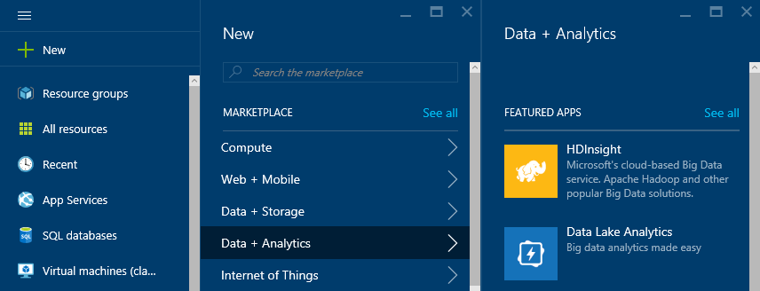
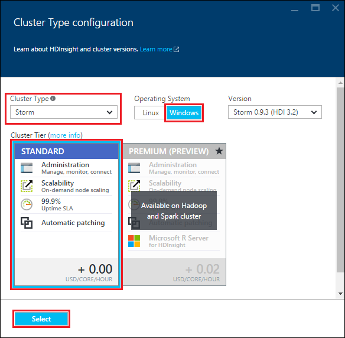
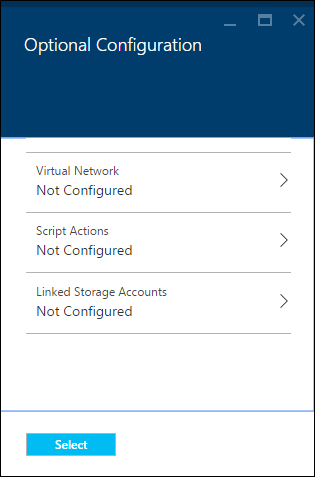
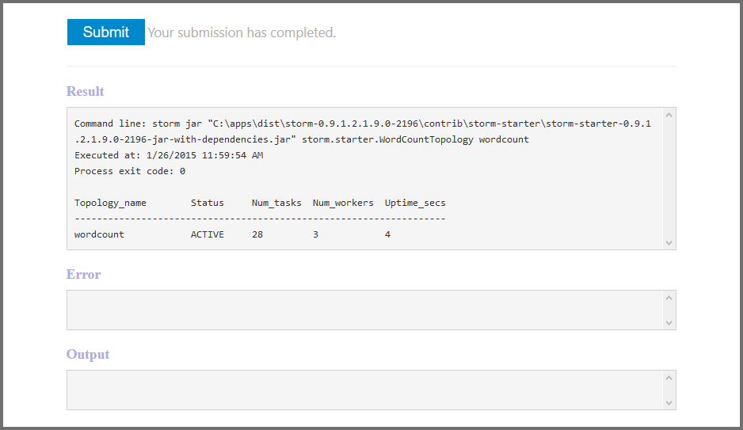

<properties
    pageTitle="Apache Storm 教程：Storm 入门 | Azure"
    description="开始在 HDInsight 上使用 Apache Storm 和 Storm 初学者示例进行大数据分析。了解如何使用 Storm 实时处理数据。"
    keywords="apache storm,apache storm 教程,大数据分析,storm 初学者"
    services="hdinsight"
    documentationcenter=""
    author="Blackmist"
    manager="jhubbard"
    editor="cgronlun"
    tags="azure-portal" />
<tags
    ms.assetid="6f93f7ff-0736-4708-80ef-4289dae532a9"
    ms.service="hdinsight"
    ms.devlang="java"
    ms.topic="article"
    ms.tgt_pltfrm="na"
    ms.workload="big-data"
    ms.date="09/07/2016"
    wacn.date="01/25/2017"
    ms.author="larryfr" />  

# Apache Storm 教程：用于在 HDInsight 上进行大数据分析的 Storm 初学者示例入门
Apache Storm 是一个可扩展的、具有容错能力的分布式实时计算系统，用于处理数据流。使用 Azure HDInsight 上的 Storm，你可以创建一个基于云的、用于实时执行大数据分析的 Storm 群集。

> [AZURE.NOTE]
本文中的步骤将创建基于 Windows 的 HDInsight 群集。有关在 HDInsight 群集上创建基于 Linux 的 Storm 的步骤，请参阅 [Apache Storm 教程：开始在 HDInsight 上使用 Storm 初学者示例进行数据分析](/documentation/articles/hdinsight-apache-storm-tutorial-get-started-linux/)
> 
> 

## 先决条件
[AZURE.INCLUDE [delete-cluster-warning](../../includes/hdinsight-delete-cluster-warning.md)]

你必须具备以下条件才能成功完成本 Apache Storm 教程：

* **一个 Azure 订阅**。请参阅[获取 Azure 试用版](/pricing/1rmb-trial/)。

### 访问控制要求
[AZURE.INCLUDE [access-control](../../includes/hdinsight-access-control-requirements.md)]

##  创建 Storm 群集
Storm on HDInsight 使用 Azure Blob 存储来存储提交到群集的日志文件和拓扑。使用以下步骤创建用于群集的 Azure 存储帐户：

1. 登录到 [Azure 门户预览][preview-portal]。
2. 依次选择“新建”、“数据分析”、“HDInsight”。
   
      

3. 输入**群集名称**。如果该**群集名称**可用，则名称旁边会出现绿色的复选标记。
4. 如果你有多个订阅，请选择“订阅”条目以选择要用于群集的 Azure 订阅。
5. 使用“选择群集类型”选择 **Storm** 群集。对于**操作系统**，选择“Windows”。对于**群集层**，选择“标准”。最后，使用选择按钮保存这些设置。
   
      

6. 对于**资源组**，可以使用下拉列表查看现有资源组的列表，然后选择要在其中创建群集的资源组。或者，可以选择“新建”，然后输入新资源组的名称。出现绿色复选标记可指示新组名是否可用。
7. 选择“凭据”，然后输入“群集登录用户名”和“群集登录密码”。最后，使用“选择”来设置凭据。本文档中未使用远程桌面，因此，你可以使其处于禁用状态。
   
      

8. 对于**数据源**，可以选择相关条目以选择现有数据源，或创建一个新数据源。
   
      

   
    目前可以选择 Azure 存储帐户作为 HDInsight 群集数据源。通过以下信息来了解“数据源”边栏选项卡上的条目。
   
    * **选择方法**：将此项设置为“来自所有订阅”，以便能够浏览所有订阅中的存储帐户。如果要输入现有存储帐户的“存储名称”和“访问密钥”，请将此项设置为“访问密钥”。
    * **新建**：使用此项创建新的存储帐户。使用出现的字段输入存储帐户名称。如果该名称可用，将出现绿色复选标记。
    * **选择默认容器**：使用此选项输入要用于该群集的默认容器名称。尽管你可以输入任何名称，但我们建议使用与群集相同的名称，以方便辨别用于这个特定群集的容器。
    * **位置**：存储帐户将位于的地理区域，或要在其中创建存储帐户的地理区域。
     
        > [AZURE.IMPORTANT]
        选择默认数据源位置的同时会设置 HDInsight 群集位置。群集和默认数据源必须位于同一区域。
        > 
        > 
    * **选择**：使用此项保存数据源配置。
9. 选择“节点定价层”显示针对此群集创建的节点的相关信息。默认情况下，工作节点数将设置为 **4**。将此项设置为 **1**，因为这足以满足本教程的要求并可减少群集的成本。此边栏选项卡的底部将显示群集的估计成本。
   
      

   
    使用“选择”保存**节点定价层**信息。
10. 选择“可选配置”。此边栏选项卡可用于选择群集版本以及配置其他可选设置，例如加入**虚拟网络**。
    
      

11. 确保选中“固定到启动板”，然后选择“创建”。这将会创建群集，并将该群集的磁贴添加到 Azure 门户预览的启动板。该图标指示群集正在预配，完成预配后，将改为显示 HDInsight 图标。
    
    | 预配时 | 预配完成 |
    | --- | --- |
    |  | |
    
    > [AZURE.NOTE]
    创建群集需要一些时间，通常约 15 分钟左右。使用启动板上的磁贴或页面左侧的“通知”项检查预配过程。
    > 
    > 

## 在 HDInsight 上运行 Storm 初学者示例
本 Apache Storm 教程将介绍如何在 GitHub 上使用 Storm 初学者示例执行大型数据分析。

每个 Storm on HDInsight 群集都包含 Storm 仪表板，可用于在群集上上传和运行 Storm 拓扑。每个群集还包含可直接从 Storm 仪表板运行的示例拓扑。

### 连接到仪表板
仪表板位于 **https://&lt;clustername>.azurehdinsight.cn//**，其中 **clustername** 是群集的名称。还可以通过以下方式找到到仪表板的链接：从启动板中选择群集，然后选择边栏选项卡顶部的“仪表板”链接。

  

> [AZURE.NOTE]
在连接到仪表板时，系统将提示你输入用户名和密码。这是创建群集时所用的管理员名称 (**admin**) 和密码。
> 
> 

加载 Storm 仪表板后，你将看到“提交拓扑”窗体。

  

“提交拓扑”窗体可用于上载和运行包含 Storm 拓扑的 .jar 文件。它还包括群集随附的几个基本示例。

### 从 GitHub 中的 Storm 初学者项目运行单词计数示例
群集随附的示例包括单词计数拓扑的多种变体。这些示例包括随机生成句子的 **spout**，和将每个句子分解成不同的单词，然后统计每个单词出现次数的 **bolt**。这些示例来自 Apache Storm 中包含的 [Storm 初学者示例](https://github.com/apache/storm/tree/master/examples/storm-starter)。

执行以下步骤以运行 Storm 初学者示例：

1. 从“Jar 文件”下拉列表中选择“StormStarter - WordCount”。这会在“类名”和“其他参数”字段中填充此示例的参数。
   
      

   
    * **类名** - 提交拓扑的 .jar 文件中的类。
    * **其他参数** - 拓扑所需的任何参数。在此示例中，该字段用于提供已提交的拓扑的友好名称。
2. 单击“提交”。片刻之后，“结果”字段将显示用于提交该作业的命令以及命令的结果。“错误”字段将显示提交拓扑时出现的任何错误。
   
      

   
    > [AZURE.NOTE]
    结果不会指示已完成拓扑 - **Storm 拓扑在启动后将一直运行，直到你停止它**。 单词计数拓扑将会生成随机的句子，并会一直计算所遇到的每个单词的出现次数，直到你将其停止。
    > 
    > 

### 监视拓扑
Storm UI 可以用于监视拓扑。

1. 从 Storm 仪表板中选择“Storm UI”。这将显示群集和所有正在运行的拓扑的摘要信息。
   
      

   
    在上述页面中，可看到拓扑处于活动状态的时间，以及工作线程、执行器和正在使用的任务数。
   
    > [AZURE.NOTE]
    “名称”列包含前面通过“其他参数”字段提供的友好名称。
    > 
    > 
2. 在“拓扑摘要”下，选择“名称”列中的“Wordcount”条目。这将显示有关拓扑的详细信息。
   
      

   
    此页提供以下信息：
   
    * **拓扑统计信息** - 有关拓扑性能的基本信息，已组织到时间窗口中。
     
        > [AZURE.NOTE]
        选择特定的时间窗口会更改页面其他部分中显示的信息的时间窗口。
        > 
        > 
    * **Spout** - 有关 spout 的基本信息，包括每个 spout 返回的最后一个错误。
    * **Bolt** - 有关 bolt 的基本信息。
    * **拓扑配置** - 有关拓扑配置的详细信息。
     
    此页还提供可对拓扑执行的操作：

    * **激活** - 继续处理已停用的拓扑。
    * **停用** - 暂停正在运行的拓扑。
    * **重新平衡** - 调整拓扑的并行度。更改群集中的节点数目之后，你应该重新平衡正在运行的拓扑。这可让拓扑调整并行度，以弥补群集中增加/减少的节点数目。有关详细信息，请参阅[了解 Storm 拓扑的并行度](http://storm.apache.org/documentation/Understanding-the-parallelism-of-a-Storm-topology.html)。
    * **终止** - 在经过指定的超时之后终止 Storm 拓扑。
3. 在此页中，从“Spout”或“Bolt”部分中选择一个条目。这将显示有关选定组件的信息。
   
      

   
    此页显示以下信息：
   
    * **Spout/Bolt 统计信息** - 有关组件性能的基本信息，已组织到时间窗口中。
     
        > [AZURE.NOTE]
        选择特定的时间窗口会更改页面其他部分中显示的信息的时间窗口。
        > 
        > 
    * **输入统计信息**（仅限 Bolt）- 有关生成 Bolt 所用数据的组件的信息。
    * **输出统计信息** - 有关此 Bolt 发出的数据的信息。
    * **执行器** - 有关此组件实例的信息。
    * **错误** - 此组件生成的错误。
4. 在查看 spout 或 bolt 的详细信息时，从“执行器”部分中的“端口”列中选择一个条目可以查看组件特定实例的详细信息。
   
        2015-01-27 14:18:02 b.s.d.task [INFO] Emitting: split default ["with"]
        2015-01-27 14:18:02 b.s.d.task [INFO] Emitting: split default ["nature"]
        2015-01-27 14:18:02 b.s.d.executor [INFO] Processing received message source: split:21, stream: default, id: {}, [snow]
        2015-01-27 14:18:02 b.s.d.task [INFO] Emitting: count default [snow, 747293]
        2015-01-27 14:18:02 b.s.d.executor [INFO] Processing received message source: split:21, stream: default, id: {}, [white]
        2015-01-27 14:18:02 b.s.d.task [INFO] Emitting: count default [white, 747293]
        2015-01-27 14:18:02 b.s.d.executor [INFO] Processing received message source: split:21, stream: default, id: {}, [seven]
        2015-01-27 14:18:02 b.s.d.task [INFO] Emitting: count default [seven, 1493957]
   
    从这些数据中，你可以看到，单词 **seven** 出现了 1,493,957 次。就是自从启动此拓扑以来该单词出现的次数。

### 停止拓扑
返回到单词计数拓扑的“拓扑摘要”页，然后从“拓扑操作”部分中选择“终止”。出现提示时，输入停止拓扑之前要等待的秒数，即 10。超时期限过后，当你访问仪表板的“Storm UI”部分时，将不再显示该拓扑。

## 删除群集
[AZURE.INCLUDE [delete-cluster-warning](../../includes/hdinsight-delete-cluster-warning.md)]

## 摘要
在本 Apache Storm 教程中，你已使用 Storm 初学者示例学习如何创建 Storm on HDInsight 群集，以及如何使用 Storm 仪表板来部署、监视和管理 Storm 拓扑。

## 后续步骤
* **HDInsight Tools for Visual Studio** - 借助 HDInsight Tools 可以使用 Visual Studio 提交、监视和管理 Storm 拓扑，就像在前面提到的 Storm 仪表板中一样。HDInsight Tools 可让你创建 C# Storm 拓扑，并包含可在群集上部署和运行的示例拓扑。
  
    有关详细信息，请参阅 [用于 Visual Studio 的 HDInsight 工具入门](/documentation/articles/hdinsight-hadoop-visual-studio-tools-get-started/)。
* **示例文件** - HDInsight Storm 群集在 **%STORM\_HOME%\\contrib** 目录中提供了多个示例。每个示例都应包含以下内容：
  
    * 源代码 - 例如，storm-starter-0.9.1.2.1.5.0-2057-sources.jar
    * Java 文档 - 例如，storm-starter-0.9.1.2.1.5.0-2057-javadoc.jar
    * 示例 - 例如，storm-starter-0.9.1.2.1.5.0-2057-jar-with-dependencies.jar
    
    使用“jar”命令可提取源代码或 Java 文档。例如，“jar -xvf storm-starter-0.9.1.2.1.5.0.2057-javadoc.jar”。
    
    > [AZURE.NOTE]
    Java 文档包含网页。一旦提取，可以使用浏览器来查看 **index.html** 文件。
    > 
    > 
    
    若要访问这些示例，必须为 Storm on HDInsight 群集启用远程桌面，然后复制 **%STORM\_HOME%\\contrib** 中的文件。
* 以下文档包含可与 Storm on HDInsight 配合使用的其他示例的列表：
  
    * [Storm on HDInsight 的示例拓扑](/documentation/articles/hdinsight-storm-example-topology/)

[apachestorm]: https://storm.incubator.apache.org
[stormdocs]: http://storm.incubator.apache.org/documentation/Documentation.html
[stormstarter]: https://github.com/apache/storm/tree/master/examples/storm-starter
[stormjavadocs]: https://storm.incubator.apache.org/apidocs/
[azureportal]: https://manage.windowsazure.cn/
[hdinsight-provision]: /documentation/articles/hdinsight-provision-clusters/
[preview-portal]: https://portal.azure.cn/

<!---HONumber=Mooncake_0120_2017-->
<!--Update_Description: update from ASM to ARM-->