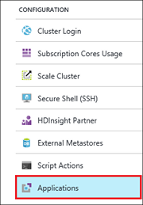
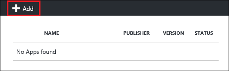
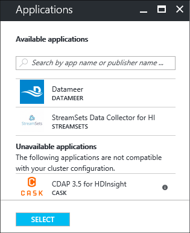
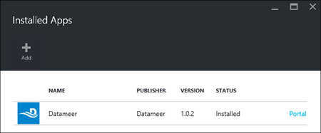

<!-- not suitable for Mooncake -->

<properties
    pageTitle="在 HDInsight 上安装 Hadoop 应用程序 | Azure"
    description="了解如何在 HDInsight 上安装 HDInsight 应用程序。"
    services="hdinsight"
    documentationcenter=""
    author="mumian"
    manager="jhubbard"
    editor="cgronlun"
    tags="azure-portal" />
<tags 
    ms.assetid="eaf5904d-41e2-4a5f-8bec-9dde069039c2"
    ms.service="hdinsight"
    ms.devlang="na"
    ms.topic="hero-article"
    ms.tgt_pltfrm="na"
    ms.workload="big-data"
    ms.date="11/23/2016"
    wacn.date="02/06/2017"
    ms.author="jgao" />

# 安装 HDInsight 应用程序
HDInsight 应用程序是用户可以在基于 Linux 的 HDInsight 群集上安装的应用程序。这些应用程序可能是 Microsoft、独立软件供应商 (ISV) 或你自己开发的。在本文中，你将了解如何安装已发布的应用程序。有关安装自己的应用程序的信息，请参阅[安装自定义 HDInsight 应用程序](/documentation/articles/hdinsight-apps-install-custom-applications/)。

目前有三个已发布的应用程序：

* **Datameer**：[Datameer](http://www.datameer.com/documentation/display/DAS50/Home?ls=Partners&lsd=Microsoft&c=Partners&cd=Microsoft) 提供一种交互方式，让分析师发现、分析和可视化大数据的结果。轻松拉进其他数据源，以发现新的关系并迅速获取所需的答案。
* **用于 HDnsight 的 Streamsets 数据收集器**提供了一个全功能的集成开发环境 (IDE)，它允许用户设计、测试、部署和管理汇合流和批处理数据的全面互通引入管道，并提供各种流中转换 - 所有这些都无需编写自定义代码。
* **Cask CDAP 3.5 for HDInsight** 为大数据提供第一个统一集成平台，减少数据应用程序和 Data Lake 的 80% 的生成时间。此应用程序仅支持标准 HBase 3.4 群集。

本文提供的说明使用 Azure 门户预览。也可以从门户导出 Azure Resource Manager 模板或从供应商处获取 Resource Manage 模板的副本，然后使用 Azure PowerShell 和 Azure CLI 部署模板。请参阅[使用 Resource Manager 模板在 HDInsight 中创建基于 Linux 的 Hadoop 群集](/documentation/articles/hdinsight-hadoop-create-linux-clusters-arm-templates/)。

## 先决条件
如果想要在现有的 HDInsight 群集上安装 HDInsight 应用程序，必须有一个 HDInsight 群集。若要创建群集，请参阅[创建群集](/documentation/articles/hdinsight-hadoop-tutorial-get-started-windows/#create-cluster)。也可以在创建 HDInsight 群集时安装 HDInsight 应用程序。

## 将应用程序安装到现有群集
下面的过程演示如何将 HDInsight 应用程序安装到现有的 HDInsight 群集。

**安装 HDInsight 应用程序**

1. 登录 [Azure 门户预览](https://portal.azure.cn)。
2. 在左侧菜单中单击“HDInsight 群集”。如果未看到，请单击“浏览”，然后单击“HDInsight 群集”。
3. 单击某个 HDInsight 群集。如果没有群集，必须先创建一个。请参阅[创建群集](/documentation/articles/hdinsight-hadoop-tutorial-get-started-windows/#create-cluster)。
4. 单击“配置”类别下的“应用程序”。此时可以看到已安装应用程序的列表（如果有）。
   
      

5. 单击边栏选项卡菜单中的“添加”。
   
      

   
    可以看到现有 HDInsight 应用程序的列表。
   
      

6. 单击其中一个应用程序，接受法律条款，然后单击“选择”。

可以通过门户通知查看安装状态（单击门户顶部的铃铛图标）。安装应用程序之后，应用程序会出现在“已安装的应用”边栏选项卡上。

##  在群集创建期间安装应用程序
你可以选择在创建群集时安装 HDInsight 应用程序。在此过程中，HDInsight 应用程序会在群集创建并处于运行状态后安装。下面的过程演示如何在创建群集时安装 HDInsight 应用程序。

**安装 HDInsight 应用程序**

1. 登录 [Azure 门户预览](https://portal.azure.cn)。
2. 单击“新建”，单击“数据 + 分析”，然后单击“HDInsight”。
3. 输入**群集名称**：此名称必须全局唯一。
4. 单击“订阅”以选择将用于此群集的 Azure 订阅。
5. 单击“选择群集类型”，然后选择：
   
    * **群集类型**：如果你不知道要选择哪种群集，请选择“Hadoop”。它是最受欢迎的群集类型。
    * **操作系统**：选择“Linux”。
    * **版本**：如果不知道要选择哪个版本，请使用默认版本。有关详细信息，请参阅 [HDInsight 群集版本](/documentation/articles/hdinsight-component-versioning/)。
    * **群集层**：Azure HDInsight 提供两个类别的大数据云产品：标准层和高级层。有关详细信息，请参阅[群集层](/documentation/articles/hdinsight-provision-clusters/#cluster-tiers)。
6. 依次单击“应用程序”、其中一个已发布的应用程序，然后单击“选择”。
7. 单击“凭据”，然后输入管理员用户的密码。此外，还必须输入“SSH 用户名”以及“密码”或“公钥”，这将用于验证 SSH 用户的身份。建议使用公钥。单击底部的“选择”以保存凭据配置。
8. 单击“数据源”，选择其中一个现有的存储帐户，或创建新的存储帐户，作为群集的默认存储帐户。
9. 单击“资源组”以选择现有的资源组，或单击“新建”以创建一个新的资源组
10. 在“新建 HDInsight 群集”边栏选项卡上，确保选中“固定到启动板”，然后单击“创建”。

##  列出已安装的 HDInsight 应用和属性
门户会显示群集的已安装 HDInsight 应用程序列表，以及每个已安装应用程序的属性。

**列出 HDInsight 应用程序并显示属性**

1. 登录 [Azure 门户预览](https://portal.azure.cn)。
2. 在左侧菜单中单击“HDInsight 群集”。如果未看到，请单击“浏览”，然后单击“HDInsight 群集”。
3. 单击某个 HDInsight 群集。
4. 在“设置”边栏选项卡中，单击“常规”类别下的“应用程序”。“已安装的应用”边栏选项卡将列出所有已安装的应用程序。
   
    
5. 单击其中一个已安装的应用程序，以显示属性。属性边栏选项卡会列出：
   
    * 应用名称：应用程序名称。
    * 状态：应用程序状态。
    * 网页：已部署到边缘节点的 Web 应用程序的 URL（如果有）。此凭据与你针对群集配置的 HTTP 用户凭据相同。
    * HTTP 终结点：此凭据与你针对群集配置的 HTTP 用户凭据相同。
    * SSH 终结点：可以使用 [SSH](/documentation/articles/hdinsight-hadoop-linux-use-ssh-unix/) 连接到边缘节点。SSH 凭据与你针对群集配置的 SSH 用户凭据相同。
6. 若要删除应用程序，请右键单击应用程序，然后单击上下文菜单中的“删除”。

## 连接到边缘节点
你可以使用 HTTP 和 SSH 连接到边缘节点。[门户](#list-installed-hdinsight-apps-and-properties)中提供了终结点信息。有关使用 SSH 的详细信息，请参阅[在 Linux、Unix 和 OS X 中的 HDInsight 上将 SSH 与基于 Linux 的 Hadoop 配合使用](/documentation/articles/hdinsight-hadoop-linux-use-ssh-unix/)。

HTTP 终结点凭据是你针对 HDInsight 群集配置的 HTTP 用户凭据；SSH 终结点凭据是你针对 HDInsight 群集配置的 SSH 凭据。

## 故障排除
请参阅[排查安装问题](/documentation/articles/hdinsight-apps-install-custom-applications/#troubleshoot-the-installation)。

## 后续步骤
* [安装自定义 HDInsight 应用程序](/documentation/articles/hdinsight-apps-install-custom-applications/)：了解如何将未发布的 HDInsight 应用程序部署到 HDInsight。
* [MSDN: Install an HDInsight application](https://msdn.microsoft.com/zh-cn/library/mt706515.aspx)（MSDN：安装 HDInsight 应用程序）：了解如何定义 HDInsight 应用程序。
* [Customize Linux-based HDInsight clusters using Script Action](/documentation/articles/hdinsight-hadoop-customize-cluster/)（使用脚本操作自定义基于 Linux 的 HDInsight 群集）：了解如何使用脚本操作安装其他应用程序。
* [Create Linux-based Hadoop clusters in HDInsight using Resource Manager templates](/documentation/articles/hdinsight-hadoop-create-linux-clusters-arm-templates/)（使用 Resource Manager 模板在 HDInsight 中创建基于 Linux 的 Hadoop 群集）：了解如何调用 Resource Manager 模板来创建 HDInsight 群集。
* [在 HDInsight 中使用空边缘节点](/documentation/articles/hdinsight-apps-use-edge-node/)：了解如何使用空边缘节点访问 HDInsight 群集、测试和托管 HDInsight 应用程序。

<!---HONumber=Mooncake_0103_2017-->