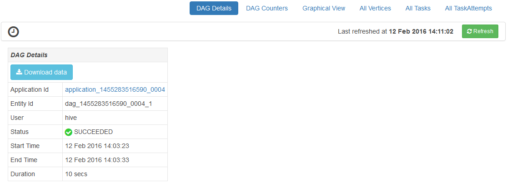

<properties
    pageTitle="将 Ambari Tez 视图与 HDInsight 配合使用 | Azure"
    description="了解如何使用 Ambari Tez 视图来调试 HDInsight 上的 Tez 作业。"
    services="hdinsight"
    documentationcenter=""
    author="Blackmist"
    manager="jhubbard"
    editor="cgronlun"
    translationtype="Human Translation" />
<tags
    ms.assetid="9c39ea56-670b-4699-aba0-0f64c261e411"
    ms.service="hdinsight"
    ms.custom="hdinsightactive"
    ms.devlang="na"
    ms.topic="article"
    ms.tgt_pltfrm="na"
    ms.workload="big-data"
    ms.date="04/14/2017"
    wacn.date="05/08/2017"
    ms.author="larryfr"
    ms.sourcegitcommit="2c4ee90387d280f15b2f2ed656f7d4862ad80901"
    ms.openlocfilehash="b5e8cc132cef05d3317c26a5c22da17ff3de4745"
    ms.lasthandoff="04/28/2017" />

# 使用 Ambari 视图来调试 HDInsight 上的 Tez 作业

适用于 HDInsight 的 Ambari Web UI 所含的 Tez 视图可用于了解和调试使用 Tez 的作业。 利用 Tez 视图，你可以将作业显示为包含已连接项目的图形，深入了解每个项目并检索统计信息和日志记录信息。

> [AZURE.IMPORTANT]
> 本文档中的步骤需要使用 Linux 的 HDInsight 群集。 Linux 是 HDInsight 3.4 或更高版本上使用的唯一操作系统。 有关详细信息，请参阅 [HDInsight 组件版本控制](/documentation/articles/hdinsight-component-versioning/#hdi-version-33-nearing-deprecation-date)。

## 先决条件

* 基于 Linux 的 HDInsight 群集。 有关创建群集的步骤，请参阅[开始使用基于 Linux 的 HDInsight](/documentation/articles/hdinsight-hadoop-linux-tutorial-get-started/)。
* 支持 HTML5 的现代 Web 浏览器。

## 了解 Tez

Tez 是 Hadoop 中的一种可扩展数据处理框架，其处理速度比传统的 MapReduce 处理要快。 对于基于 Linux 的 HDInsight 群集来说，它是 Hive 的默认引擎。

Tez 会创建一个有向无环图 (DAG)，用于描述作业所需的操作顺序。 单独的操作称为顶点，每个顶点执行完整作业的一部分。 实际执行顶点所描述的工作称为完成任务，任务可以分布在群集的多个节点中。

### 了解 Tez 视图

Tez 视图提供进程的历史信息，还提供正在运行的进程的相关信息。 此信息显示作业在各群集上的分发情况。 还显示了任务和顶点所用的计数器，以及与作业有关的错误信息。 它可以为以下情况提供有用的信息：

* 监视长时间运行的进程、查看映射的进度以及精简任务。
* 分析成功进程或失败进程的历史数据，了解处理过程的改进方式或其失败的原因。

## 生成 DAG

如果使用 Tez 引擎的作业当前正在运行或之前运行过，则 Tez 视图仅包含数据。 无需使用 Tez 即可解析简单的 Hive 查询。 要进行筛选、分组、排序、联接等操作的更复杂查询。 使用 Tez 引擎。

使用以下步骤，来运行使用 Tez 的 Hive 查询：

1. 在 Web 浏览器中导航到 https://CLUSTERNAME.azurehdinsight.cn，其中“CLUSTERNAME”是 HDInsight 群集的名称。

2. 从页面顶部的菜单中选择“视图”  图标。 该图标看起来像一系列方块。 在显示的下拉列表中，选择“Hive 视图”。

    

3. 在 Hive 视图加载后，将以下查询粘贴到查询编辑器中，然后单击“执行”。

        select market, state, country from hivesampletable where deviceplatform='Android' group by market, country, state;

    完成该作业后，将看到输出显示在“查询处理结果”部分。 结果应类似以下文本：

        market  state       country
        en-GB   Hessen      Germany
        en-GB   Kingston    Jamaica

4. 选择“日志”选项卡。 显示的信息类似以下文本：

        INFO : Session is already open
        INFO :

        INFO : Status: Running (Executing on YARN cluster with App id application_1454546500517_0063)

    保存“App id”值，因为下一部分会用到该值。

## 使用 Tez 视图

1. 从页面顶部的菜单中选择“视图”  图标。 在显示的下拉列表中，选择“Tez 视图” 。

    

2. 在 Tez 视图加载后，会看到群集中当前正在运行或过去曾经运行过的 DAG 的列表。

    

3. 如果只有一个条目，则该条目是前一部分运行的查询的结果。 如果有多个条目，则可在“应用程序 ID”字段中输入应用程序 ID，然后按 Enter 键进行搜索。

4. 选择“DAG 名称”。 将显示有关 DAG 的信息。 还可以下载含有此信息的 JSON 文件的压缩文件。

    

5. “DAG 详细信息”上方是多个可用于显示 DAG 相关信息的链接。

   * **DAG 计数器**：显示此 DAG 的计数器信息。
   * **图形视图**：显示此 DAG 的图形表示方式。
   * **所有顶点”**：显示此 DAG 中顶点的列表。
   * **所有任务**：显示此 DAG 中所有顶点的任务的列表。
   * **所有 TaskAttempts**：显示尝试针对此 DAG 运行任务的相关信息。

        > [AZURE.NOTE]
        > 如果滚动“顶点”、“任务”和“TaskAttempts”的列显示，则会注意到存在查看“计数器”的链接，以及每个行的“查看或下载日志”链接。

        如果作业失败，“DAG 详细信息”会显示状态“已失败”，同时会显示有关已失败任务的信息链接。 DAG 详细信息下方会显示诊断信息。

        

6. 选择“图形视图”。 此视图显示 DAG 的图形表示方式。 将鼠标放在视图中的单个顶点上即可显示其信息。

    

7. 选择一个顶点会加载该项的“顶点详细信息”。 选择“映射 1”顶点会显示该项的详细信息。

    

8. 此时页面顶部会存在与顶点和任务相关的链接。

    > [AZURE.NOTE]
    > 还可以通过以下方式访问此页：回到“DAG 详细信息”，选择“顶点详细信息”，然后选择“映射 1”顶点。

    * **顶点计数器**：显示此顶点的计数器信息。
    * **任务**：显示此顶点的任务。
    * **任务尝试**：显示尝试针对此顶点运行任务的相关信息。
    * **源和接收器**：显示此顶点的数据源和接收器。

        > [AZURE.NOTE]
        > 与前一菜单一样，你可以滚动“任务”、“任务尝试”、“源和接收器”的列显示，以便显示每个项的详细信息链接。

9. 选择“任务”，然后选择名为 **00_000000** 的项。 将显示此任务的“任务详细信息”。 在此屏幕中，可以查看“任务计数器”和“任务尝试”。

    

## 后续步骤

既然已了解如何使用 Tez 视图，接下来将详细了解如何[使用 Hive on HDInsight](/documentation/articles/hdinsight-use-hive/)。

有关 Tez 的更详细的技术信息，请参阅 [Hortonworks 的 Tez 页](http://hortonworks.com/hadoop/tez/)。

有关如何将 Ambari 与 HDInsight 配合使用的详细信息，请参阅[使用 Ambari Web UI 管理 HDInsight 群集](/documentation/articles/hdinsight-hadoop-manage-ambari/)