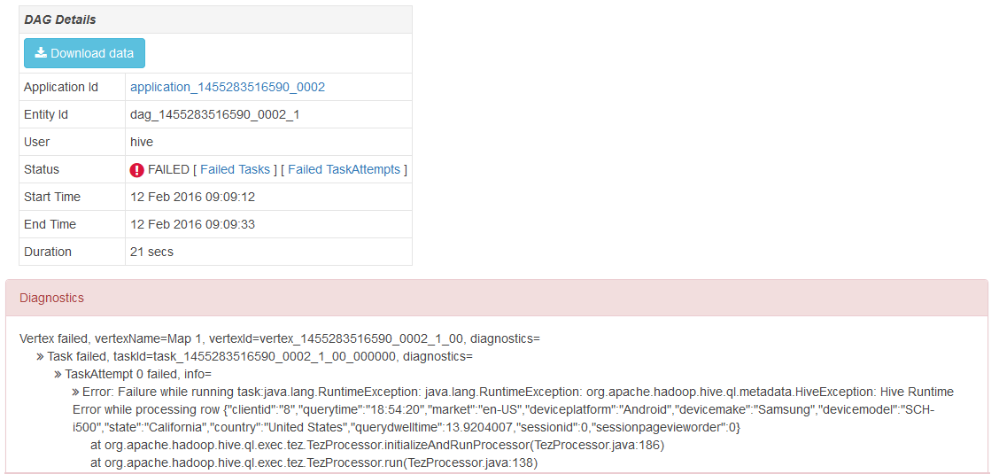

<properties
    pageTitle="将 Ambari Tez 视图与 HDInsight 配合使用 | Azure"
    description="了解如何使用 Ambari Tez 视图来调试 HDInsight 上的 Tez 作业。"
    services="hdinsight"
    documentationcenter=""
    author="Blackmist"
    manager="jhubbard"
    editor="cgronlun" />
<tags
    ms.assetid="9c39ea56-670b-4699-aba0-0f64c261e411"
    ms.service="hdinsight"
    ms.devlang="na"
    ms.topic="article"
    ms.tgt_pltfrm="na"
    ms.workload="big-data"
    ms.date="01/17/2017"
    wacn.date="03/24/2017"
    ms.author="larryfr" />  

# 使用 Ambari 视图来调试 HDInsight 上的 Tez 作业
适用于 HDInsight 的 Ambari Web UI 所含的 Tez 视图可用于了解和调试将 Tez 用作执行引擎的作业。利用 Tez 视图，你可以将作业显示为包含已连接项目的图形，深入了解每个项目并检索统计信息和日志记录信息。

> [AZURE.IMPORTANT]
本文档中的步骤需要使用 Linux 的 HDInsight 群集。Linux 是在 HDInsight 3.4 版或更高版本上使用的唯一操作系统。有关详细信息，请参阅 [HDInsight 在 Windows 上弃用](/documentation/articles/hdinsight-component-versioning/#hdi-version-32-and-33-nearing-deprecation-date)。

## 先决条件
* 基于 Linux 的 HDInsight 群集。有关创建新群集的步骤，请参阅[开始使用基于 Linux 的 HDInsight](/documentation/articles/hdinsight-hadoop-linux-tutorial-get-started/)。
* 支持 HTML5 的现代 Web 浏览器。

## 了解 Tez
Tez 是 Hadoop 中的一种可扩展数据处理框架，其处理速度比传统的 MapReduce 处理要快。对于基于 Linux 的 HDInsight 群集来说，它是 Hive 的默认引擎。

将工作提交到 Tez 时，Tez 会创建一个有向无环图 (DAG)，用于描述作业所需操作的执行顺序。单独的操作称为顶点，每个顶点执行完整作业的一部分。实际执行顶点所描述的工作称为完成任务，任务可以分布在群集的多个节点中。

### 了解 Tez 视图
Tez 视图提供正在使用 Tez 运行的或此前使用 Tez 运行过的进程的信息。它允许你查看 Tez 生成的 DAG 及其在群集中的分布情况、计数器（例如任务和顶点所用内存）以及错误信息。它可以为以下情况提供有用的信息：

* 监视长时间运行的进程、查看映射的进度以及精简任务。
* 分析成功进程或失败进程的历史数据，了解处理过程的改进方式或其失败的原因。

## 生成 DAG
Tez 视图包含数据的前提是使用 Tez 引擎的作业当前正在运行或过去曾经运行过。简单的 Hive 查询通常在不使用 Tez 的情况下即可进行解析，但是，更复杂的需要进行筛选、分组、排序、联接等操作的查询则通常需要使用 Tez。

请使用以下步骤运行 Hive 查询，该查询将通过 Tez 执行。

1. 在 Web 浏览器中导航到 https://CLUSTERNAME.azurehdinsight.cn，其中 **CLUSTERNAME** 是 HDInsight 群集的名称。
2. 从页面顶部的菜单中选择“视图”图标。该图标看起来像一系列方块。在显示的下拉列表中，选择“Hive 视图”。
   
      

3. 加载 Hive 视图后，将以下语句粘贴到“查询编辑器”中，然后单击“执行”。
   
        select market, state, country from hivesampletable where deviceplatform='Android' group by market, country, state;
   
    完成该作业后，会看到输出显示在“查询处理结果”部分。结果应如下所示：
   
        market  state       country
        en-GB   Hessen      Germany
        en-GB   Kingston    Jamaica
4. 选择“日志”选项卡。你会看到如下信息：
   
        INFO : Session is already open
        INFO :
   
        INFO : Status: Running (Executing on YARN cluster with App id application_1454546500517_0063)
   
    保存 **App id** 值，因为下一部分需要用到该值。

## 使用 Tez 视图
1. 从页面顶部的菜单中选择“视图”图标。在显示的下拉列表中，选择“Tez 视图”。
   
      

2. 在 Tez 视图加载以后，你会看到群集中当前正在运行或过去曾经运行过的 DAG 的列表。默认视图包括“DAG 名称”、“ID”、“提交者”、“状态”、“开始时间”、“结束时间”、“持续时间”、“应用程序 ID”和“队列”。使用页面右侧的齿轮图标可以添加更多列。
   
      

3. 如果只有一个条目，则该条目对应于你在前一部分运行的查询。如果有多个条目，可在“应用程序 ID”字段中输入应用程序 ID，然后按 Enter 键进行搜索。
4. 选择“DAG 名称”。此时会显示有关 DAG 的信息，以及用于下载 JSON Zip 文件（其中包含有关 DAG 的信息）的选项。
   
    
5. “DAG 详细信息”上方是多个可用于显示 DAG 相关信息的链接。
   
    * **DAG 计数器**显示此 DAG 的计数器信息。
    * **图形视图**显示此 DAG 的图形表示方式。
    * **所有顶点**显示此 DAG 中顶点的列表。
    * **所有任务**显示此 DAG 中所有顶点的任务列表。
    * **所有 TaskAttempts** 显示有关尝试针对此 DAG 运行任务的信息。
     
        > [AZURE.NOTE]
        如果滚动“顶点”、“任务”和“TaskAttempts”的列显示，你会注意到存在查看“计数器”的链接，以及每个行的“查看或下载日志”链接。
        > 
        > 
     
        如果作业失败，“DAG 详细信息”会显示状态“已失败”，同时会显示有关已失败任务的信息链接。DAG 详细信息下方会显示诊断信息。
     
          

6. 选择“图形视图”。此视图显示 DAG 的图形表示形式。将鼠标放在视图中的每个顶点上即可显示相应信息。
   
    
7. 单击某个顶点会加载该项的“顶点详细信息”。单击“映射 1”顶点可显示该项的详细信息。
   
      

8. 请注意，此时页面顶部会存在与顶点和任务相关的链接。
   
    > [AZURE.NOTE]
    你还可以通过以下方式访问此页：回到“DAG 详细信息”、选择“顶点详细信息”，然后选择“映射 1”顶点。
    > 
    > 
   
    * **顶点计数器**显示此顶点的计数器信息。
    * **任务**显示此顶点的任务。
    * **任务尝试**显示有关尝试针对此顶点运行任务的信息。
    * **源和接收器**显示此顶点的数据源和接收器。
     
        > [AZURE.NOTE]
        与前一菜单一样，你可以滚动“任务”、“任务尝试”、“源和接收器”的列显示，以便显示每个项的详细信息链接。
        > 
        > 
9. 选择“任务”，然后选择名为“00\_000000”的项。这将显示此任务的“任务详细信息”。在此屏幕中，你可以查看“任务计数器”和“任务尝试”。
   
    

## 后续步骤
现在，你已了解如何使用 Tez 视图，因此可以详细了解如何[使用 HDInsight 上的 Hive](/documentation/articles/hdinsight-use-hive/)。

有关 Tez 的更详细的技术信息，请参阅 [Hortonworks 的 Tez 页](http://hortonworks.com/hadoop/tez/)。

若要了解如何将 Ambari 与 HDInsight 配合使用，请参阅[使用 Ambari Web UI 管理 HDInsight 群集](/documentation/articles/hdinsight-hadoop-manage-ambari/)

<!---HONumber=Mooncake_0320_2017-->