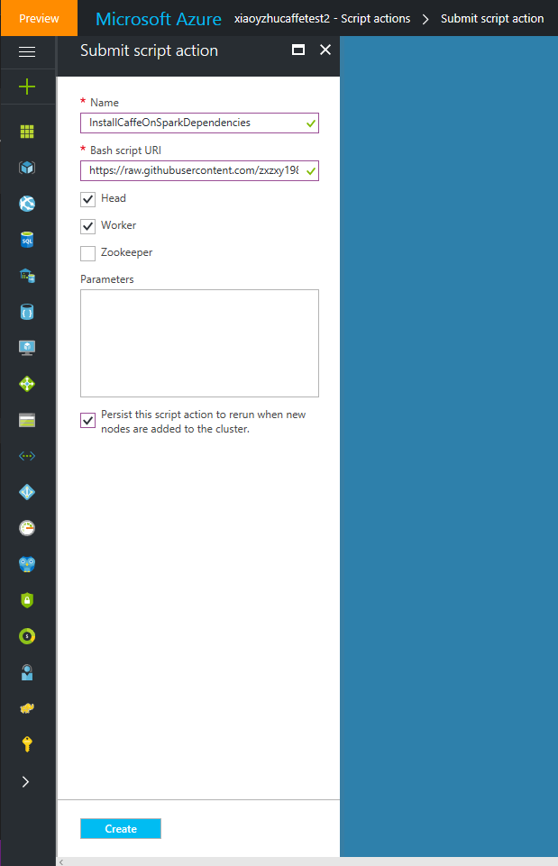
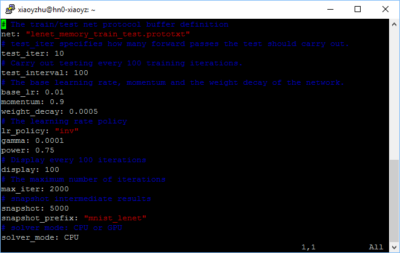
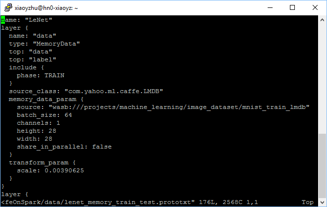
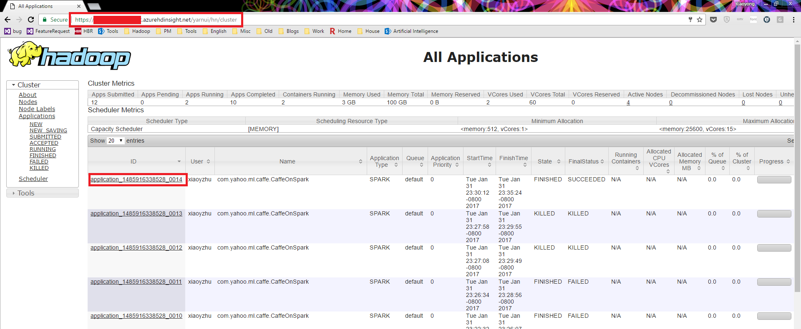
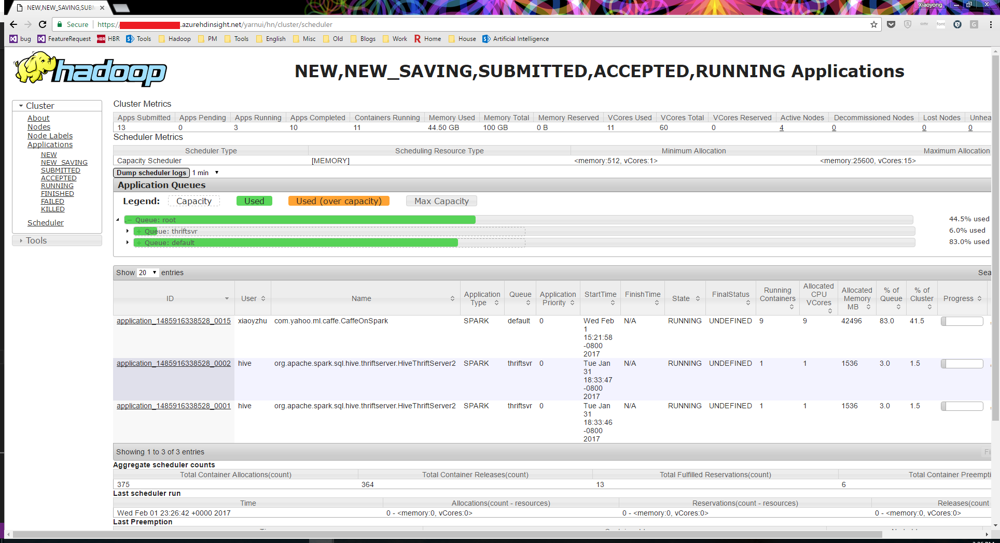
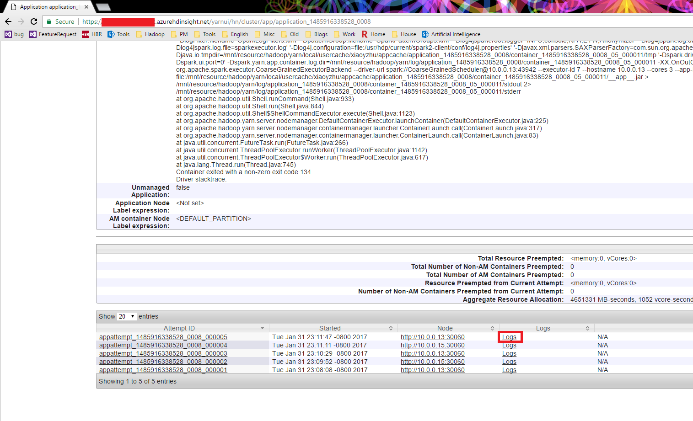

<properties
    pageTitle="使用 Caffe on Azure HDInsight Spark 进行分布式深度学习 | Azure"
    description="使用 Caffe on Azure HDInsight Spark 进行分布式深度学习"
    services="hdinsight"
    documentationcenter=""
    author="xiaoyongzhu"
    manager="asadk"
    editor="cgronlun"
    tags="azure-portal" />
<tags
    ms.assetid="71dcd1ad-4cad-47ad-8a9d-dcb7fa3c2ff9"
    ms.service="hdinsight"
    ms.workload="big-data"
    ms.tgt_pltfrm="na"
    ms.devlang="na"
    ms.topic="article"
    ms.date="02/17/2017"
    wacn.date="03/31/2017"
    ms.author="xiaoyzhu" />  

# 使用 Caffe on Azure HDInsight Spark 进行分布式深度学习

## 介绍

深度学习正在影响我们生活中的方方面面，从医疗保健到交通运输到生产制造，不一而足。很多公司都在考虑通过深度学习来解决各种棘手的问题，例如[图像分类](http://blogs.microsoft.com/next/2015/12/10/microsoft-researchers-win-imagenet-computer-vision-challenge/)、[语音识别](http://googleresearch.blogspot.jp/2015/08/the-neural-networks-behind-google-voice.html)、物体识别和机器翻译。

有[许多常用框架](https://en.wikipedia.org/wiki/Comparison_of_deep_learning_software)，其中包括 [Microsoft 认知工具包](https://www.microsoft.com/research/product/cognitive-toolkit/)、[Tensorflow](https://www.tensorflow.org/)、MXNet、Theano 等。Caffe 是最著名的非符号（命令式）神经网络框架之一，广泛用于包括计算机视觉在内的许多领域。另外，[CaffeOnSpark](http://yahoohadoop.tumblr.com/post/139916563586/caffeonspark-open-sourced-for-distributed-deep) 将 Caffe 与 Apache Spark 结合在一起，使深度学习能够轻松地用于现有的 Hadoop 群集和 Spark ETL 管道，降低进行端到端学习时的系统复杂性和延迟。

[HDInsight](https://azure.microsoft.com/services/hdinsight/) 是唯一完全托管的云 Hadoop 产品，为 Spark、Hive、MapReduce、HBase、Storm、Kafka 以及由一个 99.9% 的 SLA 支持的 R Server 提供优化的开源分析群集。这些大数据技术和 ISV 应用程序均可轻松部署为受企业级保护和监视的托管群集。

某些用户询问如何在 Microsoft 的 PaaS Hadoop 产品 HDInsight 上使用深度学习。我们会在以后给大家带来更多内容，但目前只能以技术博客的方式总结一下如何使用 Caffe on HDInsight Spark。

如果以前安装过 Caffe，用户会对安装该框架的困难有所体会。在本博客中，我们将先介绍如何为 HDInsight 群集安装 [Caffe on Spark](https://github.com/yahoo/CaffeOnSpark)，然后通过内置的 MNIST 演示版演示如何使用分布式深度学习，在多个 CPU 上使用 HDInsight Spark。

需完成四大步骤才能让其在 HDInsight 上运行。

1. 在所有节点上安装必需的依赖项
2. 在头节点上生成 Caffe on Spark for HDInsight
3. 将所需库分发到所有工作节点
4. 编写 Caffe 模型并以分布方式运行

HDInsight 是一种 PaaS 解决方案，因此提供了出色的平台功能，可以很轻松地执行某些任务。我们在本博客文章中多次使用的一项功能称为[脚本操作](https://docs.microsoft.com/azure/hdinsight/hdinsight-hadoop-customize-cluster-linux)，适合执行 Shell 命令来自定义群集节点（头节点、工作节点或边缘节点）。

## 步骤 1：在所有节点上安装必需的依赖项

若要开始，需安装所需依赖项。Caffe 站点和 [CaffeOnSpark 站点](https://github.com/yahoo/CaffeOnSpark/wiki/GetStarted_yarn)提供了一些很有用的 Wiki 信息，介绍了如何针对 Spark on YARN 模式（即适用于 HDInsight Spark 的模式）安装依赖项，但我们需要添加更多适用于 HDInsight 平台的依赖项。我们将使用脚本操作（如下所示）并让其在所有头节点和工作节点上运行。该脚本操作需时约 20 分钟，因为那些依赖项也依赖于其他包。应将其置于某个可供 HDInsight 群集访问的位置，例如置于 GitHub 或默认的 BLOB 存储帐户中。

    #!/bin/bash
    #Please be aware that installing the below will add additional 20 mins to cluster creation because of the dependencies
    #installing all dependencies, including the ones mentioned in http://caffe.berkeleyvision.org/install_apt.html, as well a few packages that are not included in HDInsight, such as gflags, glog, lmdb, numpy
    #It seems numpy will only needed during compilation time, but for safety purpose we install them on all the nodes

    sudo apt-get install -y libprotobuf-dev libleveldb-dev libsnappy-dev libopencv-dev libhdf5-serial-dev protobuf-compiler maven libatlas-base-dev libgflags-dev libgoogle-glog-dev liblmdb-dev build-essential  libboost-all-dev python-numpy python-scipy python-matplotlib ipython ipython-notebook python-pandas python-sympy python-nose

    #install protobuf
    wget https://github.com/google/protobuf/releases/download/v2.5.0/protobuf-2.5.0.tar.gz
    sudo tar xzvf protobuf-2.5.0.tar.gz -C /tmp/
    cd /tmp/protobuf-2.5.0/
    sudo ./configure
    sudo make
    sudo make check
    sudo make install
    sudo ldconfig
    echo "protobuf installation done"

上面的脚本操作有两个步骤。第一步是安装所有必需的库。这些库包括编译 Caffe 所必需的库（例如 gflags、glog）和运行 Caffe 所必需的库（例如 numpy）。考虑到 CPU 优化，我们使用的是 libatlas，但用户始终可以按照 CaffeOnSpark Wiki 上的说明来安装其他优化库，例如 MKL 或 CUDA（适合 GPU）。

第二步是在运行时下载、编译和安装适用于 Caffe 的 protobuf 2.5.0。Protobuf 2.5.0 [是必需的](https://github.com/yahoo/CaffeOnSpark/issues/87)，但 Ubuntu 16 不提供包形式的该版本，因此需从源代码对其进行编译。Internet 上也有一些介绍其编译方法的资源，例如[此文](http://jugnu-life.blogspot.com/2013/09/install-protobuf-25-on-ubuntu.html)

若要快速开始，可直接针对群集的所有工作节点和头节点运行此脚本操作（适用于 HDInsight 3.5）。脚本操作可在群集运行时运行，也可在群集预配时运行。有关脚本操作的更多详细信息，请参阅[此处](https://docs.microsoft.com/azure/hdinsight/hdinsight-hadoop-customize-cluster-linux#view-history-promote-and-demote-script-actions)的文档

  

## 步骤 2：在头节点上生成 Caffe on Spark for HDInsight

第二步是在头节点上生成 Caffe，然后将编译的库分发到所有工作节点。这一步需[以 ssh 方式登录到头节点](https://docs.microsoft.com/azure/hdinsight/hdinsight-hadoop-linux-use-ssh-unix)，然后按 [CaffeOnSpark 生成过程](https://github.com/yahoo/CaffeOnSpark/wiki/GetStarted_yarn)操作。使用下面的脚本，只需几项附加步骤即可生成 CaffeOnSpark。

    #!/bin/bash
    git clone https://github.com/yahoo/CaffeOnSpark.git --recursive
    export CAFFE_ON_SPARK=$(pwd)/CaffeOnSpark

    pushd ${CAFFE_ON_SPARK}/caffe-public/
    cp Makefile.config.example Makefile.config
    echo "INCLUDE_DIRS += ${JAVA_HOME}/include" >> Makefile.config
    #Below configurations might need to be updated based on actual cases. For example, if you are using GPU, or using a different BLAS library, you may want to update those settings accordingly.
    echo "CPU_ONLY := 1" >> Makefile.config
    echo "BLAS := atlas" >> Makefile.config
    echo "INCLUDE_DIRS += /usr/include/hdf5/serial/" >> Makefile.config
    echo "LIBRARY_DIRS += /usr/lib/x86_64-linux-gnu/hdf5/serial/" >> Makefile.config
    popd

    #compile CaffeOnSpark
    pushd ${CAFFE_ON_SPARK}
    #always clean up the environment before building (especially when rebuiding), or there will be errors such as "failed to execute goal org.apache.maven.plugins:maven-antrun-plugin:1.7:run (proto) on project caffe-distri: An Ant BuildException has occured: exec returned: 2"
    make clean 
    #the build step usually takes 20~30 mins, since it has a lot maven dependencies
    make build 
    popd
    export LD_LIBRARY_PATH=${CAFFE_ON_SPARK}/caffe-public/distribute/lib:${CAFFE_ON_SPARK}/caffe-distri/distribute/lib

    hadoop fs -mkdir -p wasb:///projects/machine_learning/image_dataset

    ${CAFFE_ON_SPARK}/scripts/setup-mnist.sh
    hadoop fs -put -f ${CAFFE_ON_SPARK}/data/mnist_*_lmdb wasb:///projects/machine_learning/image_dataset/

    ${CAFFE_ON_SPARK}/scripts/setup-cifar10.sh
    hadoop fs -put -f ${CAFFE_ON_SPARK}/data/cifar10_*_lmdb wasb:///projects/machine_learning/image_dataset/

    #put the already compiled CaffeOnSpark libraries to wasb storage, then read back to each node using script actions. This is because CaffeOnSpark requires all the nodes have the libarries
    hadoop fs -mkdir -p /CaffeOnSpark/caffe-public/distribute/lib/
    hadoop fs -mkdir -p /CaffeOnSpark/caffe-distri/distribute/lib/
    hadoop fs -put CaffeOnSpark/caffe-distri/distribute/lib/* /CaffeOnSpark/caffe-distri/distribute/lib/
    hadoop fs -put CaffeOnSpark/caffe-public/distribute/lib/* /CaffeOnSpark/caffe-public/distribute/lib/

除了 CaffeOnSpark 文档所述步骤，可能还需执行其他步骤。所做更改如下：
- 更改仅针对 CPU，特此使用 libatlas。
- 将数据集置于 BLOB 存储，这是一个共享位置，可供所有工作节点在以后使用时访问。
- 将编译的 Caffe 库置于 BLOB 存储，以便将来使用脚本操作将这些库复制到所有节点，不再需要编译。

### 故障排除：出现 Ant BuildException: exec 返回: 2

首次尝试生成 CaffeOnSpark 时，有时会出现以下错误消息：

    failed to execute goal org.apache.maven.plugins:maven-antrun-plugin:1.7:run (proto) on project caffe-distri: An Ant BuildException has occured: exec returned: 2

只需运行“make clean”清除代码存储库，然后再运行“make build”即可解决该问题，前提是依赖项正确。

### 故障排除：Maven 存储库连接超时

有时 Maven 会出现连接超时错误，类似如下内容：

    Retry:
    [INFO] Downloading: https://repo.maven.apache.org/maven2/com/twitter/chill_2.11/0.8.0/chill_2.11-0.8.0.jar
    Feb 01, 2017 5:14:49 AM org.apache.maven.wagon.providers.http.httpclient.impl.execchain.RetryExec execute
    INFO: I/O exception (java.net.SocketException) caught when processing request to {s}->https://repo.maven.apache.org:443: Connection timed out (Read failed)

此时只需等待几分钟，然后尝试重新生成代码即可。这可能是 Maven 在以某种方式限制源自特定 IP 地址的流量。

### 故障排除：Caffe 测试失败

对 CaffeOnSpark 进行最后检查时，可能会出现一条测试失败的消息，类似如下内容。这可能与 UTF-8 编码有关，但不会影响 Caffe 的使用

    Run completed in 32 seconds, 78 milliseconds.
    Total number of tests run: 7
    Suites: completed 5, aborted 0
    Tests: succeeded 6, failed 1, canceled 0, ignored 0, pending 0
    *** 1 TEST FAILED ***

## 步骤 3：将所需库分发到所有工作节点

下一步是将库（基本上是 CaffeOnSpark/caffe-public/distribute/lib/ 和 CaffeOnSpark/caffe-distri/distribute/lib/ 中的库）分发到所有节点。在步骤 2 中，我们将这些库置于 BLOB 存储，而在此步骤中，我们需使用脚本操作将其复制到所有头节点和工作节点。

为此，只需运行如下所示的脚本操作（需要指向特定于群集的正确位置）：

    #!/bin/bash
    hadoop fs -get wasb:///CaffeOnSpark /home/changetoyourusername/

我们已在步骤 2 中将其置于可供所有节点访问的 BLOB 存储，因此在此步骤中，只需直接将其复制到所有节点即可。

## 步骤 4：编写 Caffe 模型并以分布方式运行

运行上述步骤以后，Caffe 已安装在头节点上，因此可以继续操作。下一步是编写 Caffe 模型。

Caffe 使用的是“富有表现力的体系结构”，因此若要编写模型，只需定义配置文件即可，根本不需编码（大多数情况下）。让我们看看实际情况。

我们今天要训练的模型是用于 MNIST 训练的示例模型。包含手写数字的 MNIST 数据库有一个 60,000 示例的训练集，还有一个 10,000 示例的测试集。它是 NIST 提供的更大型集的子集。这些数字已在大小方面规范化，在固定大小的图像中居中。CaffeOnSpark 提供的一些脚本可以下载该数据集并将其转换成正确的格式。

CaffeOnSpark 提供了一些用于 MNIST 培训的网络拓扑示例。它具有良好的设计，将网络体系结构（网络拓扑）和优化进行了拆分。在本示例中，需要两个文件：

“解算器”文件 (${CAFFE\_ON\_SPARK}/data/lenet\_memory\_solver.prototxt) 用于监控优化情况和生成参数更新。例如，它可以定义是使用 CPU 还是 GPU，以及具体的动量和迭代次数等。它还定义程序应使用哪个神经元网络拓扑（即我们需要的第二个文件）。有关解算器的详细信息，请参阅 [Caffe 文档](http://caffe.berkeleyvision.org/tutorial/solver.html)。

就此示例来说，我们使用的是 CPU 而不是 GPU，因此应将最后一行更改为：

    # solver mode: CPU or GPU
    solver_mode: CPU

  

可以根据需要更改其他行。

第二个文件 (${CAFFE\_ON\_SPARK}/data/lenet\_memory\_train\_test.prototxt) 定义神经元网络的情况，以及相关的输入和输出文件。此外还需根据训练数据位置更新文件。更改 lenet\_memory\_train\_test.prototxt 中的以下部分（需指向特定于群集的正确位置）：

- 将“file:/Users/mridul/bigml/demodl/mnist\_train\_lmdb”更改为“wasb:///projects/machine\_learning/image\_dataset/mnist\_train\_lmdb”
- 将“file:/Users/mridul/bigml/demodl/mnist\_test\_lmdb/”更改为“wasb:///projects/machine\_learning/image\_dataset/mnist\_test\_lmdb”

  

如需详细了解如何定义网络，请查看[有关 MNIST 数据集的 Caffe 文档](http://caffe.berkeleyvision.org/gathered/examples/mnist.html)

考虑到本博客的目的，我们只使用这个简单的 MNIST 示例。应从头节点运行以下命令：

    spark-submit --master yarn --deploy-mode cluster --num-executors 8 --files ${CAFFE_ON_SPARK}/data/lenet_memory_solver.prototxt,${CAFFE_ON_SPARK}/data/lenet_memory_train_test.prototxt --conf spark.driver.extraLibraryPath="${LD_LIBRARY_PATH}" --conf spark.executorEnv.LD_LIBRARY_PATH="${LD_LIBRARY_PATH}" --class com.yahoo.ml.caffe.CaffeOnSpark ${CAFFE_ON_SPARK}/caffe-grid/target/caffe-grid-0.1-SNAPSHOT-jar-with-dependencies.jar -train -features accuracy,loss -label label -conf lenet_memory_solver.prototxt -devices 1 -connection ethernet -model wasb:///mnist.model -output wasb:///mnist_features_result

大致说来，它会将所需文件（lenet\_memory\_solver.prototxt 和 lenet\_memory\_train\_test.prototxt）分发到每个 YARN 容器，并将每个 Spark 驱动程序/执行程序的相关 PATH 设置为 LD\_LIBRARY\_PATH，后者已在前面的代码片段中定义，且指向 CaffeOnSpark 库所在位置。

## 监视和故障排除

我们使用的是 YARN 群集模式，可将 Spark 驱动程序调度到任意容器（以及任意工作节点），因此用户会在控制台中看到类似如下的输出：

    17/02/01 23:22:16 INFO Client: Application report for application_1485916338528_0015 (state: RUNNING)

若要了解所发生的情况，通常需获取 Spark 驱动程序的日志，其中包含详细信息。在本例中，需转到 YARN UI 查找相关的 YARN 日志。可通过以下 URL 获取 YARN UI：

    https://yourclustername.azurehdinsight.cn/yarnui
   
  

可以看看为这个特定的应用程序分配了多少资源。单击“计划程序”链接即可查看此应用程序的资源分配情况，有 9 个容器正在运行。我们要求 YARN 提供 8 个执行程序，另一个容器用于驱动程序进程。

  

如果发生故障，可能需要查看驱动程序日志或容器日志。若要查看驱动程序日志，可在 YARN UI 中单击应用程序 ID，然后单击“日志”按钮。此时驱动程序日志会写入 stderr 中。

  

例如，可能会显示下面列出的来自驱动程序日志的部分错误，指示用户分配的执行程序过多。

    17/02/01 07:26:06 ERROR ApplicationMaster: User class threw exception: java.lang.IllegalStateException: Insufficient training data. Please adjust hyperparameters or increase dataset.
    java.lang.IllegalStateException: Insufficient training data. Please adjust hyperparameters or increase dataset.
        at com.yahoo.ml.caffe.CaffeOnSpark.trainWithValidation(CaffeOnSpark.scala:261)
        at com.yahoo.ml.caffe.CaffeOnSpark$.main(CaffeOnSpark.scala:42)
        at com.yahoo.ml.caffe.CaffeOnSpark.main(CaffeOnSpark.scala)
        at sun.reflect.NativeMethodAccessorImpl.invoke0(Native Method)
        at sun.reflect.NativeMethodAccessorImpl.invoke(NativeMethodAccessorImpl.java:62)
        at sun.reflect.DelegatingMethodAccessorImpl.invoke(DelegatingMethodAccessorImpl.java:43)
        at java.lang.reflect.Method.invoke(Method.java:498)
        at org.apache.spark.deploy.yarn.ApplicationMaster$$anon$2.run(ApplicationMaster.scala:627)

有时，问题可能会发生在执行程序而非驱动程序中。在这种情况下，需检查容器日志。你始终可以获取驱动程序容器日志，然后获取发生故障的容器。例如，可能会在运行 Caffe 时遇到这种故障。

    17/02/01 07:12:05 WARN YarnAllocator: Container marked as failed: container_1485916338528_0008_05_000005 on host: 10.0.0.14. Exit status: 134. Diagnostics: Exception from container-launch.
    Container id: container_1485916338528_0008_05_000005
    Exit code: 134
    Exception message: /bin/bash: line 1: 12230 Aborted                 (core dumped) LD_LIBRARY_PATH=/usr/hdp/current/hadoop-client/lib/native:/usr/hdp/current/hadoop-client/lib/native/Linux-amd64-64:/home/xiaoyzhu/CaffeOnSpark/caffe-public/distribute/lib:/home/xiaoyzhu/CaffeOnSpark/caffe-distri/distribute/lib /usr/lib/jvm/java-8-openjdk-amd64/bin/java -server -Xmx4608m '-Dhdp.version=' '-Detwlogger.component=sparkexecutor' '-DlogFilter.filename=SparkLogFilters.xml' '-DpatternGroup.filename=SparkPatternGroups.xml' '-Dlog4jspark.root.logger=INFO,console,RFA,ETW,Anonymizer' '-Dlog4jspark.log.dir=/var/log/sparkapp/${user.name}' '-Dlog4jspark.log.file=sparkexecutor.log' '-Dlog4j.configuration=file:/usr/hdp/current/spark2-client/conf/log4j.properties' '-Djavax.xml.parsers.SAXParserFactory=com.sun.org.apache.xerces.internal.jaxp.SAXParserFactoryImpl' -Djava.io.tmpdir=/mnt/resource/hadoop/yarn/local/usercache/xiaoyzhu/appcache/application_1485916338528_0008/container_1485916338528_0008_05_000005/tmp '-Dspark.driver.port=43942' '-Dspark.history.ui.port=18080' '-Dspark.ui.port=0' -Dspark.yarn.app.container.log.dir=/mnt/resource/hadoop/yarn/log/application_1485916338528_0008/container_1485916338528_0008_05_000005 -XX:OnOutOfMemoryError='kill %p' org.apache.spark.executor.CoarseGrainedExecutorBackend --driver-url spark://CoarseGrainedScheduler@10.0.0.13:43942 --executor-id 4 --hostname 10.0.0.14 --cores 3 --app-id application_1485916338528_0008 --user-class-path file:/mnt/resource/hadoop/yarn/local/usercache/xiaoyzhu/appcache/application_1485916338528_0008/container_1485916338528_0008_05_000005/__app__.jar > /mnt/resource/hadoop/yarn/log/application_1485916338528_0008/container_1485916338528_0008_05_000005/stdout 2> /mnt/resource/hadoop/yarn/log/application_1485916338528_0008/container_1485916338528_0008_05_000005/stderr

    Stack trace: ExitCodeException exitCode=134: /bin/bash: line 1: 12230 Aborted                 (core dumped) LD_LIBRARY_PATH=/usr/hdp/current/hadoop-client/lib/native:/usr/hdp/current/hadoop-client/lib/native/Linux-amd64-64:/home/xiaoyzhu/CaffeOnSpark/caffe-public/distribute/lib:/home/xiaoyzhu/CaffeOnSpark/caffe-distri/distribute/lib /usr/lib/jvm/java-8-openjdk-amd64/bin/java -server -Xmx4608m '-Dhdp.version=' '-Detwlogger.component=sparkexecutor' '-DlogFilter.filename=SparkLogFilters.xml' '-DpatternGroup.filename=SparkPatternGroups.xml' '-Dlog4jspark.root.logger=INFO,console,RFA,ETW,Anonymizer' '-Dlog4jspark.log.dir=/var/log/sparkapp/${user.name}' '-Dlog4jspark.log.file=sparkexecutor.log' '-Dlog4j.configuration=file:/usr/hdp/current/spark2-client/conf/log4j.properties' '-Djavax.xml.parsers.SAXParserFactory=com.sun.org.apache.xerces.internal.jaxp.SAXParserFactoryImpl' -Djava.io.tmpdir=/mnt/resource/hadoop/yarn/local/usercache/xiaoyzhu/appcache/application_1485916338528_0008/container_1485916338528_0008_05_000005/tmp '-Dspark.driver.port=43942' '-Dspark.history.ui.port=18080' '-Dspark.ui.port=0' -Dspark.yarn.app.container.log.dir=/mnt/resource/hadoop/yarn/log/application_1485916338528_0008/container_1485916338528_0008_05_000005 -XX:OnOutOfMemoryError='kill %p' org.apache.spark.executor.CoarseGrainedExecutorBackend --driver-url spark://CoarseGrainedScheduler@10.0.0.13:43942 --executor-id 4 --hostname 10.0.0.14 --cores 3 --app-id application_1485916338528_0008 --user-class-path file:/mnt/resource/hadoop/yarn/local/usercache/xiaoyzhu/appcache/application_1485916338528_0008/container_1485916338528_0008_05_000005/__app__.jar > /mnt/resource/hadoop/yarn/log/application_1485916338528_0008/container_1485916338528_0008_05_000005/stdout 2> /mnt/resource/hadoop/yarn/log/application_1485916338528_0008/container_1485916338528_0008_05_000005/stderr

        at org.apache.hadoop.util.Shell.runCommand(Shell.java:933)
        at org.apache.hadoop.util.Shell.run(Shell.java:844)
        at org.apache.hadoop.util.Shell$ShellCommandExecutor.execute(Shell.java:1123)
        at org.apache.hadoop.yarn.server.nodemanager.DefaultContainerExecutor.launchContainer(DefaultContainerExecutor.java:225)
        at org.apache.hadoop.yarn.server.nodemanager.containermanager.launcher.ContainerLaunch.call(ContainerLaunch.java:317)
        at org.apache.hadoop.yarn.server.nodemanager.containermanager.launcher.ContainerLaunch.call(ContainerLaunch.java:83)
        at java.util.concurrent.FutureTask.run(FutureTask.java:266)
        at java.util.concurrent.ThreadPoolExecutor.runWorker(ThreadPoolExecutor.java:1142)
        at java.util.concurrent.ThreadPoolExecutor$Worker.run(ThreadPoolExecutor.java:617)
        at java.lang.Thread.run(Thread.java:745)

    Container exited with a non-zero exit code 134

在这种情况下，需获取发生故障的容器的 ID（在上面的示例中，该 ID 为 container_1485916338528_0008_05_000005）。然后需要运行

    yarn logs -containerId container_1485916338528_0008_03_000005

（从头节点）。查看容器故障后，会发现该故障的原因是在 lenet\_memory\_solver.prototxt 中使用了 GPU 模式（本应使用 CPU 模式）。

    17/02/01 07:10:48 INFO LMDB: Batch size:100
    WARNING: Logging before InitGoogleLogging() is written to STDERR
    F0201 07:10:48.309725 11624 common.cpp:79] Cannot use GPU in CPU-only Caffe: check mode.

## 获取结果

由于我们分配的执行程序为 8 个，且网络拓扑简单，获取结果应该只需要大约 30 分钟。从命令行中，可以看到我们将模型置于 wasb:///mnist.model 中，将结果置于名为 wasb:///mnist_features_result 的文件夹中。

可以通过运行以下命令获取结果：

    hadoop fs -cat hdfs:///mnist_features_result/*

结果如下所示：

    {"SampleID":"00009597","accuracy":[1.0],"loss":[0.028171852],"label":[2.0]}
    {"SampleID":"00009598","accuracy":[1.0],"loss":[0.028171852],"label":[6.0]}
    {"SampleID":"00009599","accuracy":[1.0],"loss":[0.028171852],"label":[1.0]}
    {"SampleID":"00009600","accuracy":[0.97],"loss":[0.0677709],"label":[5.0]}
    {"SampleID":"00009601","accuracy":[0.97],"loss":[0.0677709],"label":[0.0]}
    {"SampleID":"00009602","accuracy":[0.97],"loss":[0.0677709],"label":[1.0]}
    {"SampleID":"00009603","accuracy":[0.97],"loss":[0.0677709],"label":[2.0]}
    {"SampleID":"00009604","accuracy":[0.97],"loss":[0.0677709],"label":[3.0]}
    {"SampleID":"00009605","accuracy":[0.97],"loss":[0.0677709],"label":[4.0]}

SampleID 表示 MNIST 数据集中的 ID，标签是模型的标识数字。

## 结束语

在本文档中，你已尝试安装 CaffeOnSpark 并运行一个简单的示例。HDInsight 是完全托管的云分布式计算平台，尤其适合在大型数据集上运行机器学习和高级分析工作负荷，而对于分布式深度学习，可以使用 Caffe on HDInsight Spark 执行深度学习任务。

## 另请参阅
* [概述：Azure HDInsight 上的 Apache Spark](/documentation/articles/hdinsight-apache-spark-overview/)

### 方案
* [Spark 和机器学习：使用 HDInsight 中的 Spark 对使用 HVAC 数据生成温度进行分析](/documentation/articles/hdinsight-apache-spark-ipython-notebook-machine-learning/)
* [Spark 和机器学习：使用 HDInsight 中的 Spark 预测食品检查结果](/documentation/articles/hdinsight-apache-spark-machine-learning-mllib-ipython/)

### 管理资源
* [管理 Azure HDInsight 中 Apache Spark 群集的资源](/documentation/articles/hdinsight-apache-spark-resource-manager/)

<!---HONumber=Mooncake_0327_2017-->