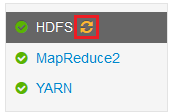
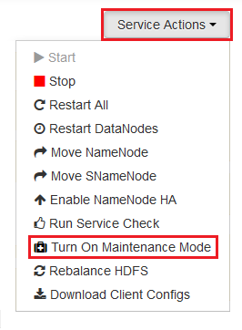

<properties
	pageTitle="在 HDInsight 上为 Hadoop 服务启用堆转储 | Microsoft Azure"
	description="为基于 Linux 的 HDInsight 群集中的 Hadoop 服务启用堆转储，以便进行调试和分析。"
	services="hdinsight"
	documentationCenter=""
	authors="Blackmist"
	manager="paulettm"
	editor="cgronlun"
	tags="azure-portal"/>

<tags
	ms.service="hdinsight"
	ms.date="09/27/2016"
	wacn.date="02/14/2017"/>

#在基于 Linux 的 HDInsight（预览版）上为 Hadoop 服务启用堆转储

[AZURE.INCLUDE [heapdump-selector](../../includes/hdinsight-selector-heap-dump.md)]

堆转储包含应用程序的内存快照，其中包括创建转储时各变量的值。因此，它们在诊断发生在运行时的问题时很有用。

> [AZURE.NOTE]本文中的信息仅适用于基于 Linux 的 HDInsight。有关基于 Windows 的 HDInsight 的信息，请参阅[为基于 Windows 的 HDInsight 上的 Hadoop 服务启用堆转储](/documentation/articles/hdinsight-hadoop-collect-debug-heap-dumps/)

## 服务

你可以启用以下服务的堆转储：

*  **hcatalog** - tempelton
*  **hive** - hiveserver2、metastore、derbyserver
*  **mapreduce** - jobhistoryserver
*  **yarn** - resourcemanager、nodemanager、timelineserver
*  **hdfs** - datanode、secondarynamenode、namenode

你还可以启用映射的堆转储，并减少由 HDInsight 运行的流程数。

## 了解堆转储配置

在某项服务启动时，可以通过将选项（有时称为 opts 或参数）传递到 JVM 来启用堆转储。对于大多数 Hadoop 服务，这可以通过修改用于启动该服务的 shell 脚本来完成。

在每个脚本中，有一个针对 \***\_OPTS** 的导出，其中包含传递到 JVM 的选项。例如，在 **hadoop-env.sh** 脚本中，以 `export HADOOP_NAMENODE_OPTS=` 开头的行包含适用于 NameNode 服务的选项。

映射和化简进程稍有不同，因为这些进程是 MapReduce 服务的子进程。每个映射或化简进程都在子容器中运行，其中有两个条目包含这些进程的 JVM 选项。二者均包含在 **mapred-site.xml** 中：

* **mapreduce.admin.map.child.java.opts**
* **mapreduce.admin.reduce.child.java.opts**

> [AZURE.NOTE]我们建议使用 Ambari 来修改这些脚本和 mapred-site.xml 设置，因为 Ambari 会负责在群集中跨节点复制更改。请参阅[使用 Ambari](#using-ambari) 部分以了解具体的步骤。

###启用堆转储

发生 OutOfMemoryError 时，可以使用以下选项来启用堆转储：

    -XX:+HeapDumpOnOutOfMemoryError

**+** 指示是否启用了此选项。默认为禁用。

> [AZURE.WARNING]默认情况下，在 HDInsight 上不为 Hadoop 服务启用堆转储，因为转储文件可能很大。如果你启用了堆转储来进行故障诊断，请记住在重现问题并收集转储文件后禁用堆转储。

###转储位置

转储文件的默认位置是当前的工作目录。你可以使用以下选项来控制文件的存储位置：

    -XX:HeapDumpPath=/path

例如，使用 `-XX:HeapDumpPath=/tmp` 可以将转储存储在 /tmp 目录中。

###脚本

你还可以在发生 **OutOfMemoryError** 时触发一个脚本。例如，可以触发一个通知，这样你就知道发生了错误。这可以使用以下选项进行控制：

    -XX:OnOutOfMemoryError=/path/to/script

> [AZURE.NOTE]由于 Hadoop 是分布式系统，任何使用的脚本都必须放置在服务运行时所在的群集的所有节点上。
>

> 该脚本还必须位于可供帐户（服务以该帐户的身份运行）访问的位置，并且必须提供执行权限。例如，你可能希望将脚本存储在 `/usr/local/bin` 中，并通过 `chmod go+rx /usr/local/bin/filename.sh` 来授予读取和执行权限。

## 使用 Ambari

若要修改服务配置，请使用以下步骤：

1. 打开群集的 Ambari Web UI。URL 将为 https://YOURCLUSTERNAME.azurehdinsight.cn。

    出现提示时，通过该站点使用群集的 HTTP 帐户名 (default: admin,) 和密码进行身份验证。

    > [AZURE.NOTE]Ambari 可能会再次提示你输入用户名和密码。如果是这样，重新输入相同的帐户名和密码即可

2. 使用左侧的列表，选择你想要修改的服务区。例如，**HDFS**。在中心区域，选择**“配置”**选项卡。

    

3. 使用**“筛选...”**条目，输入**选项**。此时会筛选配置项目的列表，只保留那些包含该文本的项目。这是一种快速查找 shell 脚本的方式，也可用于快速查找可用于设置这些选项的**模板**。

    

4. 查找需为其启用堆转储的服务的 ***\_OPTS** 条目，然后添加你希望启用的选项。在下图中，我已将 `-XX:+HeapDumpOnOutOfMemoryError -XX:HeapDumpPath=/tmp/` 添加到 **HADOOP\_NAMENODE\_OPTS** 条目：

    

	> [AZURE.NOTE]为映射或化简进程启用堆转储时，则需查找标记为 **mapreduce.admin.map.child.java.opts** 和 **mapreduce.admin.reduce.child.java.opts** 的字段。

    使用“保存”按钮保存所做的更改。你可以输入简短的说明，描述所做的更改。

5. 一旦应用了所做的更改，**“需要重新启动”**图标将显示在一个或多个服务旁边。

    

6. 选择需要重新启动的每个服务，然后使用**“服务操作”**按钮**打开维护模式**。这可以防止重新启动时从该服务生成警报。

    

7. 一旦启用维护模式，使用服务的**“重新启动”**按钮即可**重新启动所有受影响的服务**

    

    > [AZURE.NOTE]其他服务的**“重新启动”**按钮条目可能会有所不同。

8. 一旦重新启动服务，可使用**“服务操作”**按钮**关闭维护模式**。这样一来，Ambari 就可以继续监视服务的警报。

<!---HONumber=74-->