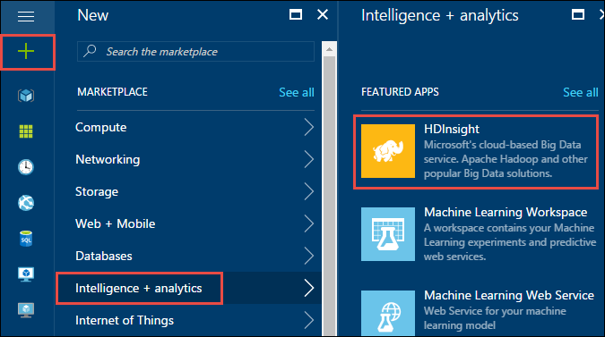

<properties
    pageTitle="使用门户在 Linux 上的 HDInsight 中创建 Hadoop、HBase、Storm 或 Spark 群集 | Azure"
    description="了解如何使用 Web 浏览器和 Azure 门户预览在 Linux 上创建适用于 HDInsight 的 Hadoop、HBase、Storm 或 Spark 群集。"
    services="hdinsight"
    documentationcenter=""
    author="nitinme"
    manager="jhubbard"
    editor="cgronlun"
    tags="azure-portal" />
<tags 
    ms.assetid="697278cf-0032-4f7c-b9b2-a84c4347659e"
    ms.service="hdinsight"
    ms.devlang="na"
    ms.topic="article"
    ms.tgt_pltfrm="na"
    ms.workload="big-data"
    ms.date="01/03/2017"
    wacn.date="01/25/2017"
    ms.author="nitinme" />

# 使用 Azure 门户预览在 HDInsight 中创建基于 Linux 的群集
[AZURE.INCLUDE [选择器](../../includes/hdinsight-selector-create-clusters.md)]

Azure 门户预览是一种基于 Web 的管理工具，用于管理 Azure 云中托管的服务和资源。在本文中，你将了解如何使用门户创建基于 Linux 的 HDInsight 群集。

## 先决条件
[AZURE.INCLUDE [delete-cluster-warning](../../includes/hdinsight-delete-cluster-warning.md)]

* **一个 Azure 订阅**。请参阅[获取 Azure 试用版](/pricing/1rmb-trial/)。
* **一个现代 Web 浏览器**。Azure 门户预览使用 HTML5 和 Javascript，可能无法在旧版 Web 浏览器中正确运行。

### 访问控制要求
[AZURE.INCLUDE [access-control](../../includes/hdinsight-access-control-requirements.md)]

## 创建群集
Azure 门户预览会公开大部分的群集属性。使用 Azure Resource Manager 模板可以隐藏许多详细信息。有关详细信息，请参阅 [Create Linux-based Hadoop clusters in HDInsight using Azure Resource Manager templates](/documentation/articles/hdinsight-hadoop-create-linux-clusters-arm-templates/)（在 HDInsight 中使用 Azure Resource Manager 模板创建基于 Linux 的 Hadoop 群集）。

1. 登录 [Azure 门户预览](https://portal.azure.cn)。
2. 单击“新建”，单击“数据分析”，然后单击“HDInsight”。
   
    

3. 输入**群集名称**：此名称必须全局唯一。

4. 从“订阅”下拉列表中选择将用于此群集的 Azure 订阅。

5. 单击“群集配置”，然后选择：
   
    * **群集类型**：如果你不知道要选择哪种群集，请选择“Hadoop”。它是最受欢迎的群集类型。
     
        > [AZURE.IMPORTANT]
        HDInsight 群集有各种类型，分别与针对其优化群集的工作负荷或技术相对应。没有任何方法支持创建组合多种类型的群集，例如一个群集同时具有 Storm 和 HBase 类型。
        > 
        > 
    * **操作系统**：选择“Linux”。
    * **版本**：如果不知道要选择哪个版本，请使用默认版本。有关详细信息，请参阅 [HDInsight 群集版本](/documentation/articles/hdinsight-component-versioning/)。

6. 单击“应用程序”以安装适用于 HDInsight 群集的应用程序。这些应用程序可能是 Microsoft、独立软件供应商 (ISV) 或你自己开发的。有关详细信息，请参阅[安装 HDInsight 应用程序](/documentation/articles/hdinsight-apps-install-applications/#install-applications-during-cluster-creation)。

7. 单击“凭据”，然后输入管理员用户的密码。此外，还必须输入“SSH 用户名”以及“密码”或“公钥”，这将用于验证 SSH 用户的身份。建议使用公钥。单击底部的“选择”以保存凭据配置。
   
    
   
    有关如何将 SSH 与 HDInsight 配合使用的详细信息，请参阅以下文章之一：
   
    * [在 Linux、Unix 或 OS X 中的 HDInsight 上将 SSH 与基于 Linux 的 Hadoop 配合使用](/documentation/articles/hdinsight-hadoop-linux-use-ssh-unix/)
    * [在 Windows 中的 HDInsight 上将 SSH 与基于 Linux 的 Hadoop 配合使用](/documentation/articles/hdinsight-hadoop-linux-use-ssh-windows/)

8. 在“数据源”边栏选项卡上，指定是否要将 Azure 存储 (WASB) 作为默认存储。

	* **将 Azure 存储 Blob 作为默认存储**

		对于**主存储类型**，单击“Azure 存储”。指定存储帐户和存储容器的详细信息，指定位置，然后单击“群集 AAD 标识”。

		  

		单击“选择”以保存数据源配置。

9. 单击“节点定价层”以显示针对此群集创建的节点的相关信息。设置群集所需的工作节点数。该群集的预估成本将显示在边栏选项卡内。
   
    
   
    > [AZURE.IMPORTANT]
    如果你计划使用 32 个以上的工作节点（在创建群集时或是在创建之后通过扩展群集进行），则必须选择至少具有 8 个核心和 14GB ram 的头节点大小。
    > 

    > 有关节点大小和相关费用的详细信息，请参阅 [HDInsight 定价](/pricing/details/hdinsight/)。
    > 
    > 
   
    单击“选择”以保存节点定价配置。

10. 单击“高级配置”可配置其他可选设置，例如加入**虚拟网络**、设置**外部元存储**以保存 Hive 和 Oozie 的数据、使用**脚本操作**来自定义要安装自定义组件的群集，或将**其他存储帐户**用于该群集。

    * **虚拟网络**：如果你想要将群集放入虚拟网络，请选择 Azure 虚拟网络和子网。
      
        
      
        有关将 HDInsight 与虚拟网络配合使用的信息（包括虚拟网络的特定配置要求），请参阅 [Extend HDInsight capabilities by using an Azure Virtual Network](/documentation/articles/hdinsight-extend-hadoop-virtual-network/)（使用 Azure 虚拟网络扩展 HDInsight 功能）。

    * 单击“外部元存储”以指定要用于保存与群集关联的 Hive 和 Oozie 元数据的 SQL 数据库。
      
        > [AZURE.NOTE]
        元存储配置不可用于 HBase 群集类型。
        > 
        > 
      
        
      
        对于“为 Hive 使用现有的 SQL DB”元数据，请单击“是”，选择 SQL 数据库，然后提供该数据库的用户名/密码。如果要“为 Oozie 元数据使用现有的 SQL DB”，请重复这些步骤。单击“选择”，直到返回“可选配置”边栏选项卡。
      
        > [AZURE.NOTE]
        用于元存储的 Azure SQL 数据库必须允许连接到其他 Azure 服务，包括 Azure HDInsight。在 Azure SQL 数据库仪表板上，单击右侧的服务器名称。该服务器是运行 SQL 数据库实例的服务器。进入服务器视图后，请单击“配置”，单击“Azure 服务”对应的“是”，然后单击“保存”。
        > 
        > 
      
        &nbsp;
      
        > [AZURE.IMPORTANT]
        创建元存储时，请勿使用包含短划线或连字符的数据库名称，因为这可能会导致群集创建过程失败。
        > 
        > 

    * 如果你想要在创建群集时使用自定义脚本自定义群集，请选择“脚本操作”。有关脚本操作的详细信息，请参阅[使用脚本操作自定义 HDInsight 群集](/documentation/articles/hdinsight-hadoop-customize-cluster-linux/)。在“脚本操作”边栏选项卡上提供如屏幕截图中所示的详细信息。
      
          

	* 单击“其他存储帐户”以指定要与群集关联的其他存储帐户。在“Azure 存储密钥”边栏选项卡中，单击“添加存储密钥”，然后选择现有的存储帐户或创建新的帐户。
      
        
      
        创建群集后，还可以添加其他存储帐户。请参阅 [Customize Linux-based HDInsight clusters using Script Action](/documentation/articles/hdinsight-hadoop-customize-cluster-linux/)（使用脚本操作自定义基于 Linux 的 HDInsight 群集）。
      
        单击“选择”，直至返回“新建 HDInsight 群集”边栏选项卡。

11. 在“新建 HDInsight 群集”边栏选项卡上，确保选中“固定到启动板”，然后单击“创建”。这将会创建群集，并将该群集的磁贴添加到 Azure 门户预览的启动板。该图标指示群集正在预配，完成预配后，将改为显示 HDInsight 图标。
    
    | 预配时 | 预配完成 |
    | --- | --- |
    |  | |
    
    > [AZURE.NOTE]
    创建群集需要一些时间，通常约 15 分钟左右。使用启动板上的磁贴或页面左侧的“通知”项检查预配进程。
    > 
    > 
12. 创建过程完成后，在启动板中单击群集磁贴，启动群集边栏选项卡。群集边栏选项卡提供有关该群集的基本信息，如名称、其所属的资源组、位置、操作系统、群集仪表板 URL 等。
    
    
    
    参考以下内容了解边栏选项卡顶部和“基本功能”部分中的图标：
    
    * **设置**和**所有设置**：显示该群集的“设置”边栏选项卡，可让你访问该群集的详细配置信息。
    * **仪表板**、**群集仪表板**和 **URL**：这是访问群集仪表板（也就是可在群集上运行作业的 Web 门户）的所有途径。
    * **安全外壳**：使用 SSH 访问群集时所需的信息。
    * **删除**：删除 HDInsight 群集。
    * **快速启动** ()：显示可帮助你开始使用 HDInsight 的信息。
    * **用户** ()：用于设置 Azure 订阅上其他用户对此群集的*门户管理*权限。
      
        > [AZURE.IMPORTANT]
        这*只会*影响在 Azure 门户预览中对此群集的访问和权限，对于连接到 HDInsight 群集或将作业提交到其上的用户并没有作用。
        > 
        > 
    * **标记** ()：标记可让你设置键/值对，以定义云服务的自定义分类。例如，你可以创建名为 **project** 的键，然后对与特定项目关联的所有服务使用一个公用值。

## 自定义群集
* 请参阅 [Customize HDInsight clusters using Bootstrap](/documentation/articles/hdinsight-hadoop-customize-cluster-bootstrap/)（使用 Bootstrap 自定义 HDInsight 群集）。
* 请参阅 [Customize Linux-based HDInsight clusters using Script Action](/documentation/articles/hdinsight-hadoop-customize-cluster-linux/)（使用脚本操作自定义基于 Linux 的 HDInsight 群集）。

## 删除群集
[AZURE.INCLUDE [delete-cluster-warning](../../includes/hdinsight-delete-cluster-warning.md)]

## 后续步骤
成功创建 HDInsight 群集后，请参考以下主题来了解如何使用群集：

### Hadoop 群集
* [将 Hive 与 HDInsight 配合使用](/documentation/articles/hdinsight-use-hive/)
* [将 Pig 与 HDInsight 配合使用](/documentation/articles/hdinsight-use-pig/)
* [将 MapReduce 与 HDInsight 配合使用](/documentation/articles/hdinsight-use-mapreduce/)

### HBase 群集
* [Get started with HBase on HDInsight（HBase on HDInsight 入门）](/documentation/articles/hdinsight-hbase-tutorial-get-started-linux/)
* [Develop Java applications for HBase on HDInsight（为 HBase on HDInsight 开发 Java 应用程序）](/documentation/articles/hdinsight-hbase-build-java-maven-linux/)

### Storm 群集
* [Develop Java topologies for Storm on HDInsight（为 Storm on HDInsight 开发 Java 拓扑）](/documentation/articles/hdinsight-storm-develop-java-topology/)
* [Use Python components in Storm on HDInsight（在 Storm on HDInsight 中使用 Python 组件）](/documentation/articles/hdinsight-storm-develop-python-topology/)
* [Deploy and monitor topologies with Storm on HDInsight（使用 Storm on HDInsight 部署和监视拓扑）](/documentation/articles/hdinsight-storm-deploy-monitor-topology-linux/)

### Spark 群集
* [使用 Scala 创建独立的应用程序](/documentation/articles/hdinsight-apache-spark-create-standalone-application/)
* [使用 Livy 在 Spark 群集中远程运行作业](/documentation/articles/hdinsight-apache-spark-livy-rest-interface/)
* [Spark 和 BI：使用 HDInsight 中的 Spark 和 BI 工具执行交互式数据分析](/documentation/articles/hdinsight-apache-spark-use-bi-tools/)
* [Spark 和机器学习：使用 HDInsight 中的 Spark 预测食品检查结果](/documentation/articles/hdinsight-apache-spark-machine-learning-mllib-ipython/)
* [Spark 流式处理：使用 HDInsight 中的 Spark 生成实时流式处理应用程序](/documentation/articles/hdinsight-apache-spark-eventhub-streaming/)

<!---HONumber=Mooncake_0120_2017-->