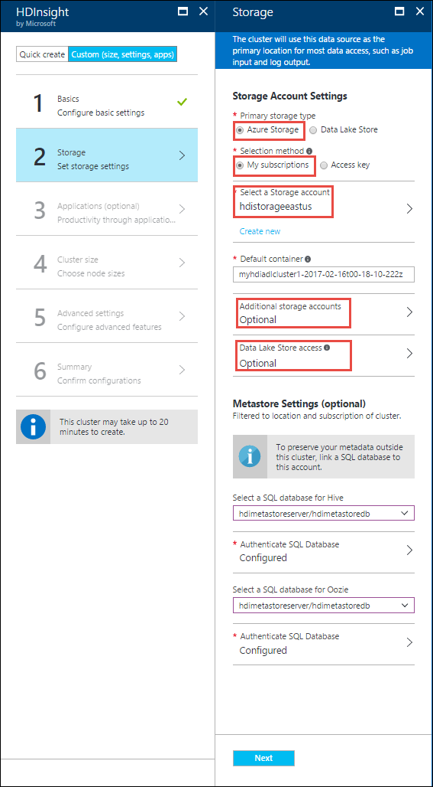

<properties
    pageTitle="使用 Web 浏览器创建 Azure HDInsight (Hadoop) | Azure"
    description="了解如何使用 Web 浏览器和 Azure 门户预览在 Linux 上创建适用于 HDInsight 的 Hadoop、HBase、Storm 或 Spark 群集。"
    services="hdinsight"
    documentationcenter=""
    author="nitinme"
    manager="jhubbard"
    editor="cgronlun"
    tags="azure-portal" />
<tags
    ms.assetid="697278cf-0032-4f7c-b9b2-a84c4347659e"
    ms.service="hdinsight"
    ms.devlang="na"
    ms.topic="article"
    ms.tgt_pltfrm="na"
    ms.workload="big-data"
    ms.date="02/16/2017"
    wacn.date="03/10/2017"
    ms.author="nitinme" />  

# 使用 Azure 门户预览在 HDInsight 中创建基于 Linux 的群集
[AZURE.INCLUDE [选择器](../../includes/hdinsight-create-linux-cluster-selector.md)]

Azure 门户预览是一种基于 Web 的管理工具，用于管理 Azure 云中托管的服务和资源。在本文中，你将了解如何使用门户创建基于 Linux 的 HDInsight 群集。

## 先决条件
[AZURE.INCLUDE [delete-cluster-warning](../../includes/hdinsight-delete-cluster-warning.md)]

* **一个 Azure 订阅**。请参阅[获取 Azure 试用版](/pricing/1rmb-trial/)。
* **一个现代 Web 浏览器**。Azure 门户预览使用 HTML5 和 Javascript，可能无法在旧版 Web 浏览器中正确运行。

### 访问控制要求
[AZURE.INCLUDE [access-control](../../includes/hdinsight-access-control-requirements.md)]

## 创建群集
Azure 门户预览会公开大部分的群集属性。使用 Azure Resource Manager 模板可以隐藏许多详细信息。有关详细信息，请参阅 [Create Linux-based Hadoop clusters in HDInsight using Azure Resource Manager templates](/documentation/articles/hdinsight-hadoop-create-linux-clusters-arm-templates/)（在 HDInsight 中使用 Azure Resource Manager 模板创建基于 Linux 的 Hadoop 群集）。

1. 登录 [Azure 门户预览](https://portal.azure.cn)。
2. 依次单击“+”、“智能 + 分析”、“HDInsight”。
   
      

3. 在“HDInsight”边栏选项卡中，单击“自定义”（大小、设置、应用），单击“基本”，然后输入以下信息。

      

    * 输入**群集名称**：此名称必须全局唯一。

    * 从“订阅”下拉列表中选择将用于此群集的 Azure 订阅。

    * 单击“群集类型” ，然后选择：
   
        * **群集类型**：如果你不知道要选择哪种群集，请选择“Hadoop”。它是最受欢迎的群集类型。
     
            > [AZURE.IMPORTANT]
     		> HDInsight 群集有各种类型，分别与针对其优化群集的工作负荷或技术相对应。没有任何方法支持创建组合多种类型的群集，例如一个群集同时具有 Storm 和 HBase 类型。
     		> 
     		> 
		
		* **操作系统**：选择“Linux”。
		
		* **版本**：如果不知道要选择哪个版本，请使用默认版本。有关详细信息，请参阅 [HDInsight 群集版本](/documentation/articles/hdinsight-component-versioning/)。

	* 对于“群集登录用户名”和“群集登录密码”，请分别输入管理员用户的用户名和密码。

	* 输入“SSH 用户名”，如果想要使 SSH 密码与前面指定的管理员密码相同，请选择“使用群集登录的密码”复选框。否则，请提供“密码”或“公钥”，以用于验证 SSH 用户的身份。建议使用公钥。单击底部的“选择”以保存凭据配置。
   
		有关如何将 SSH 与 HDInsight 配合使用的详细信息，请参阅以下文章之一：
   
		* [在 Linux、Unix 或 OS X 中的 HDInsight 上将 SSH 与 Hadoop 配合使用](/documentation/articles/hdinsight-hadoop-linux-use-ssh-unix/)
		* [在 Windows 中的 HDInsight 上将 SSH 与 Hadoop 配合使用](/documentation/articles/hdinsight-hadoop-linux-use-ssh-windows/)

	* 对于**资源组**，请指定是创建新的资源组，还是使用现有资源组。

	* 指定要在其中创建群集的数据中心**位置**。

	* 单击“下一步”。

4. 在“存储”边栏选项卡上，指定是否要将 Azure 存储 (WASB) 作为默认存储。有关详细信息，请参阅下面的表格。

      

    | 存储 | 说明 |
    |----------------------------------------------|-------------|
    | **将 Azure 存储 Blob 作为默认存储** | <ul><li>对于**主存储类型**，请选择“Azure 存储”。在此之后，对于**选择方法**，如果想要指定属于你的 Azure 订阅的存储帐户，则可以选择“我的订阅”，然后选择存储帐户。否则，请单击“访问密钥”，并提供想要从 Azure 订阅外部选择的存储帐户的信息。</li><li>对于**默认容器**，可以选择保留门户建议的默认容器名称或指定自己的名称。</li><li>如果使用 WASB 作为默认存储，你可以（可选）单击“其他存储帐户”以指定要与群集相关联的其他存储帐户。在“Azure 存储密钥”边栏选项卡中，单击“添加存储密钥”，然后提供 Azure 订阅或其他订阅的存储帐户（通过提供存储帐户的访问密钥）。</li></ul> |
    | **外部元存储** | 你可以指定 SQL 数据库用于保存与群集关联的 Hive 和 Oozie 元数据。对于“选择用于 Hive 的 SQL 数据库”，请选择 SQL 数据库，然后提供该数据库的用户名/密码。对 Oozie 元数据重复这些步骤。  对元存储使用 Azure SQL 数据库时的一些注意事项。<ul><li>用于元存储的 Azure SQL 数据库必须允许连接到其他 Azure 服务，包括 Azure HDInsight。在 Azure SQL 数据库仪表板上，单击右侧的服务器名称。该服务器是运行 SQL 数据库实例的服务器。进入服务器视图后，单击“配置”，对于“Azure 服务”，请单击“是”，然后单击“保存”。</li><li>在创建元存储时，请勿使用包含短划线或连字符的数据库名称，因为这可能会导致群集创建过程失败。</li></ul> |

    单击“下一步”。

5. 或者单击“应用程序”以安装适用于 HDInsight 群集的应用程序。这些应用程序可能是 Microsoft、独立软件供应商 (ISV) 或你自己开发的。有关详细信息，请参阅[安装 HDInsight 应用程序](/documentation/articles/hdinsight-apps-install-applications/#install-applications-during-cluster-creation)。

6. 单击“群集大小”以显示要为此群集创建的节点的相关信息。设置群集所需的工作节点数。该群集的预估成本将显示在边栏选项卡内。
   
    
   
    > [AZURE.IMPORTANT]
    如果你计划使用 32 个以上的工作节点（在创建群集时或是在创建之后通过扩展群集进行），则必须选择至少具有 8 个核心和 14GB ram 的头节点大小。
    > 
 
    > 有关节点大小和相关费用的详细信息，请参阅 [HDInsight 定价](/pricing/details/hdinsight/)。
    > 
    > 
   
    单击“下一步”以保存节点定价配置。

7. 单击“高级设置”以配置其他可选设置，例如，使用“脚本操作”自定义群集以便安装自定义组件，或者加入**虚拟网络**。有关详细信息，请参阅下面的表格。

      

    | 选项 | 说明 |
    |--------|-------------|
    | **脚本操作** | 如果想要在创建群集时使用自定义脚本自定义群集，请选择此选项。有关脚本操作的详细信息，请参阅[使用脚本操作自定义 HDInsight 群集](/documentation/articles/hdinsight-hadoop-customize-cluster-linux/)。 |
    | **虚拟网络** | 如果想要将群集放入虚拟网络，请选择 Azure 虚拟网络和子网。有关将 HDInsight 与虚拟网络配合使用的信息（包括虚拟网络的特定配置要求），请参阅 [Extend HDInsight capabilities by using an Azure Virtual Network](/documentation/articles/hdinsight-extend-hadoop-virtual-network/)（使用 Azure 虚拟网络扩展 HDInsight 功能）。 |

    单击“下一步”。

8. 在“摘要”边栏选项卡上，验证之前输入的信息，然后单击“创建”。

      

    
    > [AZURE.NOTE]
    创建群集需要一些时间，通常约 15 分钟左右。使用启动板上的磁贴或页面左侧的“通知”项检查预配进程。
    > 
    > 
12. 创建过程完成后，在启动板中单击群集磁贴，启动群集边栏选项卡。群集边栏选项卡提供以下信息。
    
      

    
    参考以下内容了解此边栏选项卡顶部的图标。
    
    * “概览”边栏选项卡提供有关该群集的基本信息，如名称、所属的资源组、位置、操作系统、群集仪表板 URL 等。
    * **仪表板**可将你定向到与群集关联的 Ambari 门户。
    * **安全外壳**：使用 SSH 访问群集时所需的信息。
    * **缩放群集**可增加与群集关联的辅助角色节点数。
    * **删除**：删除 HDInsight 群集。
    
## 自定义群集
* 请参阅 [Customize HDInsight clusters using Bootstrap](/documentation/articles/hdinsight-hadoop-customize-cluster-bootstrap/)（使用 Bootstrap 自定义 HDInsight 群集）。
* 请参阅[使用脚本操作自定义 HDInsight 群集](/documentation/articles/hdinsight-hadoop-customize-cluster-linux/)。

## 删除群集
[AZURE.INCLUDE [delete-cluster-warning](../../includes/hdinsight-delete-cluster-warning.md)]

## 后续步骤
成功创建 HDInsight 群集后，请参考以下主题来了解如何使用群集：

### Hadoop 群集
* [将 Hive 与 HDInsight 配合使用](/documentation/articles/hdinsight-use-hive/)
* [将 Pig 与 HDInsight 配合使用](/documentation/articles/hdinsight-use-pig/)
* [将 MapReduce 与 HDInsight 配合使用](/documentation/articles/hdinsight-use-mapreduce/)

### HBase 群集
* [Get started with HBase on HDInsight（HBase on HDInsight 入门）](/documentation/articles/hdinsight-hbase-tutorial-get-started-linux/)
* [Develop Java applications for HBase on HDInsight（为 HBase on HDInsight 开发 Java 应用程序）](/documentation/articles/hdinsight-hbase-build-java-maven-linux/)

### Storm 群集
* [Develop Java topologies for Storm on HDInsight（为 Storm on HDInsight 开发 Java 拓扑）](/documentation/articles/hdinsight-storm-develop-java-topology/)
* [Use Python components in Storm on HDInsight（在 Storm on HDInsight 中使用 Python 组件）](/documentation/articles/hdinsight-storm-develop-python-topology/)
* [Deploy and monitor topologies with Storm on HDInsight（使用 Storm on HDInsight 部署和监视拓扑）](/documentation/articles/hdinsight-storm-deploy-monitor-topology-linux/)

### Spark 群集
* [使用 Scala 创建独立的应用程序](/documentation/articles/hdinsight-apache-spark-create-standalone-application/)
* [使用 Livy 在 Spark 群集中远程运行作业](/documentation/articles/hdinsight-apache-spark-livy-rest-interface/)
* [Spark 和 BI：使用 HDInsight 中的 Spark 和 BI 工具执行交互式数据分析](/documentation/articles/hdinsight-apache-spark-use-bi-tools/)
* [Spark 和机器学习：使用 HDInsight 中的 Spark 预测食品检查结果](/documentation/articles/hdinsight-apache-spark-machine-learning-mllib-ipython/)
* [Spark 流式处理：使用 HDInsight 中的 Spark 生成实时流式处理应用程序](/documentation/articles/hdinsight-apache-spark-eventhub-streaming/)

<!---HONumber=Mooncake_0306_2017-->
<!--Update_Description: update the new portal's UI-->