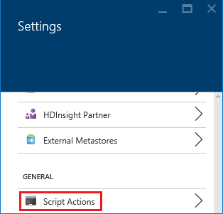

<!-- not suitable for Mooncake -->

<properties
    pageTitle="使用脚本操作自定义 HDInsight 群集 | Azure"
    description="了解如何使用脚本操作将自定义组件添加到基于 Linux 的 HDInsight 群集。脚本操作是在群集节点上运行的 Bash 脚本，可用于自定义群集配置，或者添加 Hue、Solr 或 R 等其他服务和实用工具。"
    services="hdinsight"
    documentationcenter=""
    author="Blackmist"
    manager="jhubbard"
    editor="cgronlun"
    tags="azure-portal" />
<tags 
    ms.assetid="48e85f53-87c1-474f-b767-ca772238cc13"
    ms.service="hdinsight"
    ms.workload="big-data"
    ms.tgt_pltfrm="na"
    ms.devlang="na"
    ms.topic="article"
    ms.date="11/14/2016"
    wacn.date="02/06/2017"
    ms.author="larryfr" />

# 使用脚本操作自定义基于 Linux 的 HDInsight 群集

HDInsight 提供一个称为**脚本操作**的配置选项，该选项可调用用于自定义群集的自定义脚本。这些脚本可在创建群集期间或者在运行中的群集上使用，并且用于安装其他组件或更改配置设置。

> [AZURE.NOTE]
只有基于 Linux 的 HDInsight 群集能够在运行中的群集上使用脚本操作。有关在基于 Windows 的群集上使用脚本操作的详细信息，请参阅 [Customize HDInsight clusters using Script Action (Windows)](/documentation/articles/hdinsight-hadoop-customize-cluster/)（使用脚本操作自定义 HDInsight 群集 (Windows)）。

还可以将脚本操作作为 HDInsight 应用程序发布到 Azure 应用商店。本文档中的某些示例将演示如何使用 PowerShell 和 .NET SDK 的脚本操作命令来安装 HDInsight 应用程序。

## 权限

如果使用已加入域的 HDInsight 群集，则在对群集使用脚本操作时，需要两种 Ambari 权限：

* **AMBARI.RUN\_CUSTOM\_COMMAND**：Ambari 管理员角色默认具有此权限。
* **CLUSTER.RUN\_CUSTOM\_COMMAND**：HDInsight 群集管理员和 Ambari 管理员均默认具有此权限。

## 访问控制

如果用户在使用 Azure 订阅（例如公司所有的订阅）时不是管理员/所有者，则必须确保其 Azure 登录名至少具有**参与者**访问权限，能够访问包含 HDInsight 群集的 Azure 资源组。

另外，如果用户创建的是 HDInsight 群集，至少对 Azure 订阅具有**参与者**访问权限的用户必须之前已注册 HDInsight 的提供程序。对订阅具有参与者访问权限的用户首次在订阅上创建资源时，会进行提供程序注册。不[使用 REST 注册提供程序](https://msdn.microsoft.com/zh-cn/library/azure/dn790548.aspx)创建资源也可完成该操作。

有关使用访问管理的详细信息，请参阅以下文档：

* [Azure 门户预览中的访问管理入门](/documentation/articles/role-based-access-control-what-is/)
* [使用角色分配来管理对 Azure 订阅资源的访问权限](/documentation/articles/role-based-access-control-configure/)

## 了解脚本操作

脚本操作只是一个提供 URI 和参数的 Bash 脚本，该脚本在 HDInsight 群集节点上运行。下面是脚本操作的特征和功能。

* 必须存储在可从 HDInsight 群集访问的 URI 上。下面是可能的存储位置：

    * 本身是 HDInsight 群集之主要存储帐户或其他存储帐户的 **Blob 存储帐户**。由于在创建群集期间，已将这两种存储帐户的访问权限都授予 HDInsight，因此这些存储帐户提供一个使用非公共脚本操作的方式。

    * 例如 Azure Blob、GitHub、OneDrive、Dropbox 等。

        有关存储在 Blob 容器（可公开读取）中的脚本的 URI 示例，请参阅[示例脚本操作脚本](#example-script-action-scripts)部分。

* 可以限制为**只对特定的节点类型运行**，例如头节点或辅助角色节点。

* 可以是**持久化**或**即席**。

    **持久化**脚本是应用到辅助角色节点的脚本，并且在扩展群集时，在创建的新节点上自动运行。

    持久化脚本还会将更改应用到其他节点类型（例如头节点），但从功能方面看，持久保存脚本的唯一原因就是它将应用到扩展群集时所创建的新辅助角色节点。

    > [AZURE.IMPORTANT]
    持久化脚本操作必须有唯一的名称。

    **Ad hoc** 脚本是不保留的。不过，随后可以提升一个 ad hoc 脚本为保留脚本，或者下降一个保留脚本为 ad hoc 脚本。

    > [AZURE.IMPORTANT]
    创建群集期间使用的脚本操作将自动持久保存下来。
    >

    > 即使明确指出应予保存，也不会持久保存失败的脚本。

* 可以接受脚本在执行期间使用的**参数**。
* 在群集节点上**以 root 级权限**运行。
* 可以通过 **Azure 门户预览**、**Azure PowerShell**、**Azure CLI** 或 **HDInsight .NET SDK** 使用。

[AZURE.INCLUDE [upgrade-powershell](../../includes/hdinsight-use-latest-powershell-cli-and-dotnet-sdk.md)]

为了帮助了解哪些脚本已应用到群集，以及确定可供升级或降级的脚本 ID，群集将保留所有已运行脚本的历史记录。

> [AZURE.IMPORTANT]
没有任何自动方式可撤销脚本操作所做的更改。如果需要还原脚本的效果，必须了解已做出哪些更改并手动进行还原（或提供可进行还原的脚本操作）。

###  群集创建过程中的脚本操作

在群集创建期间使用的脚本操作与在现有群集上运行的脚本操作稍有不同：

* 该脚本将**自动持久保存**。
* 脚本**失败**可能会导致群集创建过程失败。

下图演示了在创建过程中执行脚本操作的时间：

![群集创建过程中的 HDInsight 群集自定义和阶段][img-hdi-cluster-states]

在配置 HDInsight 时运行脚本。在此阶段，脚本在群集中的所有指定节点上并行运行，并且在节点上使用 root 权限运行。

> [AZURE.NOTE]
由于脚本是以 root 级权限在群集节点上运行的，因此你可以执行停止和启动服务（包括与 Hadoop 相关的服务）等操作。如果你停止服务，则必须在脚本完成运行之前，确保 Ambari 服务及其他与 Hadoop 相关的服务都已启动且正在运行。这些服务必须在群集创建时，成功地确定群集的运行状况和状态。

在群集创建期间，你可以指定多个脚本操作，这些脚本操作将按其指定顺序调用。

> [AZURE.IMPORTANT]
脚本操作必须在 60 分钟内完成，否则将会超时。在群集预配期间，脚本将与其他安装和配置进程一同运行。争用 CPU 时间和网络带宽等资源可能导致完成脚本所需的时间要长于在开发环境中所需的时间。
>

> 若要让运行脚本所花费的时间降到最低，请避免从源下载和编译应用程序等任务。应预先编译应用程序，并将二进制文件存储在 Azure Blob 存储中，这样可将其快速下载到群集。

###  正在运行的群集上的脚本操作

不同于在群集创建期间使用的脚本操作，在运行中群集上运行的脚本发生失败并不会自动导致群集更改为失败状态。脚本完成后，群集应该恢复“正在运行”状态。

> [AZURE.IMPORTANT]
这并不意味着正在运行的群集不受发生错误的脚本的影响。例如，脚本可能会删除群集所需的文件，更改配置从而使服务失败，等等。
>

> 脚本操作以 root 权限运行，因此你应该先确保了解脚本的作用，然后再将它应用到群集。

将脚本应用到群集时，如果脚本运行成功，群集状态将从“正在运行”更改为“已接受”，再更改为“HDInsight 配置”，最后恢复“正在运行”。脚本状态记录在脚本操作历史记录中，可以使用此状态来确定脚本是成功还是失败。例如，可以使用 `Get-AzureRmHDInsightScriptActionHistory` PowerShell cmdlet 来查看脚本的状态。随后将返回类似于下面的信息：

    ScriptExecutionId : 635918532516474303
    StartTime         : 2/23/2016 7:40:55 PM
    EndTime           : 2/23/2016 7:41:05 PM
    Status            : Succeeded

> [AZURE.NOTE]
如果在创建群集后更改群集用户 (admin) 的密码，可能会导致针对此群集运行的脚本操作失败。如果你的任何持久性脚本操作以辅助角色节点为目标，则当你通过调整大小操作在群集中添加节点时，这些操作可能会失败。

##  脚本操作脚本示例

可以从 Azure 门户预览、Azure PowerShell、Azure CLI 或 HDInsight.NET SDK 使用脚本操作脚本。HDInsight 提供了脚本用于在 HDInsight 群集上安装以下组件：

| 名称 | 脚本 |
| --- | --- |
| **添加 Azure 存储帐户** |https://hdiconfigactions.blob.core.windows.net/linuxaddstorageaccountv01/add-storage-account-v01.sh。请参阅 [Apply a Script Action to a running cluster](#apply-a-script-action-to-a-running-cluster)（将脚本操作应用到正在运行的群集）。 |
| **安装 Hue** |https://hdiconfigactions.blob.core.windows.net/linuxhueconfigactionv02/install-hue-uber-v02.sh。请参阅[在 HDInsight 群集上安装并使用 Hue](/documentation/articles/hdinsight-hadoop-hue-linux/)。 |
| **安装 R** |https://hdiconfigactions.blob.core.windows.net/linuxrconfigactionv01/r-installer-v01.sh。请参阅[在 HDInsight 群集上安装并使用 R](/documentation/articles/hdinsight-hadoop-r-scripts/)。 |
| **安装 Solr** |https://hdiconfigactions.blob.core.windows.net/linuxsolrconfigactionv01/solr-installer-v01.sh。请参阅[在 HDInsight 群集上安装并使用 Solr](/documentation/articles/hdinsight-hadoop-solr-install-linux/)。 |
| **安装 Giraph** |https://hdiconfigactions.blob.core.windows.net/linuxgiraphconfigactionv01/giraph-installer-v01.sh。请参阅[在 HDInsight 群集上安装并使用 Giraph](/documentation/articles/hdinsight-hadoop-giraph-install-linux/)。 |
| **预加载 Hive 库** |https://hdiconfigactions.blob.core.windows.net/linuxsetupcustomhivelibsv01/setup-customhivelibs-v01.sh。请参阅 [Add Hive libraries on HDInsight clusters](/documentation/articles/hdinsight-hadoop-add-hive-libraries/)（在 HDInsight 群集上添加 Hive 库） |

## 在创建群集期间使用脚本操作

本部分提供可以在创建 HDInsight 群集时使用脚本操作的不同方式的示例 - 从 Azure 门户、使用 Azure Resource Manager 模板、使用 PowerShell cmdlet，以及使用 .NET SDK。

### 在创建群集期间从 Azure 门户预览使用脚本操作

1. 根据 [Create Hadoop clusters in HDInsight](/documentation/articles/hdinsight-hadoop-provision-linux-clusters/)（在 HDInsight 中创建 Hadoop 群集）中所述开始创建群集。
2. 在“脚本操作”边栏选项卡的“可选配置”下，单击“添加脚本操作”可提供有关脚本操作的详细信息，如下所示：

    

    | 属性 | 值 |
    | --- | --- |
    | Name |指定脚本操作的名称。 |
    | 脚本 URI |指定要调用来自定义群集的脚本的 URI。 |
    | 头节点/辅助节点 |指定在其上运行自定义脚本的节点（**头**节点、**辅助**节点或 **ZooKeeper** 节点）。 |
    | Parameters |根据脚本的需要，请指定参数。 |

    按 ENTER 可添加多个脚本操作，以在群集上安装多个组件。

3. 单击“选择”保存配置并继续创建群集。

### 从 Azure 资源管理器模板使用脚本操作
在本部分中，将使用 Azure Resource Manager 模板创建 HDInsight 群集，并使用脚本操作在群集上安装自定义组件（在此示例中为 R）。本部分提供使用脚本操作创建群集时所需的示例模板。

> [AZURE.NOTE]
本部分中的步骤演示如何使用脚本操作创建群集。有关使用 HDInsight 应用程序从模板创建群集的示例，请参阅 [Install custom HDInsight applications](/documentation/articles/hdinsight-apps-install-custom-applications/)（安装自定义的 HDInsight 应用程序）。

#### 开始之前

* 有关配置工作站以运行 HDInsight Powershell cmdlet 的信息，请参阅[安装和配置 Azure PowerShell](/documentation/articles/powershell-install-configure/)。
* 有关如何创建模板的说明，请参阅 [Authoring Azure Resource Manager templates](/documentation/articles/resource-group-authoring-templates/)（创作 Azure Resource Manager 模板）
* 如果你以前没有对资源管理器使用过 Azure PowerShell，请参阅[将 Azure PowerShell 与 Azure 资源管理器配合使用](/documentation/articles/powershell-azure-resource-manager/)。

#### 使用脚本操作创建群集

1. 将以下模板复制到你计算机上的某个位置。此模板在群集中的头节点和辅助节点上安装 Giraph。你还可以验证 JSON 模板是否有效。将模板内容粘贴到在线 JSON 验证工具 [JSONLint](http://jsonlint.com/) 中。

            {
            "$schema": "http://schema.management.azure.com/schemas/2015-01-01/deploymentTemplate.json#",
            "contentVersion": "1.0.0.0",
            "parameters": {
                "clusterLocation": {
                    "type": "string",
                    "defaultValue": "China North",
                    "allowedValues": [ "China North" ]
                },
                "clusterName": {
                    "type": "string"
                },
                "clusterUserName": {
                    "type": "string",
                    "defaultValue": "admin"
                },
                "clusterUserPassword": {
                    "type": "securestring"
                },
                "sshUserName": {
                    "type": "string",
                    "defaultValue": "username"
                },
                "sshPassword": {
                    "type": "securestring"
                },
                "clusterStorageAccountName": {
                    "type": "string"
                },
                "clusterStorageAccountResourceGroup": {
                    "type": "string"
                },
                "clusterStorageType": {
                    "type": "string",
                    "defaultValue": "Standard_LRS",
                    "allowedValues": [
                        "Standard_LRS",
                        "Standard_GRS",
                        "Standard_ZRS"
                    ]
                },
                "clusterStorageAccountContainer": {
                    "type": "string"
                },
                "clusterHeadNodeCount": {
                    "type": "int",
                    "defaultValue": 1
                },
                "clusterWorkerNodeCount": {
                    "type": "int",
                    "defaultValue": 2
                }
            },
            "variables": {
            },
            "resources": [
                {
                    "name": "[parameters('clusterStorageAccountName')]",
                    "type": "Microsoft.Storage/storageAccounts",
                    "location": "[parameters('clusterLocation')]",
                    "apiVersion": "2015-05-01-preview",
                    "dependsOn": [ ],
                    "tags": { },
                    "properties": {
                        "accountType": "[parameters('clusterStorageType')]"
                    }
                },
                {
                    "name": "[parameters('clusterName')]",
                    "type": "Microsoft.HDInsight/clusters",
                    "location": "[parameters('clusterLocation')]",
                    "apiVersion": "2015-03-01-preview",
                    "dependsOn": [
                        "[concat('Microsoft.Storage/storageAccounts/', parameters('clusterStorageAccountName'))]"
                    ],
                    "tags": { },
                    "properties": {
                        "clusterVersion": "3.2",
                        "osType": "Linux",
                        "clusterDefinition": {
                            "kind": "hadoop",
                            "configurations": {
                                "gateway": {
                                    "restAuthCredential.isEnabled": true,
                                    "restAuthCredential.username": "[parameters('clusterUserName')]",
                                    "restAuthCredential.password": "[parameters('clusterUserPassword')]"
                                }
                            }
                        },
                        "storageProfile": {
                            "storageaccounts": [
                                {
                                    "name": "[concat(parameters('clusterStorageAccountName'),'.blob.core.chinacloudapi.cn')]",
                                    "isDefault": true,
                                    "container": "[parameters('clusterStorageAccountContainer')]",
                                    "key": "[listKeys(resourceId('Microsoft.Storage/storageAccounts', parameters('clusterStorageAccountName')), '2015-05-01-preview').key1]"
                                }
                            ]
                        },
                        "computeProfile": {
                            "roles": [
                                {
                                    "name": "headnode",
                                    "targetInstanceCount": "[parameters('clusterHeadNodeCount')]",
                                    "hardwareProfile": {
                                        "vmSize": "Large"
                                    },
                                    "osProfile": {
                                        "linuxOperatingSystemProfile": {
                                            "username": "[parameters('sshUserName')]",
                                            "password": "[parameters('sshPassword')]"
                                        }
                                    },
                                    "scriptActions": [
                                        {
                                            "name": "installGiraph",
                                            "uri": "https://hdiconfigactions.blob.core.windows.net/linuxgiraphconfigactionv01/giraph-installer-v01.sh",
                                            "parameters": ""
                                        }
                                    ]
                                },
                                {
                                    "name": "workernode",
                                    "targetInstanceCount": "[parameters('clusterWorkerNodeCount')]",
                                    "hardwareProfile": {
                                        "vmSize": "Large"
                                    },
                                    "osProfile": {
                                        "linuxOperatingSystemProfile": {
                                            "username": "[parameters('sshUserName')]",
                                            "password": "[parameters('sshPassword')]"
                                        }
                                    },
                                    "scriptActions": [
                                        {
                                            "name": "installR",
                                            "uri": "https://hdiconfigactions.blob.core.windows.net/linuxrconfigactionv01/r-installer-v01.sh",
                                            "parameters": ""
                                        }
                                    ]
                                }
                            ]
                        }
                    }
                }
            ],
            "outputs": {
                "cluster":{
                    "type" : "object",
                    "value" : "[reference(resourceId('Microsoft.HDInsight/clusters',parameters('clusterName')))]"
                }
            }
        }
2. 启动 Azure PowerShell 并登录到你的 Azure 帐户。提供凭据后，该命令将返回有关你的帐户的信息。

        Add-AzureRmAccount

        Id                             Type       ...
        --                             ----
        someone@example.com            User       ...
3. 如果你有多个订阅，请提供要用于部署的订阅 ID。

        Select-AzureRmSubscription -SubscriptionID <YourSubscriptionId>

    > [AZURE.NOTE]
    可以使用 `Get-AzureRmSubscription` 来获取与你帐户关联的所有订阅的列表，包括每个订阅的订阅 ID。

4. 如果目前没有资源组，请创建新的资源组。提供资源组的名称，以及解决方案所需的位置。将返回新资源组的摘要。

        New-AzureRmResourceGroup -Name myresourcegroup -Location "China North"

        ResourceGroupName : myresourcegroup
        Location          : chinanorth
        ProvisioningState : Succeeded
        Tags              :
        Permissions       :
                            Actions  NotActions
                            =======  ==========
                            *
        ResourceId        : /subscriptions/######/resourceGroups/ExampleResourceGroup

5. 若要为资源组创建新部署，请运行 **New-AzureRmResourceGroupDeployment** 命令并提供所需的参数。参数包括部署的名称、资源组的名称、所创建模板的路径或 URL。如果你的模板需要任何参数，则也必须传递这些参数。在此示例中，用于在群集上安装 R 的脚本操作不需要任何参数。

        New-AzureRmResourceGroupDeployment -Name mydeployment -ResourceGroupName myresourcegroup -TemplateFile <PathOrLinkToTemplate>

    系统会提示用户为模板中定义的参数提供值。

1. 部署资源组后，你将看到部署摘要。

        DeploymentName    : mydeployment
        ResourceGroupName : myresourcegroup
        ProvisioningState : Succeeded
        Timestamp         : 8/17/2015 7:00:27 PM
        Mode              : Incremental
        ...

2. 如果你的部署失败，则可以使用以下 cmdlet 获取有关故障的信息。

        Get-AzureRmResourceGroupDeployment -ResourceGroupName myresourcegroup -ProvisioningState Failed

### 在创建群集期间从 Azure PowerShell 使用脚本操作

本部分使用 [Add-AzureRmHDInsightScriptAction](https://msdn.microsoft.com/zh-cn/library/mt603527.aspx) cmdlet 通过脚本操作来调用脚本，以自定义群集。在继续前，确保你已安装并配置 Azure PowerShell。有关配置工作站以运行 HDInsight PowerShell cmdlet 的信息，请参阅 [Install and configure Azure PowerShell](/documentation/articles/powershell-install-configure/)（安装和配置 Azure PowerShell）。

执行以下步骤：

1. 打开 Azure PowerShell 控制台并使用以下命令登录到 Azure 订阅，然后声明一些 PowerShell 变量：

        # LOGIN TO ZURE
        Login-AzureRmAccount

        # PROVIDE VALUES FOR THESE VARIABLES
        $subscriptionId = "<SubscriptionId>"        # ID of the Azure subscription
        $clusterName = "<HDInsightClusterName>"            # HDInsight cluster name
        $storageAccountName = "<StorageAccountName>"    # Azure storage account that hosts the default container
        $storageAccountKey = "<StorageAccountKey>"      # Key for the storage account
        $containerName = $clusterName
        $location = "<MicrosoftDataCenter>"                # Location of the HDInsight cluster. It must be in the same data center as the storage account.
        $clusterNodes = <ClusterSizeInNumbers>            # The number of nodes in the HDInsight cluster.
        $resourceGroupName = "<ResourceGroupName>"      # The resource group that the HDInsight cluster will be created in

2. 指定配置值（如群集中的节点）和要使用的默认存储。

        # SPECIFY THE CONFIGURATION OPTIONS
        Select-AzureRmSubscription -SubscriptionId $subscriptionId
        $config = New-AzureRmHDInsightClusterConfig
        $config.DefaultStorageAccountName="$storageAccountName.blob.core.chinacloudapi.cn"
        $config.DefaultStorageAccountKey=$storageAccountKey

3. 使用 **Add-AzureRmHDInsightScriptAction** cmdlet 调用该脚本。以下示例使用一个在群集上安装 Giraph 的脚本：

        # INVOKE THE SCRIPT USING THE SCRIPT ACTION FOR HEADNODE AND WORKERNODE
        $config = Add-AzureRmHDInsightScriptAction -Config $config -Name "Install Giraph"  -NodeType HeadNode -Uri https://hdiconfigactions.blob.core.windows.net/linuxgiraphconfigactionv01/giraph-installer-v01.sh
        $config = Add-AzureRmHDInsightScriptAction -Config $config -Name "Install Giraph"  -NodeType WorkerNode -Uri https://hdiconfigactions.blob.core.windows.net/linuxgiraphconfigactionv01/giraph-installer-v01.sh

    **Add-AzureRmHDInsightScriptAction** cmdlet 采用以下参数：

    | 参数 | 定义 |
    | --- | --- |
    | Config |添加脚本操作信息的配置对象。 |
    | Name |脚本操作的名称。 |
    | NodeType |指定在其上运行自定义脚本的节点。有效值是 **HeadNode**（在头节点上安装）、**WorkerNode**（在所有数据节点上安装）或**ZookeeperNode**（在 zookeeper 节点上安装）。 |
    | Parameters |脚本所需的参数。 |
    | Uri |指定执行的脚本的 URI。 |

4. 为群集设置 admin/HTTPS 用户：

        $httpCreds = get-credential

    出现提示时，请输入“admin”作为名称，然后提供密码。

5. 设置 SSH 凭据：

        $sshCreds = get-credential

    出现提示时，请输入 SSH 用户名和密码。如果想要使用凭据而不是密码来保护 SSH 帐户，请使用空密码并将 `$sshPublicKey` 设置为要使用的证书公钥的内容。例如：

        $sshPublicKey = Get-Content .\path\to\public.key -Raw

6. 最后，创建群集：

        New-AzureRmHDInsightCluster -config $config -clustername $clusterName -DefaultStorageContainer $containerName -Location $location -ResourceGroupName $resourceGroupName -ClusterSizeInNodes $clusterNodes -HttpCredential $httpCreds -SshCredential $sshCreds -OSType Linux

    如果使用公钥保护 SSH 帐户，则还必须指定 `-SshPublicKey $sshPublicKey` 作为参数。

创建群集可能需要几分钟时间。

### 在创建群集期间从 HDInsight .NET SDK 使用脚本操作

HDInsight .NET SDK 提供客户端库，可简化从 .NET 应用程序中使用 HDInsight 的操作。有关代码示例，请参阅 [Create Linux-based clusters in HDInsight using the .NET SDK](/documentation/articles/hdinsight-hadoop-create-linux-clusters-dotnet-sdk/#use-script-action)（使用 .NET SDK 在 HDInsight 中创建基于 Linux 的群集）。

##  将脚本操作应用到正在运行的群集

本部分提供可以将脚本操作应用到正在运行 HDInsight 群集的不同方式示例 - 从 Azure 门户预览、使用 PowerShell cmdlet、使用跨平台 Azure CLI，以及使用 .NET SDK。本部分中使用的持久化脚本操作将现有 Azure 存储帐户添加到正在运行的群集。也可以使用其他脚本操作，请参阅 [Example Script Action scripts](#example-script-action-scripts)（示例脚本操作脚本）。

### 从 Azure 门户预览将脚本操作应用到正在运行的群集

1. 在 [Azure 门户预览](https://portal.azure.cn)中，选择 HDInsight 群集。

2. 从 HDInsight 群集边栏选项卡中，选择“脚本操作”磁贴。

    

    > [AZURE.NOTE]
    也可以从“设置”边栏选项卡中依次选择“所有设置”和“脚本操作”。

3. 在“脚本操作”边栏选项卡顶部，选择“提交新项”。

    

4. 在“添加脚本操作”边栏选项卡中输入以下信息。

    * **名称**：用于此脚本操作的友好名称。在本示例中为 `Add Storage account`。

    * **脚本 URI**：脚本的 URI。在本示例中为 `https://hdiconfigactions.blob.core.windows.net/linuxaddstorageaccountv01/add-storage-account-v01.sh`

    * **头**、**辅助角色**和 **Zookeeper**：选中此脚本应该应用到的节点。在本示例中，已选中“头”、“辅助角色”和“Zookeeper”。

    * **参数**：如果脚本接受参数，请在此处输入参数。在本示例中，请输入存储帐户名称和存储帐户密钥：

        

        在屏幕截图中，`contosodata` 是现有的 Azure 存储帐户，第二行是存储帐户密钥。

    * **持久化**：如果想要持久保存脚本以便在扩展群集时将脚本应用到新的辅助角色节点，请选中此项。

5. 最后，使用“创建”按钮将脚本应用到群集。

### 从 Azure PowerShell 将脚本操作应用到正在运行的群集

在继续前，确保你已安装并配置 Azure PowerShell。有关配置工作站以运行 HDInsight PowerShell cmdlet 的信息，请参阅 [Install and configure Azure PowerShell](/documentation/articles/powershell-install-configure/)（安装和配置 Azure PowerShell）。

1. 打开 Azure PowerShell 控制台并使用以下命令登录到 Azure 订阅，然后声明一些 PowerShell 变量：

        # LOGIN TO ZURE
        Login-AzureRmAccount

        # PROVIDE VALUES FOR THESE VARIABLES
        $clusterName = "<HDInsightClusterName>"            # HDInsight cluster name
        $saName = "<ScriptActionName>"                  # Name of the script action
        $saURI = "<URI to the script>"                  # The URI where the script is located
        $nodeTypes = "headnode", "workernode"

2. 使用以下命令将脚本应用到群集：

        Submit-AzureRmHDInsightScriptAction -ClusterName $clusterName -Name $saName -Uri $saURI -NodeTypes $nodeTypes -PersistOnSuccess

    作业完成后，你应会收到类似于下面的信息：

        OperationState  : Succeeded
        ErrorMessage    :
        Name            : Giraph
        Uri             : https://hdiconfigactions.blob.core.windows.net/linuxgiraphconfigactionv01/giraph-installer-v01.sh
        Parameters      :
        NodeTypes       : {HeadNode, WorkerNode}

### 从 Azure CLI 将脚本操作应用到正在运行的群集

在继续前，确保你已安装并配置 Azure CLI。有关详细信息，请参阅 [Install the Azure CLI](/documentation/articles/xplat-cli-install/)（安装 Azure CLI）。

1. 打开系统的 shell 会话、终端、命令提示符或其他命令行，并使用以下命令切换到 Azure Resource Manager 模式。

        azure config mode arm

2. 使用以下命令向 Azure 订阅进行身份验证。

        azure login

3. 使用以下命令将脚本操作应用到正在运行的群集

        azure hdinsight script-action create <clustername> -g <resourcegroupname> -n <scriptname> -u <scriptURI> -t <nodetypes>

    如果省略此命令的参数，系统将提示你指定参数。如果以 `-u` 指定的脚本接受参数，可以使用 `-p` 参数来指定参数。

    有效的**节点类型**包括 **headnode**、**workernode** 和 **zookeeper**。如果应将脚本应用到多个节点类型，请指定“;”分隔的类型。例如，`-n headnode;workernode`。

    若要持久保存脚本，请添加 `--persistOnSuccess`。以后也可以使用 `azure hdinsight script-action persisted set` 来持久保存脚本。

    在作业完成后，你将会收到类似于下面的输出。

        info:    Executing command hdinsight script-action create
        + Executing Script Action on HDInsight cluster
        data:    Operation Info
        data:    ---------------
        data:    Operation status:
        data:    Operation ID:  b707b10e-e633-45c0-baa9-8aed3d348c13
        info:    hdinsight script-action create command OK

### 使用 REST API 将脚本操作应用到正在运行的群集

请参阅 [Run Script Actions on a running cluster](https://msdn.microsoft.com/zh-cn/library/azure/mt668441.aspx)（在运行中的群集上运行脚本操作）。

### 从 HDInsight .NET SDK 将脚本操作应用到正在运行的群集

有关使用 .NET SDK 将脚本应用到群集的示例，请参阅 [https://github.com/Azure-Samples/hdinsight-dotnet-script-action](https://github.com/Azure-Samples/hdinsight-dotnet-script-action)。

## 查看历史记录以及升级和降级脚本操作

### 使用 Azure 门户预览

1. 在 [Azure 门户预览](https://portal.azure.cn)中，选择 HDInsight 群集。

2. 从 HDInsight 群集边栏选项卡中，选择“设置”。

    

3. 在“设置”边栏选项卡中，选择“脚本操作”。

    

4. “脚本操作”边栏选项卡中显示了持久化脚本列表，以及应用到群集的脚本历史记录。在以下屏幕截图中，可以看到 Solr 脚本已在此群集上运行，但尚未持久保存任何脚本操作。

    

5. 选择历史记录中的脚本会显示此脚本的“属性”边栏选项卡。从边栏选项卡的顶部，可以重新运行脚本或将它升级。

    

6. 还可以使用“脚本操作”边栏选项卡中项右侧的“...”来执行操作，例如重新运行、持久保存或删除（适用于持久化操作）。

    

### 使用 Azure PowerShell

| 使用以下 cmdlet... | 可以... |
| --- | --- |
| Get-AzureRmHDInsightPersistedScriptAction |检索有关持久化脚本操作的信息 |
| Get-AzureRmHDInsightScriptActionHistory |检索已应用到群集的脚本操作的历史记录，或特定脚本的详细信息 |
| Set-AzureRmHDInsightPersistedScriptAction |将即席脚本操作升级为持久化脚本操作 |
| Remove-AzureRmHDInsightPersistedScriptAction |将持久化脚本操作降级为即席脚本操作 |

> [AZURE.IMPORTANT]
使用 `Remove-AzureRmHDInsightPersistedScriptAction` 不会撤销脚本执行的操作，而只会删除持久化标志，使脚本不会在添加到群集的新辅助角色节点上运行。

以下示例脚本演示如何使用 cmdlet 来升级再降级脚本。

    # Get a history of scripts
    Get-AzureRmHDInsightScriptActionHistory -ClusterName mycluster

    # From the list, we want to get information on a specific script
    Get-AzureRmHDInsightScriptActionHistory -ClusterName mycluster -ScriptExecutionId 635920937765978529

    # Promote this to a persisted script
    # Note: the script must have a unique name to be promoted
    # if the name is not unique, you will receive an error
    Set-AzureRmHDInsightPersistedScriptAction -ClusterName mycluster -ScriptExecutionId 635920937765978529

    # Demote the script back to ad hoc
    # Note that demotion uses the unique script name instead of
    # execution ID.
    Remove-AzureRmHDInsightPersistedScriptAction -ClusterName mycluster -Name "Install Giraph"

### 使用 Azure CLI

| 使用以下 cmdlet... | 可以... |
| --- | --- |
| `azure hdinsight script-action persisted list <clustername>` |检索持久化脚本操作的列表 |
| `azure hdinsight script-action persisted show <clustername> <scriptname>` |检索有关特定持久化脚本操作的信息 |
| `azure hdinsight script-action history list <clustername>` |检索已应用到群集的脚本操作的历史记录 |
| `azure hdinsight script-action history show <clustername> <scriptname>` |检索有关特定脚本操作的信息 |
| `azure hdinsight script action persisted set <clustername> <scriptexecutionid>` |将即席脚本操作升级为持久化脚本操作 |
| `azure hdinsight script-action persisted delete <clustername> <scriptname>` |将持久化脚本操作降级为即席脚本操作 |

> [AZURE.IMPORTANT]
使用 `azure hdinsight script-action persisted delete` 不会撤销脚本执行的操作，而只会删除持久化标志，使脚本不会在添加到群集的新辅助角色节点上运行。

### 使用 HDInsight .NET SDK

有关使用 .NET SDK 从群集中检索脚本历史记录、升级或降级脚本的示例，请参阅 [https://github.com/Azure-Samples/hdinsight-dotnet-script-action](https://github.com/Azure-Samples/hdinsight-dotnet-script-action)。

> [AZURE.NOTE]
本示例还演示了如何使用 .NET SDK 安装 HDInsight 应用程序。

## 支持 HDInsight 群集上使用的开源软件

Azure HDInsight 服务是一个弹性平台，可让你使用围绕着 Hadoop 形成的开放源代码技术生态系统，在云中生成大数据应用程序。Azure 为开放源代码技术提供一般级别的支持，如 [Azure Support FAQ](/support/faq/)（Azure 支持常见问题）网站上的 **Support Scope**（支持范围）部分中所述。HDInsight 服务为如下所述的某些组件提供附加的支持级别。

HDInsight 服务提供两种类型的开源组件：

* **内置组件** - 这些组件预先安装在 HDInsight 群集上，并提供群集的核心功能。例如，Yarn ResourceManager、Hive 查询语言 (HiveQL) 及 Mahout 库均属于此类别。[HDInsight 提供的 Hadoop 群集版本有哪些新功能？](/documentation/articles/hdinsight-component-versioning/)中提供了群集组件的完整列表。
* **自定义组件** - 作为群集用户，你可以安装，或者在工作负荷中使用由社区提供的或你自己创建的任何组件。

> [AZURE.WARNING]
完全支持通过 HDInsight 群集提供的组件，Azure 支持部门将帮助你找出并解决与这些组件相关的问题。
>

> 自定义组件可获得合理范围的支持，有助于进一步解决问题。这可能会促进解决问题，或要求使用可用的开源技术渠道，在渠道中可找到该技术的深厚的专业知识。有许多可以使用的社区站点，例如：[HDInsight 的 MSDN 论坛](https://social.msdn.microsoft.com/Forums/azure/zh-cn/home?forum=hdinsight)、[Azure CSDN](http://azure.csdn.net)。此外，Apache 项目在 [http://apache.org](http://apache.org) 上提供了项目站点，例如 [Hadoop](http://hadoop.apache.org/)。

HDInsight 服务可提供多种方法使用自定义组件。无论在群集上使用或安装组件的方式如何，均适用相同级别的支持。以下是可在 HDInsight 群集上使用自定义组件的最常见方法列表：

1. 作业提交 - 可将 Hadoop 或其他类型的作业提交到执行或使用自定义组件的群集。

2. 群集自定义 - 在群集创建期间，可指定将安装在群集节点的其他设置和自定义组件。

3. 示例 - 对于常见的自定义组件，Microsoft 和其他用户可能会提供演示如何在 HDInsight 群集上使用这些组件的示例。我们不针对这些示例提供支持。

##  故障排除

可以使用 Ambari web UI 查看脚本操作记录的信息。如果在创建群集期间使用了脚本，而群集创建由于脚本错误而失败，则与该群集关联的默认存储帐户中也会提供日志。本部分提供有关如何使用这两个选项检索日志的信息。

### 使用 Ambari Web UI

1. 在浏览器中，导航到 https://CLUSTERNAME.azurehdinsight.cn。将 CLUSTERNAME 替换为 HDInsight 群集的名称。

    出现提示时，为群集输入管理员帐户名 (admin) 和密码。你可能需要在 Web 窗体中重新输入管理员凭据。

2. 从页面顶部栏中选择“操作”条目。这将显示通过 Ambari 在群集上执行的当前操作和以前操作的列表。

    

3. 查找“操作”列中包含 **run\_customscriptaction** 的条目。这些条目是在运行脚本操作时创建的。

    

    选择此条目，并通过链接向下钻取以查看在群集上运行该脚本时生成的 STDOUT 和 STDERR 输出。

### 从默认的存储帐户访问日志

如果群集创建由于脚本操作中的错误而失败，你仍可以从与该群集关联的默认存储帐户直接访问脚本操作日志。

* 存储日志位于 `\STORAGE_ACOCUNT_NAME\DEFAULT_CONTAINER_NAME\custom-scriptaction-logs\CLUSTER_NAME\DATE`。

    

    在此位置下面，日志分别针对头节点、辅助角色节点和 zookeeper 节点进行组织。下面是一些示例：

    * **头节点** - `<uniqueidentifier>AmbariDb-hn0-<generated_value>.chinacloudapp.cn`

    * **辅助角色节点** - `<uniqueidentifier>AmbariDb-wn0-<generated_value>.chinacloudapp.cn`

    * **Zookeeper 节点** - `<uniqueidentifier>AmbariDb-zk0-<generated_value>.chinacloudapp.cn`

* 相应主机的所有 stdout 和 stderr 将上载到存储帐户。每个脚本操作各有一个 **output-*.txt** 和 **errors-*.txt**。output-*.txt 文件包含有关在主机上运行的脚本的 URI 信息。例如

        'Start downloading script locally: ', u'https://hdiconfigactions.blob.core.windows.net/linuxrconfigactionv01/r-installer-v01.sh'

* 你有可能重复创建了同名的脚本操作群集。在这种情况下，可以根据 DATE 文件夹名称来区分相关的日志。例如，在不同的日期创建的群集 (mycluster) 的文件夹结构为：

    * `\STORAGE_ACOCUNT_NAME\DEFAULT_CONTAINER_NAME\custom-scriptaction-logs\mycluster\2015-10-04`

    * `\STORAGE_ACOCUNT_NAME\DEFAULT_CONTAINER_NAME\custom-scriptaction-logs\mycluster\2015-10-05`

* 如果在同一天创建同名的脚本操作群集，可以使用唯一的前缀来标识相关日志。

* 如果在当天结束时创建群集，则日志可能跨越两天。在这种情况下，你将看到同一群集有两个不同的日期文件夹。

* 将日志上载到默认容器可能需要 5 分钟，特别是对于大型群集。因此，如果你想要访问日志，则不应在脚本操作失败时立即删除群集。

### Ambari 监视器

> [AZURE.WARNING]
不要在基于 Linux 的 HDInsight 群集上更改 Ambari 监视器 (hdinsightwatchdog) 的密码。如果更改此帐户的密码，将无法在 HDInsight 群集上运行新脚本操作。

### 历史记录未显示创建群集期间使用的脚本

如果群集是在 2016 年 3 月 15 日之前创建的，则在创建群集期间所用的任何脚本的脚本操作历史记录中可能不会显示任何条目。但是，如果在 2016 年 3 月 15 日之后调整了群集的大小，则创建群集期间使用的脚本将出现在历史记录中，因为它们在调整大小操作过程中已应用到群集中的新节点。

有两种例外情况：

* 如果群集是在 2015 年 9 月 1 日之前创建的。这是脚本操作的推出时间，因此，在此日期之前创建的群集可能不是使用脚本操作创建的。

* 如果你在创建群集期间使用了多个脚本操作，并将相同的名称、相同的 URI 用于多个脚本，但将不同的参数用于多个脚本。在这种情况下，你将收到以下错误。

    由于现有脚本中的脚本名称有冲突，因此无法在此群集上执行任何新脚本操作。创建群集时提供的脚本名称全都必须唯一。在调整大小时仍会执行现有脚本。

## 后续步骤

请参阅以下内容以获取有关创建和使用脚本自定义群集的信息和示例：

* [为 HDInsight 开发脚本操作脚本](/documentation/articles/hdinsight-hadoop-script-actions-linux/)
* [在 HDInsight 群集上安装并使用 Solr](/documentation/articles/hdinsight-hadoop-solr-install-linux/)
* [在 HDInsight 群集上安装并使用 Giraph](/documentation/articles/hdinsight-hadoop-giraph-install-linux/)

[img-hdi-cluster-states]: ./media/hdinsight-hadoop-customize-cluster-linux/HDI-Cluster-state.png "群集创建过程中的阶段"

<!---HONumber=Mooncake_1205_2016-->