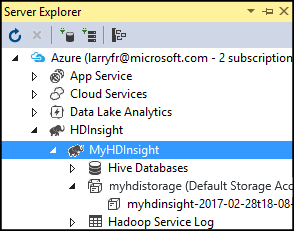

<properties
    pageTitle="在 HDInsight 中的 Hadoop 上将 C# 与 MapReduce 配合使用 - Azure | Azure"
    description="了解如何在 Azure HDInsight 中通过 Hadoop 使用 C# 创建 MapReduce 解决方案。"
    services="hdinsight"
    documentationcenter=""
    author="Blackmist"
    manager="jhubbard"
    editor="cgronlun"
    tags="azure-portal" />
<tags
    ms.assetid="d83def76-12ad-4538-bb8e-3ba3542b7211"
    ms.custom="hdinsightactive"
    ms.service="hdinsight"
    ms.workload="big-data"
    ms.tgt_pltfrm="na"
    ms.devlang="dotnet"
    ms.topic="article"
    ms.date="04/12/2017"
    wacn.date="06/05/2017"
    ms.author="v-dazen"
    ms.translationtype="Human Translation"
    ms.sourcegitcommit="08618ee31568db24eba7a7d9a5fc3b079cf34577"
    ms.openlocfilehash="dfc3eb98a4c5ea5ec893a5edb2a39eddec0af383"
    ms.contentlocale="zh-cn"
    ms.lasthandoff="05/26/2017" />

# 在 HDInsight 中的 Hadoop 上将 C# 与 MapReduce 流式处理配合使用

[AZURE.INCLUDE [azure-sdk-developer-differences](../../includes/azure-sdk-developer-differences.md)]

了解如何在 HDInsight 上使用 C# 创建 MapReduce 解决方案。

> [AZURE.IMPORTANT]
> Linux 是 HDInsight 3.4 或更高版本上使用的唯一操作系统。 有关详细信息，请参阅 [HDInsight 组件版本控制](/documentation/articles/hdinsight-component-versioning/)。

Hadoop 流式处理是一个实用工具，通过它可以使用脚本或可执行文件运行 MapReduce 作业。 在本示例中，.NET 用于为单词计数解决方案实现映射器和化简器。

## HDInsight 上的 .NET

__基于 Linux 的 HDInsight__ 群集使用 [Mono (https://mono-project.com)](https://mono-project.com) 运行 .NET 应用程序。 Mono 版本 4.2.1 包含在 HDInsight 版本 3.5 中。 有关包含在 HDInsight 中的 Mono 版本的详细信息，请参阅 [HDInsight 组件版本](/documentation/articles/hdinsight-component-versioning/)。 若要使用 Mono 的特定版本，请参阅[安装或更新 Mono](/documentation/articles/hdinsight-hadoop-install-mono/) 文档。

有关 Mono 与 .NET Framework 版本的兼容性的详细信息，请参阅 [Mono 兼容性](http://www.mono-project.com/docs/about-mono/compatibility/)。

## Hadoop 流式处理的工作原理

在本文档中用于流式处理的基本流程如下所示：

1. Hadoop 在 STDIN 上将数据传递到映射器（在本示例中为 mapper.exe）。
2. 映射器处理数据，并向 STDOUT 发出制表符分隔的键/值对。
3. 该输出由 Hadoop 读取，随后将传递到 STDIN 上的化简器（在本示例中为 reducer.exe）。
4. 化简器将读取制表符分隔的键/值对、处理数据，然后将结果作为制表符分隔的键/值对在 STDOUT 上发出。
5. 该输出由 Hadoop 读取，并写入输出目录。

有关流式处理的详细信息，请参阅 [Hadoop 流式处理 (https://hadoop.apache.org/docs/r2.7.1/hadoop-streaming/HadoopStreaming.html)](https://hadoop.apache.org/docs/r2.7.1/hadoop-streaming/HadoopStreaming.html)。

## 先决条件

* 熟悉编写和生成面向 .NET Framework 4.5 的 C# 代码。 本文档中的各个步骤都使用 Visual Studio 2017。

* 将 .exe 文件上传到群集的方法。 本文档中的各个步骤都使用针对 Visual Studio 的 Data Lake 工具将文件上传到群集的主要存储。

* Azure PowerShell 或 SSH 客户端。

* HDInsight 群集上的 Hadoop。 有关创建群集的详细信息，请参阅[创建 HDInsight 群集](/documentation/articles/hdinsight-hadoop-provision-linux-clusters/)。

## 创建映射器

在 Visual Studio 中，创建名为 __mapper__ 的新__控制台应用程序__。 针对该应用程序使用以下代码：

    using System;
    using System.Text.RegularExpressions;

    namespace mapper
    {
        class Program
        {
            static void Main(string[] args)
            {
                string line;
                //Hadoop passes data to the mapper on STDIN
                while((line = Console.ReadLine()) != null)
                {
                    // We only want words, so strip out punctuation, numbers, etc.
                    var onlyText = Regex.Replace(line, @"\.|;|:|,|[0-9]|'", "");
                    // Split at whitespace.
                    var words = Regex.Matches(onlyText, @"[\w]+");
                    // Loop over the words
                    foreach(var word in words)
                    {
                        //Emit tab-delimited key/value pairs.
                        //In this case, a word and a count of 1.
                        Console.WriteLine("{0}\t1",word);
                    }
                }
            }
        }
    }

创建该应用程序后，生成它以在项目目录中生成 `/bin/Debug/mapper.exe` 文件。

## 创建化简器

在 Visual Studio 中，创建名为 __reducer__ 的新__控制台应用程序__。 针对该应用程序使用以下代码：

    using System;
    using System.Collections.Generic;

    namespace reducer
    {
        class Program
        {
            static void Main(string[] args)
            {
                //Dictionary for holding a count of words
                Dictionary<string, int> words = new Dictionary<string, int>();

                string line;
                //Read from STDIN
                while ((line = Console.ReadLine()) != null)
                {
                    // Data from Hadoop is tab-delimited key/value pairs
                    var sArr = line.Split('\t');
                    // Get the word
                    string word = sArr[0];
                    // Get the count
                    int count = Convert.ToInt32(sArr[1]);

                    //Do we already have a count for the word?
                    if(words.ContainsKey(word))
                    {
                        //If so, increment the count
                        words[word] += count;
                    } else
                    {
                        //Add the key to the collection
                        words.Add(word, count);
                    }
                }
                //Finally, emit each word and count
                foreach (var word in words)
                {
                    //Emit tab-delimited key/value pairs.
                    //In this case, a word and a count of 1.
                    Console.WriteLine("{0}\t{1}", word.Key, word.Value);
                }
            }
        }
    }

创建该应用程序后，生成它以在项目目录中生成 `/bin/Debug/reducer.exe` 文件。

## 上传到存储

[AZURE.INCLUDE [azure-sdk-developer-differences](../../includes/azure-visual-studio-login-guide.md)]

1. 在 Visual Studio 中，打开“服务器资源管理器”。

2. 依次展开“Azure”和“HDInsight”。

3. 如果出现提示，请输入 Azure 订阅凭据，然后单击“登录”。

4. 展开要将此应用程序部署到的 HDInsight 群集。 将列出带有文本“（默认存储帐户）”的条目。

    

    * 如果此条目可以展开，则在使用 __Azure 存储帐户__作为该群集的默认存储。 若要查看该群集的默认存储上的文件，请展开该条目，然后双击“（默认容器）”。

5. 若要上传 .exe 文件，请使用以下方法之一：

    单击上传图标，然后浏览到 **mapper** 项目的 **bin\debug** 文件夹。 最后，选择“mapper.exe”文件，然后单击“确定”。

    

    上传“mapper.exe”完成后，请为“reducer.exe”文件重复该上传过程。

## 运行作业：使用 SSH 会话

1. 使用 SSH 连接到 HDInsight 群集。 有关详细信息，请参阅 [Use SSH with HDInsight](/documentation/articles/hdinsight-hadoop-linux-use-ssh-unix/)（对 HDInsight 使用 SSH）。

2. 使用以下命令之一启动 MapReduce 作业：

    * 如果使用 __Azure 存储__作为默认存储：

            yarn jar /usr/hdp/current/hadoop-mapreduce-client/hadoop-streaming.jar -files wasbs:///mapper.exe,wasbs:///reducer.exe -mapper mapper.exe -reducer reducer.exe -input /example/data/gutenberg/davinci.txt -output /example/wordcountout

    下表描述每个参数的作用：

    * `hadoop-streaming.jar`：包含流式处理 MapReduce 功能的 jar 文件。
    * `-files`：将 `mapper.exe` 和 `reducer.exe` 文件添加到此作业。 每个文件前的 `adl:///` 或 `wasb:///` 是指向群集的默认存储根目录的路径。
    * `-mapper`：指定哪个文件实现映射器。
    * `-reducer`：指定哪个文件实现化简器。
    * `-input`：输入数据。
    * `-output`：输出目录。

3. 完成 MapReduce 作业后，使用以下命令查看结果：

        hdfs dfs -text /example/wordcountout/part-00000

    以下文本是此命令返回的数据的示例：

        you     1128
        young   38
        younger 1
        youngest        1
        your    338
        yours   4
        yourself        34
        yourselves      3
        youth   17

## 运行作业：使用 PowerShell

使用以下 PowerShell 脚本运行 MapReduce 作业，并下载结果。

    # Login to your Azure subscription
    # Is there an active Azure subscription?
    $sub = Get-AzureRmSubscription -ErrorAction SilentlyContinue
    if(-not($sub))
    {
        Add-AzureRmAccount -EnvironmentName AzureChinaCloud
    }

    # Get HDInsight info
    $clusterName = Read-Host -Prompt "Enter the HDInsight cluster name"
    $creds=Get-Credential -Message "Enter the login for the cluster"

    # Path for job output
    $outputPath="/example/wordcountoutput"

    # Progress indicator
    $activity="C# MapReduce example"
    Write-Progress -Activity $activity -Status "Getting cluster information..."
    #Get HDInsight info so we can get the resource group, storage, etc.
    $clusterInfo = Get-AzureRmHDInsightCluster -ClusterName $clusterName
    $resourceGroup = $clusterInfo.ResourceGroup
    $storageActArr=$clusterInfo.DefaultStorageAccount.split('.')
    $storageAccountName=$storageActArr[0]
    $storageType=$storageActArr[1]

    # Progress indicator
    #Define the MapReduce job
    # Note: using "/mapper.exe" and "/reducer.exe" looks in the root
    #       of default storage.
    $jobDef=New-AzureRmHDInsightStreamingMapReduceJobDefinition `
        -Files "/mapper.exe","/reducer.exe" `
        -Mapper "mapper.exe" `
        -Reducer "reducer.exe" `
        -InputPath "/example/data/gutenberg/davinci.txt" `
        -OutputPath $outputPath

    # Start the job
    Write-Progress -Activity $activity -Status "Starting MapReduce job..."
    $job=Start-AzureRmHDInsightJob `
        -ClusterName $clusterName `
        -JobDefinition $jobDef `
        -HttpCredential $creds

    #Wait for the job to complete
    Write-Progress -Activity $activity -Status "Waiting for the job to complete..."
    Wait-AzureRmHDInsightJob `
        -ClusterName $clusterName `
        -JobId $job.JobId `
        -HttpCredential $creds

    Write-Progress -Activity $activity -Completed

    # Download the output 
    # Azure Storage account
    # Get the container
    $container=$clusterInfo.DefaultStorageContainer
    #NOTE: This assumes that the storage account is in the same resource
    #      group as HDInsight. If it is not, change the
    #      --ResourceGroupName parameter to the group that contains storage.
    $storageAccountKey=(Get-AzureRmStorageAccountKey `
        -Name $storageAccountName `
        -ResourceGroupName $resourceGroup)[0].Value

    #Create a storage context
    $context = New-AzureStorageContext `
        -StorageAccountName $storageAccountName `
        -StorageAccountKey $storageAccountKey
    # Download the file
    Get-AzureStorageBlobContent `
        -Blob 'example/data/WordCountOutput/part-r-00000' `
        -Container $container `
        -Destination output.txt `
        -Context $context

此脚本将提示用户提供群集登录的帐户名和密码，以及 HDInsight 群集名称。 完成作业后，输出将下载到从中运行脚本的目录的 `output.txt` 文件。 以下文本是 `output.txt` 文件中数据的示例：

    you     1128
    young   38
    younger 1
    youngest        1
    your    338
    yours   4
    yourself        34
    yourselves      3
    youth   17

## 后续步骤

有关将 MapReduce 与 HDInsight 配合使用的详细信息，请参阅[将 MapReduce 与 HDInsight 配合使用](/documentation/articles/hdinsight-use-mapreduce/)。

有关将 C# 与 Hive 和 Pig 配合使用的信息，请参阅[将 C# 用户定义函数与 Hive 和 Pig 配合使用](/documentation/articles/hdinsight-hadoop-hive-pig-udf-dotnet-csharp/)。

有关在 HDInsight 上将 C# 与 Storm 配合使用的信息，请参阅[为 HDInsight 上的 Storm 开发 C# 拓扑](/documentation/articles/hdinsight-storm-develop-csharp-visual-studio-topology/)。

<!--Update_Description: add content about "Mono"-->