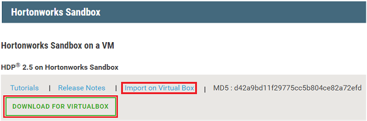
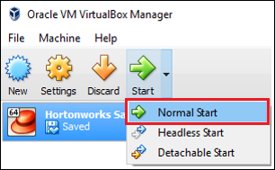

<properties
	pageTitle="使用 Hadoop 沙盒了解 Hadoop | Azure"
	description="若要了解如何使用 Hadoop 生态系统，可以在 Azure 虚拟机上设置 Hortonworks 提供的 Hadoop 沙盒。"
	keywords="hadoop emulator,hadoop 沙盒"
	editor="cgronlun"
	manager="jhubbard"
	services="hdinsight"
	authors="nitinme"
	documentationCenter=""
	tags="azure-portal"/>

<tags
	ms.service="hdinsight"
	ms.workload="big-data"
	ms.tgt_pltfrm="na"
	ms.devlang="na"
	ms.topic="article"
	ms.date="08/24/2016"
	wacn.date="10/10/2016"
	ms.author="nitinme"/>

# 在虚拟机上使用 Hadoop 沙盒开始了解 Hadoop 生态系统

了解如何在虚拟机上安装 Hortonworks 提供的 Hadoop 沙盒，了解 Hadoop 生态系统。该沙盒提供一个本地开发环境，让用户了解 Hadoop、Hadoop 分布式文件系统 (HDFS) 和作业提交内容。

## 先决条件

* [Oracle VirtualBox](https://www.virtualbox.org/)

熟悉 Hadoop 之后，便可以开始在 Azure 中使用 Hadoop 创建 HDInsight 群集。有关如何入门的详细信息，请参阅 [Get started with Hadoop on HDInsight](/documentation/articles/hdinsight-hadoop-tutorial-get-started-windows-v1/)（HDInsight 上的 Hadoop 入门）。

## 下载并安装虚拟机

1. 在 [http://hortonworks.com/downloads/#sandbox](http://hortonworks.com/downloads/#sandbox) 中，选择 HDP 2.4 on Hortonworks Sandbox 对应的“DOWNLOAD FOR VIRTUALBOX”（VIRTUALBOX 下载）项。开始下载之前，网站会提示在 Hortonworks 上注册。

    

2. 在同一个网页中，选择 HDP 2.4 on Hortonworks Sandbox 对应的“VirtualBox Install Guide”（VirtualBox 安装指南）。随后将下载包含虚拟机安装说明的 PDF。

    

## 启动虚拟机

1. 启动 VirtualBox，然后依次选择“Hortonworks Sandbox”（Hortonworks 沙盒）、“Start”（启动）、“Normal Start”（正常启动）。

    

2. 虚拟机完成启动过程后，将显示登录说明。打开 Web 浏览器并导航到显示的 URL（通常是 http://127.0.0.1:8888）。

## 设置密码

1. 在“Hortonworks Sandbox”（Hortonworks 沙盒）页的“get started”（开始）步骤中，选择“View Advanced Options”（查看高级选项）。使用此页上的信息通过 SSH 登录到沙盒。使用提供的名称和密码。

    > [AZURE.NOTE] 如果未安装 SSH 客户端，可以使用虚拟机在 \_\_http://localhost:4200/__ 上提供的基于 Web 的 SSH。

    首次使用 SSH 建立连接时，系统会提示更改 root 帐户的密码。输入新密码，将来使用 SSH 登录时要用到它。

2. 登录后，请输入以下命令：

        ambari-admin-password-reset
    
    出现提示时，请提供 Ambari 管理员帐户的密码。访问 Ambari Web UI 时要用到此密码。

## 使用 hive 命令

1. 与沙盒建立 SSH 连接后，使用以下命令启动 Hive shell：

        hive

2. 启动 shell 后，使用以下命令查看随沙盒一起提供的表：

        show tables;

3. 使用以下命令检索 `sample_07` 表中的 10 行数据：

        select * from sample_07 limit 10;

## 后续步骤

* [Learn how to use Visual Studio with the Hortonworks Sandbox](/documentation/articles/hdinsight-hadoop-emulator-visual-studio/)（了解如何将 Visual Studio 与 Hortonworks 沙盒配合使用）
* [Learning the ropes of the Hortonworks Sandbox](http://hortonworks.com/hadoop-tutorial/learning-the-ropes-of-the-hortonworks-sandbox/)（学习 Hortonworks 沙盒的重要知识）
* [Hadoop tutorial - Getting started with HDP](http://hortonworks.com/hadoop-tutorial/hello-world-an-introduction-to-hadoop-hcatalog-hive-and-pig/)（Hadoop 教程 - HDP 入门）

<!---HONumber=Mooncake_0926_2016-->