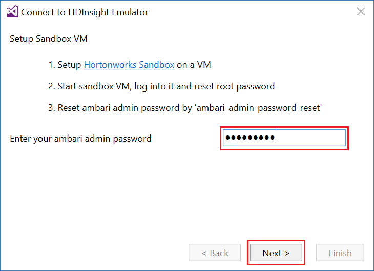
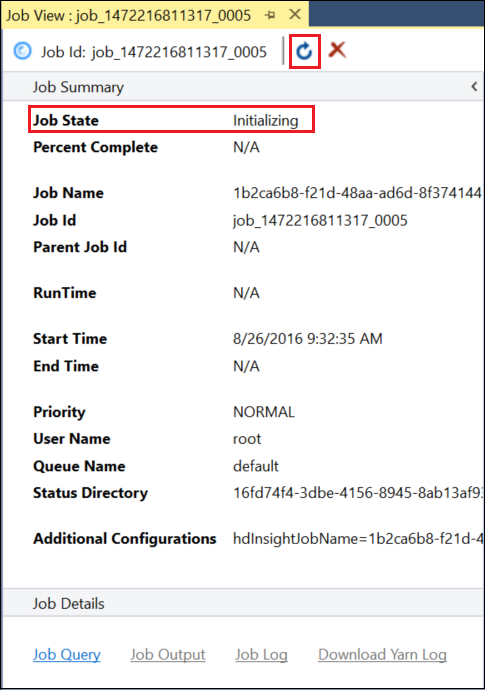

<!-- not suitable for Mooncake -->

<properties
pageTitle="将用于 Visual Studio 的 Azure Data Lake 工具与 Hortonworks 沙盒配合使用 | Azure"
description="了解如何将用于 Visual Studio 的 Azure Data Lake 工具与 Hortonworks 沙盒（在本地 VM 中运行）配合使用。 使用这些工具，可以在沙盒中创建和运行 Hive 与 Pig 作业，并查看作业输出和历史记录。"
services="hdinsight"
documentationCenter=""
authors="Blackmist"
manager="paulettm"
editor="cgronlun"/>

<tags
ms.service="hdinsight"
ms.devlang="na"
ms.topic="article"
ms.tgt_pltfrm="na"
ms.workload="big-data"
ms.date="08/26/2016"
wacn.date="02/06/2017"
ms.author="larryfr"/>

# 将用于 Visual Studio 的 Azure Data Lake 工具与 Hortonworks 沙盒配合使用

用于 Visual Studio 的 Azure Data Lake 工具包含用于处理常规 Hadoop 群集的工具，以及用于处理 Azure Data Lake 和 HDInsight 的工具。本文档提供将 Azure Data Lake 工具与本地虚拟机上运行的 Hortonworks 沙盒配合使用所要执行的步骤。

借助 Hortonworks 沙盒可以在开发环境本地使用 Hadoop。开发一个解决方案后，如果想要大规模部署该解决方案，可以转移到 HDInsight 群集。

## 先决条件

* 在开发环境上的虚拟机中运行的 Hortonworks 沙盒。本文档是根据 Oracle VirtualBox 中运行的沙盒编写和测试的，而该沙盒是使用 [Get started in the Hadoop ecosystem](/documentation/articles/hdinsight-hadoop-emulator-get-started/)（Hadoop 生态系统入门）文档配置的。

* Visual Studio 2013 或 2015，任何版本均可。

* [用于 .NET 的 Azure SDK](/downloads/) 2.7.1 或更高版本

* [用于 Visual Studio 的 Azure Data Lake 工具](https://www.microsoft.com/download/details.aspx?id=49504)

## 配置沙盒的密码

确保 Hortonworks 沙盒正在运行，然后遵循 [Get started in the Hadoop ecosystem](/documentation/articles/hdinsight-hadoop-emulator-get-started/#set-passwords)（Hadoop 生态系统入门）中的步骤配置 SSH `root` 帐户和 Ambari `admin` 帐户的密码。从 Visual Studio 连接到沙盒时，将使用这些密码。

## 将工具连接到沙盒

1. 打开 Visual Studio，选择“视图”，然后选择“服务器资源管理器”。

2. 在“服务器资源管理器”中，右键单击“HDInsight”项，然后选择“连接到 HDInsight Emulator”。

    

3. 从“连接到 HDInsight Emulator”对话框中，输入针对 Ambari 配置的密码。

    

    选择“下一步”继续。

4. 使用“密码”字段输入针对 `root` 帐户配置的密码。将其他字段保留默认值。

    

    选择“下一步”继续。

5. 等待服务验证完成。在某些情况下，验证可能失败，并提示更新配置。在此情况下，请选择“更新”按钮，等待服务配置和验证完成。

    

    > [AZURE.NOTE] 在更新过程，使用 Ambari 将 Hortonworks 沙盒配置修改为用于 Visual Studio 的 Azure Data Lake 工具所需的配置。

    验证完成后，请选择“完成”以完成配置。

    

    > [AZURE.NOTE] 根据开发环境的速度以及分配给虚拟机的内存量，可能需要几分钟时间才能完成服务的配置和验证。

完成这些步骤后，服务器资源管理器中“HDInsight”部分下面会出现“HDInsight 本地群集”项。

## 编写 Hive 查询

Hive 提供类似于 SQL 的查询语言 (HiveQL) 来处理结构化数据。使用以下步骤了解如何针对本地群集运行即席查询。

1. 在“服务器资源管理器”中，右键单击前面添加的本地群集所对应的项，然后选择“编写 Hive 查询”。

    

    此时将打开新的查询窗口，用于快速键入查询并将其提交到本地群集。

2. 在新查询窗口中输入以下命令：

        select count(*) from sample_08;
    
    在查询窗口的顶部，请确保已选择本地群集的配置，然后选择“提交”。将其他值（“批处理”和服务器名称）保留为默认值。

    

    请注意，还可以使用“提交”旁边的下拉菜单选择“高级”。此时会打开一个对话框，用于在提交作业时提供更多选项。

    

3. 提交查询后，将显示作业状态。其中提供了 Hadoop 处理作业时有关作业的信息。“作业状态”项提供作业的当前状态。状态会定期更新，也可以使用刷新图标手动刷新状态。

    

    “作业状态”更改为“已完成”后，将显示有向无环图 (DAG)。此图描述 Tez（本地群集上 Hive 的默认执行引擎）确定的执行路径。
    
    > [AZURE.NOTE] 使用基于 Linux 的 HDInsight 群集时，Tez 也是默认引擎。它不是基于 Windows 的 HDInsight 上的默认引擎；若要这种群集上使用 Tez，必须在 Hive 查询的开头处添加 `set hive.execution.engine = tez;` 行。

    使用“作业输出”链接查看输出。在本例中，输出为 __823__，即 sample\_08 表中的行数。可以使用“作业日志”和“下载 YARN 日志”链接查看有关作业的诊断信息。

4. 还可以交互方式运行 Hive 作业，将“批处理”字段更改为“交互”，然后选择“执行”即可。

    

    这会将处理期间生成的输出日志流式传输到“HiveServer2 输出”窗口。
    
    > [AZURE.NOTE] 此信息与完成作业后使用“作业日志”链接所看到的信息相同。

    

## 创建 Hive 项目

还创建包含多个 Hive 脚本的项目。如果需要将相关脚本保留在一起，或者使用版本控制系统维护脚本，则这种做法非常有用。

1. 在 Visual Studio 中，依次选择“文件”、“新建”、“项目”。

2. 在项目列表中，展开“模板”、“Azure Data Lake”，然后选择“HIVE (HDInsight)”。在模板列表中，选择“Hive 示例”。输入名称和位置，然后选择“确定”。

    

__Hive 示例__项目包含两个脚本：__WebLogAnalysis.hql__ 和 __SensorDataAnalysis.hql__。可以使用窗口顶部的同一个“提交”按钮提交这些脚本。

## 创建 Pig 项目

Hive 提供类似于 SQL 的语言来处理结构化数据，而 Pig 提供的语言 (Pig Latin) 可用于开发能够应用到数据的转换管道。执行以下步骤可在本地群集上使用 Pig。

1. 打开 Visual Studio，依次选择“文件”、“新建”、“项目”。在项目列表中，展开“模板”、“Azure Data Lake”，然后选择“Pig (HDInsight)”。在模板列表中，选择“Pig 应用程序”。输入名称和位置，然后选择“确定”。

    

2. 输入以下信息作为使用此项目创建的 __script.pig__ 文件内容。

        a = LOAD '/demo/data/Website/Website-Logs' AS (
            log_id:int, 
            ip_address:chararray, 
            date:chararray, 
            time:chararray, 
            landing_page:chararray, 
            source:chararray);
        b = FILTER a BY (log_id > 100);
        c = GROUP b BY ip_address;
        DUMP c;

    尽管 Pig 使用的语言与 Hive 不同，但通过“提交”按钮运行作业的方式在这两种语言之间是一致的。选择“提交”旁边的下拉列表会显示 Pig 的高级提交对话框。

    
    
3. 显示的作业状态和输出也与 Hive 查询相同。

    

## 查看作业

使用 Azure Data Lake Tools 还可以轻松查看有关 Hadoop 上运行的作业的信息。使用以下步骤可以查看已在本地群集上运行的作业。

1. 在“服务器资源管理器”中，右键单击本地群集，然后选择“查看作业”。此时会显示已提交到群集的作业列表。

    

2. 在作业列表中，选择一个作业查看其详细信息。

    

    显示的信息类似于运行 Hive 或 Pig 查询后看到的信息，同时还附带了用于查看输出和日志信息的链接。

3. 还可以在此处修改和重新提交作业。

## 查看 Hive 数据库

1. 在“服务器资源管理器”中，展开“HDInsight 本地群集”项，然后展开“Hive 数据库”。此时将显示本地群集上的“默认”和“xademo”数据库。展开一个数据库可显示该数据库中的表。

    

2. 展开一个表可显示该表的列。可以右键单击某个表并选择“查看前 100 行”来快速查看数据。

    

### 数据库和表属性

可以选择查看数据库或表的“属性”。这会在属性窗口中显示选定项的详细信息。

### 创建表

若要创建新表，请右键单击某个数据库，然后选择“创建表”。

然后，可以使用表单创建表。在此页面的底部，可以看到用于创建表的原始 HiveQL。

## 后续步骤

* [Learning the ropes of the Hortonworks Sandbox](http://hortonworks.com/hadoop-tutorial/learning-the-ropes-of-the-hortonworks-sandbox/)（学习 Hortonworks 沙盒的重要知识）
* [Hadoop tutorial - Getting started with HDP](http://hortonworks.com/hadoop-tutorial/hello-world-an-introduction-to-hadoop-hcatalog-hive-and-pig/)（Hadoop 教程 - HDP 入门）

<!---HONumber=Mooncake_0926_2016-->