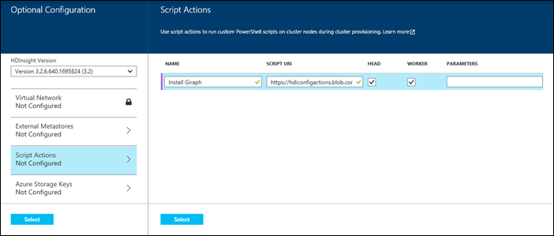
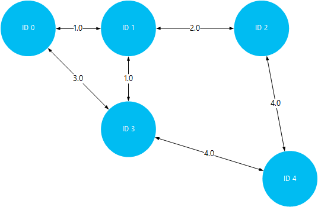

<!-- not suitable for Mooncake -->

<properties
    pageTitle="在 HDInsight 中的 Hadoop 群集上安装和使用 Giraph | Azure"
    description="了解如何通过 Giraph 自定义 HDInsight 群集，以及如何使用 Giraph。"
    services="hdinsight"
    documentationcenter=""
    author="nitinme"
    manager="jhubbard"
    editor="cgronlun"
    tags="azure-portal" />
<tags 
    ms.assetid="77a1d0e0-55de-4e61-98a0-060914fb7ca0"
    ms.service="hdinsight"
    ms.workload="big-data"
    ms.tgt_pltfrm="na"
    ms.devlang="na"
    ms.topic="article"
    ms.date="02/05/2016"
    wacn.date="02/06/2017"
    ms.author="nitinme" />

# 在 HDInsight 中安装和使用 Giraph
了解如何使用 Giraph 通过脚本操作来自定义基于 Windows 的 HDInsight 群集，以及如何使用 Giraph 来处理大型关系图。有关在基于 Linux 的群集中使用 Giraph 的信息，请参阅[在 HDInsight Hadoop 群集 (Linux) 上安装 Giraph](/documentation/articles/hdinsight-hadoop-giraph-install-linux/)。

可以使用*脚本操作*，在 Azure HDInsight 的任何一种群集（Hadoop、Storm、HBase、Spark）上安装 Giraph。用于在 HDInsight 群集上安装 Giraph 的示例脚本可通过 [https://hdiconfigactions.blob.core.windows.net/giraphconfigactionv01/giraph-installer-v01.ps1](https://hdiconfigactions.blob.core.windows.net/giraphconfigactionv01/giraph-installer-v01.ps1) 上的只读 Azure 存储 Blob 获得。示例脚本仅适用于 HDInsight 群集版本 3.1。有关 HDInsight 群集版本的详细信息，请参阅 [HDInsight 群集版本](/documentation/articles/hdinsight-component-versioning/)。

**相关文章**

* [在 HDInsight Hadoop 群集 (Linux) 上安装 Giraph](/documentation/articles/hdinsight-hadoop-giraph-install-linux/)
* [在 HDInsight 中创建 Hadoop 群集](/documentation/articles/hdinsight-provision-clusters/)：有关创建 HDInsight 群集的一般信息。
* [使用脚本操作自定义 HDInsight 群集][hdinsight-cluster-customize]：有关使用脚本操作自定义 HDInsight 群集的一般信息。
* [为 HDInsight 开发脚本操作脚本](/documentation/articles/hdinsight-hadoop-script-actions/)。

## 什么是 Giraph？
<a href="http://giraph.apache.org/" target="_blank">Apache Giraph</a> 可让你使用 Hadoop 执行图形处理，并可以在 Azure HDInsight 上使用。图形可为对象之间的关系建模，例如，为 Internet 之类的大型网络上的路由器之间的连接建模，或者为社交网络上的人物之间的关系建模（有时称为社交图形）。通过图形处理，可以推理图形中对象之间的关系，例如：

* 根据当前的关系识别潜在的朋友。
* 识别网络中两台计算机之间的最短路由。
* 计算网页的排名。

## 使用门户安装 Giraph
1. 如[在 HDInsight 中创建 Hadoop 群集](/documentation/articles/hdinsight-provision-clusters/)中所述，使用“自定义创建”选项开始创建群集。
2. 在向导的“脚本操作”页上，单击“添加脚本操作”，以提供有关脚本操作的详细信息，如下所示：

    

    <table border='1'>
        <tr><th>属性</th><th>值</th></tr>
        <tr><td>名称</td>
            <td>指定脚本操作的名称。例如 <b>Install Giraph</b>。</td></tr>
        <tr><td>脚本 URI</td>
            <td>指定调用来自定义群集的脚本的统一资源标识符 (URI)。例如 <i>https://hdiconfigactions.blob.core.windows.net/giraphconfigactionv01/giraph-installer-v01.ps1</i></td></tr>
        <tr><td>节点类型</td>
            <td>指定在其上运行自定义脚本的节点。你可以选择“所有节点”<b></b>、“仅限头节点”<b></b>或“仅限工作节点”<b></b>。
        <tr><td>参数</td>
            <td>根据脚本的需要，请指定参数。用于安装 Giraph 的脚本不需要任何参数，因此可以将此字段留空。</td></tr>
    </table>

    可添加多个脚本操作，以便在群集上安装多个组件。添加脚本后，单击复选标记即可开始创建群集。

## 使用 Giraph
我们将使用 SimpleShortestPathsComputation 示例来演示有关查找图形中对象之间最短路径的基本 <a href = "http://people.apache.org/~edwardyoon/documents/pregel.pdf">Pregel</a> 实现。请执行以下步骤，以上载示例数据和示例 jar，使用 SimpleShortestPathsComputation 示例运行作业，然后查看结果。

1. 将示例数据文件上载到 Azure Blob 存储。在本地工作站上，创建名为 **tiny\_graph.txt** 的新文件。该文件应该包含以下几行：

        [0,0,[[1,1],[3,3]]]
        [1,0,[[0,1],[2,2],[3,1]]]
        [2,0,[[1,2],[4,4]]]
        [3,0,[[0,3],[1,1],[4,4]]]
        [4,0,[[3,4],[2,4]]]

    将 tiny\_graph.txt 文件上载到 HDInsight 群集的主存储。有关如何上载数据的说明，请参阅[在 HDInsight 中上载 Hadoop 作业的数据](/documentation/articles/hdinsight-upload-data/)。

    此数据使用 [source\_id, source\_value,[[dest\_id], [edge\_value],...]] 格式，描述定向图形中对象之间的关系。每行代表一个 **source\_id** 对象与一个或多个 **dest\_id** 对象之间的关系。**edge\_value**（或权重）可被视为 **source\_id** 和 **dest\_id** 之间的连接强度或距离。

    使用表示对象间距离的值（或权重）绘制图形后，上述数据可能类似以下形式：

      

2. 运行 SimpleShortestPathsComputation 示例。使用 tiny\_graph.txt 文件作为输入，通过以下 Azure PowerShell cmdlet 来运行该示例。

    > [AZURE.IMPORTANT]
    Azure PowerShell 对于使用 Azure Service Manager 管理 HDInsight 资源的支持已**弃用**，将于 2017 年 1 月 1 日删除。本文档中的步骤使用的是与 Azure Resource Manager 兼容的新 HDInsight cmdlet。
    >

    > 请按照 [Install and configure Azure PowerShell](https://docs.microsoft.com/powershell/azureps-cmdlets-docs)（安装和配置 Azure PowerShell）中的步骤安装最新版本的 Azure PowerShell。如果你的脚本需要修改才能使用与 Azure Resource Manager 兼容的新 cmdlet，请参阅[迁移到适用于 HDInsight 群集的基于 Azure Resource Manager 的开发工具](/documentation/articles/hdinsight-hadoop-development-using-azure-resource-manager/)，了解详细信息。

        $clusterName = "clustername"
        # Giraph examples jar
        $jarFile = "wasbs:///example/jars/giraph-examples.jar"
        # Arguments for this job
        $jobArguments = "org.apache.giraph.examples.SimpleShortestPathsComputation",
                        "-ca", "mapred.job.tracker=headnodehost:9010",
                        "-vif", "org.apache.giraph.io.formats.JsonLongDoubleFloatDoubleVertexInputFormat",
                        "-vip", "wasbs:///example/data/tiny_graph.txt",
                        "-vof", "org.apache.giraph.io.formats.IdWithValueTextOutputFormat",
                        "-op",  "wasbs:///example/output/shortestpaths",
                        "-w", "2"
        # Create the definition
        $jobDefinition = New-AzureHDInsightMapReduceJobDefinition
            -JarFile $jarFile
            -ClassName "org.apache.giraph.GiraphRunner"
            -Arguments $jobArguments

        # Run the job, write output to the Azure PowerShell window
        $job = Start-AzureHDInsightJob -Cluster $clusterName -JobDefinition $jobDefinition
        Write-Host "Wait for the job to complete ..." -ForegroundColor Green
        Wait-AzureHDInsightJob -Job $job
        Write-Host "STDERR"
        Get-AzureHDInsightJobOutput -Cluster $clusterName -JobId $job.JobId -StandardError
        Write-Host "Display the standard output ..." -ForegroundColor Green
        Get-AzureHDInsightJobOutput -Cluster $clusterName -JobId $job.JobId -StandardOutput

在上面的示例中，请将 **clustername** 替换为已装有 Giraph 的 HDInsight 群集的名称。
3. 查看结果。完成该作业后，结果将存储在 **wasbs:///example/out/shotestpaths** 文件夹中的两个输出文件中。这些文件名为 **part-m-00001** 和 **part-m-00002**。执行以下步骤以下载和查看输出：

        $subscriptionName = "<SubscriptionName>"       # Azure subscription name
        $storageAccountName = "<StorageAccountName>"   # Azure Storage account name
        $containerName = "<ContainerName>"             # Blob storage container name

        # Select the current subscription
        Select-AzureSubscription $subscriptionName

        # Create the Storage account context object
        $storageAccountKey = Get-AzureStorageKey $storageAccountName | %{ $_.Primary }
        $storageContext = New-AzureStorageContext -StorageAccountName $storageAccountName -StorageAccountKey $storageAccountKey

        # Download the job output to the workstation
        Get-AzureStorageBlobContent -Container $containerName -Blob example/output/shortestpaths/part-m-00001 -Context $storageContext -Force
        Get-AzureStorageBlobContent -Container $containerName -Blob example/output/shortestpaths/part-m-00002 -Context $storageContext -Force

此时会在工作站上的当前目录中创建 **example/output/shortestpaths** 目录结构，并将两个输出文件下载到该位置。

    Use the **Cat** cmdlet to display the contents of the files:

        Cat example/output/shortestpaths/part*

    The output should appear similar to the following:

        0    1.0
        4    5.0
        2    2.0
        1    0.0
        3    1.0

    The SimpleShortestPathComputation example is hard coded to start with object ID 1 and find the shortest path to other objects. So the output should be read as `destination_id distance`, where distance is the value (or weight) of the edges traveled between object ID 1 and the target ID.

    Visualizing this, you can verify the results by traveling the shortest paths between ID 1 and all other objects. Note that the shortest path between ID 1 and ID 4 is 5. This is the total distance between ID 1 and 3, and then ID 3 and 4.

    

## 使用 Azure PowerShell 安装 Giraph
请参阅[使用脚本操作自定义 HDInsight 群集](/documentation/articles/hdinsight-hadoop-customize-cluster/#call-scripts-using-azure-powershell)。此示例演示如何使用 Azure PowerShell 安装 Spark。你需要自定义脚本以使用 [https://hdiconfigactions.blob.core.windows.net/giraphconfigactionv01/giraph-installer-v01.ps1](https://hdiconfigactions.blob.core.windows.net/giraphconfigactionv01/giraph-installer-v01.ps1)。

## 使用 .NET SDK 安装 Giraph
请参阅[使用脚本操作自定义 HDInsight 群集](/documentation/articles/hdinsight-hadoop-customize-cluster/#call-scripts-using-azure-powershell)。此示例演示如何使用 .NET SDK 安装 Spark。你需要自定义脚本以使用 [https://hdiconfigactions.blob.core.windows.net/giraphconfigactionv01/giraph-installer-v01.ps1](https://hdiconfigactions.blob.core.windows.net/giraphconfigactionv01/giraph-installer-v01.ps1)。

## 另请参阅
* [在 HDInsight Hadoop 群集 (Linux) 上安装 Giraph](/documentation/articles/hdinsight-hadoop-giraph-install-linux/)
* [在 HDInsight 中创建 Hadoop 群集](/documentation/articles/hdinsight-provision-clusters/)：有关创建 HDInsight 群集的一般信息。
* [使用脚本操作自定义 HDInsight 群集][hdinsight-cluster-customize]：有关使用脚本操作自定义 HDInsight 群集的一般信息。
* [为 HDInsight 开发脚本操作脚本](/documentation/articles/hdinsight-hadoop-script-actions/)。
* [在 HDInsight 群集上安装和使用 Spark][hdinsight-install-spark]：有关安装 Spark 的脚本操作示例。
* [在 HDInsight 群集上安装 R][hdinsight-install-r]：有关安装 R 的脚本操作示例。
* [在 HDInsight 群集上安装 Solr](/documentation/articles/hdinsight-hadoop-solr-install/)：有关如何安装 Solr 的脚本操作示例。

[tools]: https://github.com/Blackmist/hdinsight-tools
[aps]: /documentation/articles/powershell-install-configure/

[powershell-install]: https://docs.microsoft.com/powershell/azureps-cmdlets-docs
[hdinsight-provision]: /documentation/articles/hdinsight-provision-clusters/
[hdinsight-install-r]: /documentation/articles/hdinsight-hadoop-r-scripts/
[hdinsight-install-spark]: /documentation/articles/hdinsight-hadoop-spark-install/
[hdinsight-cluster-customize]: /documentation/articles/hdinsight-hadoop-customize-cluster/

<!---HONumber=Mooncake_0103_2017-->