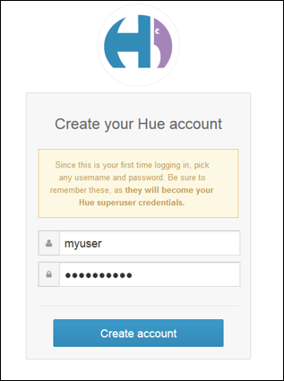
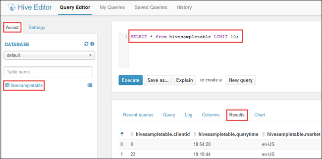
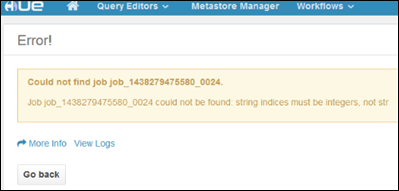

<!-- not suitable for Mooncake -->

<properties
	pageTitle="在 HDInsight Linux 群集上将 Hue 与 Hadoop 搭配使用 | Azure"
	description="了解如何在 HDInsight Linux 上安装 Hue 并将其与 Hadoop 群集搭配使用。"
	services="hdinsight"
	documentationCenter=""
	authors="nitinme"
	manager="jhubbard"
	editor="cgronlun"/>

<tags 
	ms.service="hdinsight" 
	ms.workload="big-data" 
	ms.tgt_pltfrm="na" 
	ms.devlang="na" 
	ms.topic="article" 
	ms.date="09/13/2016" 
	wacn.date="02/06/2017" 
	ms.author="nitinme"/>

# 在 HDInsight Hadoop 群集上安装并使用 Hue

了解如何在 HDInsight Linux 群集上安装 Hue ，并使用隧道将请求路由至 Hue。

## 什么是 Hue？

Hue 是一组 Web 应用程序，用来与 Hadoop 群集交互。你可以使用 Hue 浏览与 Hadoop 群集关联的存储（在 HDInsight 群集的案例中为 WASB）、运行 Hive 作业和 Pig 脚本等等。HDInsight Hadoop 群集上的 Hue 安装提供以下组件。

* Beeswax Hive 编辑器
* Pig
* 元存储管理器
* Oozie
* FileBrowser（与 WASB 默认容器进行通信）
* 作业浏览器

> [AZURE.WARNING] 完全支持通过 HDInsight 群集提供的组件，Microsoft 支持部门将帮助你找出并解决与这些组件相关的问题。
>
> 自定义组件可获得合理范围的支持，以帮助你进一步排查问题。这可能导致问题解决，或要求你参与可用的开放源代码技术渠道，在该处可找到该技术的深入专业知识。有许多可以使用的社区站点，例如：[HDInsight 的 MSDN 论坛](https://social.msdn.microsoft.com/Forums/azure/zh-cn/home?forum=hdinsight)、[http://stackoverflow.com](http://stackoverflow.com)。此外，Apache 项目在 [http://apache.org](http://apache.org) 上提供了项目站点，例如 [Hadoop](http://hadoop.apache.org/)。

## 使用脚本操作安装 Hue

以下脚本操作可用于在基于 Linux 的 HDInsight 群集上安装 Hue。
    https://hdiconfigactions.blob.core.windows.net/linuxhueconfigactionv02/install-hue-uber-v02.sh
    
本部分说明如何在使用 Azure 门户预览预配群集时使用脚本。

> [AZURE.NOTE] Azure PowerShell、Azure CLI、HDInsight .NET SDK 或 Azure Resource Manager 模板也可用于应用脚本操作。你也可以将脚本操作应用于已在运行的群集。有关详细信息，请参阅[使用脚本操作自定义 HDInsight 群集](/documentation/articles/hdinsight-hadoop-customize-cluster-linux/)。

1. 使用[预配 Linux 上的 HDInsight 群集](/documentation/articles/hdinsight-hadoop-provision-linux-clusters/)中的步骤开始预配群集，但不要完成预配。

	> [AZURE.NOTE] 若要在 HDInsight 群集上安装 Hue，建议的头节点大小为至少 A4（8 核、14 GB 内存）。

2. 在“可选配置”边栏选项卡上，选择“脚本操作”，并提供如下信息：

	

	* __名称__：输入脚本操作的友好名称。
	* __脚本 URI__：https://hdiconfigactions.blob.core.windows.net/linuxhueconfigactionv02/install-hue-uber-v02.sh
	* __标头__：选中此选项
	* __辅助角色__：将此选项留空。
	* __ZOOKEEPER__：将此选项留空。
	* __参数__：将此选项留空。

3. 在“脚本操作”的底部，使用“选择”按钮保存配置。最后，使用“可选配置”边栏选项卡底部的“选择”按钮保存可选配置信息。

4. 继续按[预配 Linux 上的 HDInsight 群集](/documentation/articles/hdinsight-hadoop-provision-linux-clusters/)中所述预配群集。

## 将 Hue 与 HDInsight 群集搭配使用

运行 Hue 时，SSH 隧道是在群集上访问 Hue 的唯一方式。通过 SSH 的隧道允许流量直接流向运行 Hue 的群集的头节点。在完成群集预配后，通过执行以下步骤在 HDInsight Linux 群集上使用 Hue。

1. 利用[使用 SSH 隧道来访问 Ambari Web UI、ResourceManager、JobHistory、NameNode、Oozie 及其他 Web UI](/documentation/articles/hdinsight-linux-ambari-ssh-tunnel/) 中的信息，创建从客户端系统到 HDInsight 群集的 SSH 隧道，然后将 Web 浏览器配置为将 SSH 隧道用作代理。

2. 在创建 SSH 隧道并将浏览器配置为通过它代理发送流量后，必须查找主头节点的主机名。为此，可以在端口 22 上使用 SSH 连接到群集。例如 `ssh USERNAME@CLUSTERNAME-ssh.azurehdinsight.cn`，其中 __USERNAME__ 是 SSH 用户名，__CLUSTERNAME__ 是群集的名称。

    有关使用 SSH 的详细信息，请参阅以下文档：

    * [Use SSH with Linux-based HDInsight from a Linux, Unix, or Mac OS X client](/documentation/articles/hdinsight-hadoop-linux-use-ssh-unix/)（从 Linux、Unix 或 Mac OS X 客户端使用 SSH 连接基于 Linux 的 HDInsight）
    * [Use SSH with Linux-based HDInsight from a Windows client](/documentation/articles/hdinsight-hadoop-linux-use-ssh-windows/)（从 Windows 客户端使用 SSH 连接基于 Linux 的 HDInsight）

3. 连接后，使用以下命令获取主头节点的完全限定域名：

        hostname -f

    此命令将返回类似于下面的名称：

        hn0-myhdi-nfebtpfdv1nubcidphpap2eq2b.ex.internal.chinacloudapp.cn
    
    这是 Hue 网站所在的主头节点的主机名。

2. 使用浏览器打开 Hue 门户 (http://HOSTNAME:8888)。将 HOSTNAME 替换为在上一步骤中获取的名称。

    > [AZURE.NOTE] 第一次登录时，系统会提示你创建帐户来登录 Hue 门户。你在此处指定的凭据只能用于该门户，并且与预配群集时指定的管理员或 SSH 用户凭据不相关。

	

### 运行 Hive 查询

1. 在 Hue 门户中，单击“查询编辑器”，然后单击“Hive”打开 Hive 编辑器。

	

2. 在“帮助”选项卡上的“数据库”下面，应会看到 **hivesampletable**。这是 HDInsight 上的所有 Hadoop 群集随附的示例表。在右窗格中输入示例查询，然后在下方窗格的“结果”选项卡中查看输出，如屏幕截图所示。

	

	也可以使用“图表”选项卡查看结果的视觉表示形式。

### 浏览群集存储

1. 在 Hue 门户中，单击菜单栏右上角的“文件浏览器”。

2. 默认情况下，文件浏览器在 **/user/myuser** 目录中打开。单击路径中用户目录前面的正斜杠，以转到与群集关联的 Azure 存储容器的根目录。

	

3. 右键单击某个文件或文件夹，以查看可用的操作。使用右侧的“上载”按钮，将文件上载到当前目录。使用“新建”按钮创建新的文件或目录。

> [AZURE.NOTE] Hue 文件浏览器只能显示与 HDInsight 群集关联的默认容器的内容。与群集关联的任何其他存储帐户/容器将无法使用文件浏览器访问。不过，与群集关联的其他容器始终可供 Hive 作业访问。例如，如果在 Hive 编辑器中输入 `dfs -ls wasbs://newcontainer@mystore.blob.core.chinacloudapi.cn` 命令，也可以看到其他容器的内容。在此命令中，**newcontainer** 不是与群集关联的默认容器。

## 重要注意事项

1. 用于安装 Hue 的脚本只会在群集的主头节点上安装它。

2. 在安装期间，系统会重启多个 Hadoop 服务（HDFS、YARN、MR2、Oozie），以更新配置。在脚本安装完 Hue 之后，可能需要一些时间让其他 Hadoop 服务启动。一开始可能会影响 Hue 的性能。等所有服务都启动之后，Hue 就可以完全正常运行。

3.	Hue 不了解 Tez 作业，这是 Hive 当前的默认值。如果你想使用 MapReduce 作为 Hive 执行引擎，请更新脚本，以在你的脚本中使用以下命令：

		set hive.execution.engine=mr;

4.	使用 Linux 群集时，可能会出现这种情况：服务在主头节点上运行，而 Resource Manager 可能在辅助头节点上运行。使用 Hue 查看群集上正在运行的作业的详细信息时，这种情况可能会导致错误（如下所示）。不过，你可以在作业完成后查看作业详细信息。

	

	这是由已知问题造成的。解决方法如下：修改 Ambari，使活动 Resource Manager 也在主头节点上运行。

5.	当 HDInsight 群集使用 Azure 存储（使用 `wasbs://`）时，Hue 能识别 WebHDFS。因此，搭配脚本操作使用的自定义脚本会安装 WebWasb，这是用来与 WASB 通信的 WebHDFS 兼容服务。因此，即使 Hue 门户中显示 HDFS（例如，将鼠标移到“文件浏览器”上时），也应该将它解释为 WASB。

## 后续步骤

- [在 HDInsight 群集上安装 Giraph](/documentation/articles/hdinsight-hadoop-giraph-install-linux/)。使用群集自定义在 HDInsight Hadoop 群集上安装 Giraph。Giraph 可让你使用 Hadoop 执行图形处理，并可以在 Azure HDInsight 上使用。

- [在 HDInsight 群集上安装 Solr](/documentation/articles/hdinsight-hadoop-solr-install-linux/)。使用群集自定义在 HDInsight Hadoop 群集上安装 Solr。Solr 允许你对存储的数据执行功能强大的搜索操作。

- [在 HDInsight 群集上安装 R](/documentation/articles/hdinsight-hadoop-r-scripts/)。使用群集自定义在 HDInsight Hadoop 群集上安装 R。R 是一种用于统计计算的开放源代码语言和环境。它提供了数百个内置统计函数及其自己的编程语言，可结合各方面的函数编程和面向对象的编程。它还提供了各种图形功能。

[powershell-install-configure]: /documentation/articles/install-configure-powershell-linux/
[hdinsight-provision]: /documentation/articles/hdinsight-hadoop-provision-linux-clusters/
[hdinsight-cluster-customize]: /documentation/articles/hdinsight-hadoop-customize-cluster-linux/

<!---HONumber=Mooncake_0926_2016-->