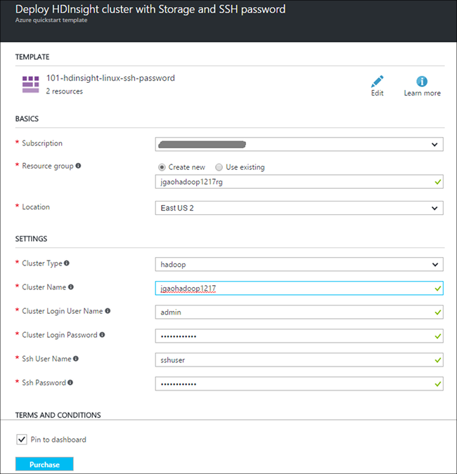
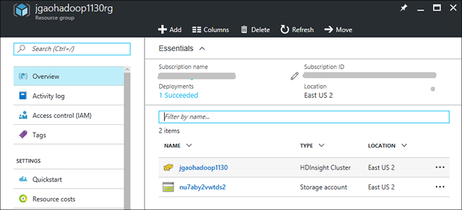
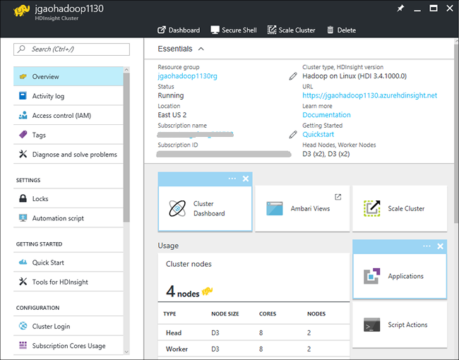

<!-- not suitable for Mooncake -->

<properties
    pageTitle="Linux 教程：Hadoop 和 Hive 入门 | Azure"
    description="遵循本 Linux 教程开始使用 HDInsight 中的 Hadoop。了解如何设置 Linux 群集，以及如何使用 Hive 查询数据。"
    services="hdinsight"
    documentationcenter=""
    author="mumian"
    manager="jhubbard"
    editor="cgronlun"
    tags="azure-portal" />
<tags 
    ms.assetid="6a12ed4c-9d49-4990-abf5-0a79fdfca459"
    ms.service="hdinsight"
    ms.devlang="na"
    ms.topic="hero-article"
    ms.tgt_pltfrm="na"
    ms.workload="big-data"
    ms.date="12/16/2016"
    wacn.date="02/06/2017"
    ms.author="jgao" />

# Hadoop 教程：在 HDInsight 中使用基于 Linux 的 Hadoop 入门
> [AZURE.SELECTOR]
- [基于 Linux](/documentation/articles/hdinsight-hadoop-linux-tutorial-get-started/)
- [基于 Windows](/documentation/articles/hdinsight-hadoop-tutorial-get-started-windows/)

了解如何在 HDInsight 中创建基于 Linux 的 [Hadoop](http://hadoop.apache.org/) 群集，以及如何在 HDInsight 中运行 Hive 作业。[Apache Hive](https://hive.apache.org/) 是 Hadoop 生态系统中最热门的组件。目前 HDInsight 提供了六种不同的群集类型：[Hadoop](/documentation/articles/hdinsight-hadoop-introduction/)、[Spark](/documentation/articles/hdinsight-apache-spark-overview/)、[HBase](/documentation/articles/hdinsight-hbase-overview/)、[Storm](/documentation/articles/hdinsight-storm-overview/)、[Interactive Hive（预览版）](/documentation/articles/hdinsight-hadoop-use-interactive-hive/)和 [R server](/documentation/articles/hdinsight-hadoop-r-server-overview/)。每个群集类型都支持一组不同的组件。所有六种群集类型都支持 Hive。有关 HDInsight 中受支持组件的列表，请参阅 [HDInsight 提供的 Hadoop 群集版本中有哪些新功能？](/documentation/articles/hdinsight-component-versioning/)

[AZURE.INCLUDE [delete-cluster-warning](../../includes/hdinsight-delete-cluster-warning.md)]

## 先决条件
在开始阅读本教程前，必须具备以下条件：

* **Azure 订阅**：若要创建免费试用一个月的帐户，请浏览到 [azure.microsoft.com/free](https://azure.microsoft.com/free)。

### 访问控制要求
[AZURE.INCLUDE [access-control](../../includes/hdinsight-access-control-requirements.md)]

##  创建群集

大部分 Hadoop 作业都是批处理作业。你可以创建群集、运行某些作业，然后删除该群集。在此部分中，会使用 [Azure Resource Manager 模板](/documentation/articles/resource-group-template-deploy/)在 HDInsight 中创建基于 Linux 的 Hadoop 群集。可以完全自定义 Resource Manager 模板；采用此模板，可以轻松创建 HDInsight 等 Azure 资源。对于遵循本教程，Resource Manager 模板体验不是必需的。对于其他群集创建方法以及了解本教程中使用的属性，请参阅[创建 HDInsight 群集](/documentation/articles/hdinsight-hadoop-provision-linux-clusters/)。使用页面顶部的选择器来选择群集创建选项。

本教程中所用的 Resource Manager 模板位于 Github 中 (https://azure.microsoft.com/resources/templates/101-hdinsight-linux-ssh-password/)。

1. 单击以下映像以登录到 Azure，然后在 Azure 门户预览中打开 Resource Manager 模板。
   
    
2. 输入或选择下列值：
   
    。
   
    * **订阅**：选择你的 Azure 订阅。
    * **资源组**：创建新资源组或选择现有的资源组。资源组是 Azure 组件的容器。在此示例中，资源组包含 HDInsight 群集和依赖的 Azure 存储帐户。
    * **位置**：选择要创建群集的 Azure 位置。为获得更佳性能，请选择离你较近的位置。
    * **群集类型**：对于本教程，选择“Hadoop”。
    * **群集名称**：输入要创建的 Hadoop 群集的名称。
    * **群集登录名和密码**：默认登录名是 **admin**。
    * **SSH 用户名和密码**：默认用户名是 **sshuser**。可以重命名它。
     
    某些属性已在模板中硬编码。可以在模板中配置这些值。

    * **位置**：群集和依赖的存储帐户的位置都使用与资源组相同的位置。
    * **群集版本**：3.4
    * **OS 类型**：Linux
    * **工作节点数**：2

     每个群集都有一个 Azure Blob 存储帐户依赖项。它通常称作默认存储帐户。HDInsight 群集与默认存储帐户必须均位于同一 Azure 区域。删除群集并不会删除存储帐户。此模板中，默认存储帐户名定义为后接“store”的群集名称。

3. 选中“我同意上述条款和条件”和“固定到仪表板”，然后单击“购买”。你会在门户仪表板上看到一个标题为“对模板部署进行部署”的新磁贴。创建群集大约需要 20 分钟时间。创建群集后，磁贴的标题被更改为指定的资源组名称。门户将自动在新的边栏选项卡中打开资源组。可以看到列出了群集和默认存储。
   
    。

4. 单击群集名称可在新的边栏选项卡中打开该群集。

      

## 运行 Hive 查询
HDInsight 中使用的组件中，[Apache Hive](/documentation/articles/hdinsight-use-hive/) 最为常用。有多种方法可以在 HDInsight 中运行 Hive 作业。在本教程中，你将从门户中使用 Ambari Hive 视图运行某些 Hive 作业。有关提交 Hive 作业的其他方法，请参阅[在 HDInsight 中使用 Hive](/documentation/articles/hdinsight-use-hive/)。

1. 在前面的屏幕截图中，单击“群集仪表板”，然后单击“HDInsight 群集仪表板”。还可以浏览到 **https://&lt;ClusterName>.azurehdinsight.cn**，其中 <ClusterName> 是上一节中为打开 Ambari 所创建的群集。
2. 输入上一节中指定的 Hadoop 用户名和密码。默认的用户名为 **admin**。
3. 打开 **Hive 视图**，如以下屏幕截图中所示：
   
    。
4. 在此页面的“查询编辑器”中，将以下 HiveQL 语句粘贴到工作表中：
   
        SHOW TABLES;
   
    > [AZURE.NOTE]
    对于 Hive，需使用分号。
    > 
    > 
5. 单击“执行”。“查询进程结果”部分应出现在“查询编辑器”下方，并显示有关作业的信息。
   
    查询完成后，“查询进程结果”部分将显示该操作的结果。你应看到一个名为 **hivesampletable** 的表。此示例 Hive 表包含所有 HDInsight 群集。
   
    。
6. 重复执行步骤 4 和步骤 5，以运行以下查询：
   
        SELECT * FROM hivesampletable;
   
    > [AZURE.TIP]
    请注意“查询进程结果”部分左上角的“保存结果”下拉列表；可使用此下载结果，或将其作为 CSV 文件保存到 HDInsight 存储中。
    > 
    > 
7. 单击“历史记录”来获取作业列表。

已完成 Hive 作业后，可以 [将结果导出到 Azure SQL 数据库或 SQL Server 数据库](/documentation/articles/hdinsight-use-sqoop/)，还可以[使用 Excel 将结果可视化](/documentation/articles/hdinsight-connect-excel-power-query/)。有关在 HDInsight 中使用 Hive 的详细信息，请参阅 [将 Hive 和 HiveQL 与 HDInsight 中的 Hadoop 配合使用以分析示例 Apache log4j 文件](/documentation/articles/hdinsight-use-hive/)。

## 结束本教程
完成教程之后，可能想要删除该群集。有了 HDInsight，你就可以将数据存储在 Azure 存储空间中，因此可以在群集不用时安全地删除群集。此外，还需要支付 HDInsight 群集费用，即使未使用。由于群集费用数倍于存储空间费用，因此在群集不用时删除群集可以节省费用。

**删除群集和/或默认存储帐户**

1. 登录 [Azure 门户预览](https://portal.azure.cn)。
2. 从门户仪表板中，单击创建群集时使用的资源组名称的磁贴。
3. 在资源边栏选项卡中单击“删除”可删除该资源组，其中包含群集和默认存储帐户；或者单击“资源”磁贴上的群集名称，然后单击群集边栏选项卡上的“删除”。请注意，删除资源组将删除存储帐户。如果想要保留存储帐户，请选择仅删除群集。

## 后续步骤
在本教程中，你已学习如何使用 Resource Manager 模板创建基于 Linux 的 HDInsight 群集，以及如何执行基本 Hive 查询。

若要了解有关使用 HDInsight 分析数据的详细信息，请参阅以下文档：

* 若要了解有关将 Hive 与 HDInsight 配合使用（包括如何从 Visual Studio 中执行 Hive 查询）的详细信息，请参阅[将 Hive 与 HDInsight 配合使用][hdinsight-use-hive]。
* 若要了解 Pig（一种用于转换数据的语言），请参阅[将 Pig 与 HDInsight 配合使用][hdinsight-use-pig]。
* 若要了解 MapReduce（在 Hadoop 中处理数据的程序编写方式），请参阅[将 MapReduce 与 HDInsight 配合使用][hdinsight-use-mapreduce]。
* 若要了解使用适用于 Visual Studio 的 HDInsight 工具在 HDInsight 上进行数据分析的内容，请参阅[用于 HDInsight 的 Visual Studio Hadoop 工具入门](/documentation/articles/hdinsight-hadoop-visual-studio-tools-get-started/)。

如果已准备好开始使用自己的数据，并希望详细了解 HDInsight 如何存储数据或如何将数据导入 HDInsight，请参阅以下文档：

* 有关 HDInsight 如何使用 Azure blob 存储的信息，请参阅[将 Azure Blob 存储与 HDInsight 配合使用](/documentation/articles/hdinsight-hadoop-use-blob-storage/)。
* 有关如何将数据上传到 HDInsight 的信息，请参阅[将数据上传到 HDInsight][hdinsight-upload-data]。

如果想要了解有关创建或管理 HDInsight 群集的详细信息，请参阅以下文档：

* 若要了解有关管理基于 Linux 的 HDInsight 群集的信息，请参阅[使用 Ambari 管理 HDInsight 群集](/documentation/articles/hdinsight-hadoop-manage-ambari/)。
* 若要了解有关创建 HDInsight 群集时可选择的选项的详细信息，请参阅[使用自定义选项在 Linux 上创建 HDInsight](/documentation/articles/hdinsight-hadoop-provision-linux-clusters/)。
* 如果熟悉 Linux 和 Hadoop，但想要了解有关 HDInsight 上 Hadoop 的具体信息，请参阅[使用 Linux 上的 HDInsight](/documentation/articles/hdinsight-hadoop-linux-information/)。这提供了如下信息：
  
  * 群集上托管的服务（例如 Ambari 和 WebHCat）的 URL
  * Hadoop 文件和示例在本地文件系统上的位置
  * 使用 Azure 存储空间 (WASB) 而不是 HDFS 作为默认数据存储

[1]: /documentation/articles/hdinsight-hadoop-visual-studio-tools-get-started/

[hdinsight-provision]: /documentation/articles/hdinsight-hadoop-provision-linux-clusters/
[hdinsight-admin-powershell]: /documentation/articles/hdinsight-administer-use-powershell/
[hdinsight-upload-data]: /documentation/articles/hdinsight-upload-data/
[hdinsight-use-mapreduce]: /documentation/articles/hdinsight-use-mapreduce/
[hdinsight-use-hive]: /documentation/articles/hdinsight-use-hive/
[hdinsight-use-pig]: /documentation/articles/hdinsight-use-pig/

[powershell-download]: http://go.microsoft.com/fwlink/p/?linkid=320376&clcid=0x409
[powershell-install-configure]: https://docs.microsoft.com/powershell/azureps-cmdlets-docs
[powershell-open]: https://docs.microsoft.com/powershell/azureps-cmdlets-docs#Install

[img-hdi-dashboard]: ./media/hdinsight-hadoop-tutorial-get-started-windows/HDI.dashboard.png
[img-hdi-dashboard-query-select]: ./media/hdinsight-hadoop-tutorial-get-started-windows/HDI.dashboard.query.select.png
[img-hdi-dashboard-query-select-result]: ./media/hdinsight-hadoop-tutorial-get-started-windows/HDI.dashboard.query.select.result.png
[img-hdi-dashboard-query-select-result-output]: ./media/hdinsight-hadoop-tutorial-get-started-windows/HDI.dashboard.query.select.result.output.png
[img-hdi-dashboard-query-browse-output]: ./media/hdinsight-hadoop-tutorial-get-started-windows/HDI.dashboard.query.browse.output.png
[image-hdi-clusterstatus]: ./media/hdinsight-hadoop-tutorial-get-started-windows/HDI.ClusterStatus.png
[image-hdi-gettingstarted-powerquery-importdata]: ./media/hdinsight-hadoop-tutorial-get-started-windows/HDI.GettingStarted.PowerQuery.ImportData.png
[image-hdi-gettingstarted-powerquery-importdata2]: ./media/hdinsight-hadoop-tutorial-get-started-windows/HDI.GettingStarted.PowerQuery.ImportData2.png

<!---HONumber=Mooncake_0103_2017-->