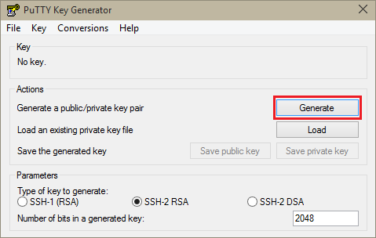
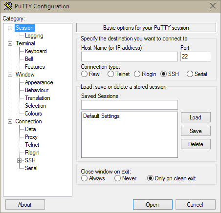

<properties
    pageTitle="在 Windows 上通过 PuTTY 将 SSH 与 HDInsight 群集配合使用 | Azure"
    description="了解如何创建和使用 SSH 密钥，以便从基于 Windows 的客户端通过 PuTTY SSH 客户端向基于 Linux 的 HDInsight 群集进行身份验证。"
    services="hdinsight"
    documentationcenter=""
    author="Blackmist"
    manager="jhubbard"
    editor="cgronlun"
    tags="azure-portal" />
<tags 
    ms.assetid="639328ca-d800-4fa9-97ed-5664477b88cd"
    ms.service="hdinsight"
    ms.devlang="na"
    ms.topic="get-started-article"
    ms.tgt_pltfrm="na"
    ms.workload="big-data"
    ms.date="01/12/2017"
    wacn.date="01/25/2017"
    ms.author="larryfr" />

# 在 Windows 上通过 PuTTY 将 SSH 与 HDInsight (Hadoop) 配合使用
> [AZURE.SELECTOR]
- [PuTTY (Windows)](/documentation/articles/hdinsight-hadoop-linux-use-ssh-windows/)
- [SSH（Windows、Linux、Unix、OS X）](/documentation/articles/hdinsight-hadoop-linux-use-ssh-unix/)

[安全外壳 (SSH)](https://zh.wikipedia.org/wiki/Secure_Shell) 可使用命令行接口在基于 Linux 的 HDInsight 群集上远程执行操作。本文档提供有关如何通过使用 PuTTY SSH 客户端在基于 Windows 的客户端中连接到 HDInsight 的信息。

> [AZURE.NOTE]
本文中的步骤假设用户使用的是基于 Windows 的系统，该系统装有 PuTTY SSH 客户端。如果用户使用的是提供 `ssh` 命令的 Linux、Unix、OS X 或 Windows 系统，请参阅[在 Linux、Unix 或 OS X 中的 HDInsight 上将 SSH 与基于 Linux 的 Hadoop 配合使用](/documentation/articles/hdinsight-hadoop-linux-use-ssh-unix/)。

## 先决条件

* 适用于 Windows 客户端的 **PuTTY** 和 **PuTTYGen**。可以从 [http://www.chiark.greenend.org.uk/~sgtatham/putty/download.html](http://www.chiark.greenend.org.uk/~sgtatham/putty/download.html) 获取这些实用工具。
* 支持 HTML5 的现代 Web 浏览器。

## 什么是 SSH？

SSH 是用于登录远程服务器以及在其上远程执行命令的实用工具。通过基于 Linux 的 HDInsight，SSH 可建立与群集头节点的加密连接，并提供用于键入命令的命令行。然后，你便可以在服务器上直接执行命令。

从历史上看，Windows 不提供 SSH 客户端。PuTTY 是可以安装在 Windows 上的图形 SSH 客户端。

### SSH 用户名

SSH 用户名是用于向 HDInsight 群集进行身份验证的名称。如果在群集创建过程中指定 SSH 用户名，则将在群集中的所有节点上创建此用户。创建群集后，可以使用此用户名连接到 HDInsight 群集头节点。然后，可以从头节点连接到各个辅助节点。

### SSH 密码或公钥

SSH 用户可以使用密码或公钥进行身份验证。密码仅仅是你编造的文本的字符串，而公钥是生成以唯一标识你的加密密钥对的一部分。

密钥比密码更安全，但是，需要额外的步骤才能生成密钥，并且必须在安全位置维护包含密钥的文件。如果任何人可以访问密钥文件，他们就可以访问你的帐户。或者，如果你丢失了密钥文件，你将无法登录到你的帐户。

密钥对由一个公钥（它将发送到 HDInsight 服务器）和一个私钥（它存放在客户端计算机上）组成。 当你使用 SSH 连接到 HDInsight 服务器时，SSH 客户端将使用计算机上的私钥向服务器进行身份验证。

## 创建 SSH 密钥

如果你打算在群集上使用 SSH 密钥，请使用以下信息。如果你打算使用密码，则可以跳过本节。

1. 打开 PuTTYGen。

2. 对于“要生成的密钥类型”，请选择“SSH-2 RSA”，然后单击“生成”。
   
      

3. 在进度条下面的区域中移动鼠标，直到进度条填满。移动鼠标可生成用于生成密钥的随机数据。
   
      

   
    生成密钥后，将显示公钥。

4. 为了提高安全性，你可以在“密钥通行短语”字段中输入通行短语，然后在“确认通行短语”字段中键入相同值。
   
      

   
    > [AZURE.NOTE]
    强烈建议你为密钥使用安全的通行短语。但是，如果你忘记了通行短语，将没有办法恢复它。

5. 单击“保存私钥”以在 **.ppk** 文件中保存密钥。在基于 Linux 的 HDInsight 群集上进行身份验证时，将要用到此密钥。
   
    > [AZURE.NOTE]
    应该将此密钥存储在安全位置，因为它可以用来访问基于 Linux 的 HDInsight 群集。

6. 单击“保存公钥”以在 **.txt** 文件中保存此密钥。当你以后创建其他基于 Linux 的 HDInsight 群集时，可以重复使用该公钥。
   
    > [AZURE.NOTE]
    公钥也显示在 PuTTYGen 的顶部。利用 Azure 门户创建群集时，可右键单击此字段，复制值，然后将其粘贴到窗体中。

##  创建基于 Linux 的 HDInsight 群集

创建基于 Linux 的 HDInsight 群集时，你必须提供以前创建的公钥。通过基于 Windows 的客户端，你可以使用下面两种方法，创建基于 Linux 的 HDInsight 群集：

* **Azure 门户** - 使用基于 Web 的门户创建群集。

* **适用于 Mac、Linux 和 Windows 的 Azure CLI** - 使用命令行命令来创建群集。

上述每种方法都将需要公钥。若要完整了解如何创建基于 Linux 的 HDInsight 群集，请参阅[预配基于 Linux 的 HDInsight 群集](/documentation/articles/hdinsight-hadoop-provision-linux-clusters/)。

### Azure 门户

使用 [Azure 门户][preview-portal]创建基于 Linux 的 HDInsight 群集时，必须输入 **SSH 用户名**，再选择输入**密码**或 **SSH 公钥**。

如果选择 **SSH 公钥**，可将公钥（参见 PuttyGen 的“要粘贴到 OpenSSH authorized\_keys 文件中的公钥”字段）粘贴到“SSH 公钥”字段中，或选中“选择文件”以打开并选择含有公钥的文件。

  

这将为指定的用户创建登录名，并启用密码身份验证或 SSH 密钥身份验证。

### 适用于 Mac、Linux 和 Windows 的 Azure 命令行接口

你可以使用[适用于 Mac、Linux 和 Windows 的 Azure CLI](/documentation/articles/xplat-cli-install/) 来通过 `azure hdinsight cluster create` 命令创建新群集。

有关使用此命令的详细信息，请参阅[使用自定义选项在 HDInsight 中预配 Hadoop Linux 群集](/documentation/articles/hdinsight-hadoop-provision-linux-clusters/)。

## 连接到基于 Linux 的 HDInsight 群集

1. 打开 PuTTY。
   
      

2. 如果你在创建用户帐户时提供了 SSH 密钥，则必须执行以下步骤，以选择向群集进行身份验证时要使用的私钥：
   
    在“类别”中，依次展开“连接”和“SSH”，然后选择“身份验证”。最后，单击“浏览”，然后选择包含私钥的 .ppk 文件。
   
      

3. 在“类别”中，选择“会话”。在“PuTTY 会话的基本选项”屏幕中，将 HDInsight 服务器的 SSH 地址输入到“主机名(或 IP 地址)”字段中。连接到群集时可使用以下两个 SSH 地址：

      

    * **头节点地址**：若要连接到群集的头节点，请使用群集名称，后接 **-ssh.azurehdinsight.cn**。例如，**mycluster-ssh.azurehdinsight.cn**。
   
    * **边缘节点地址**：若要连接到 HDInsight 群集上的 R 服务器，可使用地址 **RServer.CLUSTERNAME.ssh.azurehdinsight.cn** 连接到 R 服务器边缘节点，其中 CLUSTERNAME 是群集的名称。例如，**RServer.mycluster.ssh.azurehdinsight.cn**。
     
4. 若要保存连接信息以供将来使用，请在“保存的会话”下方输入此连接的名称，然后单击“保存”。该连接将会添加到已保存会话列表中。
5. 单击“打开”以连接到群集。
   
    > [AZURE.NOTE]
    如果这是第一次连接到群集，你将收到安全警报。这是一般警报。选择“是”缓存服务器的 RSA2 密钥以继续。

6. 出现提示时，请输入你在创建群集时输入的用户。如果你为用户提供了密码，则系统仍将提示你输入该密码。

> [AZURE.NOTE]
上述步骤假设使用的是端口 22，它将连接到 HDInsight 群集上的主头节点。若使用端口 23，将连接到次要节点。有关头节点的详细信息，请参阅 [HDInsight 中的 Hadoop 群集的可用性和可靠性](/documentation/articles/hdinsight-high-availability-linux/)。

### 连接到从节点

从节点不能直接从 Azure 数据中心外部访问，但是可以通过 SSH 从群集头节点访问。

如果你在创建用户帐户时提供了 SSH 密钥，则必须执行以下步骤，以在向群集进行身份验证时使用私钥（如果要连接到从节点）。

1. 从 [http://www.chiark.greenend.org.uk/~sgtatham/putty/download.html](http://www.chiark.greenend.org.uk/~sgtatham/putty/download.html) 安装 Pageant。此实用程序用于缓存 PuTTY 的 SSH 密钥。

2. 运行 Pageant。它将最小化到状态托盘中的图标。右键单击该图标，然后选择“添加密钥”。
   
      

3. 在“浏览”对话框出现时，选择包含密钥的 .ppk 文件，然后单击“打开”。此时将向 Pageant 添加密钥，在连接到群集时，Pageant 将向 PuTTY 提供该密钥。
   
    > [AZURE.IMPORTANT]
    如果你使用了 SSH 密钥保护帐户，则必须完成以前的步骤，然后才能连接到辅助节点。

4. 打开 PuTTY。

5. 如果你使用 SSH 密钥进行身份验证，请在“类别”部分中，依次展开“连接”和“SSH”，然后选择“身份验证”。
   
    在“身份验证参数”部分中，启用“允许代理转发”。这样，在连接到从节点时，PuTTY 可以通过到群集头节点的连接自动传递证书身份验证。
   
      

6. 如上所述，连接到群集。如果你使用 SSH 密钥进行身份验证，则不需要选择该密钥。添加到 Pageant 的 SSH 密钥将用于向群集进行身份验证。

7. 在建立连接后，使用以下方式检索你的群集节点列表。将 *ADMINPASSWORD* 替换为你的群集管理员帐户的密码。将 *CLUSTERNAME* 替换为群集名称。
   
        curl --user admin:ADMINPASSWORD https://CLUSTERNAME.azurehdinsight.cn/api/v1/hosts
   
    这将返回群集节点的 JSON 格式的信息，包括 `host_name`，其中包含每个节点的完全限定域名 (FQDN)。下面是由 **curl** 命令返回的 `host_name` 条目的示例：
   
        "host_name" : "workernode0.workernode-0-e2f35e63355b4f15a31c460b6d4e1230.j1.internal.chinacloudapp.cn"

8. 一旦有你要连接到的从节点的列表，就可以在 PuTTY 会话中使用以下命令打开到从节点的连接：
   
        ssh USERNAME@FQDN
   
    将 *USERNAME* 替换为你的 SSH 用户名，并将 *FQDN* 替换为辅助节点的 FQDN。例如，`workernode0.workernode-0-e2f35e63355b4f15a31c460b6d4e1230.j1.internal.chinacloudapp.cn`。
    
    > [AZURE.NOTE]
    如果你使用密码对 SSH 会话进行身份验证，则系统将提示你重新输入该密码。如果你使用 SSH 密钥，则连接应在没有任何提示的情况下完成。

9. 在建立会话后，你的 PuTTY 会话的提示符将从 `username@hn#-clustername` 更改为 `username@wn#-clustername`，指示你已连接到辅助节点。你此时运行的任何命令都将在从节点上运行。

10. 在辅助节点上执行完操作后，使用 `exit` 命令来关闭辅助节点的会话。这将使你返回到 `username@hn#-clustername` 提示符。

## 添加更多帐户

如果需要将更多帐户添加到你的群集，请执行以下步骤：

1. 如上所述，为新的用户帐户生成新的公钥和私钥。

2. 在群集的 SSH 会话中，使用以下命令添加新用户：
   
        sudo adduser --disabled-password <username>
   
    这将创建一个新的用户帐户，但会禁用密码身份验证。

3. 使用以下命令，创建用于保存密钥的目录和文件：
   
        sudo mkdir -p /home/<username>/.ssh
        sudo touch /home/<username>/.ssh/authorized_keys
        sudo nano /home/<username>/.ssh/authorized_keys

4. 当 nano 编辑器打开时，请复制并粘贴新用户帐户的公钥内容。最后，使用 **Ctrl-X** 保存文件并退出编辑器。
   
      

5. 使用以下命令，将 .ssh 文件夹和内容的所有权更改为新用户帐户：
   
        sudo chown -hR <username>:<username> /home/<username>/.ssh

6. 现在，你应该可以使用新用户帐户和私钥向服务器进行身份验证。

## SSH 隧道

可以使用 SSH 来以隧道方式将本地请求（例如 Web 请求）传送到 HDInsight 群集。然后，请求将路由到请求的资源，就像它是来源于 HDInsight 群集头节点一样。

> [AZURE.IMPORTANT]
访问某些 Hadoop 服务的 Web UI 需要使用 SSH 隧道。例如，作业历史记录 UI 或资源管理器 UI 只能使用 SSH 隧道访问。

有关创建和使用 SSH 隧道的详细信息，请参阅[使用 SSH 隧道访问 Ambari Web UI、ResourceManager、JobHistory、NameNode、Oozie 和其他 Web UI](/documentation/articles/hdinsight-linux-ambari-ssh-tunnel/)。

## 后续步骤

既然你了解了如何使用 SSH 密钥进行身份验证，就可以学习如何在 HDInsight 上将 MapReduce 与 Hadoop 配合使用。

* [将 Hive 与 HDInsight 配合使用](/documentation/articles/hdinsight-use-hive/)
* [将 Pig 与 HDInsight 配合使用](/documentation/articles/hdinsight-use-pig/)
* [将 MapReduce 作业与 HDInsight 配合使用](/documentation/articles/hdinsight-use-mapreduce/)

[preview-portal]: https://portal.azure.cn/

<!---HONumber=Mooncake_0120_2017-->