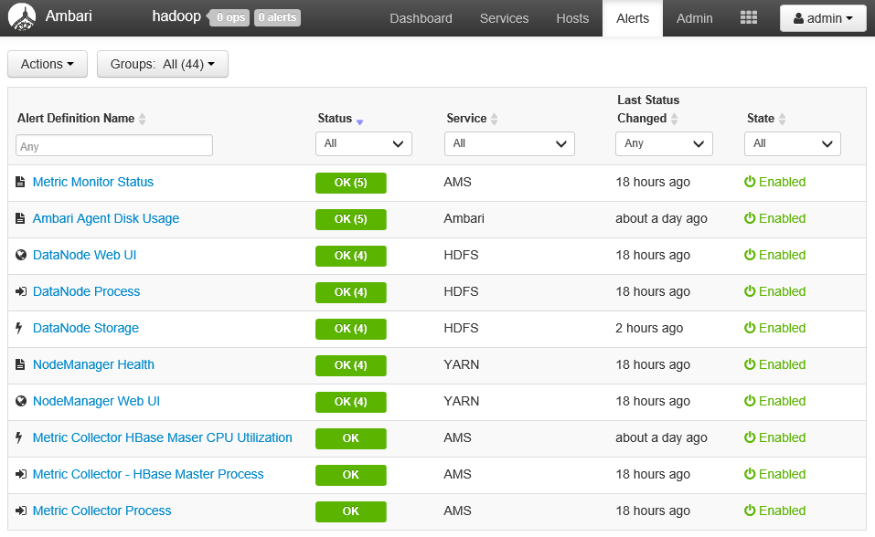
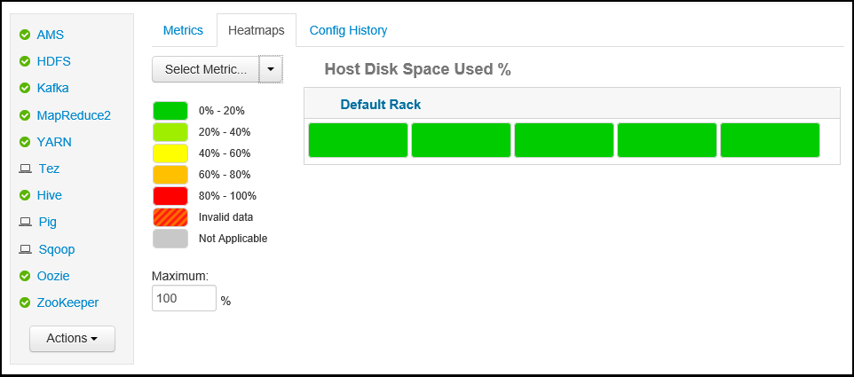

<properties
    pageTitle="使用 Apache Ambari Web UI 监视和管理 HDInsight 群集 | Azure"
    description="了解如何使用 Ambari 监视和管理基于 Linux 的 HDInsight 群集。在本文档中，你将学习如何使用 HDInsight 群集附带的 Ambari Web UI。"
    services="hdinsight"
    documentationcenter=""
    author="Blackmist"
    manager="jhubbard"
    editor="cgronlun"
    tags="azure-portal" />
<tags 
    ms.assetid="4787f3cc-a650-4dc3-9d96-a19a67aad046"
    ms.service="hdinsight"
    ms.devlang="na"
    ms.topic="article"
    ms.tgt_pltfrm="na"
    ms.workload="big-data"
    ms.date="10/31/2016"
    wacn.date="02/06/2017"
    ms.author="larryfr" />

# 使用 Ambari Web UI 管理 HDInsight 群集
[AZURE.INCLUDE [ambari-selector](../../includes/hdinsight-ambari-selector.md)]

Apache Ambari 提供简单易用的 Web UI 和 REST API 来简化 Hadoop 群集的管理和监视。基于 Linux 的 HDInsight 群集包含 Ambari，用于监视群集和进行配置更改。

在本文档中，你将学习如何将 Ambari Web UI 用于 HDInsight 群集。

## 什么是 Ambari？
<a href="http://ambari.apache.org" target="_blank">Apache Ambari</a> 提供简单易用的 Web UI，让你可以预配、管理和监视 Hadoop 群集，以此简化 Hadoop 管理。开发人员可以使用 <a href="https://github.com/apache/ambari/blob/trunk/ambari-server/docs/api/v1/index.md" target="_blank">Ambari REST API</a> 在其应用程序中集成这些功能。

基于 Linux 的 HDInsight 群集已按默认提供 Ambari Web UI。

## 连接
Ambari Web UI 在 HDInsight 群集（网址为 HTTPS://CLUSTERNAME.azurehdidnsight.net，其中 **CLUSTERNAME** 是群集的名称）上可用。

> [AZURE.IMPORTANT]
连接到 HDInsight 上的 Ambari 需要 HTTPS。此外，必须使用创建群集时提供的管理员帐户名（默认为 **admin**）和密码向 Ambari 进行身份验证。
> 
> 

## SSH 代理
> [AZURE.NOTE]
尽管可以直接通过 Internet 访问群集的 Ambari，但 Ambari Web UI 中的某些链接（例如 JobTracker 的链接）并未在 Internet 上公开。因此，除非你使用安全外壳 (SSH) 隧道来代理对群集头节点的 Web 流量，否则在尝试访问这些功能时会收到“找不到服务器”错误。
> 
> 

有关创建 SSH 隧道以使用 Ambari 的信息，请参阅 [Use SSH Tunneling to access Ambari web UI, ResourceManager, JobHistory, NameNode, Oozie, and other web UI's](/documentation/articles/hdinsight-linux-ambari-ssh-tunnel/)（使用 SSH 隧道访问 Ambari Web UI、ResourceManager、JobHistory、NameNode、Oozie 和其他 Web UI）。

## Ambari Web UI
连接到 Ambari Web UI 时，系统将提示用户向该页进行身份验证。使用群集创建期间使用的群集管理员用户（默认为 Admin）和密码。

当该页打开时，请注意顶栏。这包含以下信息和控件：

  

* **Ambari 徽标** - 打开仪表板，以便可以监视群集。
* **群集名称 # 项操作** - 显示进行中的 Ambari 操作数目。选择群集名称或“# 项操作”会显示后台操作列表。
* **警报数** - 与群集相关的警告或严重警报（如果有）。选择此项将显示警报的列表。
* **仪表板** - 显示仪表板。
* **服务** - 群集中服务的信息和配置设置。
* **主机** - 群集中节点的信息和配置设置。
* **警报** - 包含信息、警告和严重警报的日志。
* **管理** - 已安装在群集上的软件堆栈/服务、服务帐户信息和 Kerberos 安全性。
* **管理按钮** - Ambari 管理、用户设置和注销。

##  监视
### 警报
Ambari 提供许多警报，其可能状态如下：

* **确定**
* **警告**
* **关键**
* **未知**

除“正常”以外的警报会导致页面顶部以“# 个警报”条目显示警报数目。选择此条目会显示警报及其状态。

警报已组织成若干个默认组，你可以从“警报”页面进行查看。

  

你可以通过使用“操作”菜单并选择“管理警报组”来管理这些组。这样，你便可以修改现有组，或创建新组。

  

你还可以从“操作”菜单创建警报通知。这样，你便可以创建触发器，以在发生特定的警报/严重性组合时，通过“电子邮件”或“SNMP”发送通知。例如，你可以在“YARN 默认设置”组中的任何警报设为“关键”时发送警报。

  

### 群集
仪表板的“度量值”选项卡包含一系列 Widget，可让你一目了然地轻松监视群集状态。“CPU 使用率”等多个 Widget 可在单击后提供更多信息。

  

“热图”选项卡以绿色到红色的彩色热图显示度量值。

  

如需有关群集中节点的详细信息，请选择“主机”，然后选择所需的特定节点。

  

### 服务
仪表板上的“服务”边栏可让你快速了解群集上运行的服务的状态。其中使用了各种图标来指出状态或应采取的措施，例如，如果需要回收某个服务，便会显示黄色回收符号。

  

选择一个服务会显示有关该服务的更多详细信息。

  

#### 快速链接
某些服务会在页面顶部显示“快速链接”链接。这可以用于访问特定于服务的 Web UI，例如：

* **作业历史记录** - MapReduce 作业历史记录。
* **资源管理器** - YARN ResourceManager UI。
* **NameNode** - Hadoop 分布式文件系统 (HDFS) NameNode UI。
* **Oozie Web UI** - Oozie UI。

选择其中任何一个链接会在浏览器中打开新选项卡，以显示选择的页面。

> [AZURE.NOTE]
选择任何服务的“快速链接”链接将会导致出现“找不到服务器”的错误，除非你使用安全套接字层 (SSL) 隧道通过代理将 Web 流量发送到群集。这是因为用来显示此信息的 Web 应用程序不在 Internet 上公开。
> 
> 有关将 SSH 隧道与 HDInsight 配合使用的信息，请参阅 [Use SSH Tunneling to access Ambari web UI, ResourceManager, JobHistory, NameNode, Oozie, and other web UI's](/documentation/articles/hdinsight-linux-ambari-ssh-tunnel/)（使用 SSH 隧道访问 Ambari Web UI、ResourceManager、JobHistory、NameNode、Oozie 和其他 Web UI）
> 
> 

## 管理

### 主机
“主机”页面列出群集中的所有主机。若要管理主机，请遵循以下步骤。

  

> [AZURE.NOTE]
对于 HDInsight 群集，不应使用添加、停用或重用主机的功能。
> 
> 

1. 选择你要管理的主机。
2. 使用“操作”菜单选择你要执行的操作。
   
    * **启动所有组件** - 启动主机上的所有组件。
    * **停止所有组件** - 停止主机上的所有组件。
    * **重新启动所有组件** - 停止然后启动主机上的所有组件。
    * **打开维护模式** - 隐藏主机的警报。如果你要执行操作，以生成重新启动正在运行的服务所依赖的服务等警报，则应启用此项。
    * **关闭维护模式** - 让主机恢复正常警报功能。
    * **停止** - 停止主机上的 DataNode 或 NodeManagers。
    * **启动** - 启动主机上的 DataNode 或 NodeManagers。
    * **重新启动** - 停止然后启动主机上的 DataNode 或 NodeManagers。
    * **停用** - 从群集中删除主机。
     
        > [AZURE.NOTE]
        请勿在 HDInsight 群集上使用此操作。
        > 
        > 
    * **重用** - 将以前已停用的主机添加到群集中。
     
        > [AZURE.NOTE]
        请勿在 HDInsight 群集上使用此操作。
        > 
        > 

### 服务
在“仪表板”或“服务”页中，使用服务列表底部的“操作”按钮来停止然后启动所有服务。

  

> [AZURE.WARNING]
虽然此菜单中列出了“添加服务”，但是不应使用它将服务添加到 HDInsight 群集。应在群集预配过程中使用脚本操作添加新服务。有关使用脚本操作的详细信息，请参阅 [Customize HDInsight clusters using Script Actions](/documentation/articles/hdinsight-hadoop-customize-cluster-linux/)（使用脚本操作自定义 HDInsight 群集）。
> 
> 

虽然“操作”按钮可以重新启动所有服务，但你要启动、停止或重新启动的往往是特定服务。使用以下步骤来对单个服务执行操作：

1. 从“仪表板”或“服务”页面中选择一个服务。
2. 在“摘要”选项卡的顶部，使用“服务操作”按钮，然后选择要执行的操作。这会重新启动所有节点上的服务。
   
      

   
    > [AZURE.NOTE]
    在群集运行时重新启动某些服务可能会生成警报。若要避免这个问题，可以使用“服务操作”按钮来启用服务的“维护模式”，然后再执行重新启动。
    > 
    > 
3. 选择某个操作后，页面顶部的“# 项操作”条目便会递增数字，指出正在进行后台操作。如果已配置为显示，则将显示后台操作的列表。
   
    > [AZURE.NOTE]
    如果你已对服务启用了“维护模式”，请记得在操作完成后使用“服务操作”按钮来将它禁用。
    > 
    > 

若要配置服务，请使用以下步骤：

1. 从“仪表板”或“服务”页面中选择一个服务。
2. 选择“配置”选项卡。此时会显示当前配置。同时，还会显示以前的配置列表。
   
      

3. 使用显示的字段修改配置，然后选择“保存”。或者，选择以前的某个配置，然后选择“设为当前配置”以回滚到以前的设置。

## Ambari 视图
Ambari 视图允许开发人员使用 [Ambari 视图框架](https://cwiki.apache.org/confluence/display/AMBARI/Views)将 UI 元素插入到 Ambari Web UI 中。HDInsight 为 Hadoop 群集类型提供了以下视图：

* Yarn 队列管理器：队列管理器提供简单的 UI，用于查看和修改 YARN 队列。
* Hive 视图：Hive 视图允许用户直接从 Web 浏览器运行 Hive 查询。用户可以保存查询、查看结果、将结果保存到群集存储，或者将结果下载到本地系统。有关使用 Hive 视图的详细信息，请参阅[将 Hive 视图与 HDInsight 配合使用](/documentation/articles/hdinsight-hadoop-use-hive-ambari-view/)。
* Tez 视图：使用 Tez 视图可以查看有关 Tez 作业执行情况和作业使用的资源的信息，从而可以更好地了解和优化作业。

<!---HONumber=Mooncake_1205_2016-->