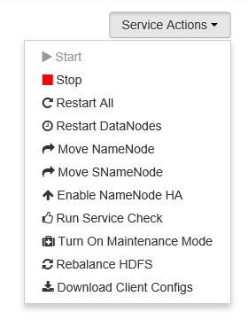

<properties
    pageTitle="使用 Ambari Web UI 监视和管理 Azure HDInsight |Azure"
    description="了解如何使用 Ambari 监视和管理基于 Linux 的 HDInsight 群集。 本文档介绍如何使用 HDInsight 群集附带的 Ambari Web UI。"
    services="hdinsight"
    documentationcenter=""
    author="Blackmist"
    manager="jhubbard"
    editor="cgronlun"
    tags="azure-portal" />
<tags
    ms.assetid="4787f3cc-a650-4dc3-9d96-a19a67aad046"
    ms.service="hdinsight"
    ms.custom="hdinsightactive"
    ms.devlang="na"
    ms.topic="article"
    ms.tgt_pltfrm="na"
    ms.workload="big-data"
    ms.date="05/04/2017"
    wacn.date="06/05/2017"
    ms.author="v-dazen"
    ms.translationtype="Human Translation"
    ms.sourcegitcommit="08618ee31568db24eba7a7d9a5fc3b079cf34577"
    ms.openlocfilehash="b53353344037c74c3dd6d57c335fd81af5ade685"
    ms.contentlocale="zh-cn"
    ms.lasthandoff="05/26/2017" />

# 使用 Ambari Web UI 管理 HDInsight 群集

[AZURE.INCLUDE [ambari-selector](../../includes/hdinsight-ambari-selector.md)]

Apache Ambari 提供简单易用的 Web UI 和 REST API 来简化 Hadoop 群集的管理和监视。 基于 Linux 的 HDInsight 群集包含 Ambari，用于监视群集和进行配置更改。

本文档介绍如何结合使用 Ambari Web UI 和 HDInsight 群集。

## 什么是 Ambari？

[Apache Ambari](http://ambari.apache.org) 通过提供易于使用的 Web UI 简化了 Hadoop 管理。 可以使用 Ambari 来创建、管理和监视 Hadoop 群集。 开发人员可以使用 [Ambari REST API](https://github.com/apache/ambari/blob/trunk/ambari-server/docs/api/v1/index.md)在其应用程序中集成这些功能。

默认已对使用 Linux 操作系统的 HDInsight 群集提供了 Ambari Web UI。

> [AZURE.IMPORTANT]
> Linux 是在 HDInsight 3.4 版或更高版本上使用的唯一操作系统。 有关详细信息，请参阅 [HDInsight 在 Windows 上即将弃用](/documentation/articles/hdinsight-component-versioning/#hdi-version-33-nearing-deprecation-date)。 

## 连接

位于 HTTPS://CLUSTERNAME.azurehdidnsight.net处的 HDInsight 群集上提供了 Ambari Web UI，其中 **CLUSTERNAME** 是你的 HDInsight 群集的名称。

> [AZURE.IMPORTANT]
> 连接到 HDInsight 上的 Ambari 需要 HTTPS。 当提示进行身份验证时，请使用在创建群集时提供的管理员帐户名称和密码。

## SSH 隧道（代理）

尽管可以直接通过 Internet 访问群集的 Ambari，但 Ambari Web UI 中的某些链接（例如 JobTracker 的链接）并未在 Internet 上公开。 若要访问这些服务，必须创建一个 SSH 隧道。 有关详细信息，请参阅[将 SSH 隧道与 HDInsight 配合使用](/documentation/articles/hdinsight-linux-ambari-ssh-tunnel/)。

## Ambari Web UI

连接到 Ambari Web UI 时，系统将提示用户向该页进行身份验证。 请使用在创建群集过程中你使用的群集管理员用户（默认 Admin）和密码。

当该页打开时，请注意顶栏。 此栏中包含以下信息和控件：

* **Ambari 徽标** - 打开仪表板，以便可以监视群集。

* **群集名称 # 项操作** - 显示进行中的 Ambari 操作数目。 选择群集名称或“# 项操作”会显示后台操作列表。

* **# 个警报** - 显示与群集相关的警告或严重警报（如果有）。

* **仪表板** - 显示仪表板。

* **服务** - 群集中服务的信息和配置设置。

* **主机** - 群集中节点的信息和配置设置。

* **警报** - 包含信息、警告和严重警报的日志。

* **管理** - 已安装在群集上的软件堆栈/服务、服务帐户信息和 Kerberos 安全性。

* **管理按钮** - Ambari 管理、用户设置和注销。

## 监视

### 警报

以下列表包含 Ambari 使用的常见警报状态：

* **正常**
* **警告**
* **严重**
* **未知**

警报（“正常”状态除外）会导致页面顶部以“# 个警报”条目显示警报数目。 选择此条目会显示警报及其状态。

警报已组织成若干个默认组，可以从“警报”页面进行查看。

可通过使用“操作”菜单并选择“管理警报组”来管理这些组。

还可管理警报方式，并通过在“操作”菜单中选择“管理警报通知”来创建警报通知。 所有当前通知都会显示。 还可以从此处创建通知。 出现特定的警报/严重性组合时，可通过**电子邮件**或 **SNMP** 发送通知。 例如，可在“YARN 默认设置”组中的任何警报设为“严重”时发送电子邮件消息。

最后，在“操作”菜单中选择“管理警报设置”可设置发送通知前出现警报的次数。 可以使用此设置来防止针对暂时性错误发出通知。

### 群集

仪表板的“度量值”选项卡包含一系列 Widget，可让你一目了然地轻松监视群集状态。 “CPU 使用率”等多个 Widget 可在单击后提供更多信息。

“热图”选项卡以绿色到红色的彩色热图显示度量值。

若要了解群集内节点的详细信息，请选择“主机”。 然后选择你感兴趣的具体节点。

### 服务

仪表板上的“服务”边栏可让你快速了解群集上运行的服务的状态。 各种图标用来指示状态或应当采取的操作。 例如，如果某项服务需要再循环，则会显示一个黄色的再循环符号。

> [AZURE.NOTE]
> 对于不同的 HDInsight 群集类型和版本，所显示的服务会有所不同。 此处显示的服务可能不同于针对你的群集所显示的服务。

选择一个服务会显示有关该服务的更多详细信息。

#### 快速链接

某些服务会在页面顶部显示“快速链接”链接。 这可以用于访问特定于服务的 Web UI，例如：

* **作业历史记录** - MapReduce 作业历史记录。
* **Resource Manager** - YARN ResourceManager UI。
* **NameNode** - Hadoop 分布式文件系统 (HDFS) NameNode UI。
* **Oozie Web UI** - Oozie UI。

选择其中任何链接会在浏览器中打开新选项卡，新选项卡显示选择的页面。

> [AZURE.NOTE]
> 选择某项服务的**快速链接**条目可能会返回“找不到服务”错误。 如果遇到此错误，则在使用此服务的**快速链接**条目时必须使用 SSH 隧道。 有关信息，请参阅[将 SSH 隧道与 HDInsight 配合使用](/documentation/articles/hdinsight-linux-ambari-ssh-tunnel/)

## 管理

### 主机

“主机”页面列出群集中的所有主机。 若要管理主机，请遵循以下步骤。

> [AZURE.NOTE]
> 对于 HDInsight 群集，不应使用添加、停用和重用主机的功能。

1. 选择要管理的主机。

2. 使用“操作”菜单选择要执行的操作：

    * **启动所有组件** - 启动主机上的所有组件。

    * **停止所有组件** - 停止主机上的所有组件。

    * **重新启动所有组件** - 停止然后启动主机上的所有组件。

    * **打开维护模式** - 隐藏主机的警报。 如果你正在执行生成了警报的操作，则应当启用此模式。 例如，停止和启动服务。

    * **关闭维护模式** - 让主机恢复正常警报功能。

    * **停止** - 停止主机上的 DataNode 或 NodeManagers。

    * **启动** - 启动主机上的 DataNode 或 NodeManagers。

    * **重新启动** - 停止然后启动主机上的 DataNode 或 NodeManagers。

    * **停用** - 从群集中删除主机。

        > [AZURE.NOTE]
        > 请勿在 HDInsight 群集上使用此操作。

    * **重用** - 将以前已停用的主机添加到群集中。

        > [AZURE.NOTE]
        > 请勿在 HDInsight 群集上使用此操作。

### 服务

在“仪表板”或“服务”页中，使用服务列表底部的“操作”按钮来停止和启动所有服务。

> [AZURE.WARNING]
> 虽然“添加服务”列于该菜单中，但不应使用它来向 HDInsight 群集添加服务。 应在群集预配过程中使用脚本操作添加新服务。 有关使用脚本操作的详细信息，请参阅[使用脚本操作自定义 HDInsight 群集](/documentation/articles/hdinsight-hadoop-customize-cluster-linux/)。

虽然“操作”按钮可以重启所有服务，但你要启动、停止或重启的通常是某个特定服务。 使用以下步骤来对单个服务执行操作：

1. 从“仪表板”或“服务”页面中选择一个服务。

2. 在“摘要”选项卡的顶部，使用“服务操作”按钮，然后选择要执行的操作。 这会重启所有节点上的服务。

    

    > [AZURE.NOTE]
    > 在群集运行时重启某些服务可能会生成警报。 若要避免生成警报，可使用“服务操作”按钮来为服务启用**维护模式**，然后再执行重启。

3. 选择某个操作后，页面顶部的“# 项操作”条目的数字便会递增，指出正在进行后台操作。 如果已配置为显示，则将显示后台操作的列表。

    > [AZURE.NOTE]
    > 如果你已为服务启用了**维护模式**，请记得在操作完成后使用“服务操作”按钮来将它禁用。

若要配置服务，请使用以下步骤：

1. 从“仪表板”或“服务”页面中选择一个服务。

2. 选择“配置”选项卡。 这会显示当前配置。 同时，还会显示以前的配置列表。

    

3. 使用显示的字段修改配置，然后选择“保存”。 或者，选择以前的某个配置，然后选择“设为当前配置”以回滚到以前的设置。

## Ambari 视图

Ambari 视图允许开发人员使用 [Ambari 视图框架](https://cwiki.apache.org/confluence/display/AMBARI/Views)将 UI 元素插入到 Ambari Web UI 中。 HDInsight 为 Hadoop 群集类型提供了以下视图：

* Yarn 队列管理器：队列管理器提供简单的 UI，用于查看和修改 YARN 队列。

* Hive 视图：Hive 视图允许用户直接从 Web 浏览器运行 Hive 查询。 用户可以保存查询、查看结果、将结果保存到群集存储，或者将结果下载到本地系统。 有关使用 Hive 视图的详细信息，请参阅[将 Hive 视图与 HDInsight 配合使用](/documentation/articles/hdinsight-hadoop-use-hive-ambari-view/)。

* Tez 视图：使用 Tez 视图可以更好地理解和优化作业。 可以查看与 Tez 作业的执行情况以及使用了哪些资源有关的信息。

<!--Update_Description: wording update-->