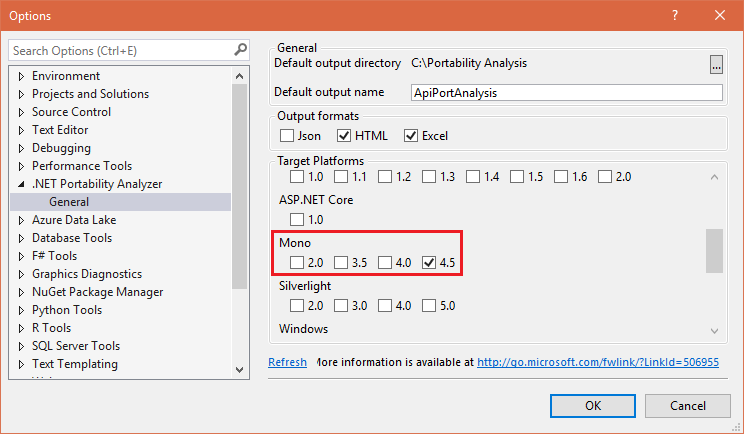
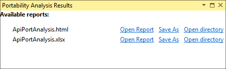

<properties
    pageTitle="在基于 Linux 的 HDInsight 上将 .NET 与 Hadoop MapReduce 配合使用 - Azure | Azure"
    description="了解如何在基于 Linux 的 HDInsight 上将 .NET 应用程序用于流式处理 MapReduce。"
    services="hdinsight"
    documentationCenter=""
    author="Blackmist"
    manager="jhubbard"
    editor="cgronlun"
    tags="azure-portal"
    translationtype="Human Translation" />
<tags
    ms.assetid=""
    ms.service="hdinsight"
    ms.custom="hdinsightactive"
    ms.devlang="dotnet"
    ms.topic="article"
    ms.tgt_pltfrm="na"
    ms.workload="big-data"
    ms.date="04/12/2017"
    wacn.date="05/08/2017"
    ms.author="larryfr"
    ms.sourcegitcommit="2c4ee90387d280f15b2f2ed656f7d4862ad80901"
    ms.openlocfilehash="3296ae8f44eea298910c9569fc81abb1dbbfe6d6"
    ms.lasthandoff="04/28/2017" />

# 将基于 Windows 的 HDInsight 的 .NET 解决方案迁移到基于 Linux 的 HDInsight

基于 Linux 的 HDInsight 群集使用 [Mono (https://mono-project.com)](https://mono-project.com) 运行 .NET 应用程序。 Mono 支持将 .NET 组件（例如 MapReduce 应用程序）与基于 Linux 的 HDInsight 配合使用。 在此文档中，了解如何迁移为基于 Windows 的 HDInsight 群集创建的 .NET 解决方案，以与基于 Linux 的 HDInsight 上的 Mono 配合使用。

## Mono 与 .NET 的兼容性

Mono 版本 4.2.1 包含在 HDInsight 版本 3.5 中。 有关包含在 HDInsight 中的 Mono 版本的详细信息，请参阅 [HDInsight 组件版本](/documentation/articles/hdinsight-component-versioning/)。

有关 Mono 与 .NET 间兼容性的详细信息，请参阅 [Mono 兼容性 (http://www.mono-project.com/docs/about-mono/compatibility/)](http://www.mono-project.com/docs/about-mono/compatibility/) 文档。

> [AZURE.IMPORTANT]
> SCP.NET 框架与 Mono 兼容。 有关将 SCP.NET 与 Mono 配合使用的详细信息，请参阅[使用 Visual Studio 为 HDInsight 上的 Apache Storm 开发 C# 拓扑](/documentation/articles/hdinsight-storm-develop-csharp-visual-studio-topology/)。

## 自动可移植性分析

[.NET Portability Analyzer](https://marketplace.visualstudio.com/items?itemName=ConnieYau.NETPortabilityAnalyzer) 可以用于生成有关应用程序和 Mono 之间不兼容性的报表。 使用以下步骤配置该分析器，以检查应用程序是否可以移植到 Mono：

1. 安装 [.NET Portability Analyzer](https://marketplace.visualstudio.com/items?itemName=ConnieYau.NETPortabilityAnalyzer)。 在安装期间，选择要使用的 Visual Studio 版本。

2. 在 Visual Studio 2015 中，依次选择“分析” > “可移植性分析器设置”，并确保在“Mono”部分选中了“4.5”。

    

    选择“确定”以保存配置。

3. 依次选择“分析” > “分析程序集可移植性”。 选择包含解决方案的程序集，然后选择“打开”以开始分析。

4. 分析完成后，依次选择“分析” > “查看分析报表”。 在“可移植性分析结果”中，选择“打开报表”以打开某个报表。

    

> [AZURE.IMPORTANT]
> 分析器无法捕获解决方案的每个问题。 例如，`c:\temp\file.txt` 的文件路径被视为没有问题，因为 Mono 在 Windows 上运行，而该路径在这种上下文中有效。 但是，该路径在 Linux 平台上无效。

## 手动可移植性分析

使用[应用程序可移植性 (http://www.mono-project.com/docs/getting-started/application-portability/)](http://www.mono-project.com/docs/getting-started/application-portability/) 文档中的信息手动审核代码。

## 修改和生成

可以继续使用 Visual Studio 为 HDInsight 生成 .NET 解决方案。 但必须确保将项目配置为使用 .NET Framework 4.5。

## 部署和测试

使用 .NET Portability Analyzer 或手动分析提供的建议修改解决方案后，必须通过 HDInsight 测试该解决方案。 在基于 Linux 的 HDInsight 群集上测试解决方案可能会揭露一些需要更正的细小问题。 我们建议在测试时，在应用程序中启用其他日志记录。

有关访问日志的详细信息，请参阅以下文档：

* [分析 HDInsight 日志](/documentation/articles/hdinsight-debug-jobs/)
* [在基于 Linux 的 HDInsight 上访问 YARN 应用程序日志](/documentation/articles/hdinsight-hadoop-access-yarn-app-logs-linux/)

## 后续步骤

* [在 HDInsight 上将 C# 与 MapReduce 配合使用](/documentation/articles/hdinsight-hadoop-dotnet-csharp-mapreduce-streaming/)

* [将 C# 用户定义函数与 Hive 和 Pig 配合使用](/documentation/articles/hdinsight-hadoop-hive-pig-udf-dotnet-csharp/)

* [为 HDInsight 上的 Storm 开发 C# 拓扑](/documentation/articles/hdinsight-storm-develop-csharp-visual-studio-topology/)