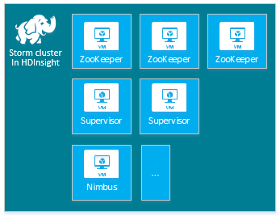
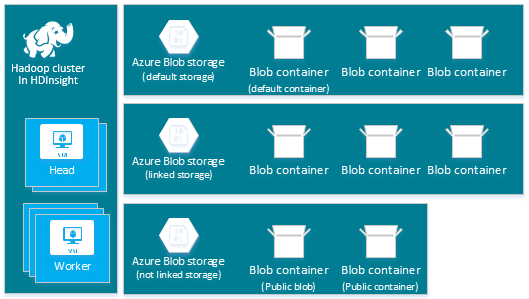
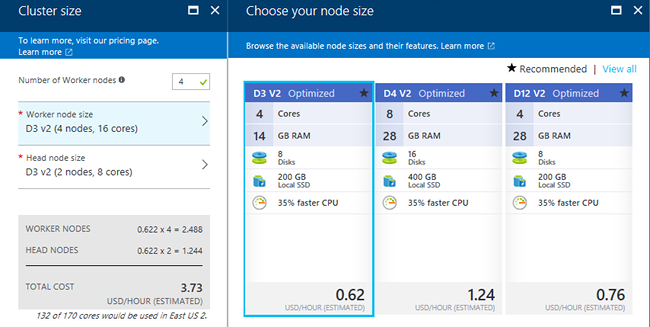

<properties
    pageTitle="在 Azure HDInsight 上创建 Hadoop、HBase、Kafka、Storm 或 Spark | Azure"
    description="了解如何使用浏览器、Azure CLI、Azure PowerShell、REST 或 SDK 在 Linux 上创建适用于 HDInsight 的 Hadoop、HBase、Storm 或 Spark 群集。"
    services="hdinsight"
    documentationcenter=""
    author="mumian"
    manager="jhubbard"
    editor="cgronlun"
    tags="azure-portal" />
<tags
    ms.assetid="23a01938-3fe5-4e2e-8e8b-3368e1bbe2ca"
    ms.service="hdinsight"
    ms.devlang="na"
    ms.topic="article"
    ms.tgt_pltfrm="na"
    ms.workload="big-data"
    ms.date="02/17/2017"
    wacn.date="03/31/2017"
    ms.author="jgao" />  

# 在 HDInsight 中创建 Hadoop 群集
[AZURE.INCLUDE [选择器](../../includes/hdinsight-create-linux-cluster-selector.md)]

Hadoop 群集由多个虚拟机（节点）组成，这些虚拟机用于对群集中的任务进行分布式处理。Azure 对各个节点的安装和配置的实现细节进行抽象，因此只需提供常规配置信息。本文介绍这些配置设置。

## 访问控制要求
[AZURE.INCLUDE [access-control](../../includes/hdinsight-access-control-requirements.md)]

##  群集类型
目前，Azure HDInsight 提供五种不同类型的群集，每种类型都具有一组用于提供特定功能的组件。

| 群集类型 | 功能 |
| --- | --- |
| [Hadoop](/documentation/articles/hdinsight-hadoop-introduction/) |查询和分析（批处理作业） |
| [HBase](/documentation/articles/hdinsight-hbase-overview/) |NoSQL 数据存储 |
| [Storm](/documentation/articles/hdinsight-storm-overview/) |实时事件处理 |
| [Spark](/documentation/articles/hdinsight-apache-spark-overview/) |内存中处理、交互式查询、微批流处理 |
| [交互式 Hive（预览版）](/documentation/articles/hdinsight-hadoop-use-interactive-hive/) |内存中缓存用于实现交互式且更快的 Hive 查询 |

每个群集类型在群集中具有自身的节点数目、在群集中使用自身的节点术语，对每个节点类型具有默认的 VM 大小。下表中的括号内列出了每个节点类型的节点数目。

| 类型 | Nodes | 图表 |
| --- | --- | --- |
| Hadoop |头节点 (2)，数据节点 (1+) | |
| HBase |头服务器 (2)，区域服务器 (1+)，主控/ZooKeeper 节点 (3) | |
| Storm |Nimbus 节点 (2)，监督程序服务器 (1+)，ZooKeeper 节点 (3) | |
| Spark |头节点 (2)，辅助角色节点 (1+)，ZooKeeper 节点 (3)（对于 A1 ZooKeeper VM 大小免费） |  
 |

下表列出了 HDInsight 的默认 VM 大小：

<!-- need to be verified -->

| 群集类型 | Hadoop | HBase | Storm | Spark |
| --- | --- | --- | --- | --- |
| 头：默认 VM 大小 |D3 v2 |D3 v2 |A3 |D12 v2 |
| 头：建议的 VM 大小 |D3 v2、D4 v2、D12 v2 |D3 v2、D4 v2、D12 v2 |A3、A4、A5 |D12 v2、D13 v2、D14 v2 |
| 辅助角色：默认 VM 大小 |D3 v2 |D3 v2 |D3 v2 |Windows：D12 v2；Linux：D4 v2 |
| 辅助角色：建议的 VM 大小 |D3 v2、D4 v2、D12 v2 |D3 v2、D4 v2、D12 v2 |D3 v2、D4 v2、D12 v2 |Windows：D12 v2、D13 v2、D14 v2；Linux：D4 v2、D12 v2、D13 v2、D14 v2 |
| Zookeeper：默认 VM 大小 | |A3 |A2 | |
| Zookeeper：建议的 VM 大小 | |A3、A4、A5 |A2、A3、A4 | |

> [AZURE.NOTE]
头称为 Storm 群集类型的 *Nimbus*。辅助角色称为 HBase 群集类型的*区域*以及 Storm 群集类型的*监督程序*。

> [AZURE.IMPORTANT]
如果计划使用 32 个以上的工作节点（在创建群集时配置或者是在创建之后通过扩展群集来配置），必须选择至少具有 8 个核心和 14 GB RAM 的头节点大小。
>
>

可以使用[脚本操作](#customize-clusters-using-script-action)向这些基本类型添加其他组件，如 Hue 或 R。

> [AZURE.IMPORTANT]
HDInsight 群集有各种类型，分别与针对其优化群集的工作负荷或技术相对应。没有任何方法支持创建组合多种类型的群集，如一个群集同时具有 Storm 和 HBase 类型。
>
>

如果你的解决方案需要分布在多种 HDInsight 群集类型上的技术，则应创建 Azure 虚拟网络，并创建虚拟网络中所需的群集类型。此配置允许群集以及部署到群集的任何代码直接相互通信。

有关将 Azure 虚拟网络与 HDInsight 配合使用的详细信息，请参阅[使用 Azure 虚拟网络扩展 HDInsight](/documentation/articles/hdinsight-extend-hadoop-virtual-network/)。

有关在 Azure 虚拟网络中使用两种群集类型的示例，请参阅[使用 Storm 和 HBase 分析传感器数据](/documentation/articles/hdinsight-storm-sensor-data-analysis/)。

## 基本配置选项
下面是用于创建 HDInsight 群集的基本配置选项。

### 群集名称
群集名称用于标识群集。群集名称必须全局唯一，并且遵守以下命名准则：

* 字段必须是包含 3 到 63 个字符的字符串。
* 字段只能包含字母、数字和连字符。

### 群集类型
请参阅[群集类型](#cluster-types)和[群集层](#cluster-tiers)。

### 操作系统
可以在以下两个操作系统之一上创建 HDInsight 群集：

* Linux 上的 HDInsight。HDInsight 提供在 Azure 上配置 Linux 群集的选项。如果熟悉 Linux 或 Unix，要从现有的基于 Linux 的 Hadoop 解决方案进行迁移，或者想要轻松集成针对 Linux 构建的 Hadoop 生态系统组件，请配置 Linux 群集。有关详细信息，请参阅[在 HDInsight 中的 Linux 上开始使用 Hadoop](/documentation/articles/hdinsight-hadoop-linux-tutorial-get-started/)。
* Windows 上的 HDInsight (Windows Server 2012 R2 Datacenter)。

### HDInsight 版本
此选项用于确定该群集所需的 HDInsight 版本。有关详细信息，请参阅 [Hadoop cluster versions and components in HDInsight](/documentation/articles/hdinsight-component-versioning/)（HDInsight 中的 Hadoop 群集版本和组件）。

### 订阅名称
每个 HDInsight 群集与一个 Azure 订阅绑定。

### 资源组名称
可以借助 [Azure Resource Manager](/documentation/articles/resource-group-overview/) 以组（称为 Azure 资源组）的形式处理应用程序中的资源。可以通过一个协调的操作为应用程序部署、更新、监视或删除所有资源。

### 凭据
使用 HDInsight 群集时，可以在群集创建期间配置两个用户帐户：

* HTTP 用户。默认的用户名为 *admin*。它使用 Azure 门户预览的基本配置。有时称为“群集用户”。
* SSH 用户（Linux 群集）。通过 SSH 连接到群集时使用此用户。群集创建后，可以根据 [Use SSH with Linux-based Hadoop on HDInsight from Linux, Unix, or OS X](/documentation/articles/hdinsight-hadoop-linux-use-ssh-unix/)（在 Linux、Unix 或 OS X 中的 HDInsight 上将 SSH 与基于 Linux 的 Hadoop 配合使用）或者 [Use SSH with Linux-based Hadoop on HDInsight from Windows](/documentation/articles/hdinsight-hadoop-linux-use-ssh-unix/)（在 Windows 中的 HDInsight 上将 SSH 与基于 Linux 的 Hadoop 配合使用）中的步骤创建更多 SSH 用户帐户。

    > [AZURE.NOTE]
    对于基于 Windows 的群集，可以创建一个 RDP 用户，用于通过 RDP 连接到群集。
    >
    >

### 数据源

原始 Hadoop 分布式文件系统 (HDFS) 在群集上使用许多本地磁盘。HDInsight 使用 Azure 存储中的 Blob。Azure 存储是一种稳健、通用的存储解决方案，它与 HDInsight 无缝集成。通过 HDFS 界面，可以针对 Blob 中存储的结构化或非结构化数据直接运行 HDInsight 中的整套组件。将数据存储在 Azure 存储中有助于安全删除用于计算的 HDInsight 群集，而不会丢失用户数据。

> [AZURE.WARNING]
HDInsight 仅支持__常规用途__ Azure 存储帐户。当前不支持 __Blob 存储__帐户类型。

在配置期间，必须指定 Azure 存储帐户，并在该 Azure 存储帐户中指定 Blob 容器。某些创建过程要求事先创建 Azure 存储帐户和 Blob 容器。群集使用该 Blob 容器作为默认存储位置。也可以选择指定群集可访问的其他 Azure 存储帐户（链接的存储）。群集还可以访问任何配置有完全公共读取权限或仅限对 Blob 的公共读取权限的 Blob 容器。有关详细信息，请参阅[管理对 Azure 存储资源的访问](/documentation/articles/storage-manage-access-to-resources/)。

  

> [AZURE.NOTE]
Blob 容器提供一组 Blob 的分组，如下图所示。

  

建议不要使用默认 Blob 容器来存储业务数据。最佳做法是每次使用之后删除默认 Blob 容器以降低存储成本。请注意，默认容器包含应用程序日志和系统日志。请确保在删除该容器之前检索日志。

> [AZURE.WARNING]
不支持对多个群集共享一个 Blob 容器。

有关使用辅助 Azure 存储帐户的详细信息，请参阅 [Using Azure Storage with HDInsight](/documentation/articles/hdinsight-hadoop-use-blob-storage/)（将 Azure 存储与 HDInsight 配合使用）。

### 位置（区域）
HDInsight 群集与其默认存储帐户必须位于相同的 Azure 位置。

有关受支持区域的列表，请查看 [HDInsight 定价](/pricing/details/hdinsight/)中的“已列出区域”部分。

###  节点定价层
客户需根据群集的生存期，支付这些节点的使用费。创建群集后便开始计费，删除群集后停止计费。无法取消分配群集或将其置于暂停状态。

不同群集类型具有不同的节点类型、节点数和节点大小。例如，Hadoop 群集类型具有两个*头节点*和四个*数据节点*（默认值），而 Storm 群集类型具有两个 *Nimbus 节点*、三个 *ZooKeeper 节点*和四个*主管节点*（默认值）。HDInsight 群集的成本取决于节点数和节点的虚拟机大小。例如，如果你知道将执行需要大量内存的操作，则可能要选择具有更多内存的计算资源。为便于学习，建议使用一个数据节点。有关 HDInsight 定价的详细信息，请参阅 [HDInsight 定价](/pricing/details/hdinsight/)。

> [AZURE.NOTE]
群集大小限制因 Azure 订阅而异。要提高限制的大小，请联系计费支持人员。
>

> 群集使用的节点不视为虚拟机，因为用于节点的虚拟机映像是 HDInsight 服务的实现细节。节点使用的计算核心会计入可供订阅使用的计算核心总数。创建 HDInsight 群集时，可以在“节点定价层”边栏选项卡的摘要部分中查看可用核心数以及群集要使用的核心数。
>
>

使用 Azure 门户预览配置群集时，可通过“节点定价层”边栏选项卡查看节点大小。还可以查看不同节点大小的相关成本。以下屏幕截图显示了基于 Linux 的 Hadoop 群集的选项。

  

下表显示 HDInsight 群集支持的大小和它们提供的容量。

#### 标准层：A 系列
在经典部署模型中，某些 VM 大小在 PowerShell 和命令行接口 (CLI) 中稍有不同。

* Standard\_A3 是大型
* Standard\_A4 是超大型

| 大小 | CPU 核心数 | 内存 | NIC 数（最大值） | 最大磁盘大小 | 最大数据磁盘（每个 1023 GB） | 最大IOPS（每个磁盘 500 次） |
| --- | --- | --- | --- | --- | --- | --- |
| Standard\_A3\\大型 |4 |7 GB |2 |临时磁盘 = 285 GB |8 |8x500 |
| Standard\_A4\\超大型 |8 |14 GB |4 |临时磁盘 = 605 GB |16 |16x500 |
| Standard\_A6 |4 |28 GB |2 |临时磁盘 = 285 GB |8 |8x500 |
| Standard\_A7 |8 |56 GB |4 |临时磁盘 = 605 GB |16 |16x500 |

#### 标准层：D 系列
| 大小 | CPU 核心数 | 内存 | NIC 数（最大值） | 最大磁盘大小 | 最大数据磁盘（每个 1023 GB） | 最大IOPS（每个磁盘 500 次） |
| --- | --- | --- | --- | --- | --- | --- |
| Standard\_D3 |4 |14 GB |4 |临时磁盘 (SSD) = 200 GB |8 |8x500 |
| Standard\_D4 |8 |28 GB |8 |临时磁盘 (SSD) = 400 GB |16 |16x500 |
| Standard\_D12 |4 |28 GB |4 |临时磁盘 (SSD) = 200 GB |8 |8x500 |
| Standard\_D13 |8 |56 GB |8 |临时磁盘 (SSD) = 400 GB |16 |16x500 |
| Standard\_D14 |16 |112 GB |8 |临时磁盘 (SSD) = 800 GB |32 |32x500 |

#### 标准层：Dv2 系列
| 大小 | CPU 核心数 | 内存 | NIC 数（最大值） | 最大磁盘大小 | 最大数据磁盘（每个 1023 GB） | 最大IOPS（每个磁盘 500 次） |
| --- | --- | --- | --- | --- | --- | --- |
| Standard\_D3\_v2 |4 |14 GB |4 |临时磁盘 (SSD) = 200 GB |8 |8x500 |
| Standard\_D4\_v2 |8 |28 GB |8 |临时磁盘 (SSD) = 400 GB |16 |16x500 |
| Standard\_D12\_v2 |4 |28 GB |4 |临时磁盘 (SSD) = 200 GB |8 |8x500 |
| Standard\_D13\_v2 |8 |56 GB |8 |临时磁盘 (SSD) = 400 GB |16 |16x500 |
| Standard\_D14\_v2 |16 |112 GB |8 |临时磁盘 (SSD) = 800 GB |32 |32x500 |

有关在计划使用这些资源时要考虑的部署注意事项，请参阅 [Sizes for virtual machines](/documentation/articles/virtual-machines-windows-sizes/)（虚拟机的大小）。有关不同大小的定价信息，请参阅 [HDInsight pricing](/pricing/details/hdinsight/)（HDInsight 定价）。

> [AZURE.IMPORTANT]
如果计划使用 32 个以上的工作节点（在创建群集时配置或者是在创建之后通过扩展群集来配置），必须选择至少具有 8 个核心和 14 GB RAM 的头节点大小。
>
>

创建群集后便开始计费，删除群集后停止计费。有关定价的详细信息，请参阅 [HDInsight pricing details](/pricing/details/hdinsight/)（HDInsight 定价详细信息）。

##  使用其他存储
在某些情况下，可能会向群集添加其他存储。例如，为不同地理区域或不同服务创建了多个 Azure 存储帐户，但想要使用 HDInsight 分析所有这些帐户。

创建 HDInsight 群集时或创建群集后，可以添加存储帐户。请参阅 [Customize Linux-based HDInsight clusters using Script Action](/documentation/articles/hdinsight-hadoop-customize-cluster-linux/)（使用脚本操作自定义基于 Linux 的 HDInsight 群集）。

有关辅助 Azure 存储帐户的详细信息，请参阅 [Using Azure Storage with HDInsight](/documentation/articles/hdinsight-hadoop-use-blob-storage/)（将 Azure 存储与 HDInsight 配合使用）。

##  使用 Hive/Oozie 元存储
如果想要在删除 HDInsight 群集后保留 Hive 表，建议使用自定义元存储。这样，便可以将该元存储附加到另HDInsight 群集。

> [AZURE.IMPORTANT]
为一个 HDInsight 群集版本创建的 HDInsight 元存储不能在不同的 HDInsight 群集版本之间共享。有关 HDInsight 版本的列表，请参阅[支持的 HDInsight 版本](/documentation/articles/hdinsight-component-versioning/#supported-hdinsight-versions)。
>
>

元存储包含 Hive 和 Oozie 元数据，例如 Hive 表、分区、架构和列。元存储可帮助保留 Hive 和 Oozie 元数据，因此在创建新群集时，不需要重新创建 Hive 表或 Oozie 作业。默认情况下，Hive 使用嵌入的 Azure SQL 数据库存储此信息。删除群集时，嵌入式数据库无法保留元数据。在配置了 Hive 元存储的 HDInsight 群集中创建 Hive 表时，使用相同的 Hive 元存储重新创建群集会保留这些表。

元存储配置不可用于 HBase 群集类型。

> [AZURE.IMPORTANT]
创建自定义元存储时，请勿使用包含短划线或连字符的数据库名称。否则可能导致群集创建过程失败。
>
>

## 使用 Azure 虚拟网络
使用 [Azure 虚拟网络](/documentation/services/networking/)可以创建包含解决方案所需的资源的安全持久性网络。使用虚拟网络可以：

* 在专用网络（仅限云）中将云资源连接在一起。

    
* 使用虚拟专用网络 (VPN) 将云资源连接到本地数据中心网络（站点到站点，或点到站点）。

| 站点到站点配置 | 点到站点配置 |
| --- | --- |
| 借助站点到站点配置，可以使用硬件 VPN 或路由和远程访问服务将多个资源从数据中心连接到 Azure 虚拟网络。  |借助点到站点配置，可以使用软件 VPN 将特定资源连接到 Azure 虚拟网络。  |

基于 Windows 的群集需要在经典部署模型中创建的虚拟网络。基于 Linux 的群集需要在 Resource Manager 部署模型中创建的虚拟网络。如果没有正确的网络类型，则在创建群集时无法使用网络。

有关将 HDInsight 与虚拟网络配合使用的详细信息（包括虚拟网络的特定配置要求），请参阅 [Extend HDInsight capabilities by using Azure Virtual Network](/documentation/articles/hdinsight-extend-hadoop-virtual-network/)（使用 Azure 虚拟网络扩展 HDInsight 功能）。

## 使用 HDInsight 群集自定义功能来自定义群集 (bootstrap)
有时需要配置以下配置文件：

* clusterIdentity.xml
* core-site.xml
* gateway.xml
* hbase-env.xml
* hbase-site.xml
* hdfs-site.xml
* hive-env.xml
* hive-site.xml
* mapred-site
* oozie-site.xml
* oozie-env.xml
* storm-site.xml
* tez-site.xml
* webhcat-site.xml
* yarn-site.xml

要在群集的整个生存期内保留更改，可以在创建过程中使用 HDInsight 群集自定义，或者在基于 Linux 的群集中使用 Ambari。有关详细信息，请参阅 [Customize HDInsight clusters using Bootstrap](/documentation/articles/hdinsight-hadoop-customize-cluster-bootstrap/)（使用 Bootstrap 自定义 HDInsight 群集）。

> [AZURE.NOTE]
基于 Windows 的群集无法保留重新制作映像所造成的更改。有关详细信息，请参阅[重新启动角色实例进行 OS 升级](http://blogs.msdn.com/b/kwill/archive/2012/09/19/role-instance-restarts-due-to-os-upgrades.aspx)。要在群集生存期保留更改，必须在创建过程中使用 HDInsight 群集自定义。
>
>

##  使用脚本操作自定义群集
你可以在创建期间通过使用脚本安装其他组件或自定义群集配置。此类脚本可通过**脚本操作**调用，脚本操作是一种配置选项，可通过 Azure 门户预览、HDInsight Windows PowerShell cmdlet 或 HDInsight .NET SDK 使用。有关详细信息，请参阅[使用脚本操作自定义 HDInsight 群集](/documentation/articles/hdinsight-hadoop-customize-cluster-linux/)。

某些本机 Java 组件（如 Mahout 和 Cascading）可以在群集上作为 Java 存档 (JAR) 文件运行。可以通过 Hadoop 作业提交机制将这些 JAR 文件分发到 Azure 存储，并提交到 HDInsight 群集。有关详细信息，请参阅[以编程方式提交 Hadoop 作业](/documentation/articles/hdinsight-submit-hadoop-jobs-programmatically/)。

> [AZURE.NOTE]
如果在将 JAR 文件部署到 HDInsight 群集或调用 HDInsight 群集上的 JAR 文件时遇到问题，请联系 [Microsoft 技术支持](/support/contact/)。
>

> HDInsight 不支持级联，因此不符合 Microsoft 技术支持的条件。有关支持的组件列表，请参阅 [HDInsight 提供的群集版本有哪些新功能？](/documentation/articles/hdinsight-component-versioning/)。
>
>

## 使用边缘节点
 空边缘节点是安装并配置了与头节点中相同的客户端工具的 Linux 虚拟机。可以使用该边缘节点来访问群集、测试客户端应用程序和托管客户端应用程序。有关详细信息，请参阅 [Use empty edge nodes in HDInsight](/documentation/articles/hdinsight-apps-use-edge-node/)（在 HDInsight 中使用空边缘节点）。

##  群集创建方法
在本文中，你了解了有关创建基于 Linux 的 HDInsight 群集的基本信息。使用下表查找具体信息，了解如何使用最合适的方法创建群集。

| 群集创建方法 | Web 浏览器 | 命令行 | REST API | SDK | Linux、Mac OS X 或 Unix | Windows |
| --- |:---:|:---:|:---:|:---:|:---:|:---:|
| [Azure 门户预览](/documentation/articles/hdinsight-hadoop-create-linux-clusters-portal/) |✔ |&nbsp; |&nbsp; |&nbsp; |✔ |✔ |
| [Azure CLI](/documentation/articles/hdinsight-hadoop-create-linux-clusters-azure-cli/) |&nbsp; |✔ |&nbsp; |&nbsp; |✔ |✔ |
| [Azure PowerShell](/documentation/articles/hdinsight-hadoop-create-linux-clusters-azure-powershell/) |&nbsp; |✔ |&nbsp; |&nbsp; |✔ |✔ |
| [cURL](/documentation/articles/hdinsight-hadoop-create-linux-clusters-curl-rest/) |&nbsp; |✔ |✔ |&nbsp; |✔ |✔ |
| [.NET SDK](/documentation/articles/hdinsight-hadoop-create-linux-clusters-dotnet-sdk/) |&nbsp; |&nbsp; |&nbsp; |✔ |✔ |✔ |
| [Azure Resource Manager 模板](/documentation/articles/hdinsight-hadoop-create-linux-clusters-arm-templates/) |&nbsp; |✔ |&nbsp; |&nbsp; |✔ |✔ |

<!---HONumber=Mooncake_0327_2017-->
<!--Update_Description: wording update-->