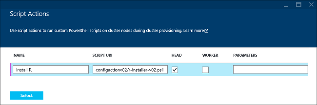

<properties
    pageTitle="在 HDInsight 中使用 R 来自定义群集 | Azure"
    description="了解如何通过脚本操作安装 R，以及如何在 HDInsight 群集上使用 R。"
    services="hdinsight"
    documentationcenter=""
    tags="azure-portal"
    author="mumian"
    manager="jhubbard"
    editor="cgronlun" />
<tags
    ms.assetid="be851270-afa5-4af0-a69e-2d343a4deeb7"
    ms.service="hdinsight"
    ms.workload="big-data"
    ms.tgt_pltfrm="na"
    ms.devlang="na"
    ms.topic="article"
    ms.date="02/28/2017"
    wacn.date="04/27/2017"
    ms.author="jgao" />

# 在 HDInsight Hadoop 群集上安装并使用 R
了解如何使用 R 通过脚本操作来自定义基于 Windows 的 HDInsight 群集，以及如何在 HDInsight 群集上使用 R。有关在基于 Linux 的群集中使用 R 的信息，请参阅[在 HDInsight Hadoop 群集 (Linux) 上安装和使用 R](/documentation/articles/hdinsight-hadoop-r-scripts-linux/)。

可以使用*脚本操作*，在 Azure HDInsight 的任何群集类型（Hadoop、Storm、HBase、Spark）上安装 R。用于在 HDInsight 群集上安装 R 的示例脚本可通过 [https://hdiconfigactions.blob.core.windows.net/rconfigactionv02/r-installer-v02.ps1](https://hdiconfigactions.blob.core.windows.net/rconfigactionv02/r-installer-v02.ps1) 上的只读 Azure 存储 Blob 获得。

**相关文章**

* [在 HDInsight Hadoop 群集 (Linux) 上安装和使用 R](/documentation/articles/hdinsight-hadoop-r-scripts-linux/)
* [在 HDInsight 中创建 Hadoop 群集](/documentation/articles/hdinsight-hadoop-provision-linux-clusters/)：有关如何创建 HDInsight 群集的一般信息
* [使用脚本操作自定义 HDInsight 群集][hdinsight-cluster-customize]：有关如何使用脚本操作自定义 HDInsight 群集的一般信息
* [为 HDInsight 开发脚本操作脚本](/documentation/articles/hdinsight-hadoop-script-actions/)

## 什么是 R？
<a href="http://www.r-project.org/" target="_blank">统计计算的 R 项目</a>是一种用于统计计算的开放源代码语言和环境。R 提供了数百个内置统计函数及其自己的编程语言，该语言结合了各方面的函数编程和面向对象的编程。它还提供了各种图形功能。R 是面向各个领域最专业的统计学家和科学家的首选编程环境。

R 与 Azure Blob 存储 (WASB) 兼容，这样，存储在此的数据可以在 HDInsight 上使用 R 进行处理。

## 安装 R
用于在 HDInsight 群集上安装 R 的[示例脚本](https://hdiconfigactions.blob.core.windows.net/rconfigactionv02/r-installer-v02.ps1)可从 Azure 存储中的只读 Blob 获得。本部分提供有关如何在使用 Azure 门户预览创建群集时使用示例脚本的说明。

> [AZURE.NOTE]
示例脚本是随同 HDInsight 群集版本 3.1 一起引入的。有关 HDInsight 群集版本的详细信息，请参阅 [HDInsight 群集版本](/documentation/articles/hdinsight-component-versioning/)。
>
>

1. 从门户创建 HDInsight 群集时，先单击“可选配置”，然后单击“脚本操作”。
2. 在“脚本操作”页上，输入以下值：

      

    <table border='1'>
        <tr><th>属性</th><th>值</th></tr>
        <tr><td>Name</td>
            <td>指定脚本操作的名称，例如 <b>Install R</b>。</td></tr>
        <tr><td>脚本 URI</td>
            <td>指定调用用于自定义群集的脚本的 URI，例如 <i>https://hdiconfigactions.blob.core.windows.net/rconfigactionv02/r-installer-v02.ps1</i></td></tr>
        <tr><td>节点类型</td>
            <td>指定运行自定义脚本的节点。可选择“所有节点”、“仅限头节点”或“仅限辅助节点”<b></b><b></b><b></b>。
        <tr><td>Parameters</td>
            <td>根据脚本的需要，请指定参数。但是，用于安装 R 的脚本不需要任何参数，因此，可以将此项保留为空。</td></tr>
    </table>

    可添加多个脚本操作，以便在群集上安装多个组件。在添加了脚本后，单击复选标记以开始创建群集。

还可以通过 Azure PowerShell 或 HDInsight .NET SDK 使用脚本在 HDInsight 上安装 R。有关这些过程的说明在本文后面提供。

## 运行 R 脚本
本部分介绍如何在安装有 HDInsight 的 Hadoop 群集上运行 R 脚本。

1. **与群集建立远程桌面连接**：在门户中，对创建的安装有 R 的群集启用远程桌面，然后连接到该群集。有关说明，请参阅[使用 RDP 连接到 HDInsight 群集](/documentation/articles/hdinsight-administer-use-management-portal/#connect-to-clusters-using-rdp)。
2. **打开 R 控制台**：R 安装将 R 控制台的链接放置在头节点的桌面上。单击它以打开 R 控制台。
3. **运行 R 脚本**：通过粘贴并选择 R 脚本，然后按 ENTER，可以从 R 控制台直接运行该脚本。下面是一个简单的示例脚本，该脚本将生成 1 到 100 的数字，然后将其乘以 2。

        library(rmr2)
        library(rhdfs)
        ints = to.dfs(1:100)
        calc = mapreduce(input = ints, map = function(k, v) cbind(v, 2*v))
        from.dfs(calc)

前两行调用随 R 一起安装的 RHadoop 库。最后一行将结果打印到控制台。输出应如下所示：

    [1,]  1 2
    [2,]  2 4
    .
    .
    .
    [98,]  98 196
    [99,]  99 198
    [100,] 100 200

## 使用 Azure PowerShell 安装 R
请参阅[使用脚本操作自定义 HDInsight 群集](/documentation/articles/hdinsight-hadoop-customize-cluster/#call-scripts-using-azure-powershell)。此示例演示如何使用 Azure PowerShell 安装 Spark。你需要自定义要使用的脚本 [https://hdiconfigactions.blob.core.windows.net/rconfigactionv02/r-installer-v02.ps1](https://hdiconfigactions.blob.core.windows.net/rconfigactionv02/r-installer-v02.ps1)。

## 使用 .NET SDK 安装 R
请参阅[使用脚本操作自定义 HDInsight 群集](/documentation/articles/hdinsight-hadoop-customize-cluster/#call-scripts-using-azure-powershell)。此示例演示如何使用 .NET SDK 安装 Spark。你需要自定义要使用的脚本 [https://hdiconfigactions.blob.core.windows.net/rconfigactionv02/r-installer-v02.ps1](https://hdiconfigactions.blob.core.windows.net/rconfigactionv02/r-installer-v02.ps1)。

## 另请参阅
* [在 HDInsight Hadoop 群集 (Linux) 上安装和使用 R](/documentation/articles/hdinsight-hadoop-r-scripts-linux/)
* [在 HDInsight 中创建 Hadoop 群集](/documentation/articles/hdinsight-hadoop-provision-linux-clusters/)：有关如何创建 HDInsight 群集的一般信息
* [使用脚本操作自定义 HDInsight 群集][hdinsight-cluster-customize]：有关如何使用脚本操作自定义 HDInsight 群集的一般信息
* [为 HDInsight 开发脚本操作脚本](/documentation/articles/hdinsight-hadoop-script-actions/)
* [在 HDInsight 群集上安装和使用 Spark][hdinsight-install-spark]：有关安装 Spark 的脚本操作示例
* [在 HDInsight 群集上安装 Giraph](/documentation/articles/hdinsight-hadoop-giraph-install/)：有关如何安装 Giraph 的脚本操作示例
* [在 HDInsight 群集上安装 Solr](/documentation/articles/hdinsight-hadoop-solr-install-linux/)：有关如何安装 Solr 的脚本操作示例。

[powershell-install-configure]: https://docs.microsoft.com/powershell/azureps-cmdlets-docs
[hdinsight-provision]: /documentation/articles/hdinsight-hadoop-provision-linux-clusters/
[hdinsight-cluster-customize]: /documentation/articles/hdinsight-hadoop-customize-cluster-linux/
[hdinsight-install-spark]: /documentation/articles/hdinsight-apache-spark-jupyter-spark-sql/

<!---HONumber=Mooncake_0120_2017-->
<!--Update_Description: update from ASM to ARM-->