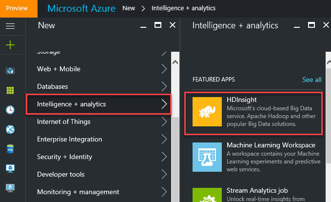
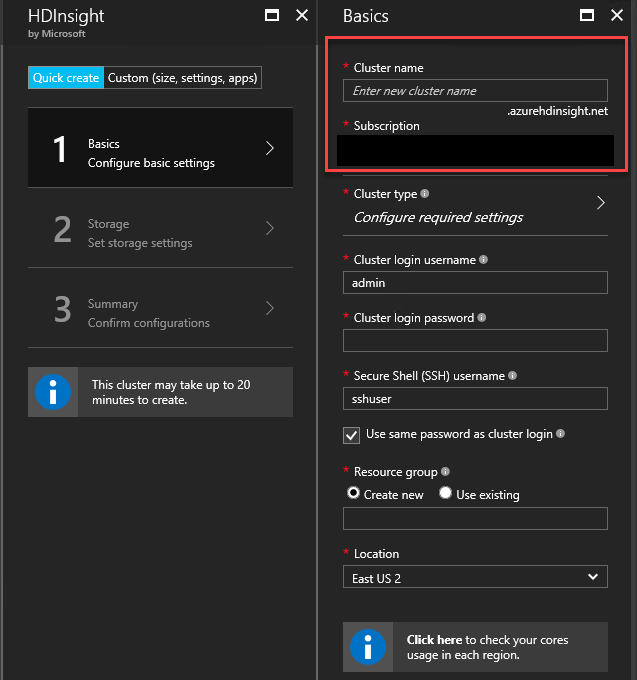
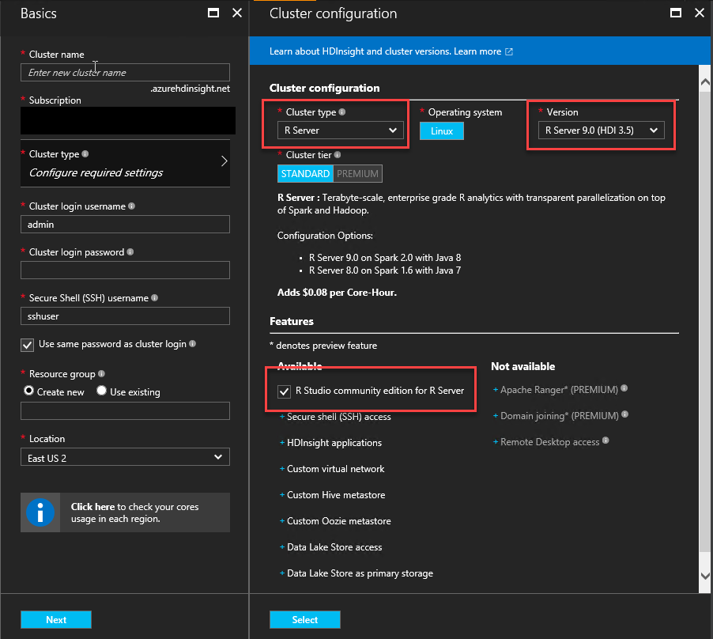
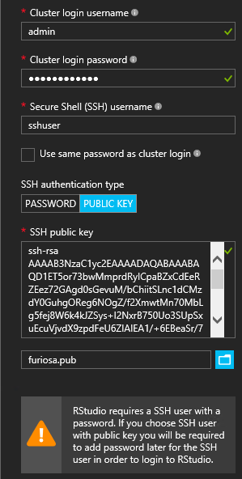
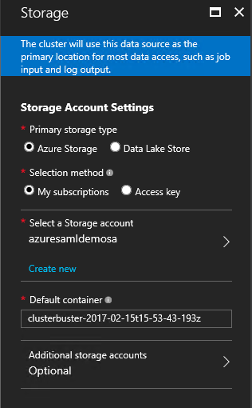
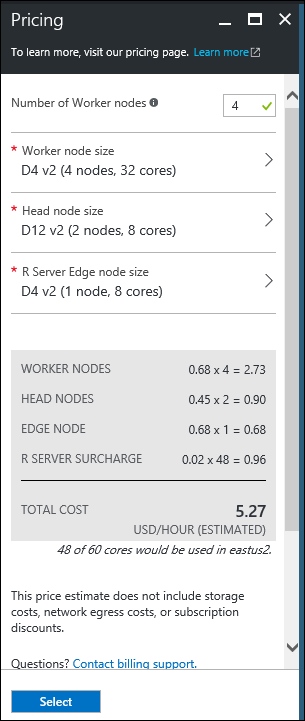
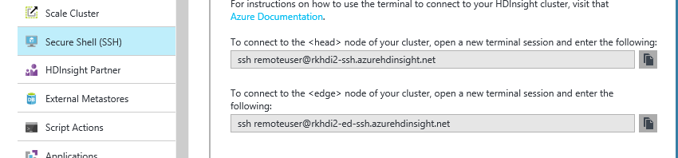
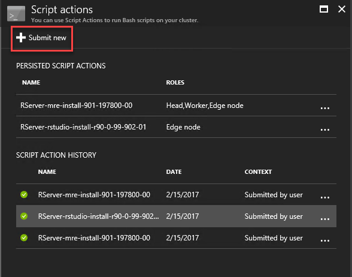

<!-- not suitable for Mooncake -->

<properties
    pageTitle="HDInsight 上的 R Server 入门 | Azure"
    description="了解如何在包含 R Server 的 HDInsight 群集上创建 Apache Spark，然后在群集上提交 R 脚本。"
    services="HDInsight"
    documentationcenter=""
    author="jeffstokes72"
    manager="jhubbard"
    editor="cgronlun" />
<tags 
    ms.assetid="b5e111f3-c029-436c-ba22-c54a4a3016e3"
    ms.service="HDInsight"
    ms.devlang="R"
    ms.topic="article"
    ms.tgt_pltfrm="na"
    ms.workload="data-services"
    ms.date="01/09/2017"
    wacn.date="02/14/2017"
    ms.author="jeffstok" />

# 开始使用 HDInsight 上的 R Server
HDInsight 提供可集成到 HDInsight 群集中的 R Server 选项。这将允许 R 脚本使用 Spark 和 MapReduce 运行分布式计算。在本文档中，你将了解如何在 HDInsight 群集上创建新的 R Server，然后运行 R 脚本，以演示如何使用 Spark 进行分布式 R 计算。

## 先决条件
* **Azure 订阅**：在开始学习本教程之前，必须有一个 Azure 订阅。请参阅 [Get Azure trial](/pricing/1rmb-trial/)（获取 Azure 试用版）了解详细信息。
* **安全 Shell (SSH) 客户端**：SSH 客户端可用于从远程连接到 HDInsight 群集，并直接在群集上运行命令。Linux、Unix 和 OS X 系统可通过 `ssh` 命令提供 SSH 客户端。对于 Windows 系统，我们建议使用 [PuTTY](http://www.chiark.greenend.org.uk/~sgtatham/putty/download.html)。

  * **SSH 密钥（可选）**：可以使用密码或公钥来保护用于连接群集的 SSH 帐户。使用密码会更方便，因为不需要创建公钥/私钥对即可着手；但是，使用密钥更加安全。

      本文档中的步骤假设使用密码。有关如何创建在 HDInsight 中创建和使用 SSH 密钥的信息，请参阅以下文档：

    * [Use SSH with HDInsight from Linux, Unix, or OS X clients（在 Linux、Unix 或 OS X 客户端中将 SSH 与 HDInsight 配合使用）](/documentation/articles/hdinsight-hadoop-linux-use-ssh-unix/)
    * [Use SSH with HDInsight from Windows clients（在 Windows 客户端中将 SSH 与 HDInsight 配合使用）](/documentation/articles/hdinsight-hadoop-linux-use-ssh-windows/)

### 访问控制要求
[AZURE.INCLUDE [access-control](../../includes/hdinsight-access-control-requirements.md)]

## 创建群集
> [AZURE.NOTE]
本文档中的步骤将指导用户完成如何使用基本配置信息在 HDInsight 群集上创建 R Server。有关其他群集配置设置（例如，添加其他存储帐户、使用 Azure 虚拟网络或创建 Hive 元存储）的信息，请参阅 [Create Linux-based HDInsight clusters](/documentation/articles/hdinsight-hadoop-provision-linux-clusters/)（创建基于 Linux 的 HDInsight 群集）。
>
> 

1. 登录 [Azure 门户预览](https://portal.azure.cn)。

2. 依次选择“新建”、“智能 + 分析”、“HDInsight”。

      

3. 在“群集名称”字段中，输入群集的名称。如果你有多个 Azure 订阅，请使用“订阅”条目选择要使用的订阅。

      

4. 选择“群集配置”。在“群集配置”边栏选项卡中选择以下选项：

    * **群集类型**：R Server
    * **版本**：选择要在群集上安装的 R Server 版本。选择最新功能的最新版本。如果兼容性需要，有其他版本可用。[此处](https://msdn.microsoft.com/microsoft-r/notes/r-server-notes)提供了每个可用版本的发行说明。
    * **用于 R Server 的 R Studio 社区版**：默认情况下，在边缘节点上安装此基于浏览器的 IDE。如果不想安装它，则取消选中该复选框。如果选择安装它，则在创建群集后，可在群集的门户应用程序边栏选项卡上找到用于访问 RStudio Server 登录界面的 URL。将其他选项保留为默认值，然后使用“选择”按钮保存群集类型。

       

    ​

5. 选择“凭据”，然后输入“群集登录用户名”和“群集登录密码”。

    输入 **SSH 用户名**。通过**安全外壳 (SSH)** 客户端从远程连接到群集时，将使用 SSH。可以在此对话框中指定 SSH 用户，也可以在创建群集之后指定（通过群集的“配置”选项卡）。R Server 配置为要求使用 **SSH 用户名**“remoteuser”。如果你使用其他用户名，则必须在创建群集后执行附加步骤。

    

    **SSH 身份验证类型**：除非你偏好使用公钥，否则请选择“密码”作为身份验证类型。如果想要通过远程客户端（例如 RTVS、RStudio 或其他桌面 IDE）访问群集上的 R Server，则需要使用公钥/私钥对。请注意，如果安装 RStudio Server 社区版，则需要选择 SSH 密码。

    若要创建并使用公钥/私钥对，请选择“公钥”，然后按如下所述继续操作。这些说明假设你安装了包含 ssh-keygen 的 Cygwin 或同等组件。

    * 在便携式计算机上通过命令提示符生成公钥/私钥对：

            ssh-keygen -t rsa -b 2048 -f <private-key-filename>

    * 这将会创建一个私钥文件，以及一个名为 <私钥文件名>.pub 的公钥文件，例如 davec 和 davec.pub。然后，在分配 HDI 群集凭据时指定公钥文件 (*.pub)：

     

    * 在便携式计算机上更改对私钥文件的权限

            chmod 600 <private-key-filename>

    * 结合使用私钥文件和 SSH 进行远程登录，例如：

            ssh -i <private-key-filename> remoteuser@<hostname public ip>

     或者在客户端上为 R Server 定义 Hadoop Spark 计算上下文的过程中（请参阅 [Get started with SacaleR on Apache Spark document](https://msdn.microsoft.com/microsoft-r/scaler-spark-getting-started)（Apache Spark 上的 SacaleR 入门）在线指南的 [Creating a Compute Context for Spark](https://msdn.microsoft.com/microsoft-r/scaler-spark-getting-started#creating-a-compute-context-for-spark)（创建 Spark 的计算上下文）部分中的“Using Microsoft R Server as a Hadoop Client”（使用 Microsoft R Server 作为 Hadoop 客户端））。

6. 选择“数据源”，以便选择要作为群集所用的 HDFS 文件系统的主位置的数据源。选择新的或现有的 Azure 存储帐户或者现有的 Data Lake Storage 帐户。

    1. 如果选择 Azure 存储帐户，则可以选择现有的存储帐户，方法是选择“选择存储帐户”，然后选择帐户；也可以使用“选择存储帐户”部分中的“新建”链接创建新帐户。

      > [AZURE.NOTE]
      如果选择“新建”，则必须输入新存储帐户的名称。如果该名称可接受，将出现绿色复选标记。

      “默认容器”默认为群集的名称。请不要更改此值。

      如果选择了一个新的存储帐户选项，则可以选择“位置”以选择要在其中创建存储帐户的区域。

      > [AZURE.IMPORTANT]
      选择默认数据源位置的同时会设置 HDInsight 群集位置。群集和默认数据源必须位于同一区域。

    2. 如果选择使用现有 Data Lake Store，则选择要使用的 ADLS 存储帐户，并将群集 ADD 标识添加到群集以允许访问存储。有关此过程的详细信息，请参阅 [Createan HDInsight cluster with Data Lake Store using Azure Portal Preview](https://docs.microsoft.com/azure/data-lake-store/data-lake-store-hdinsight-hadoop-use-portal)（使用 Azure 门户预览创建包含 Data Lake Store 的 HDInsight 群集）。

      使用“选择”按钮保存数据源配置。

       

7. 选择“节点定价层”显示针对此群集创建的节点的相关信息。除非确定需要更大的群集，否则请保留辅助角色节点数目的默认值 `4`。该群集的预估成本将显示在边栏选项卡内。

    > [AZURE.NOTE]
    以后，如果需要，你可以通过门户调整群集的大小（“群集”->“设置”->“缩放群集”），以增加或减少辅助角色节点的数目。这种方法可将不再使用的群集置于空闲状态，或者增加容量来满足更大任务的需要。
    >
    > ​

    调整群集、数据节点和边缘节点的大小时，需要注意的一些因素包括：

    * 如果数据较大，则 Spark 上的分布式 R Server 分析的性能与辅助角色节点数目成正比。

    * R Server 分析的性能与所要分析的数据大小呈线性关系。例如：

     * 对于小型到中等的数据，如果在边缘节点上的本地计算上下文中执行分析，则性能最佳。有关在哪种本地上下文和 Spark 计算上下文中可获得最佳工作性能的详细信息，请参阅“Compute context options for R Server on HDInsight”（HDInsight 上 R Server 的计算上下文选项）。 
     * 如果登录到边缘节点并运行 R 脚本，则除 ScaleR rx-functions 以外的所有函数将在边缘节点<strong>本地</strong>执行，因此内存和边缘节点的核心数应会相应地调整。如果通过便携式计算机使用 HDI 上的 R Server 作为远程计算上下文，则这一点同样适用。

     

     使用“选择”按钮保存节点定价配置。

8. 选择要使用的**资源组**，方法是选择现有资源组或创建一个新资源组。如果选择“新建”，则输入新资源组的名称。出现绿色复选标记表示可以使用这个新组名称。

      

    ​

9. 查看你的选择后，现在可以创建群集了。为此，请选择“固定到启动板”，然后选择“创建”。这将会创建群集，并将该群集的磁贴添加到 Azure 门户预览的启动板。

    你会注意到，还有一个“自动化选项”的链接。单击此链接将显示可用于自动创建具有所选配置的群集的脚本。创建群集后，这些脚本还可从群集的 Azure 门户预览条目获得。

    | 创建时 | 创建完成 |
    | ---------------------------------------- | ---------------------------------------- |
    |  |   
 |

    > [AZURE.NOTE]
    创建群集需要一些时间，通常约 20 分钟左右。使用启动板上的磁贴或页面左侧的“通知”项检查创建过程。
    >
    > ​

## 连接到 RStudio Server

如果选择要在安装中包括 RStudio Server 社区版，则可以通过两种不同方法访问 RStudio 登录界面。

1. 通过转到以下 URL（其中 **CLUSTERNAME** 是所创建的群集的名称）：

        https://**CLUSTERNAME**.azurehdinsight.cn/rstudio/  

2. 或通过打开群集在 Azure 门户预览中的条目，选择 R Server 仪表板快速链接，然后选择 R Studio 仪表板：

       

    > [AZURE.IMPORTANT]
    无论使用哪种方法，第一次登录时将需要进行两次身份验证。首次身份验证时，需提供群集管理员用户 ID 和密码。出现第二个提示时，提供 SSH 用户 ID 和密码。后续登录将只需要 SSH 密码和用户 ID。

## 连接到 R Server 边缘节点
使用 SSH 连接到 HDInsight 群集的 R Server 边缘节点：

    ssh USERNAME@CLUSTERNAME-ed-ssh.azurehdinsight.cn

> [AZURE.NOTE]
也可以依次选择群集、“所有设置”、“应用”和“RServer”，在 Azure 门户预览中找到 `USERNAME@CLUSTERNAME-ed-ssh.azurehdinsight.cn` 地址。这会显示边缘节点的 SSH 终结点信息。
>

>   
>
> 

如果使用了密码来保护 SSH 帐户，系统会提示你输入密码。如果你使用了公钥，则可能需要使用 `-i` 参数来指定匹配的私钥。例如，`ssh -i ~/.ssh/id_rsa USERNAME@CLUSTERNAME-ed-ssh.azurehdinsight.cn`。

有关将 SSH 与基于 Linux 的 HDInsight 配合使用的详细信息，请参阅以下文章：

* [在 Linux、Unix 或 OS X 中的 HDInsight 上将 SSH 与基于 Linux 的 Hadoop 配合使用](/documentation/articles/hdinsight-hadoop-linux-use-ssh-unix/)
* [在 Windows 中的 HDInsight 上将 SSH 与基于 Linux 的 Hadoop 配合使用](/documentation/articles/hdinsight-hadoop-linux-use-ssh-windows/)

连接之后，你将看到类似于下面的提示。

    username@ed00-myrser:~$

## 使用 R 控制台
1. 在 SSH 会话中，使用以下命令启动 R 控制台。

        R

    你将看到与下面类似的输出。

        R version 3.2.2 (2015-08-14) -- "Fire Safety"
        Copyright (C) 2015 The R Foundation for Statistical Computing
        Platform: x86_64-pc-linux-gnu (64-bit)
       
        R is free software and comes with ABSOLUTELY NO WARRANTY.
        You are welcome to redistribute it under certain conditions.
        Type 'license()' or 'licence()' for distribution details.
       
        Natural language support but running in an English locale
       
        R is a collaborative project with many contributors.
        Type 'contributors()' for more information and
        'citation()' on how to cite R or R packages in publications.
       
        Type 'demo()' for some demos, 'help()' for on-line help, or
        'help.start()' for an HTML browser interface to help.
        Type 'q()' to quit R.
       
        Microsoft R Server version 8.0: an enhanced distribution of R
        Microsoft packages Copyright (C) 2016 Microsoft Corporation
       
        Type 'readme()' for release notes.
       
        >
2. 可以通过 `>` 提示符输入 R 代码。R Server 包含可让你轻松与 Hadoop 交互并运行分布式计算的包。例如，若要查看 HDInsight 群集的默认文件系统根目录，可使用以下命令。

        rxHadoopListFiles("/")

    还可以使用 WASB 样式寻址。

        rxHadoopListFiles("wasbs:///")

## 从 Microsoft R Server 或 Microsoft R Client 的远程实例使用 HDI 上的 R Server
根据上述有关使用公钥/私钥对访问群集的部分，可以设置从台式机或便携式计算机上运行的 Microsoft R Server 或 Microsoft R Client 到 HDI Hadoop Spark 计算上下文的访问（请参阅 [RevoScaleR Hadoop Spark Getting Started guide](https://msdn.microsoft.com/microsoft-r/scaler-spark-getting-started)（RevoScaleR Hadoop Spark 入门）在线指南的 [Creating a Compute Context for Spark](https://msdn.microsoft.com/microsoft-r/scaler-spark-getting-started#creating-a-compute-context-for-spark)（创建 Spark 的计算上下文）部分中的“Using Microsoft R Server as a Hadoop Client”（使用 Microsoft R Server 作为 Hadoop 客户端））。为此，需要在便携式计算机上定义 RxSpark 计算上下文时指定以下选项：hdfsShareDir、shareDir、sshUsername、sshHostname、sshSwitches 和 sshProfileScript。例如：

    myNameNode <- "default"
    myPort <- 0 
    
    mySshHostname  <- 'rkrrehdi1-ed-ssh.azurehdinsight.cn'  # HDI secure shell hostname
    mySshUsername  <- 'remoteuser'# HDI SSH username
    mySshSwitches  <- '-i /cygdrive/c/Data/R/davec'   # HDI SSH private key
    
    myhdfsShareDir <- paste("/user/RevoShare", mySshUsername, sep="/")
    myShareDir <- paste("/var/RevoShare" , mySshUsername, sep="/")
    
    mySparkCluster <- RxSpark(
      hdfsShareDir = myhdfsShareDir,
      shareDir     = myShareDir,
      sshUsername  = mySshUsername,
      sshHostname  = mySshHostname,
      sshSwitches  = mySshSwitches,
      sshProfileScript = '/etc/profile',
      nameNode     = myNameNode,
      port         = myPort,
      consoleOutput= TRUE
    )

## 使用计算上下文
计算上下文可让你控制是否要在边缘节点上本地执行计算，或者是否要将计算分布到 HDInsight 群集的节点之间。

1. 在 RStudio Server 或 R 控制台（在 SSH 会话中）中，使用以下命令将示例数据加载到 HDInsight 的默认存储中。

        # Set the HDFS (WASB) location of example data
        bigDataDirRoot <- "/example/data"
        # create a local folder for storaging data temporarily
        source <- "/tmp/AirOnTimeCSV2012"
        dir.create(source)
        # Download data to the tmp folder
        remoteDir <- "http://packages.revolutionanalytics.com/datasets/AirOnTimeCSV2012"
        download.file(file.path(remoteDir, "airOT201201.csv"), file.path(source, "airOT201201.csv"))
        download.file(file.path(remoteDir, "airOT201202.csv"), file.path(source, "airOT201202.csv"))
        download.file(file.path(remoteDir, "airOT201203.csv"), file.path(source, "airOT201203.csv"))
        download.file(file.path(remoteDir, "airOT201204.csv"), file.path(source, "airOT201204.csv"))
        download.file(file.path(remoteDir, "airOT201205.csv"), file.path(source, "airOT201205.csv"))
        download.file(file.path(remoteDir, "airOT201206.csv"), file.path(source, "airOT201206.csv"))
        download.file(file.path(remoteDir, "airOT201207.csv"), file.path(source, "airOT201207.csv"))
        download.file(file.path(remoteDir, "airOT201208.csv"), file.path(source, "airOT201208.csv"))
        download.file(file.path(remoteDir, "airOT201209.csv"), file.path(source, "airOT201209.csv"))
        download.file(file.path(remoteDir, "airOT201210.csv"), file.path(source, "airOT201210.csv"))
        download.file(file.path(remoteDir, "airOT201211.csv"), file.path(source, "airOT201211.csv"))
        download.file(file.path(remoteDir, "airOT201212.csv"), file.path(source, "airOT201212.csv"))
        # Set directory in bigDataDirRoot to load the data into
        inputDir <- file.path(bigDataDirRoot,"AirOnTimeCSV2012") 
        # Make the directory
        rxHadoopMakeDir(inputDir)
        # Copy the data from source to input
        rxHadoopCopyFromLocal(source, bigDataDirRoot)

2. 接下来，我们要创建一些数据信息并定义两个数据源，以便使用数据。

        # Define the HDFS (WASB) file system
        hdfsFS <- RxHdfsFileSystem()
        # Create info list for the airline data
        airlineColInfo <- list(
            DAY_OF_WEEK = list(type = "factor"),
            ORIGIN = list(type = "factor"),
            DEST = list(type = "factor"),
            DEP_TIME = list(type = "integer"),
            ARR_DEL15 = list(type = "logical"))
       
        # get all the column names
        varNames <- names(airlineColInfo)
       
        # Define the text data source in hdfs
        airOnTimeData <- RxTextData(inputDir, colInfo = airlineColInfo, varsToKeep = varNames, fileSystem = hdfsFS)
        # Define the text data source in local system
        airOnTimeDataLocal <- RxTextData(source, colInfo = airlineColInfo, varsToKeep = varNames)
       
        # formula to use
        formula = "ARR_DEL15 ~ ORIGIN + DAY_OF_WEEK + DEP_TIME + DEST"

3. 现在，我们使用本地计算上下文对数据运行逻辑回归。

        # Set a local compute context
        rxSetComputeContext("local")
        # Run a logistic regression
        system.time(
            modelLocal <- rxLogit(formula, data = airOnTimeDataLocal)
        )
        # Display a summary 
        summary(modelLocal)

    你应会看到结尾类似于以下行的输出：

        Data: airOnTimeDataLocal (RxTextData Data Source)
        File name: /tmp/AirOnTimeCSV2012
        Dependent variable(s): ARR_DEL15
        Total independent variables: 634 (Including number dropped: 3)
        Number of valid observations: 6005381
        Number of missing observations: 91381
        -2*LogLikelihood: 5143814.1504 (Residual deviance on 6004750 degrees of freedom)
       
        Coefficients:
                        Estimate Std. Error z value Pr(>|z|)
        (Intercept)   -3.370e+00  1.051e+00  -3.208  0.00134 **
        ORIGIN=JFK     4.549e-01  7.915e-01   0.575  0.56548
        ORIGIN=LAX     5.265e-01  7.915e-01   0.665  0.50590
        ......
        DEST=SHD       5.975e-01  9.371e-01   0.638  0.52377
        DEST=TTN       4.563e-01  9.520e-01   0.479  0.63172
        DEST=LAR      -1.270e+00  7.575e-01  -1.676  0.09364 .
        DEST=BPT         Dropped    Dropped Dropped  Dropped
        ---
        Signif. codes:  0 '***' 0.001 '**' 0.01 '*' 0.05 '.' 0.1 ' ' 1
       
        Condition number of final variance-covariance matrix: 11904202
        Number of iterations: 7

4. 然后，我们使用 Spark 上下文来运行相同的逻辑回归。Spark 上下文会将处理分布到 HDInsight 群集的所有辅助角色节点之间。

        # Define the Spark compute context 
        mySparkCluster <- RxSpark()
        # Set the compute context 
        rxSetComputeContext(mySparkCluster)
        # Run a logistic regression 
        system.time(  
            modelSpark <- rxLogit(formula, data = airOnTimeData)
        )
        # Display a summary
        summary(modelSpark)

    > [AZURE.NOTE]
    也可以使用 MapReduce 将计算分布到群集节点之间。有关计算上下文的详细信息，请参阅 [Compute context options for R Server on HDInsight](/documentation/articles/hdinsight-hadoop-r-server-compute-contexts/)（适用于 HDInsight 上的 R Server 的计算上下文选项）。
    >
    > ​

## 将 R 代码分布到多个节点
使用 R Server 时，可以轻松利用现有的 R 代码并使用 `rxExec` 跨多个群集节点运行代码。执行参数扫描或模拟时，这非常有用。下面是 `rxExec` 的用法示例。

    rxExec( function() {Sys.info()["nodename"]}, timesToRun = 4 )

如果仍在使用 Spark 或 MapReduce 上下文，此操作将针对运行代码 `(Sys.info()["nodename"])` 的工作节点返回 nodename 值。例如，在四节点群集上，你可能会收到类似于下面的输出：

    $rxElem1
        nodename
    "wn3-myrser"
    
    $rxElem2
        nodename
    "wn0-myrser"
    
    $rxElem3
        nodename
    "wn3-myrser"
    
    $rxElem4
        nodename
    "wn3-myrser"

## 访问 Hive 和 Parquet 中的数据
R Server 9.0 和更高版本中提供的新功能允许直接访问 Hive 和 Parquet 中的数据以供 ScaleR 函数在 Spark 计算上下文中使用。这些功能通过称为 RxHiveData 和 RxParquetData 的新 ScaleR 数据源函数提供，这些函数使用 Spark SQL 将数据直接加载到 Spark DataFrame 中供 ScaleR 进行分析。

下面提供了有关使用这些新函数的一些示例代码：

    #..create a Spark compute context

    myHadoopCluster <- rxSparkConnect(reset = TRUE)

   

    #..retrieve some sample data from Hive and run a model 

    hiveData <- RxHiveData("select * from hivesampletable", 
                     colInfo = list(devicemake = list(type = "factor")))
    rxGetInfo(hiveData, getVarInfo = TRUE)

    rxLinMod(querydwelltime ~ devicemake, data=hiveData)

 

    #..retrieve some sample data from Parquet and run a model 

    rxHadoopMakeDir('/share')
    rxHadoopCopyFromLocal(file.path(rxGetOption('sampleDataDir'), 'claimsParquet/'), '/share/')
    pqData <- RxParquetData('/share/claimsParquet',
                     colInfo = list(
                age    = list(type = "factor"),
               car.age = list(type = "factor"),
                  type = list(type = "factor")
             ) )
    rxGetInfo(pqData, getVarInfo = TRUE)

    rxNaiveBayes(type ~ age + cost, data = pqData)

   

    #..check on Spark data objects, cleanup, and close the Spark session 

    lsObj <- rxSparkListData() # two data objs are cached
    lsObj
    rxSparkRemoveData(lsObj)
    rxSparkListData() # it should show empty list
    rxSparkDisconnect(myHadoopCluster)

有关如何使用这些新函数的其他信息，请通过使用 ?RxHivedata 和 ?RxParquetData 命令查看 R Server 中的联机帮助。

##  安装 R 包
如果要在边缘节点上安装其他 R 包，可以在通过 SSH 连接到边缘节点时，直接从 R 控制台内部使用 `install.packages()`。但是，如果需要在群集的辅助角色节点上安装 R 包，则必须使用脚本操作。

脚本操作是一种 Bash 脚本，可用于更改 HDInsight 群集的配置或安装其他软件。在本例中，我们要安装其他 R 包。若要使用脚本操作安装其他包，请使用以下步骤。

> [AZURE.IMPORTANT]
只有在创建群集之后，才可以使用脚本操作来安装其他 R 包。不应在群集创建期间使用脚本操作，因为脚本依赖于完全安装且配置的 R Server。
>
> 

1. 在 [Azure 门户预览](https://portal.azure.cn)中，选择 HDInsight 群集上的 R Server。
2. 在“设置”边栏选项卡中，依次选择“脚本操作”、“新提交”以提交新的脚本操作。

      

3. 在“提交脚本操作”边栏选项卡中提供以下信息。

    * **名称**：用于标识此脚本的友好名称

    * **Bash 脚本 URI**：`http://mrsactionscripts.blob.core.chinacloudapi.cn/rpackages-v01/InstallRPackages.sh`

    * **头**：应为**未选中状态**

    * **辅助角色**：应为**选中状态**

    * **边缘节点**：应为**未选中状态**。

    * **Zookeeper**：应为**未选中状态**

    * **参数**：要安装的 R 包。例如 `bitops stringr arules`

    * **保留此脚本...**：应为**选中状态**

        > [AZURE.NOTE]
        > 1. 默认情况下，将从与安装的 R Server 版本一致的 Microsoft MRAN 存储库快照中安装所有 R 包。如果想要安装更新版本的包，则会出现不兼容的风险，不过，这种做法是可行的，只需指定 `useCRAN` 作为包列表的第一个元素即可，例如 `useCRAN bitops, stringr, arules`。
        > 2. 某些 R 包需要额外的 Linux 系统库。为方便起见，我们已预先安装了最流行的 100 个 R 包所需的依赖项。但是，如果安装的 R 包需要除此之外的库，则必须下载此处使用的基本脚本，并添加安装系统库的步骤。接下来，必须将修改的脚本上载到 Azure 存储空间中的公共 Blob 容器，并使用修改的脚本来安装包。有关开发脚本操作的详细信息，请参阅 [Script Action development](/documentation/articles/hdinsight-hadoop-script-actions-linux/)（脚本操作开发）。
        >
        >

        
     
4. 选择“创建”运行脚本。脚本完成后，可在所有辅助角色节点上使用 R 包。

## 后续步骤
现在，你已了解如何创建包括 R Server 的新 HDInsight 群集，以及从 SSH 会话使用 R 控制台的基础知识，请使用以下资源发现使用 HDInsight 上的 R Server 的其他方法。

* [将 RStudio Server 添加到 HDInsight（如果未在群集创建过程中安装）](/documentation/articles/hdinsight-hadoop-r-server-install-r-studio/)
* [Compute context options for R Server on HDInsight（适用于 HDInsight 上的 R Server 的计算上下文选项）](/documentation/articles/hdinsight-hadoop-r-server-compute-contexts/)
* [Azure Storage options for R Server on HDInsight（适用于 HDInsight 上的 R Server 的 Azure 存储选项）](/documentation/articles/hdinsight-hadoop-r-server-storage/)

<!---HONumber=Mooncake_0103_2017-->